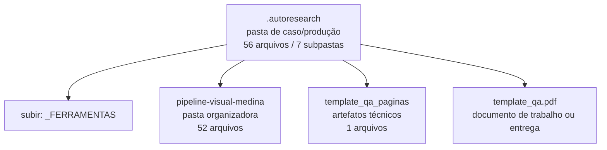

<!-- IA_NAVIGACAO:GERADO_AUTO:v1 -->
# Mapa IA - .autoresearch

Atualizado automaticamente em: **2026-08-05 13:32:39 -0300**

- Caminho: `C:\Users\IgorPC\.claude\projects\Escritório fabio osório\fabricas de melhoria de petições\_FERRAMENTAS\.autoresearch`
- Tipo: **pasta de caso/produção**
- Função para navegação: contém peça, parecer, memorial, relatório ou plano
- Conteúdo recursivo: **56 arquivos**, **7 subpastas**, **1.4 MB**
- Tipos de arquivo: .svg: 28, .emf: 7, .json: 5, .png: 4, .pdf: 3, .py: 3, .dot: 2, .docx: 2, .jsonl: 1, .mmd: 1
- Mapa raiz: [MAPA_IA.md](<../../MAPA_IA.md>)
- Índice geral: [INDICE_GERAL_IA.md](<../../00_IA_NAVIGACAO/INDICE_GERAL_IA.md>)
- Protocolo de navegação: [PROTOCOLO_NAVEGACAO_IA.md](<../../00_IA_NAVIGACAO/PROTOCOLO_NAVEGACAO_IA.md>)
- Inventário JSON para agentes: [inventario_ia.json](<../../00_IA_NAVIGACAO/dados/inventario_ia.json>)
- Mapa superior: [_FERRAMENTAS](<../MAPA_IA.md>)

## GPS Mermaid

## Ordem de leitura recomendada

1. Ler este `MAPA_IA.md` antes de abrir arquivos pesados.
2. Subir para a raiz se precisar das regras globais `AGENTS.md`, `CLAUDE.md` e `_LEIS_GERAIS`.
3. Usar builds, renders e QA apenas para validar entrega ou rastrear geração; não começar por eles.

## Subpastas diretas

| Subpasta | Tipo | Conteúdo | Atualização | Próximo passo |
|---|---|---:|---:|---|
| [pipeline-visual-medina](<pipeline-visual-medina/MAPA_IA.md>) | pasta organizadora | 52 arquivos / 5 subpastas | 2026-07-08 04:13 | agrega subpastas; abrir mapa filho conforme objetivo |
| [template_qa_paginas](<template_qa_paginas/MAPA_IA.md>) | artefatos técnicos | 1 arquivos / 0 subpastas | 2026-07-08 04:46 | build, extração ou QA; ler só quando precisar validar entrega |

## Arquivos diretos

| Arquivo | Papel | Tamanho | Modificado | Observação |
|---|---:|---:|---:|---|
| [template_qa.pdf](<template_qa.pdf>) | peça/trabalho | 178.7 KB | 2026-07-08 04:46 | documento de trabalho ou entrega |
| [analise_padrao_word.py](<analise_padrao_word.py>) | dados/script | 5.1 KB | 2026-07-08 04:43 | dado estruturado ou rotina técnica |
| [padrao_word_extraido.json](<padrao_word_extraido.json>) | dados/script | 11.4 KB | 2026-07-08 04:43 | dado estruturado ou rotina técnica |

## Leitura por papel

- **peça/trabalho**: [template_qa.pdf](<template_qa.pdf>)
- **dados/script**: [analise_padrao_word.py](<analise_padrao_word.py>), [padrao_word_extraido.json](<padrao_word_extraido.json>)

## Observações anti-alucinação

- Este mapa classifica por nomes, extensões e posição na árvore; não substitui leitura de fonte primária.
- Fato, citação, ID processual, prazo e jurisprudência só entram em peça depois de conferência no arquivo-fonte ou fonte oficial.
- Se a pasta tiver regimento, a peça deve refletir o regimento vigente na data do protocolo.
