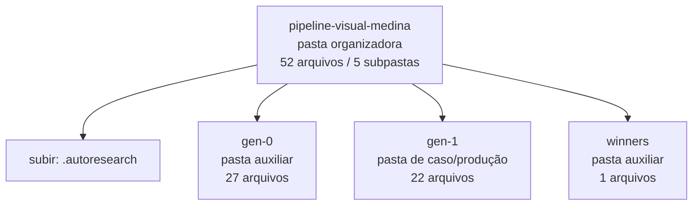

<!-- IA_NAVIGACAO:GERADO_AUTO:v1 -->
# Mapa IA - pipeline-visual-medina

Atualizado automaticamente em: **2026-08-05 13:33:44 -0300**

- Caminho: `C:\Users\IgorPC\.claude\projects\Escritório fabio osório\fabricas de melhoria de petições\_FERRAMENTAS\.autoresearch\pipeline-visual-medina`
- Tipo: **pasta organizadora**
- Função para navegação: agrega subpastas; abrir mapa filho conforme objetivo
- Conteúdo recursivo: **52 arquivos**, **5 subpastas**, **1.2 MB**
- Tipos de arquivo: .svg: 28, .emf: 7, .json: 4, .png: 3, .py: 2, .dot: 2, .docx: 2, .pdf: 2, .jsonl: 1, .mmd: 1
- Mapa raiz: [MAPA_IA.md](<../../../MAPA_IA.md>)
- Índice geral: [INDICE_GERAL_IA.md](<../../../00_IA_NAVIGACAO/INDICE_GERAL_IA.md>)
- Protocolo de navegação: [PROTOCOLO_NAVEGACAO_IA.md](<../../../00_IA_NAVIGACAO/PROTOCOLO_NAVEGACAO_IA.md>)
- Inventário JSON para agentes: [inventario_ia.json](<../../../00_IA_NAVIGACAO/dados/inventario_ia.json>)
- Mapa superior: [.autoresearch](<../MAPA_IA.md>)

## GPS Mermaid

## Ordem de leitura recomendada

1. Ler este `MAPA_IA.md` antes de abrir arquivos pesados.
2. Subir para a raiz se precisar das regras globais `AGENTS.md`, `CLAUDE.md` e `_LEIS_GERAIS`.
3. Usar builds, renders e QA apenas para validar entrega ou rastrear geração; não começar por eles.

## Subpastas diretas

| Subpasta | Tipo | Conteúdo | Atualização | Próximo passo |
|---|---|---:|---:|---|
| [gen-0](<gen-0/MAPA_IA.md>) | pasta auxiliar | 27 arquivos / 0 subpastas | 2026-07-08 04:09 | conteúdo auxiliar ou residual |
| [gen-1](<gen-1/MAPA_IA.md>) | pasta de caso/produção | 22 arquivos / 2 subpastas | 2026-07-08 04:12 | contém peça, parecer, memorial, relatório ou plano |
| [winners](<winners/MAPA_IA.md>) | pasta auxiliar | 1 arquivos / 0 subpastas | 2026-07-08 04:13 | conteúdo auxiliar ou residual |

## Arquivos diretos

| Arquivo | Papel | Tamanho | Modificado | Observação |
|---|---:|---:|---:|---|
| [log.jsonl](<log.jsonl>) | dados/script | 526 B | 2026-07-08 04:13 | dado estruturado ou rotina técnica |
| [manifest.json](<manifest.json>) | dados/script | 591 B | 2026-07-08 04:05 | dado estruturado ou rotina técnica |

## Leitura por papel

- **dados/script**: [log.jsonl](<log.jsonl>), [manifest.json](<manifest.json>)

## Observações anti-alucinação

- Este mapa classifica por nomes, extensões e posição na árvore; não substitui leitura de fonte primária.
- Fato, citação, ID processual, prazo e jurisprudência só entram em peça depois de conferência no arquivo-fonte ou fonte oficial.
- Se a pasta tiver regimento, a peça deve refletir o regimento vigente na data do protocolo.
