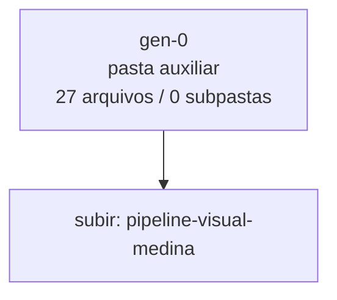

<!-- IA_NAVIGACAO:GERADO_AUTO:v1 -->
# Mapa IA - gen-0

Atualizado automaticamente em: **2026-08-05 13:55:56 -0300**

- Caminho: `C:\Users\IgorPC\.claude\projects\Escritório fabio osório\fabricas de melhoria de petições\_FERRAMENTAS\.autoresearch\pipeline-visual-medina\gen-0`
- Tipo: **pasta auxiliar**
- Função para navegação: conteúdo auxiliar ou residual
- Conteúdo recursivo: **27 arquivos**, **0 subpastas**, **54.4 KB**
- Tipos de arquivo: .svg: 21, .json: 2, .py: 1, .emf: 1, .dot: 1, .mmd: 1
- Mapa raiz: [MAPA_IA.md](<../../../../MAPA_IA.md>)
- Índice geral: [INDICE_GERAL_IA.md](<../../../../00_IA_NAVIGACAO/INDICE_GERAL_IA.md>)
- Protocolo de navegação: [PROTOCOLO_NAVEGACAO_IA.md](<../../../../00_IA_NAVIGACAO/PROTOCOLO_NAVEGACAO_IA.md>)
- Inventário JSON para agentes: [inventario_ia.json](<../../../../00_IA_NAVIGACAO/dados/inventario_ia.json>)
- Mapa superior: [pipeline-visual-medina](<../MAPA_IA.md>)

## GPS Mermaid

## Ordem de leitura recomendada

1. Ler este `MAPA_IA.md` antes de abrir arquivos pesados.
2. Subir para a raiz se precisar das regras globais `AGENTS.md`, `CLAUDE.md` e `_LEIS_GERAIS`.
3. Usar builds, renders e QA apenas para validar entrega ou rastrear geração; não começar por eles.

## Subpastas diretas

_Sem subpastas diretas._

## Arquivos diretos

| Arquivo | Papel | Tamanho | Modificado | Observação |
|---|---:|---:|---:|---|
| [d2_cfg.json](<d2_cfg.json>) | dados/script | 255 B | 2026-07-08 04:09 | dado estruturado ou rotina técnica |
| [gen0_testes.py](<gen0_testes.py>) | dados/script | 7.6 KB | 2026-07-08 04:09 | dado estruturado ou rotina técnica |
| [scores.json](<scores.json>) | dados/script | 3.2 KB | 2026-07-08 04:09 | dado estruturado ou rotina técnica |
| [a1_attr_px.svg](<a1_attr_px.svg>) | artefato técnico | 116 B | 2026-07-08 04:09 | imagem/render de QA ou build |
| [a2_attr_sem_unidade.svg](<a2_attr_sem_unidade.svg>) | artefato técnico | 114 B | 2026-07-08 04:09 | imagem/render de QA ou build |
| [a3_style_inline.svg](<a3_style_inline.svg>) | artefato técnico | 122 B | 2026-07-08 04:09 | imagem/render de QA ou build |
| [a4_css_bloco.svg](<a4_css_bloco.svg>) | artefato técnico | 134 B | 2026-07-08 04:09 | imagem/render de QA ou build |
| [a5_decimal.svg](<a5_decimal.svg>) | artefato técnico | 116 B | 2026-07-08 04:09 | imagem/render de QA ou build |
| [b1_ok_12px.svg](<b1_ok_12px.svg>) | artefato técnico | 114 B | 2026-07-08 04:09 | imagem/render de QA ou build |
| [b2_ok_grande.svg](<b2_ok_grande.svg>) | artefato técnico | 114 B | 2026-07-08 04:09 | imagem/render de QA ou build |
| [c1_font_shorthand.svg](<c1_font_shorthand.svg>) | artefato técnico | 132 B | 2026-07-08 04:09 | imagem/render de QA ou build |
| [c2_unidade_pt.svg](<c2_unidade_pt.svg>) | artefato técnico | 115 B | 2026-07-08 04:09 | imagem/render de QA ou build |
| [c3_sem_fontsize.svg](<c3_sem_fontsize.svg>) | artefato técnico | 113 B | 2026-07-08 04:09 | imagem/render de QA ou build |
| [c3b_sem_fontsize_largo.svg](<c3b_sem_fontsize_largo.svg>) | artefato técnico | 114 B | 2026-07-08 04:09 | imagem/render de QA ou build |
| [c4_viewbox_virgulas.svg](<c4_viewbox_virgulas.svg>) | artefato técnico | 116 B | 2026-07-08 04:09 | imagem/render de QA ou build |
| [c5_viewbox_offset.svg](<c5_viewbox_offset.svg>) | artefato técnico | 115 B | 2026-07-08 04:09 | imagem/render de QA ou build |
| [c6_em_unidade.svg](<c6_em_unidade.svg>) | artefato técnico | 117 B | 2026-07-08 04:09 | imagem/render de QA ou build |
| [c7_g_heranca.svg](<c7_g_heranca.svg>) | artefato técnico | 120 B | 2026-07-08 04:09 | imagem/render de QA ou build |
| [c8_pt_grande.svg](<c8_pt_grande.svg>) | artefato técnico | 116 B | 2026-07-08 04:09 | imagem/render de QA ou build |
| [d1_fluxo.svg](<d1_fluxo.svg>) | artefato técnico | 2.5 KB | 2026-07-08 04:09 | imagem/render de QA ou build |
| [d2_timeline.svg](<d2_timeline.svg>) | artefato técnico | 12.0 KB | 2026-07-08 04:09 | imagem/render de QA ou build |
| [d3_matplotlib.svg](<d3_matplotlib.svg>) | artefato técnico | 9.8 KB | 2026-07-08 04:09 | imagem/render de QA ou build |
| [e1_ruim.svg](<e1_ruim.svg>) | artefato técnico | 122 B | 2026-07-08 04:09 | imagem/render de QA ou build |
| [e2.emf](<e2.emf>) | artefato técnico | 16.4 KB | 2026-07-08 04:09 | imagem/render de QA ou build |
| [e2_bom.svg](<e2_bom.svg>) | artefato técnico | 159 B | 2026-07-08 04:09 | imagem/render de QA ou build |
| [d1_fluxo.dot](<d1_fluxo.dot>) | outro | 408 B | 2026-07-08 04:09 | arquivo não classificado automaticamente |
| [d2_timeline.mmd](<d2_timeline.mmd>) | outro | 65 B | 2026-07-08 04:09 | arquivo não classificado automaticamente |

## Leitura por papel

- **dados/script**: [d2_cfg.json](<d2_cfg.json>), [gen0_testes.py](<gen0_testes.py>), [scores.json](<scores.json>)
- **artefato técnico**: [a1_attr_px.svg](<a1_attr_px.svg>), [a2_attr_sem_unidade.svg](<a2_attr_sem_unidade.svg>), [a3_style_inline.svg](<a3_style_inline.svg>), [a4_css_bloco.svg](<a4_css_bloco.svg>), [a5_decimal.svg](<a5_decimal.svg>), [b1_ok_12px.svg](<b1_ok_12px.svg>), [b2_ok_grande.svg](<b2_ok_grande.svg>), [c1_font_shorthand.svg](<c1_font_shorthand.svg>), [c2_unidade_pt.svg](<c2_unidade_pt.svg>), [c3_sem_fontsize.svg](<c3_sem_fontsize.svg>), [c3b_sem_fontsize_largo.svg](<c3b_sem_fontsize_largo.svg>), [c4_viewbox_virgulas.svg](<c4_viewbox_virgulas.svg>), [c5_viewbox_offset.svg](<c5_viewbox_offset.svg>), [c6_em_unidade.svg](<c6_em_unidade.svg>), [c7_g_heranca.svg](<c7_g_heranca.svg>), [c8_pt_grande.svg](<c8_pt_grande.svg>), [d1_fluxo.svg](<d1_fluxo.svg>), [d2_timeline.svg](<d2_timeline.svg>), [d3_matplotlib.svg](<d3_matplotlib.svg>), [e1_ruim.svg](<e1_ruim.svg>), [e2.emf](<e2.emf>), [e2_bom.svg](<e2_bom.svg>)
- **outro**: [d1_fluxo.dot](<d1_fluxo.dot>), [d2_timeline.mmd](<d2_timeline.mmd>)

## Observações anti-alucinação

- Este mapa classifica por nomes, extensões e posição na árvore; não substitui leitura de fonte primária.
- Fato, citação, ID processual, prazo e jurisprudência só entram em peça depois de conferência no arquivo-fonte ou fonte oficial.
- Se a pasta tiver regimento, a peça deve refletir o regimento vigente na data do protocolo.
