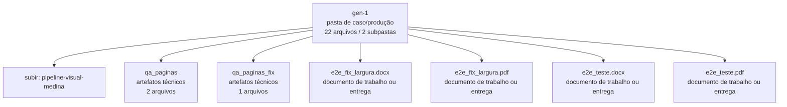

<!-- IA_NAVIGACAO:GERADO_AUTO:v1 -->
# Mapa IA - gen-1

Atualizado automaticamente em: **2026-08-05 13:55:56 -0300**

- Caminho: `C:\Users\IgorPC\.claude\projects\Escritório fabio osório\fabricas de melhoria de petições\_FERRAMENTAS\.autoresearch\pipeline-visual-medina\gen-1`
- Tipo: **pasta de caso/produção**
- Função para navegação: contém peça, parecer, memorial, relatório ou plano
- Conteúdo recursivo: **22 arquivos**, **2 subpastas**, **1.1 MB**
- Tipos de arquivo: .emf: 6, .svg: 6, .png: 3, .docx: 2, .pdf: 2, .py: 1, .json: 1, .dot: 1
- Mapa raiz: [MAPA_IA.md](<../../../../MAPA_IA.md>)
- Índice geral: [INDICE_GERAL_IA.md](<../../../../00_IA_NAVIGACAO/INDICE_GERAL_IA.md>)
- Protocolo de navegação: [PROTOCOLO_NAVEGACAO_IA.md](<../../../../00_IA_NAVIGACAO/PROTOCOLO_NAVEGACAO_IA.md>)
- Inventário JSON para agentes: [inventario_ia.json](<../../../../00_IA_NAVIGACAO/dados/inventario_ia.json>)
- Mapa superior: [pipeline-visual-medina](<../MAPA_IA.md>)

## GPS Mermaid

## Ordem de leitura recomendada

1. Ler este `MAPA_IA.md` antes de abrir arquivos pesados.
2. Subir para a raiz se precisar das regras globais `AGENTS.md`, `CLAUDE.md` e `_LEIS_GERAIS`.
3. Usar builds, renders e QA apenas para validar entrega ou rastrear geração; não começar por eles.

## Subpastas diretas

| Subpasta | Tipo | Conteúdo | Atualização | Próximo passo |
|---|---|---:|---:|---|
| [qa_paginas](<qa_paginas/MAPA_IA.md>) | artefatos técnicos | 2 arquivos / 0 subpastas | 2026-07-08 04:11 | build, extração ou QA; ler só quando precisar validar entrega |
| [qa_paginas_fix](<qa_paginas_fix/MAPA_IA.md>) | artefatos técnicos | 1 arquivos / 0 subpastas | 2026-07-08 04:12 | build, extração ou QA; ler só quando precisar validar entrega |

## Arquivos diretos

| Arquivo | Papel | Tamanho | Modificado | Observação |
|---|---:|---:|---:|---|
| [e2e_fix_largura.docx](<e2e_fix_largura.docx>) | peça/trabalho | 33.8 KB | 2026-07-08 04:12 | documento de trabalho ou entrega |
| [e2e_fix_largura.pdf](<e2e_fix_largura.pdf>) | peça/trabalho | 53.3 KB | 2026-07-08 04:12 | documento de trabalho ou entrega |
| [e2e_teste.docx](<e2e_teste.docx>) | peça/trabalho | 130.8 KB | 2026-07-08 04:11 | documento de trabalho ou entrega |
| [e2e_teste.pdf](<e2e_teste.pdf>) | peça/trabalho | 208.2 KB | 2026-07-08 04:11 | documento de trabalho ou entrega |
| [gen1_visual.py](<gen1_visual.py>) | dados/script | 6.9 KB | 2026-07-08 04:10 | dado estruturado ou rotina técnica |
| [scores.json](<scores.json>) | dados/script | 627 B | 2026-07-08 04:11 | dado estruturado ou rotina técnica |
| [e2e_fluxo.emf](<e2e_fluxo.emf>) | artefato técnico | 35.1 KB | 2026-07-08 04:11 | imagem/render de QA ou build |
| [e2e_fluxo.svg](<e2e_fluxo.svg>) | artefato técnico | 2.9 KB | 2026-07-08 04:11 | imagem/render de QA ou build |
| [e2e_matplotlib.emf](<e2e_matplotlib.emf>) | artefato técnico | 61.8 KB | 2026-07-08 04:11 | imagem/render de QA ou build |
| [e2e_matplotlib.svg](<e2e_matplotlib.svg>) | artefato técnico | 8.8 KB | 2026-07-08 04:11 | imagem/render de QA ou build |
| [variant-a.emf](<variant-a.emf>) | artefato técnico | 86.4 KB | 2026-07-08 04:11 | imagem/render de QA ou build |
| [variant-a.svg](<variant-a.svg>) | artefato técnico | 1.8 KB | 2026-07-08 04:11 | imagem/render de QA ou build |
| [variant-b.emf](<variant-b.emf>) | artefato técnico | 86.4 KB | 2026-07-08 04:11 | imagem/render de QA ou build |
| [variant-b.svg](<variant-b.svg>) | artefato técnico | 1.8 KB | 2026-07-08 04:11 | imagem/render de QA ou build |
| [variant-c.emf](<variant-c.emf>) | artefato técnico | 86.4 KB | 2026-07-08 04:11 | imagem/render de QA ou build |
| [variant-c.svg](<variant-c.svg>) | artefato técnico | 1.8 KB | 2026-07-08 04:11 | imagem/render de QA ou build |
| [variant-d.emf](<variant-d.emf>) | artefato técnico | 142.7 KB | 2026-07-08 04:11 | imagem/render de QA ou build |
| [variant-d.svg](<variant-d.svg>) | artefato técnico | 2.0 KB | 2026-07-08 04:11 | imagem/render de QA ou build |
| [e2e_fluxo.dot](<e2e_fluxo.dot>) | outro | 432 B | 2026-07-08 04:11 | arquivo não classificado automaticamente |

## Leitura por papel

- **peça/trabalho**: [e2e_fix_largura.docx](<e2e_fix_largura.docx>), [e2e_fix_largura.pdf](<e2e_fix_largura.pdf>), [e2e_teste.docx](<e2e_teste.docx>), [e2e_teste.pdf](<e2e_teste.pdf>)
- **dados/script**: [gen1_visual.py](<gen1_visual.py>), [scores.json](<scores.json>)
- **artefato técnico**: [e2e_fluxo.emf](<e2e_fluxo.emf>), [e2e_fluxo.svg](<e2e_fluxo.svg>), [e2e_matplotlib.emf](<e2e_matplotlib.emf>), [e2e_matplotlib.svg](<e2e_matplotlib.svg>), [variant-a.emf](<variant-a.emf>), [variant-a.svg](<variant-a.svg>), [variant-b.emf](<variant-b.emf>), [variant-b.svg](<variant-b.svg>), [variant-c.emf](<variant-c.emf>), [variant-c.svg](<variant-c.svg>), [variant-d.emf](<variant-d.emf>), [variant-d.svg](<variant-d.svg>)
- **outro**: [e2e_fluxo.dot](<e2e_fluxo.dot>)

## Observações anti-alucinação

- Este mapa classifica por nomes, extensões e posição na árvore; não substitui leitura de fonte primária.
- Fato, citação, ID processual, prazo e jurisprudência só entram em peça depois de conferência no arquivo-fonte ou fonte oficial.
- Se a pasta tiver regimento, a peça deve refletir o regimento vigente na data do protocolo.
