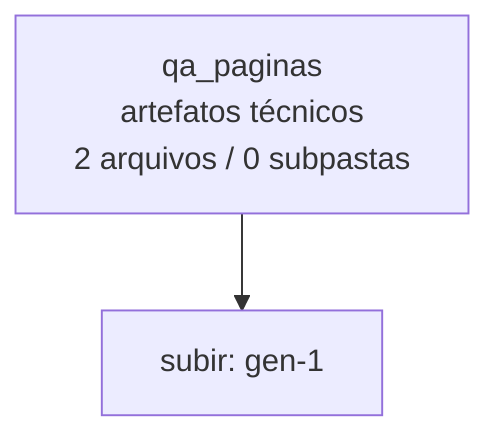

<!-- IA_NAVIGACAO:GERADO_AUTO:v1 -->
# Mapa IA - qa_paginas

Atualizado automaticamente em: **2026-08-05 13:55:49 -0300**

- Caminho: `C:\Users\IgorPC\.claude\projects\Escritório fabio osório\fabricas de melhoria de petições\_FERRAMENTAS\.autoresearch\pipeline-visual-medina\gen-1\qa_paginas`
- Tipo: **artefatos técnicos**
- Função para navegação: build, extração ou QA; ler só quando precisar validar entrega
- Conteúdo recursivo: **2 arquivos**, **0 subpastas**, **150.0 KB**
- Tipos de arquivo: .png: 2
- Mapa raiz: [MAPA_IA.md](<../../../../../MAPA_IA.md>)
- Índice geral: [INDICE_GERAL_IA.md](<../../../../../00_IA_NAVIGACAO/INDICE_GERAL_IA.md>)
- Protocolo de navegação: [PROTOCOLO_NAVEGACAO_IA.md](<../../../../../00_IA_NAVIGACAO/PROTOCOLO_NAVEGACAO_IA.md>)
- Inventário JSON para agentes: [inventario_ia.json](<../../../../../00_IA_NAVIGACAO/dados/inventario_ia.json>)
- Mapa superior: [gen-1](<../MAPA_IA.md>)

## GPS Mermaid

## Ordem de leitura recomendada

1. Ler este `MAPA_IA.md` antes de abrir arquivos pesados.
2. Subir para a raiz se precisar das regras globais `AGENTS.md`, `CLAUDE.md` e `_LEIS_GERAIS`.
3. Usar builds, renders e QA apenas para validar entrega ou rastrear geração; não começar por eles.

## Subpastas diretas

_Sem subpastas diretas._

## Arquivos diretos

| Arquivo | Papel | Tamanho | Modificado | Observação |
|---|---:|---:|---:|---|
| [p01.png](<p01.png>) | artefato técnico | 94.9 KB | 2026-07-08 04:11 | imagem/render de QA ou build |
| [p02.png](<p02.png>) | artefato técnico | 55.1 KB | 2026-07-08 04:11 | imagem/render de QA ou build |

## Leitura por papel

- **artefato técnico**: [p01.png](<p01.png>), [p02.png](<p02.png>)

## Observações anti-alucinação

- Este mapa classifica por nomes, extensões e posição na árvore; não substitui leitura de fonte primária.
- Fato, citação, ID processual, prazo e jurisprudência só entram em peça depois de conferência no arquivo-fonte ou fonte oficial.
- Se a pasta tiver regimento, a peça deve refletir o regimento vigente na data do protocolo.
