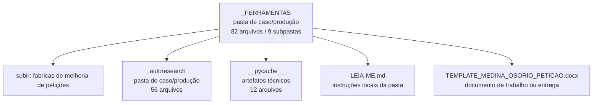

<!-- IA_NAVIGACAO:GERADO_AUTO:v1 -->
# Mapa IA - _FERRAMENTAS

Atualizado automaticamente em: **2026-08-05 13:56:10 -0300**

- Caminho: `C:\Users\IgorPC\.claude\projects\Escritório fabio osório\fabricas de melhoria de petições\_FERRAMENTAS`
- Tipo: **pasta de caso/produção**
- Função para navegação: contém peça, parecer, memorial, relatório ou plano
- Conteúdo recursivo: **82 arquivos**, **9 subpastas**, **1.9 MB**
- Tipos de arquivo: .svg: 28, .py: 13, .pyc: 12, .emf: 7, .json: 5, .png: 4, .md: 3, .docx: 3, .pdf: 3, .dot: 2, +2 tipos
- Mapa raiz: [MAPA_IA.md](<../MAPA_IA.md>)
- Índice geral: [INDICE_GERAL_IA.md](<../00_IA_NAVIGACAO/INDICE_GERAL_IA.md>)
- Protocolo de navegação: [PROTOCOLO_NAVEGACAO_IA.md](<../00_IA_NAVIGACAO/PROTOCOLO_NAVEGACAO_IA.md>)
- Inventário JSON para agentes: [inventario_ia.json](<../00_IA_NAVIGACAO/dados/inventario_ia.json>)
- Mapa superior: [fabricas de melhoria de petições](<../MAPA_IA.md>)

## GPS Mermaid

## Ordem de leitura recomendada

1. Ler este `MAPA_IA.md` antes de abrir arquivos pesados.
2. Subir para a raiz se precisar das regras globais `AGENTS.md`, `CLAUDE.md` e `_LEIS_GERAIS`.
3. Usar builds, renders e QA apenas para validar entrega ou rastrear geração; não começar por eles.

## Subpastas diretas

| Subpasta | Tipo | Conteúdo | Atualização | Próximo passo |
|---|---|---:|---:|---|
| [.autoresearch](<.autoresearch/MAPA_IA.md>) | pasta de caso/produção | 56 arquivos / 7 subpastas | 2026-07-08 04:46 | contém peça, parecer, memorial, relatório ou plano |
| [__pycache__](<__pycache__/MAPA_IA.md>) | artefatos técnicos | 12 arquivos / 0 subpastas | 2026-08-05 03:11 | build, extração ou QA; ler só quando precisar validar entrega |

## Arquivos diretos

| Arquivo | Papel | Tamanho | Modificado | Observação |
|---|---:|---:|---:|---|
| [LEIA-ME.md](<LEIA-ME.md>) | regras | 6.0 KB | 2026-07-08 04:13 | instruções locais da pasta \| tópicos: _FERRAMENTAS — Arsenal de diagramação de excelência (Word + LaTeX); Regra de ouro para Word (formato usual do escritório); Ferramentas instaladas |
| [TEMPLATE_MEDINA_OSORIO_PETICAO.docx](<TEMPLATE_MEDINA_OSORIO_PETICAO.docx>) | peça/trabalho | 93.8 KB | 2026-07-08 04:46 | documento de trabalho ou entrega |
| [estilo_medina.py](<estilo_medina.py>) | dados/script | 7.4 KB | 2026-07-08 04:12 | dado estruturado ou rotina técnica |
| [medina_svg_colisao.py](<medina_svg_colisao.py>) | dados/script | 18.1 KB | 2026-08-04 20:24 | dado estruturado ou rotina técnica |
| [medina_svg_kit.py](<medina_svg_kit.py>) | dados/script | 12.0 KB | 2026-08-03 16:05 | dado estruturado ou rotina técnica |
| [medina_visual_kit.py](<medina_visual_kit.py>) | dados/script | 39.5 KB | 2026-08-05 03:09 | dado estruturado ou rotina técnica |
| [medina_visual_lint.py](<medina_visual_lint.py>) | dados/script | 7.7 KB | 2026-07-09 23:51 | dado estruturado ou rotina técnica |
| [montar_visual.py](<montar_visual.py>) | dados/script | 5.3 KB | 2026-07-19 19:56 | dado estruturado ou rotina técnica |
| [organizar_pedidos_email.py](<organizar_pedidos_email.py>) | dados/script | 16.9 KB | 2026-07-07 18:26 | dado estruturado ou rotina técnica |
| [release_visual_fixes.py](<release_visual_fixes.py>) | dados/script | 3.2 KB | 2026-07-30 16:49 | dado estruturado ou rotina técnica |
| [word_pdf_worker.py](<word_pdf_worker.py>) | dados/script | 3.4 KB | 2026-07-10 00:54 | dado estruturado ou rotina técnica |
| [word_visual_pipeline.py](<word_visual_pipeline.py>) | dados/script | 10.7 KB | 2026-08-03 16:05 | dado estruturado ou rotina técnica |
| [_prompt_review_skill.md](<_prompt_review_skill.md>) | outro | 2.9 KB | 2026-07-09 23:30 | arquivo não classificado automaticamente \| tópicos: Revisão adversarial — skill padrao-visual-medina + kits; Alvo da revisão (ler TODOS, na íntegra); Contexto |
| [PADRAO_WORD_MEDINA_OSORIO.md](<PADRAO_WORD_MEDINA_OSORIO.md>) | outro | 4.3 KB | 2026-07-08 23:12 | arquivo não classificado automaticamente \| tópicos: PADRÃO WORD MEDINA OSÓRIO — especificação canônica (extraída das peças reais); REGRA NÚMERO 1 — nunca criar documento do zero; Especificação da página |

## Leitura por papel

- **regras**: [LEIA-ME.md](<LEIA-ME.md>)
- **peça/trabalho**: [TEMPLATE_MEDINA_OSORIO_PETICAO.docx](<TEMPLATE_MEDINA_OSORIO_PETICAO.docx>)
- **dados/script**: [estilo_medina.py](<estilo_medina.py>), [medina_svg_colisao.py](<medina_svg_colisao.py>), [medina_svg_kit.py](<medina_svg_kit.py>), [medina_visual_kit.py](<medina_visual_kit.py>), [medina_visual_lint.py](<medina_visual_lint.py>), [montar_visual.py](<montar_visual.py>), [organizar_pedidos_email.py](<organizar_pedidos_email.py>), [release_visual_fixes.py](<release_visual_fixes.py>), [word_pdf_worker.py](<word_pdf_worker.py>), [word_visual_pipeline.py](<word_visual_pipeline.py>)
- **outro**: [_prompt_review_skill.md](<_prompt_review_skill.md>), [PADRAO_WORD_MEDINA_OSORIO.md](<PADRAO_WORD_MEDINA_OSORIO.md>)

## Observações anti-alucinação

- Este mapa classifica por nomes, extensões e posição na árvore; não substitui leitura de fonte primária.
- Fato, citação, ID processual, prazo e jurisprudência só entram em peça depois de conferência no arquivo-fonte ou fonte oficial.
- Se a pasta tiver regimento, a peça deve refletir o regimento vigente na data do protocolo.
