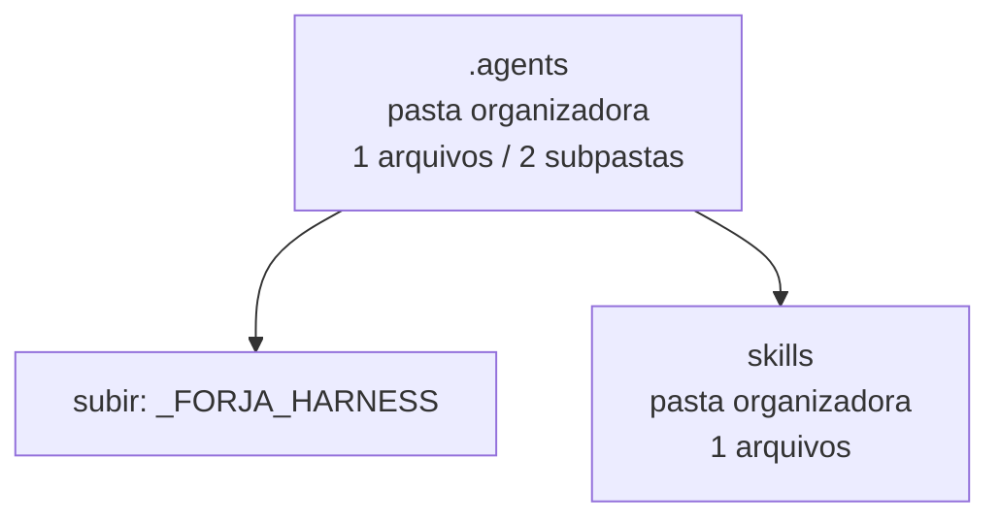

<!-- IA_NAVIGACAO:GERADO_AUTO:v1 -->
# Mapa IA - .agents

Atualizado automaticamente em: **2026-08-05 13:32:39 -0300**

- Caminho: `C:\Users\IgorPC\.claude\projects\Escritório fabio osório\fabricas de melhoria de petições\_FORJA_HARNESS\.agents`
- Tipo: **pasta organizadora**
- Função para navegação: agrega subpastas; abrir mapa filho conforme objetivo
- Conteúdo recursivo: **1 arquivos**, **2 subpastas**, **1.1 KB**
- Tipos de arquivo: .md: 1
- Mapa raiz: [MAPA_IA.md](<../../MAPA_IA.md>)
- Índice geral: [INDICE_GERAL_IA.md](<../../00_IA_NAVIGACAO/INDICE_GERAL_IA.md>)
- Protocolo de navegação: [PROTOCOLO_NAVEGACAO_IA.md](<../../00_IA_NAVIGACAO/PROTOCOLO_NAVEGACAO_IA.md>)
- Inventário JSON para agentes: [inventario_ia.json](<../../00_IA_NAVIGACAO/dados/inventario_ia.json>)
- Mapa superior: [_FORJA_HARNESS](<../MAPA_IA.md>)

## GPS Mermaid

## Ordem de leitura recomendada

1. Ler este `MAPA_IA.md` antes de abrir arquivos pesados.
2. Subir para a raiz se precisar das regras globais `AGENTS.md`, `CLAUDE.md` e `_LEIS_GERAIS`.

## Subpastas diretas

| Subpasta | Tipo | Conteúdo | Atualização | Próximo passo |
|---|---|---:|---:|---|
| [skills](<skills/MAPA_IA.md>) | pasta organizadora | 1 arquivos / 1 subpastas | 2026-07-29 22:47 | agrega subpastas; abrir mapa filho conforme objetivo |

## Arquivos diretos

_Sem arquivos diretos nesta pasta._

## Leitura por papel

- Sem arquivos diretos.

## Observações anti-alucinação

- Este mapa classifica por nomes, extensões e posição na árvore; não substitui leitura de fonte primária.
- Fato, citação, ID processual, prazo e jurisprudência só entram em peça depois de conferência no arquivo-fonte ou fonte oficial.
- Se a pasta tiver regimento, a peça deve refletir o regimento vigente na data do protocolo.
