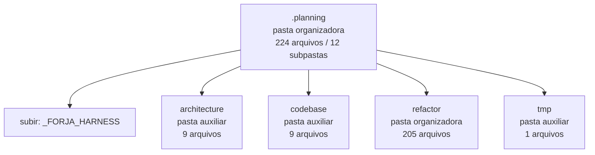

<!-- IA_NAVIGACAO:GERADO_AUTO:v1 -->
# Mapa IA - .planning

Atualizado automaticamente em: **2026-08-05 13:56:09 -0300**

- Caminho: `C:\Users\IgorPC\.claude\projects\Escritório fabio osório\fabricas de melhoria de petições\_FORJA_HARNESS\.planning`
- Tipo: **pasta organizadora**
- Função para navegação: agrega subpastas; abrir mapa filho conforme objetivo
- Conteúdo recursivo: **224 arquivos**, **12 subpastas**, **23.3 MB**
- Tipos de arquivo: .png: 60, .svg: 50, .md: 37, .mmd: 37, .emf: 17, .json: 12, .py: 5, .html: 4, .docx: 1, .pdf: 1
- Mapa raiz: [MAPA_IA.md](<../../MAPA_IA.md>)
- Índice geral: [INDICE_GERAL_IA.md](<../../00_IA_NAVIGACAO/INDICE_GERAL_IA.md>)
- Protocolo de navegação: [PROTOCOLO_NAVEGACAO_IA.md](<../../00_IA_NAVIGACAO/PROTOCOLO_NAVEGACAO_IA.md>)
- Inventário JSON para agentes: [inventario_ia.json](<../../00_IA_NAVIGACAO/dados/inventario_ia.json>)
- Mapa superior: [_FORJA_HARNESS](<../MAPA_IA.md>)

## GPS Mermaid

## Ordem de leitura recomendada

1. Ler este `MAPA_IA.md` antes de abrir arquivos pesados.
2. Subir para a raiz se precisar das regras globais `AGENTS.md`, `CLAUDE.md` e `_LEIS_GERAIS`.
3. Usar builds, renders e QA apenas para validar entrega ou rastrear geração; não começar por eles.

## Subpastas diretas

| Subpasta | Tipo | Conteúdo | Atualização | Próximo passo |
|---|---|---:|---:|---|
| [architecture](<architecture/MAPA_IA.md>) | pasta auxiliar | 9 arquivos / 0 subpastas | 2026-08-05 03:09 | conteúdo auxiliar ou residual |
| [codebase](<codebase/MAPA_IA.md>) | pasta auxiliar | 9 arquivos / 0 subpastas | 2026-07-16 23:24 | conteúdo auxiliar ou residual |
| [refactor](<refactor/MAPA_IA.md>) | pasta organizadora | 205 arquivos / 8 subpastas | 2026-07-17 02:07 | agrega subpastas; abrir mapa filho conforme objetivo |
| [tmp](<tmp/MAPA_IA.md>) | pasta auxiliar | 1 arquivos / 0 subpastas | 2026-07-16 19:39 | conteúdo auxiliar ou residual |

## Arquivos diretos

_Sem arquivos diretos nesta pasta._

## Leitura por papel

- Sem arquivos diretos.

## Observações anti-alucinação

- Este mapa classifica por nomes, extensões e posição na árvore; não substitui leitura de fonte primária.
- Fato, citação, ID processual, prazo e jurisprudência só entram em peça depois de conferência no arquivo-fonte ou fonte oficial.
- Se a pasta tiver regimento, a peça deve refletir o regimento vigente na data do protocolo.
