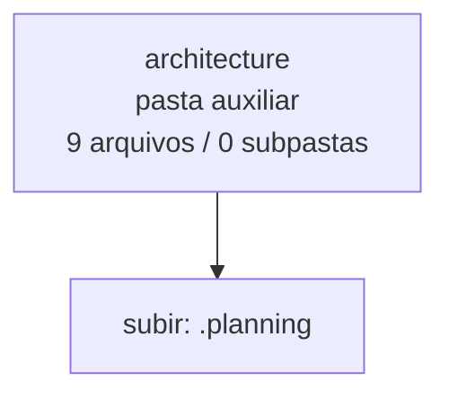

<!-- IA_NAVIGACAO:GERADO_AUTO:v1 -->
# Mapa IA - architecture

Atualizado automaticamente em: **2026-08-05 13:56:04 -0300**

- Caminho: `C:\Users\IgorPC\.claude\projects\Escritório fabio osório\fabricas de melhoria de petições\_FORJA_HARNESS\.planning\architecture`
- Tipo: **pasta auxiliar**
- Função para navegação: conteúdo auxiliar ou residual
- Conteúdo recursivo: **9 arquivos**, **0 subpastas**, **2.0 MB**
- Tipos de arquivo: .json: 4, .html: 4, .md: 1
- Mapa raiz: [MAPA_IA.md](<../../../MAPA_IA.md>)
- Índice geral: [INDICE_GERAL_IA.md](<../../../00_IA_NAVIGACAO/INDICE_GERAL_IA.md>)
- Protocolo de navegação: [PROTOCOLO_NAVEGACAO_IA.md](<../../../00_IA_NAVIGACAO/PROTOCOLO_NAVEGACAO_IA.md>)
- Inventário JSON para agentes: [inventario_ia.json](<../../../00_IA_NAVIGACAO/dados/inventario_ia.json>)
- Mapa superior: [.planning](<../MAPA_IA.md>)

## GPS Mermaid

## Ordem de leitura recomendada

1. Ler este `MAPA_IA.md` antes de abrir arquivos pesados.
2. Subir para a raiz se precisar das regras globais `AGENTS.md`, `CLAUDE.md` e `_LEIS_GERAIS`.

## Subpastas diretas

_Sem subpastas diretas._

## Arquivos diretos

| Arquivo | Papel | Tamanho | Modificado | Observação |
|---|---:|---:|---:|---|
| [improvement-roadmap.workflow.json](<improvement-roadmap.workflow.json>) | dados/script | 3.7 KB | 2026-07-22 02:07 | dado estruturado ou rotina técnica |
| [interface-calls.sequence.json](<interface-calls.sequence.json>) | dados/script | 3.8 KB | 2026-08-05 00:53 | dado estruturado ou rotina técnica |
| [system.architecture.json](<system.architecture.json>) | dados/script | 9.7 KB | 2026-08-05 03:09 | dado estruturado ou rotina técnica |
| [target.architecture.json](<target.architecture.json>) | dados/script | 5.2 KB | 2026-07-22 02:07 | dado estruturado ou rotina técnica |
| [ANALISE_ARQUITETURAL_E_PROPOSTAS.md](<ANALISE_ARQUITETURAL_E_PROPOSTAS.md>) | outro | 10.0 KB | 2026-07-22 02:07 | arquivo não classificado automaticamente \| tópicos: Diagnóstico arquitetural e propostas — FORJA Harness; 1. Veredito executivo; Decisão recomendada |
| [improvement-roadmap.html](<improvement-roadmap.html>) | outro | 499.1 KB | 2026-07-22 02:07 | arquivo não classificado automaticamente |
| [interface-calls.html](<interface-calls.html>) | outro | 503.2 KB | 2026-07-22 01:43 | arquivo não classificado automaticamente |
| [system-architecture.html](<system-architecture.html>) | outro | 518.4 KB | 2026-07-29 01:32 | arquivo não classificado automaticamente |
| [target-architecture.html](<target-architecture.html>) | outro | 503.9 KB | 2026-07-22 02:07 | arquivo não classificado automaticamente |

## Leitura por papel

- **dados/script**: [improvement-roadmap.workflow.json](<improvement-roadmap.workflow.json>), [interface-calls.sequence.json](<interface-calls.sequence.json>), [system.architecture.json](<system.architecture.json>), [target.architecture.json](<target.architecture.json>)
- **outro**: [ANALISE_ARQUITETURAL_E_PROPOSTAS.md](<ANALISE_ARQUITETURAL_E_PROPOSTAS.md>), [improvement-roadmap.html](<improvement-roadmap.html>), [interface-calls.html](<interface-calls.html>), [system-architecture.html](<system-architecture.html>), [target-architecture.html](<target-architecture.html>)

## Observações anti-alucinação

- Este mapa classifica por nomes, extensões e posição na árvore; não substitui leitura de fonte primária.
- Fato, citação, ID processual, prazo e jurisprudência só entram em peça depois de conferência no arquivo-fonte ou fonte oficial.
- Se a pasta tiver regimento, a peça deve refletir o regimento vigente na data do protocolo.
