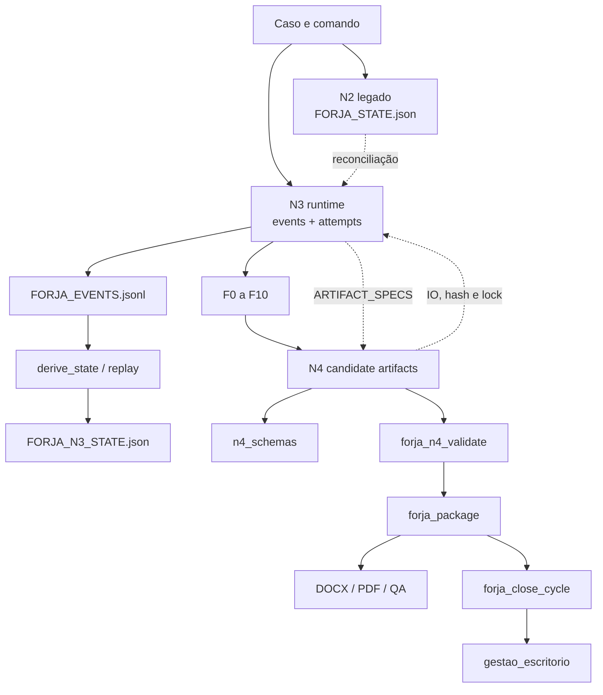
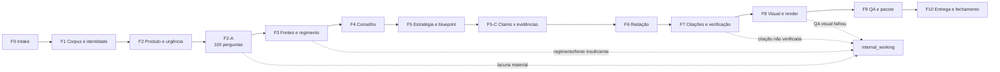
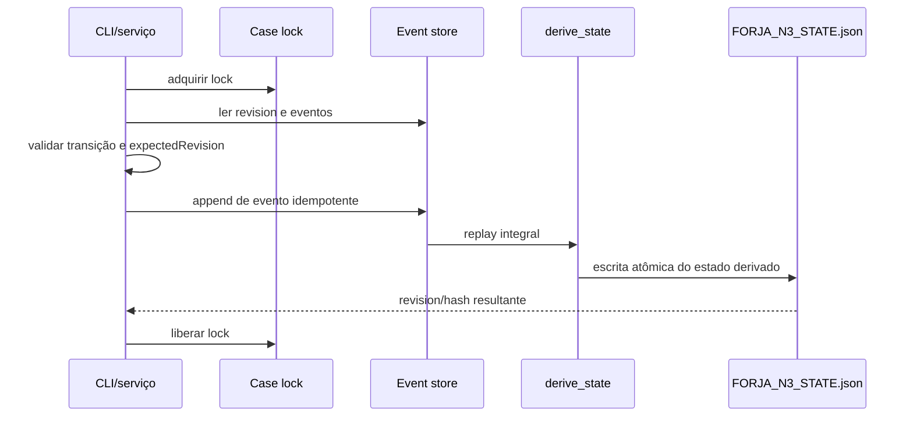
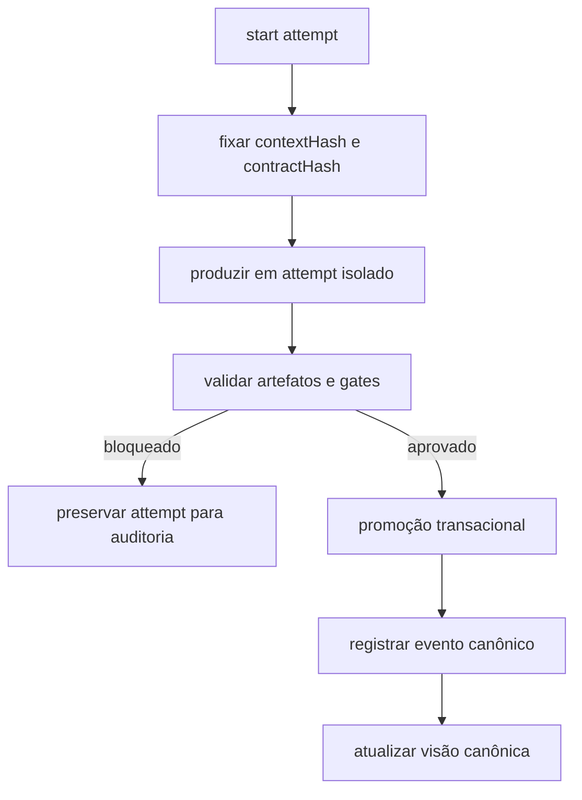
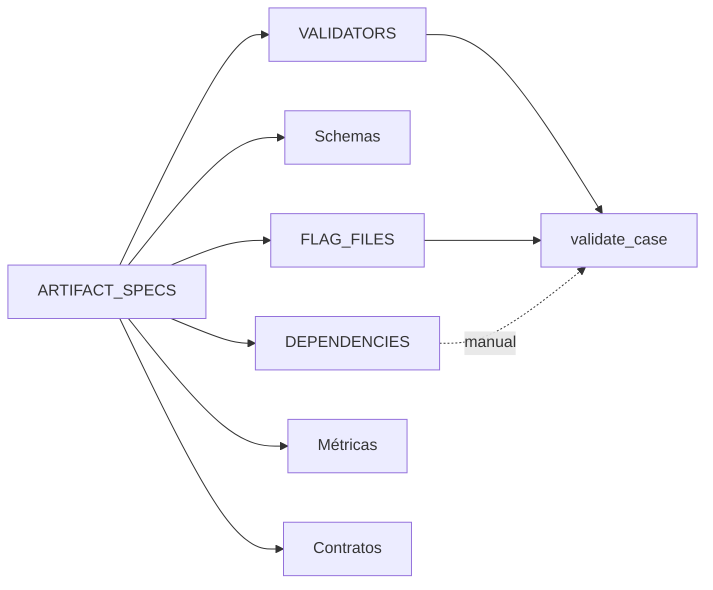
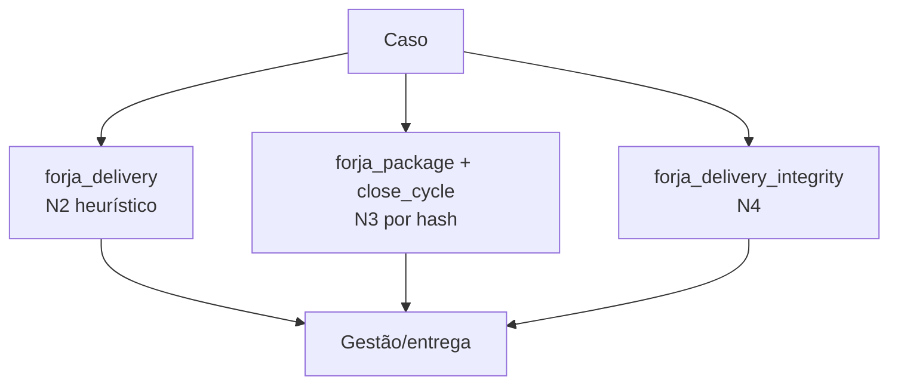
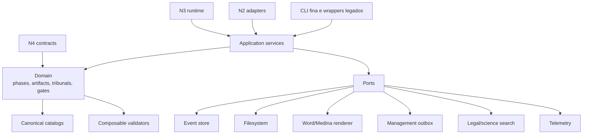

# Arquitetura da FORJA

**Levantamento:** 2026-07-15  
**Natureza:** descrição do estado atual e arquitetura-alvo proposta

## Síntese

A FORJA é um harness local de produção jurídica orientado por fases, artefatos versionados, gates e rastreabilidade. Sua evolução ocorreu de forma aditiva:

- N2 mantém snapshots e rotinas legadas;
- N3 introduz event store, replay, attempts e promoção por hash;
- N4 introduz schemas, novos artefatos e validação candidata.

Não foram encontrados ciclos estáticos no grafo de imports Python. O acoplamento relevante é conceitual: cada geração conhece detalhes das outras.

## Arquitetura atual

## Fluxo das fases

Os nomes exatos devem continuar sendo derivados dos contratos e manifestos. Este diagrama representa responsabilidades, não substitui os arquivos canônicos.

## Estado e eventos N3

`forja_state_machine.py` é uma das partes mais sólidas da base. O estado N3 é derivado; os eventos são a trilha auditável.

Invariantes a preservar:

- append-only;
- idempotência;
- revisão otimista;
- proibição de regressão silenciosa;
- escrita atômica;
- replay determinístico;
- histórico preservado em invalidações.

## Execução por attempts

`forja_run.py` cria diretórios isolados, registra hashes de contexto e promove resultados. O fluxo desejado é:

Risco atual: a promoção verifica `contractHash`, mas o `contextHash` precisa ser revalidado na fronteira final. Cópias/eventos podem ocorrer antes da conclusão do gate N4; isso requer uma política transacional explícita e teste de rollback/estado parcial.

## Catálogo N4 distribuído

Hoje a definição de um artefato pode aparecer em:

- `forja_n4_common.py::ARTIFACT_SPECS`;
- `forja_n4_validate.py::VALIDATORS`;
- `forja_n4_validate.py::FLAG_FILES`;
- `forja_n4_invalidation.py::DEPENDENCIES`;
- `generate_n4_contracts.py`;
- `forja_run_metrics.py`;
- regras contextuais no agregador.

Arquitetura-alvo: `ArtifactCatalog` canônico e tipado, capaz de gerar schemas, índices, documentação e checks de completude. Validadores contextuais permanecem código, mas são registrados explicitamente.

## Entrega atual

Três caminhos coexistem:

O caminho N2 usa glob e primeiro resultado em alguns pontos; o N3 usa identidade e hash. A identidade N3 deve ser canônica, preservando o N2 apenas como adaptador de descoberta legada com alerta de ambiguidade.

## Hubs de dependência

| Módulo | Papel | Sinal arquitetural |
|---|---|---|
| `forja_n3_common.py` | paths, IO, hashing, locks, config | 48 consumidores; precisa virar fachada |
| `forja_n4_common.py` | catálogo e envelope N4 | fonte parcial de verdade |
| `forja_state_machine.py` | eventos e estado derivado | núcleo a preservar |
| `forja_n4_validate.py` | agregador de validações | fan-out alto e muitas responsabilidades |
| `forja_run.py` | attempts e promoção | orquestrador central |
| `forja_package.py` | Definition of Done e pacote | defesa contra autocertificação |

## Arquitetura-alvo

### Camadas propostas

- `core`: IO, tempo, IDs, hashing, locks, paths e erros.
- `domain`: fases, tribunais, artefatos, severidades e políticas.
- `application`: start/resume/promote, validate, package, close e reconcile.
- `ports`: contratos para filesystem, Word, gestão, busca e telemetria.
- `adapters`: implementações locais/Windows/legadas.
- `cli`: parsing e apresentação, sem regra jurídica.

## Hotspots

| Símbolo | Tamanho aproximado | Extração indicada |
|---|---:|---|
| `forja_visual.compor` | 321 linhas | parsing, layout, tabelas, emissão |
| `forja_delivery.main` | 186 linhas | CLI, resolução, regra, integração |
| `forja_render_docx.render` | 165 linhas | composição, Word, exportação, QA |
| `forja_pso_pet.validate_plan` | 161 linhas | schema, regras, métricas |
| `forja_n4_m6_cycles.run` | 161 linhas | orquestração e operações |
| `validate_adversarial_audit` | 136 linhas | ledger, regras e relatório |
| `forja_n4_validate.validate_case` | 115+ linhas | pipeline de validadores |

## Regra de migração

Nenhuma camada deve ser substituída de uma vez. Extrair, reexportar pela fachada existente, comparar comportamento, observar telemetria e só então remover o caminho antigo.
