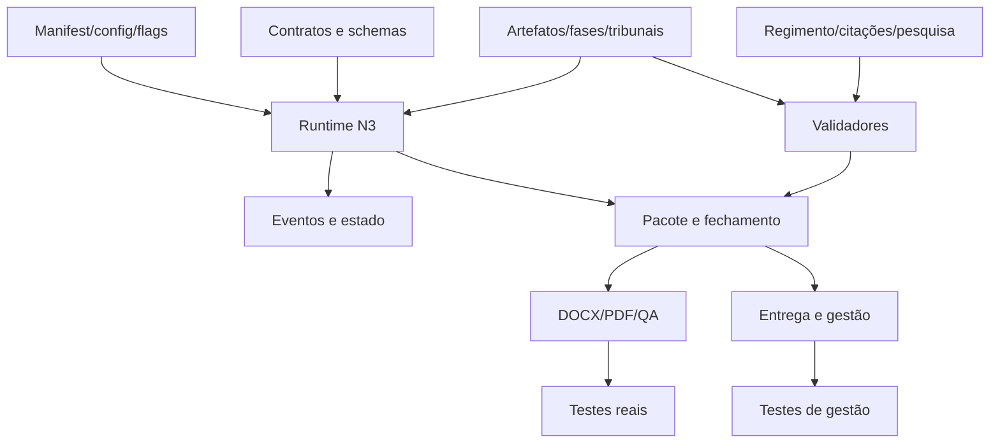
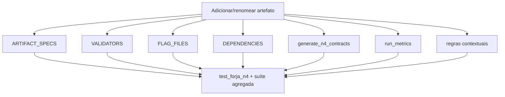
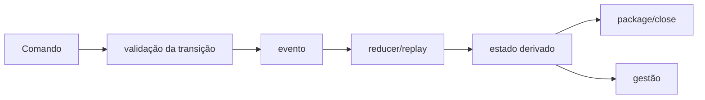
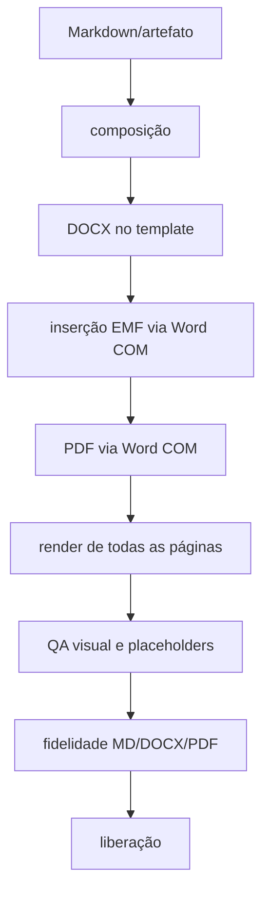
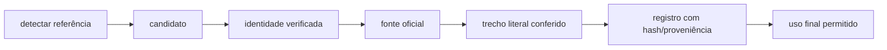

# Mapa de impacto de mudanças

**Levantamento:** 2026-07-15  
**Uso:** consultar antes de alterar qualquer parte da FORJA

## Como usar

1. Localize a mudança na matriz.
2. Confirme quais fontes de verdade ainda coexistem.
3. Abra os módulos consumidores.
4. Acrescente teste de caracterização.
5. Faça a menor extração arquitetural que mova o sistema para a arquitetura-alvo.
6. Execute gates unitários, integração e reais indicados.

## Visão de dependência

## Matriz principal

| Se alterar... | Fontes/arquivos principais | Consumidores e efeitos | Verificação necessária |
|---|---|---|---|
| fases F0–F10 | manifest, contratos, `forja_phase_contracts.py`, state machine | headless, run, package, relatórios, docs | contrato, replay, retomada, pacote |
| F2-A 100 perguntas | `forja_exploracao_100.py`, gerador, schema | F2, N4, bloqueio de redação | scaffold 100, semântica, compatibilidade legacy |
| artefato N4 | `ARTIFACT_SPECS`, validators, flags, dependencies, schemas | run, validate, metrics, package | catálogo completo, schema, invalidação, `--check` |
| tribunal/CNJ | `forja_f2_check.py`, `forja_sources.py` | classificação e busca de regimento | matriz de todos os tribunais, casos reais |
| regimento | `forja_sources.py` e contratos F3 | liberação para pesquisa/conselho | fail-closed, pasta do caso, atualização |
| citação | `forja_citations.py`, métricas F7, auditoria | uso final e score | fonte oficial, literalidade, mutação adversarial |
| severidade | `issue()` e filtros dos agregadores | bloqueio, relatórios, exit codes | enum/casing, P0 em todos os modos |
| event store | `forja_state_machine.py`, common | todo estado N3 | replay, idempotência, concorrência, revisão |
| attempt/promoção | `forja_run.py` | artefatos canônicos e eventos | context/contract hash, rollback, falha parcial |
| definição de pronto | `forja_package.py` | fechamento e entrega | anti-autocertificação, hashes, gates reais |
| resolução de caso | legacy glob + resolver N3 | quase todos os CLIs | zero/um/múltiplos matches |
| entrega | `forja_delivery.py`, package, close, integrity | gestão e arquivos enviados | artifact ID/hash, evidência, idempotência |
| gestão | bridge/reconcile/fila/alertas | painel e status operacional | outbox, retry, precedência de evidência |
| DOCX/render | render, visual, `_FERRAMENTAS` | documento protocolável | template, Word COM, EMF, PDF, QA total |
| QA visual | visual QA, page QA, lint Medina | liberação final | todas as páginas e casos reais |
| injection scan | `forja_injection_scan.py` | confiança no corpus | exceção, arquivo grande, formato inválido |
| dependência Python | futuro `pyproject.toml` | runtime e testes | ambiente limpo e lock reproduzível |
| caminho/pasta | imports, docs, runners, subprocessos | execução em toda a fábrica | wrappers, links, imports e telemetria |

## Mudança em artefato N4

Hoje a alteração deve ser procurada em múltiplos lugares:

Depois de `ArtifactCatalog`, a maior parte deve ser derivada, e o teste precisa falhar se um artefato não estiver coberto.

## Mudança no estado

Checklist:

- evento antigo continua legível;
- replay produz o mesmo estado para histórico antigo;
- evento novo é idempotente;
- revisão concorrente é rejeitada;
- estado legado não é silenciosamente reescrito;
- pacote e gestão entendem a nova representação.

## Mudança em renderização

Não aceitar como prova apenas “o DOCX abriu” ou “o PDF foi criado”. Validar timbre, fólio, EMF, fontes, quebras, rodapé, placeholders e legibilidade.

## Mudança em citação ou fonte

Qualquer atalho que pule uma dessas etapas deve produzir bloqueio ou `não verificado`, nunca aprovação silenciosa.

## Mudança em entrega

Checklist obrigatório:

- resolver exatamente um caso;
- selecionar exatamente um artefato por ID/hash;
- confirmar Definition of Done recalculada;
- registrar hash do entregue;
- vincular evidência operacional;
- manter idempotência em reexecução;
- sincronizar gestão sem perder o estado se a integração falhar;
- distinguir “entregue ao escritório” de “protocolado judicialmente”.

## Testes por área

| Área | Unitário | Contrato | Integração | Real |
|---|---|---|---|---|
| catálogo | sim | sim | — | — |
| estado/eventos | sim | sim | sim | replay de corpus |
| regimento/fontes | sim | sim | sim | caso crítico oficial |
| citação | sim | sim | sim | fonte oficial real |
| render | sim | — | sim | Word/PDF/QA obrigatório |
| entrega | sim | sim | sim | evidência real controlada |
| gestão | sim | sim | sim | painel/estado reconciliado |

## Áreas em que não se deve fazer substituição ampla

- `forja_state_machine.py`;
- primitives atômicas/hashing/locking;
- `forja_package.py` e recálculo de gates;
- contratos históricos;
- testes reais e telemetria;
- artefatos e eventos invalidados;
- template e pipeline Word institucional.

Nessas áreas, preferir extração por fachada e comparação de comportamento.
