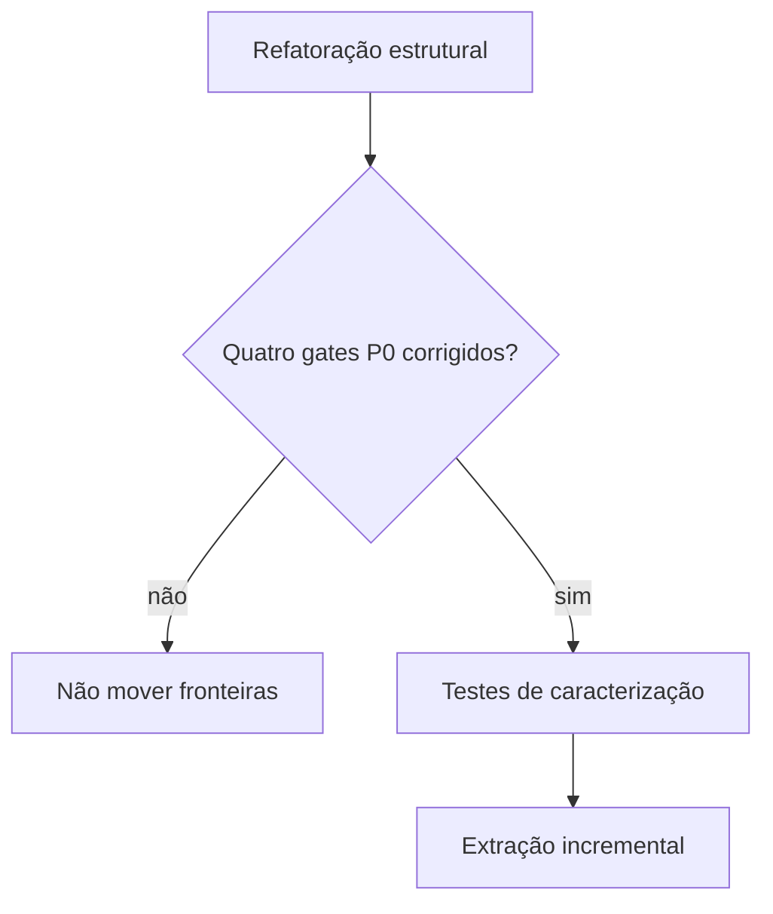
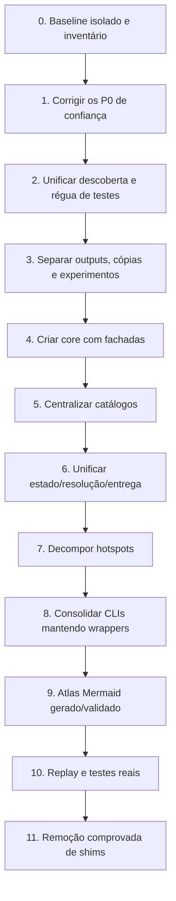

# Riscos, dívida técnica e roteiro de sanitização

**Levantamento:** 2026-07-15  
**Escala:** P0 bloqueia confiança; P1 ameaça manutenção/correção; P2 melhora legibilidade e custo

## P0 — corrigir antes de mover arquitetura

### P0.1 — régua com falso verde

Quinze arquivos de teste não pertencem à união dos dois runners principais. A coleta global também é quebrável por mutação de `sys.stdout` durante import.

**Risco:** refatoração passa pela régua mesmo quebrando proteções não executadas.

### P0.2 — regimento pode ficar apenas em P1

`forja_sources.py` trata ausência como P0, mas regimento fora da pasta, incompleto ou sem metadados pode não bloquear. A busca ampla pode selecionar o primeiro arquivo de outro caso.

**Risco:** liberação contrária à regra inviolável do projeto.

### P0.3 — fonte jurisprudencial pode se autocertificar

Número em nome de PDF/DOCX ou ocorrência em MD/TXT pode produzir fonte local e `finalUseAllowed` sem confirmar identidade, tribunal e trecho literal.

**Risco:** jurisprudência incorreta em peça protocolável.

### P0.4 — scanner de injection falha aberto

Exceção pode retornar sem P0; PDFs acima de 20 MB são filtrados; o processo pode terminar com sucesso.

**Risco:** entrada não analisada é tratada como segura.

## P1 — riscos arquiteturais

| ID | Risco | Evidência | Tratamento |
|---|---|---|---|
| P1.1 | promoção parcialmente canônica | `forja_run.py` copia/registra antes do gate final | transação explícita e teste de rollback |
| P1.2 | `contextHash` não revalidado na promoção | contrato verificado, contexto precisa de novo gate | comparar ambos imediatamente antes de promover |
| P1.3 | seleção heurística de DOCX | `forja_delivery.py` usa primeiro glob | identidade/hash N3 canônicos |
| P1.4 | catálogos N4 dispersos | specs, validators, flags, schemas, métricas | `ArtifactCatalog` |
| P1.5 | tribunais divergentes | dois `TJ_POR_TR` diferentes | catálogo único de domínio |
| P1.6 | estado legado mutado diretamente | delivery, reconcile, sources, citations | adaptadores sobre primitives atômicas |
| P1.7 | integração gestão dentro da transação | imports dinâmicos/exceções absorvidas | outbox idempotente |
| P1.8 | ambiente não reproduzível | sem pyproject/lock | manifesto e grupos de dependência |
| P1.9 | cópia divergente do FocoEdital | 52 clones e 19 divergências | retirar após backup/verificação |
| P1.10 | workspace muito sujo | 751 entradas no início | baseline/worktree isolado |

## P2 — legibilidade e manutenção

- 32 CLIs independentes;
- funções de 115–321 linhas;
- helpers repetidos;
- typing parcial;
- severidades com casing variável;
- documentação arquitetural misturada a changelog;
- mapa automático inclui caches, outputs e projeto estrangeiro;
- pilotos e scripts datados na raiz;
- chave duplicada `caseTestMode`;
- muitos entrypoints sem política uniforme de saída.

## Duplicação: o que remover e o que preservar

### Acidental

- helpers de JSON, tempo, collections e IDs;
- mapas de tribunais e comandos;
- catálogo de artefatos espalhado;
- cópia do FocoEdital;
- rotas heurísticas de resolução/entrega;
- scripts pontuais aparentando runtime permanente.

### Intencional

- `phase_contracts` vigente versus `phase_contracts_n4` candidato;
- recálculo de gates no render, pacote e N4;
- testes unitários e testes reais;
- wrappers de compatibilidade durante migração;
- eventos históricos e artefatos invalidados.

Eliminar duplicação defensiva pode enfraquecer a anti-autocertificação. A pergunta correta não é “há duas implementações?”, mas “elas validam a mesma coisa pela mesma fonte de verdade?”.

## Sequência de refatoração recomendada

## Gates por onda

| Onda | Prova mínima |
|---|---|
| baseline | manifesto de arquivos, hashes, status Git e backup |
| confiança | novos testes P0 passando e negativos comprovados |
| core | equivalência de imports e helpers |
| catálogos | geração `--check` limpa e cobertura total |
| estado | replay determinístico e nenhuma regressão silenciosa |
| entrega | seleção pelo artifact ID/hash e pacote equivalente |
| render | Word/PDF/EMF e QA página a página em casos reais |
| limpeza | ausência de uso, restore testado e documentação atualizada |

## Risco de processo

A taxonomia compartilhada registra F007: auditor delegado pode alterar arquivos fora do relatório. Por isso, esta pesquisa manteve escrita somente em `.planning/codebase/`. Antes de qualquer futura integração, comparar o status Git e timestamps fora dessa área.

## Definição de conclusão futura

A sanitização completa não é “Ruff verde” nem “menos arquivos”. Ela exige:

- fontes de verdade canônicas;
- todos os testes descobertos e classificados;
- gates jurídicos fail-closed;
- runtime modular com dependências direcionais;
- outputs fora da árvore de fonte;
- diagramas ligados ao código real;
- compatibilidade removida apenas com evidência;
- backup e restore comprovados;
- artefatos reais equivalentes.
