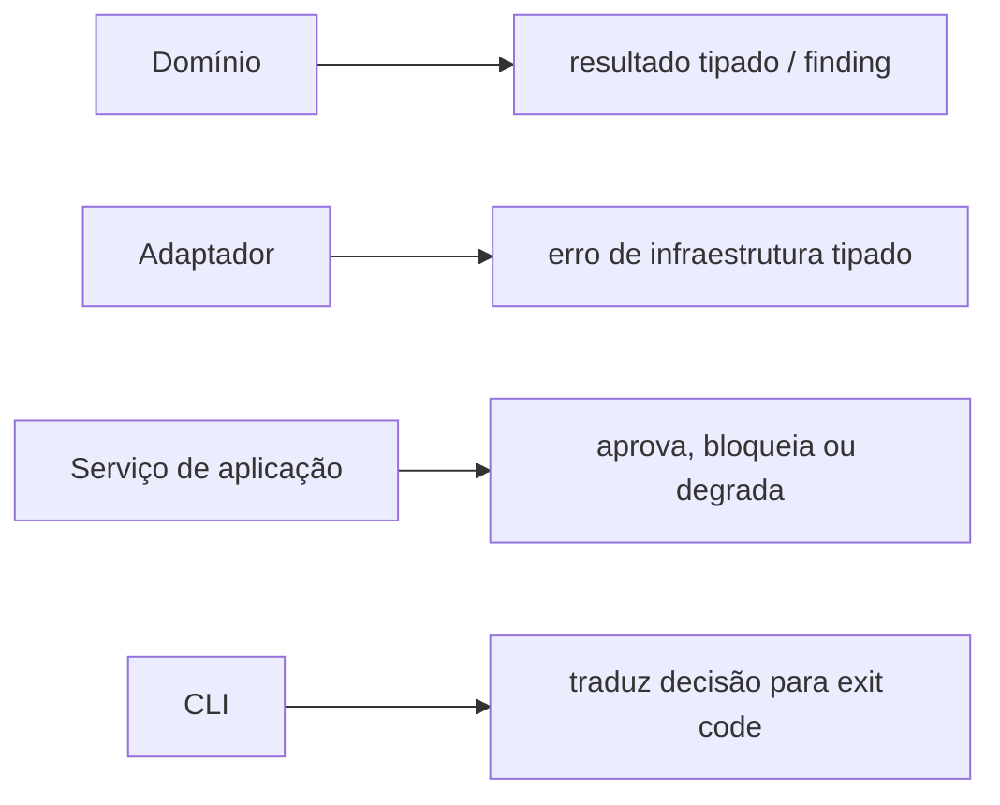
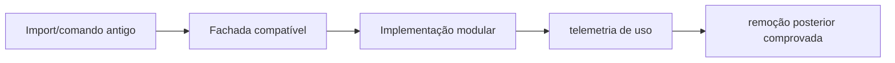

# Convenções de código

**Levantamento:** 2026-07-15

## Padrões positivos existentes

### Paths e serialização

- uso predominante de `pathlib.Path`;
- JSON legível e com Unicode preservado;
- primitives atômicas e hashing em `forja_n3_common.py`;
- confinamento de caminhos para artefatos N3/N4;
- estados derivados em vez de mutação silenciosa no caminho N3.

### Rastreabilidade

- eventos append-only;
- hashes de contratos e artefatos;
- timestamps ISO;
- IDs de eventos e attempts;
- reports e telemetria separados dos artefatos protocoláveis.

### Validação

- findings estruturados com severidade;
- schemas N4;
- validadores específicos por domínio;
- recálculo de gates no empacotamento para impedir autocertificação;
- invalidação preservando histórico.

### Testes

- muitos testes isolam casos em diretórios temporários;
- há testes de contratos, replay, fidelidade e artefatos reais;
- existe bateria real com Word/PDF e telemetria.

## Inconsistências observadas

| Tema | Situação atual | Efeito |
|---|---|---|
| imports | manipulação de `sys.path` | dependência da posição física |
| entrypoints | dezenas de `main()` independentes | UX e tratamento de erro divergentes |
| JSON | helpers repetidos | semântica de default/erro varia |
| tempo | várias funções `now_iso`/parse | timezone e erro inconsistentes |
| erro | `SystemExit`, exceptions e retorno estruturado misturados | difícil compor módulos |
| severidade | `P0/P1` e `p0/p1` | filtros frágeis |
| typing | anotações parciais | contratos implícitos |
| resolução de caso | glob heurístico e resolvedor estrito coexistem | seleção ambígua |
| catálogo | constantes repetidas em módulos | divergência funcional |
| CLI/regra | regra de negócio dentro de `main()` | baixa testabilidade |

Ruff encontrou 64 ocorrências no levantamento, 27 potencialmente autofixáveis. Há uma chave duplicada `caseTestMode` em `forja_n4_validate.py`. Autofix não deve ser aplicado em massa antes de testes de caracterização.

## Clones utilitários

- `append_unique`: quatro implementações;
- `merge_by_id`: duas;
- leitura JSON: várias, apesar de primitive N3;
- timestamp ISO: várias;
- parsing de data: várias;
- extração DOCX: duas ou mais;
- verificação de IDs únicos: quase-clones.

Destino sugerido:

```text
src/forja/core/
├── collections.py
├── errors.py
├── ids.py
├── json_io.py
├── locking.py
├── paths.py
└── time.py
```

`forja_n3_common.py` deve permanecer temporariamente como fachada, reexportando símbolos dos módulos novos.

## Padrão recomendado de erro



Regras:

- bibliotecas não chamam `sys.exit()`;
- somente CLI converte resultado em exit code;
- exceção não analisada em gate crítico implica bloqueio;
- findings usam enum canônico de severidade;
- mensagens para relatório não contêm caminhos ou segredos desnecessários;
- erro técnico e decisão jurídica são campos diferentes.

## Padrão recomendado de função

- parâmetros e retorno tipados em APIs públicas;
- efeitos colaterais explícitos no nome ou serviço;
- uma responsabilidade principal;
- dependências externas injetadas por porta;
- ausência de `glob()` não determinístico em regra de negócio;
- sem leitura de configuração global no meio de validador puro;
- helpers puros separados de IO.

## Padrão de catálogos

Catálogos de domínio devem ter uma única fonte de verdade:

- fases;
- artefatos;
- tribunais;
- comandos;
- severidades;
- feature flags;
- estados epistemológicos.

Derivados devem ser gerados ou validados contra o catálogo. Duplicação entre schema e regra semântica pode permanecer quando a responsabilidade for explicitamente diferente.

## Compatibilidade



Não remover wrappers por aparência de desuso. Buscar referências, instrumentar, validar runners e observar ciclos reais.

## Convenções documentais

- caminhos reais em backticks;
- Mermaid pequeno e voltado a decisão;
- diagrama acompanhado da fonte canônica que o sustenta;
- data de observação explícita;
- separar “estado atual” de “arquitetura-alvo”;
- não usar documentação como prova de comportamento sem teste correspondente.
