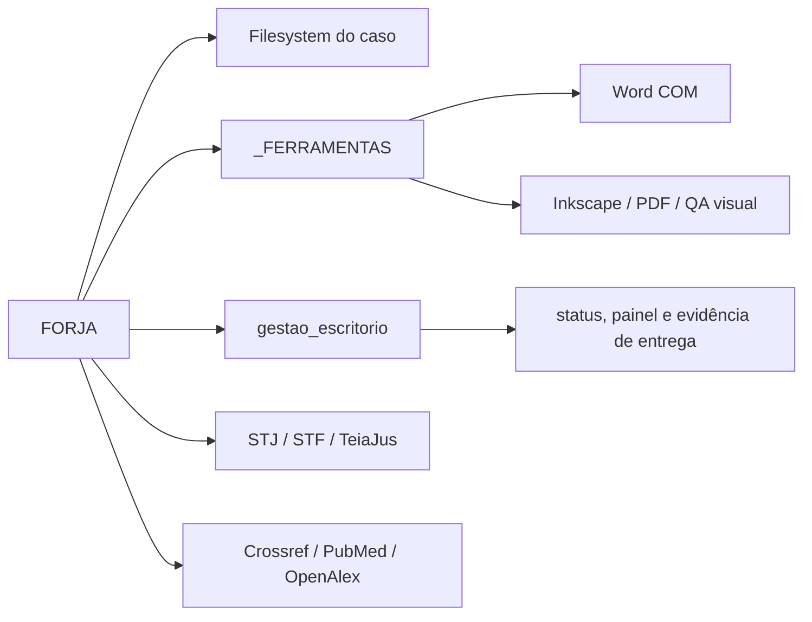

# Integrações e fronteiras externas

**Levantamento:** 2026-07-15

## Visão geral

## Filesystem e artefatos do caso

É a principal integração do sistema. A FORJA lê e escreve:

- `state/case-*`;
- `FORJA_STATE.json` legado;
- `FORJA_EVENTS.jsonl` e `FORJA_N3_STATE.json` aditivos;
- artefatos F0–F10;
- attempts isolados;
- pacotes, relatórios, hashes e telemetria.

Pontos fortes já existentes:

- escrita JSON atômica em `forja_n3_common.py`;
- confinamento de caminhos;
- hashing de artefatos;
- lock de caso;
- revisão otimista e replay de eventos.

Risco: módulos legados ainda usam `glob()` e escolhem o primeiro resultado, enquanto o resolvedor N3 rejeita ambiguidades.

## Ferramentas visuais compartilhadas

Integração por `sys.path` com a pasta irmã `_FERRAMENTAS` em módulos como:

- `forja_render_docx.py`;
- `forja_visual.py`;
- `forja_visual_qa.py`;
- `forja_n3_shadow_replay.py`;
- `validate_forja_n3.py`.

Essa pasta fornece template, lint visual, pipeline Word/PDF e utilitários Medina. A dependência é legítima, mas está acoplada à posição física do workspace.

Recomendação: uma porta `DocumentRenderer` com adaptador Word/Medina; o runtime não deve manipular `sys.path`.

## Microsoft Word e geração final

- Word COM é a fonte de fidelidade para inserir EMF e exportar PDF.
- `python-docx` é usado para estrutura e leitura, mas não substitui COM para EMF.
- QA final exige renderização de todas as páginas.

Falhas possíveis:

- Word indisponível ou processo preso;
- template ausente;
- EMF inserido pelo caminho errado;
- documento gerado, porém sem inspeção de todas as páginas.

Uma futura porta deve distinguir `capability unavailable`, `render failed` e `qa blocked`, sempre falhando de forma explícita.

## Gestão do escritório

Integração com `../gestao_escritorio` aparece em:

- `forja_management_bridge.py`;
- `forja_delivery.py`;
- `forja_reconcile.py`;
- `forja_fila.py`;
- `forja_alertas.py`;
- testes de gestão e rotas.

Fontes relevantes incluem `demandas.json`, `forja_status.json`, `forja_fila.json` e intervenções manuais.

Regra de precedência operacional: entrega comprovada na gestão pode prevalecer sobre snapshot atrasado da FORJA. O teste `forja_status_conflict` ainda representa a regra antiga.

Risco arquitetural: imports dinâmicos e exceções absorvidas ligam transação de caso a atualização de painel. Recomendação: porta `ManagementOutbox`, com evento persistido e sincronização idempotente fora da transação principal.

## Pesquisa jurídica

`forja_citations.py` constrói links oficiais para:

- SCON/STJ;
- pesquisa de jurisprudência STF;
- súmulas STF/STJ;
- temas repetitivos STJ;
- repercussão geral STF;
- informativos.

`forja_legal_search.py` executa uma ponte local com o sistema de busca jurídica.

Risco crítico: presença de número em nome/conteúdo de arquivo pode liberar uma fonte local sem comprovar identidade e literalidade. A integração precisa retornar estados distintos: `candidate`, `identity_verified`, `content_verified` e `final_use_allowed`.

## Pesquisa científica

`forja_science.py` usa `urllib` para:

- Crossref;
- PubMed/NCBI;
- OpenAlex.

OpenAlex pode consumir chave por configuração de ambiente. Nenhum segredo deve ser registrado nos mapas ou telemetria.

Recomendação: timeouts, retry limitado, cache com proveniência e resultado `unverified` quando a fonte remota falhar.

## Execução headless e subprocessos

Subprocessos aparecem em:

- `forja_headless.py`;
- `forja_legal_search.py`;
- `forja_regua.py`;
- validadores e construtores de atlas.

O contrato comum deve registrar:

- comando lógico, sem segredos;
- timeout;
- código de saída;
- stdout/stderr sanitizados;
- hash dos inputs;
- efeito esperado;
- política de retry.

## Matriz de criticidade

| Integração | Se indisponível | Política recomendada |
|---|---|---|
| Filesystem/event store | impossível manter rastreabilidade | bloquear |
| Regimento/fonte oficial | peça juridicamente insegura | bloquear |
| Word COM em entrega final | PDF sem fidelidade garantida | bloquear entrega final |
| QA visual | defeitos podem chegar ao protocolo | bloquear entrega final |
| Gestão | status pode ficar atrasado | persistir outbox e alertar |
| Pesquisa científica opcional | lastro complementar incompleto | bloquear somente quando aplicável |
| Painel/atlas | visualização indisponível | degradar com alerta |
