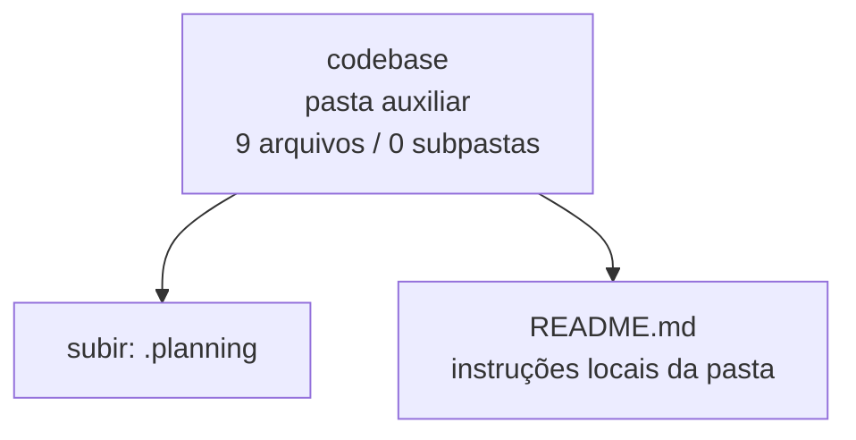

<!-- IA_NAVIGACAO:GERADO_AUTO:v1 -->
# Mapa IA - codebase

Atualizado automaticamente em: **2026-08-05 13:56:04 -0300**

- Caminho: `C:\Users\IgorPC\.claude\projects\Escritório fabio osório\fabricas de melhoria de petições\_FORJA_HARNESS\.planning\codebase`
- Tipo: **pasta auxiliar**
- Função para navegação: conteúdo auxiliar ou residual
- Conteúdo recursivo: **9 arquivos**, **0 subpastas**, **47.3 KB**
- Tipos de arquivo: .md: 9
- Mapa raiz: [MAPA_IA.md](<../../../MAPA_IA.md>)
- Índice geral: [INDICE_GERAL_IA.md](<../../../00_IA_NAVIGACAO/INDICE_GERAL_IA.md>)
- Protocolo de navegação: [PROTOCOLO_NAVEGACAO_IA.md](<../../../00_IA_NAVIGACAO/PROTOCOLO_NAVEGACAO_IA.md>)
- Inventário JSON para agentes: [inventario_ia.json](<../../../00_IA_NAVIGACAO/dados/inventario_ia.json>)
- Mapa superior: [.planning](<../MAPA_IA.md>)

## GPS Mermaid

## Ordem de leitura recomendada

1. Ler este `MAPA_IA.md` antes de abrir arquivos pesados.
2. Subir para a raiz se precisar das regras globais `AGENTS.md`, `CLAUDE.md` e `_LEIS_GERAIS`.

## Subpastas diretas

_Sem subpastas diretas._

## Arquivos diretos

| Arquivo | Papel | Tamanho | Modificado | Observação |
|---|---:|---:|---:|---|
| [README.md](<README.md>) | regras | 3.4 KB | 2026-07-16 23:23 | instruções locais da pasta \| tópicos: Mapa técnico da FORJA; Leitura recomendada; Fotografia verificada |
| [ARCHITECTURE.md](<ARCHITECTURE.md>) | outro | 7.7 KB | 2026-07-15 18:46 | arquivo não classificado automaticamente \| tópicos: Arquitetura da FORJA; Síntese; Arquitetura atual |
| [CHANGE_IMPACT.md](<CHANGE_IMPACT.md>) | outro | 7.1 KB | 2026-07-15 18:48 | arquivo não classificado automaticamente \| tópicos: Mapa de impacto de mudanças; Como usar; Visão de dependência |
| [CONCERNS.md](<CONCERNS.md>) | outro | 5.9 KB | 2026-07-15 18:47 | arquivo não classificado automaticamente \| tópicos: Riscos, dívida técnica e roteiro de sanitização; P0 — corrigir antes de mover arquitetura; P0.1 — régua com falso verde |
| [CONVENTIONS.md](<CONVENTIONS.md>) | outro | 4.7 KB | 2026-07-15 18:48 | arquivo não classificado automaticamente \| tópicos: Convenções de código; Padrões positivos existentes; Paths e serialização |
| [INTEGRATIONS.md](<INTEGRATIONS.md>) | outro | 4.7 KB | 2026-07-15 18:45 | arquivo não classificado automaticamente \| tópicos: Integrações e fronteiras externas; Visão geral; Filesystem e artefatos do caso |
| [STACK.md](<STACK.md>) | outro | 3.7 KB | 2026-07-15 18:45 | arquivo não classificado automaticamente \| tópicos: Stack e dependências; Linguagem e runtime; Bibliotecas observadas |
| [STRUCTURE.md](<STRUCTURE.md>) | outro | 5.6 KB | 2026-07-16 23:24 | arquivo não classificado automaticamente \| tópicos: Estrutura do codebase; Situação atual; Classificação dos arquivos Python da raiz |
| [TESTING.md](<TESTING.md>) | outro | 4.5 KB | 2026-07-15 18:47 | arquivo não classificado automaticamente \| tópicos: Testes e estratégia de validação; Estado observado; Resultado do levantamento seguro |

## Leitura por papel

- **regras**: [README.md](<README.md>)
- **outro**: [ARCHITECTURE.md](<ARCHITECTURE.md>), [CHANGE_IMPACT.md](<CHANGE_IMPACT.md>), [CONCERNS.md](<CONCERNS.md>), [CONVENTIONS.md](<CONVENTIONS.md>), [INTEGRATIONS.md](<INTEGRATIONS.md>), [STACK.md](<STACK.md>), [STRUCTURE.md](<STRUCTURE.md>), [TESTING.md](<TESTING.md>)

## Observações anti-alucinação

- Este mapa classifica por nomes, extensões e posição na árvore; não substitui leitura de fonte primária.
- Fato, citação, ID processual, prazo e jurisprudência só entram em peça depois de conferência no arquivo-fonte ou fonte oficial.
- Se a pasta tiver regimento, a peça deve refletir o regimento vigente na data do protocolo.
