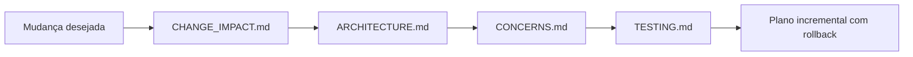

# Mapa técnico da FORJA

**Data da pesquisa:** 2026-07-15  
**Última atualização física:** 2026-07-16
**Escopo:** `_FORJA_HARNESS`  
**Estado:** mapa da pesquisa original, atualizado após a primeira sanitização física

Este diretório é o ponto de entrada para humanos e IAs que precisem entender a FORJA antes de alterar código. Ele combina a fotografia do levantamento com atualizações físicas confirmadas; a arquitetura-alvo ainda não está integralmente implementada.

Limites atuais importantes:

- o acervo visual pesado está fora do harness, em `C:\Users\IgorPC\.claude\projects\Forja visual 3d`;
- esse arquivo externo não é dependência runtime da FORJA;
- FocoEdital não pertence à FORJA e não deve ser importado, recriado ou tratado como subprojeto visual;
- scripts pontuais estão indexados em `_scripts_oneoff/LEIA-ME.md`.

## Leitura recomendada

1. `ARCHITECTURE.md` — motores N2/N3/N4, fluxos e arquitetura-alvo.
2. `CHANGE_IMPACT.md` — onde mexer e o que pode quebrar.
3. `CONCERNS.md` — riscos e ordem segura de refatoração.
4. `TESTING.md` — proteção existente e lacunas da régua.
5. `STRUCTURE.md` — responsabilidade das pastas e arquivos.
6. `STACK.md` — runtime e dependências.
7. `INTEGRATIONS.md` — fronteiras com Word, gestão, pesquisa e filesystem.
8. `CONVENTIONS.md` — padrões atuais e padrões recomendados.

## Fotografia verificada

| Indicador | Resultado |
|---|---:|
| Python na raiz | 102 arquivos |
| Módulos de produção `forja_*` | 58 arquivos / 12.419 LOC |
| Testes na raiz | 35 arquivos / 4.274 LOC |
| CLIs de produção com `argparse` | 32 |
| Funções examinadas por AST | 854 |
| Ciclos estáticos de importação | 0 |
| Clones exatos de funções | 6 grupos / 16 instâncias |
| Erros Ruff no levantamento | 64 |
| Bateria isolada | 227 aprovados / 1 teste desatualizado |
| Entradas sujas no workspace no início deste mapa | 751 |

## Regra de navegação para IA

Antes de propor alteração:

1. identificar a fase, artefato e motor afetados;
2. consultar `CHANGE_IMPACT.md`;
3. localizar a fonte de verdade vigente e as duplicadas;
4. distinguir duplicação acidental de defesa em profundidade;
5. acrescentar teste de caracterização antes de mover código;
6. preservar compatibilidade por fachada ou wrapper;
7. validar com replay e, quando houver Word/PDF, com artefatos reais.

## Limites e histórico desta pesquisa

- No levantamento de 15/07 não houve limpeza, movimentação ou exclusão de arquivos.
- Em 16/07 ocorreu uma sanitização física posterior: o acervo visual saiu do harness e scripts pontuais foram isolados. Os documentos desta pasta devem distinguir os dois momentos.
- A atualização deste mapa não transforma o arquivo visual externo ou o FocoEdital em componentes da arquitetura FORJA.
- Testes reais com Word COM, entrega externa e pesquisa remota não foram reexecutados nesta etapa documental.
- Contagens de `state/`, `reports/` e `telemetria/` são voláteis e devem ser atualizadas antes de uma limpeza.

## Princípio de refatoração

> Preservar os gates jurídicos e a rastreabilidade; centralizar fontes de verdade; mover por etapas; apagar somente depois de prova de substituição.
