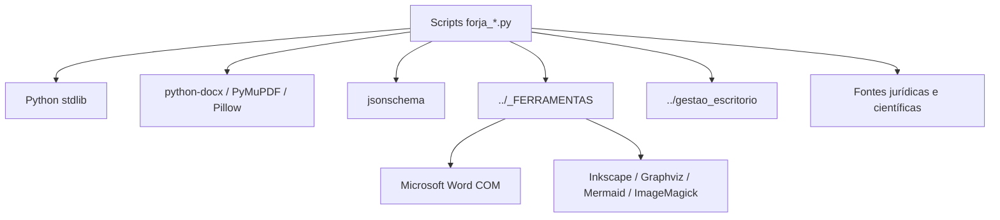

# Stack e dependências

**Levantamento:** 2026-07-15  
**Objeto:** runtime e ferramentas observadas na FORJA

## Linguagem e runtime

- Linguagem principal: Python.
- Runtime disponível durante o levantamento: Python 3.14.6.
- Test runner disponível: pytest 9.0.3.
- O repositório não possui `pyproject.toml`, `requirements.txt`, lockfile, `pytest.ini`, configuração Ruff ou configuração mypy própria no harness.
- Os módulos são executados diretamente a partir da raiz; ainda não existe pacote `src/forja` instalável.

O número da versão observada descreve a máquina atual, não um requisito versionado. A ausência de manifesto reproduzível é um risco de manutenção.

## Bibliotecas observadas

| Área | Biblioteca/ferramenta | Uso principal |
|---|---|---|
| DOCX | `python-docx` | leitura, composição e inspeção de documentos Word |
| PDF | `PyMuPDF` / `fitz` | leitura, renderização e metadados |
| Imagem | Pillow | QA de páginas e preparação visual |
| Schema | `jsonschema` | contratos N4 |
| Word | `pywin32` / Word COM | inserção EMF e PDF final fiel |
| HTML/atlas | BeautifulSoup e `markdown-it-py` | construção do atlas visual |
| Testes | pytest e unittest | testes unitários, subtests e runners legados |
| Relatórios | ReportLab, pdfplumber e pypdf disponíveis no ambiente | suporte a PDF e auditoria |
| Sistema | stdlib: `pathlib`, `json`, `hashlib`, `subprocess`, `urllib`, locks | runtime da FORJA |

## Ferramentas externas obrigatórias no ecossistema

As regras do projeto também dependem de ferramentas fora deste diretório:

- `_FERRAMENTAS/word_visual_pipeline.py`;
- `_FERRAMENTAS/word_pdf_worker.py`;
- `_FERRAMENTAS/medina_visual_lint.py`;
- template Word institucional;
- Microsoft Word via COM;
- Inkscape para SVG → EMF;
- Graphviz e Mermaid CLI para diagramas;
- ImageMagick e Tectonic em fluxos específicos.

## Forma atual do runtime



## Configuração existente

- `FORJA_SPEC_MANIFEST.json` descreve especificações e rollout.
- `FORJA_N3_CONFIG.json` controla flags N3 e modo N4.
- `phase_contracts/` mantém contratos vigentes.
- `phase_contracts_n4/` mantém contratos candidatos.
- `n4_schemas/` contém 28 schemas gerados/versionados.
- Estado operacional fica em `state/`, `cache/`, `telemetria/` e `reports/`.

Flags observadas em `FORJA_N3_CONFIG.json`:

- `eventStoreV1: false`;
- `phaseRunnerV1: false`;
- N4 em `pilot_blocking`.

Essas flags tornam a migração aditiva, mas também mantêm caminhos legados ativos.

## Débitos de stack

1. Dependências e versão do Python não estão fixadas.
2. Não há instalação reproduzível nem pacote importável.
3. Imports usam manipulação de `sys.path` para `_FERRAMENTAS`.
4. Testes dependem do ambiente global da máquina.
5. CLIs são dezenas de scripts independentes, sem entrypoint único.
6. Ferramentas Windows não possuem uma checagem central de capacidade antes da execução.

## Estado-alvo recomendado

```text
pyproject.toml
src/forja/
tests/
tools/
```

O `pyproject.toml` deve registrar:

- versão suportada do Python;
- dependências centrais e grupos opcionais `word`, `visual`, `science`, `dev`;
- pytest, Ruff e type checking;
- entrypoint `forja`;
- política de versão dos contratos.

A adoção deve ser incremental. Os scripts antigos permanecem como wrappers até a telemetria provar que não são mais usados.
