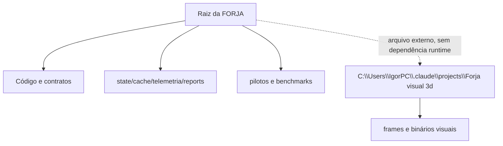
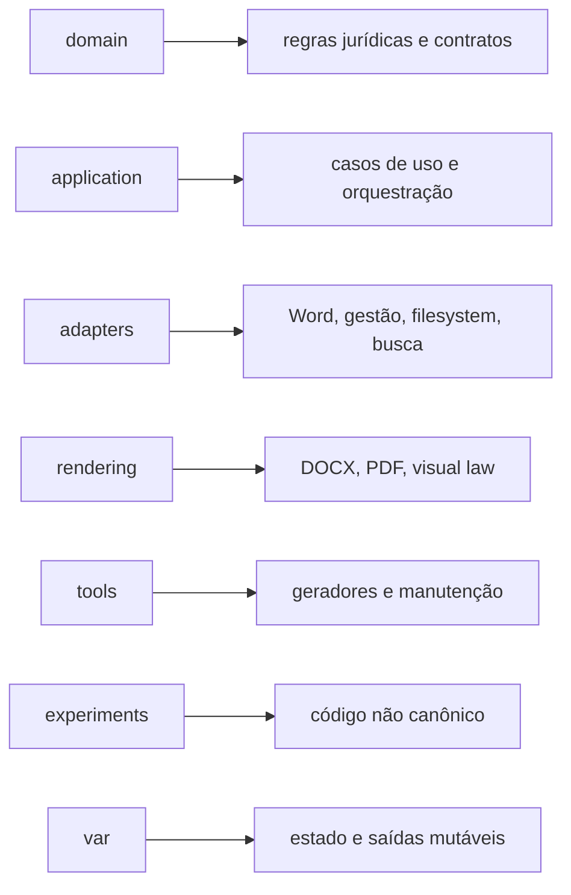

# Estrutura do codebase

**Levantamento original:** 2026-07-15
**Atualização física:** 2026-07-16

## Situação atual

A maior parte do Python ainda vive na raiz. Código, testes, CLIs, geradores, pilotos e documentação coexistem no mesmo nível. Os scripts pontuais foram isolados em `_scripts_oneoff/`; o acervo visual volumoso deixou o harness.

```text
_FORJA_HARNESS/
├── forja_*.py                 runtime, CLIs, pilotos e validadores
├── test_*.py                  testes
├── validate_forja_n3.py       runner N3
├── generate_n4_contracts.py   gerador de contratos/schemas
├── FORJA_SPEC_MANIFEST.json
├── FORJA_N3_CONFIG.json
├── phase_contracts/           12 arquivos
├── phase_contracts_n4/        13 arquivos
├── n4_schemas/                28 arquivos
├── templates/                 3 arquivos
├── _scripts_oneoff/           scripts históricos/pontuais, com índice próprio
├── state/                     1.739 arquivos no levantamento
├── cache/                     60 arquivos
├── telemetria/                320 arquivos
└── reports/                   saídas e relatórios operacionais
```

As contagens de saídas são instantâneas e não devem ser tratadas como constantes.

O acervo `Forja visual 3d`, o atlas Blender e os assets visuais pesados foram arquivados fora do harness em `C:\Users\IgorPC\.claude\projects\Forja visual 3d`. Esse diretório externo não é fonte Python nem dependência runtime da FORJA.

## Classificação dos arquivos Python da raiz

| Classe | Exemplos | Destino futuro |
|---|---|---|
| runtime canônico | `forja_run.py`, `forja_state_machine.py`, `forja_package.py` | `src/forja/application` |
| domínio/validação | `forja_n4_common.py`, `forja_reasoning.py` | `src/forja/domain` |
| infraestrutura | `forja_n3_common.py`, render, filesystem | `src/forja/core` e `adapters` |
| CLI operacional | `forja_close_cycle.py`, `forja_fila.py` | `src/forja/cli` ou `tools` |
| geradores | `generate_n4_contracts.py` | `tools/generators` |
| pilotos/benchmarks | `forja_n4_pilot_*`, `forja_n4_m6_*` | `experiments/n4` |
| migração pontual | `_scripts_oneoff/neutralizar_marca_*`, `_scripts_oneoff/sanitize_pdfs_pendentes.py` | `migrations/YYYY-MM` |
| caso datado | `_scripts_oneoff/build_f2a_igor_20260715.py` | pasta do caso ou migração auditável |
| testes | `test_*.py` | `tests` |

## Mistura fonte/saída



Essa mistura aumenta:

- tempo de inventário;
- ruído em busca textual;
- risco de uma IA editar a cópia errada;
- tamanho de backup e status Git, quando outputs retornam ao harness;
- dificuldade de definir ownership e retenção.

## Limite explícito: FocoEdital

O FocoEdital **não pertence à FORJA**, não é componente visual da FORJA e não pode ser tratado como fonte, dependência, fixture ou subprojeto deste harness. O projeto canônico, quando necessário em tarefa própria, fica fora deste escopo:

`C:\Users\IgorPC\.claude\projects\FocoEdital`

O levantamento de 15/07 havia identificado uma cópia acidental dentro da antiga árvore visual. A sanitização retirou essa árvore do harness e, em 16/07, o experimento e seus documentos também saíram do arquivo visual externo. A cópia redundante foi eliminada após backup privado e restore testado. O caminho antigo não existe mais e não pode ser recriado, importado ou indexado pela FORJA.

Classificação: projeto alheio à FORJA. Se uma cópia reaparecer no harness, registrar a ocorrência e removê-la do escopo por procedimento auditável, sem fundir conteúdo com o projeto canônico.

## Estrutura-alvo proposta

```text
_FORJA_HARNESS/
├── pyproject.toml
├── src/forja/
│   ├── core/
│   ├── domain/
│   ├── application/
│   ├── adapters/
│   ├── rendering/
│   └── cli/
├── tests/
│   ├── unit/
│   ├── contract/
│   ├── integration/
│   └── real/
├── tools/
├── experiments/n4/
├── migrations/
├── archive/
├── docs/
├── contracts/
│   ├── current/
│   ├── candidate/
│   └── schemas/
└── var/
    ├── state/
    ├── cache/
    ├── telemetria/
    ├── reports/
    └── renders/
```

## Ownership sugerido



## Regras para movimentação futura

1. Não mover código e alterar comportamento no mesmo passo.
2. Criar teste de import/CLI antes do movimento.
3. Manter wrapper no caminho antigo.
4. Atualizar links, runners e documentação.
5. Registrar origem e destino em manifesto de migração.
6. Comparar hashes/artefatos antes e depois.
7. Remover wrapper somente após telemetria sem uso.
8. Não apagar `state`, contratos históricos ou relatórios sem política de retenção e restore.
