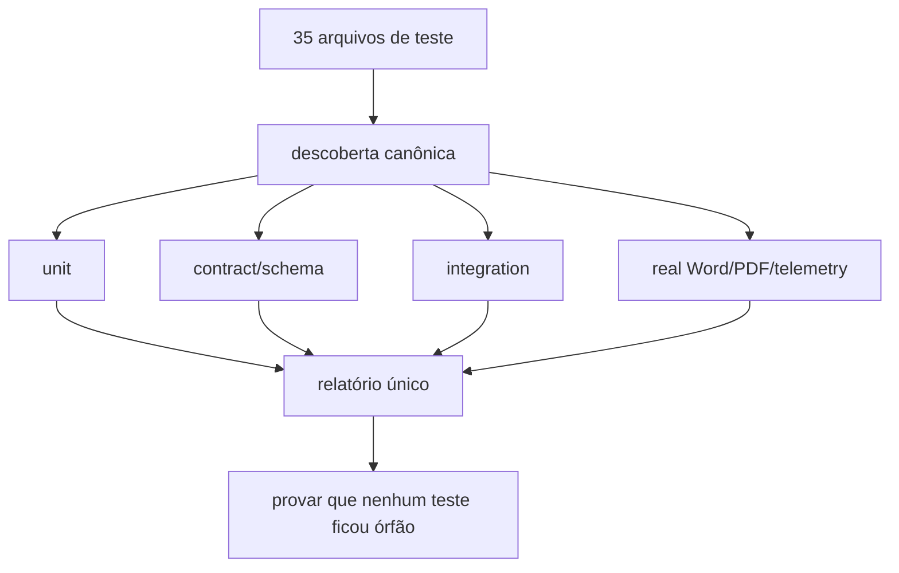
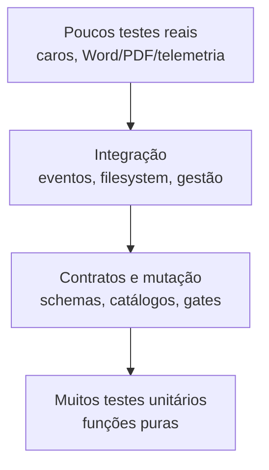

# Testes e estratégia de validação

**Levantamento:** 2026-07-15

## Estado observado

- 35 arquivos `test_*.py` na raiz.
- Aproximadamente 4.274 linhas de teste.
- pytest e unittest coexistem.
- Há scripts-testes executados diretamente.
- `forja_regua.py` e `validate_forja_n3.py` são runners distintos.

## Resultado do levantamento seguro

Foi executada uma bateria isolada, sem cache pytest e sem `__pycache__` persistente:

- 227 testes passaram;
- 8 subtestes passaram;
- 1 teste falhou;
- duração aproximada: 15,7 segundos.

A falha foi `test_forja_n3_management.py::forja_status_conflict`. O teste espera conflito quando a gestão está `cumprida` com evidência, mas a implementação atual suprime corretamente esse conflito. É um teste desatualizado, não prova de defeito no comportamento atual.

## Problema de coleta global

Dois testes substituem `sys.stdout` na importação:

- `test_forja_citacoes.py`;
- `test_forja_verificador.py`.

Isso pode quebrar a coleta/teardown global do pytest. Estado global não deve ser alterado no import; usar fixture ou contexto local.

## Cobertura dos runners

A união de `forja_regua.py` e `validate_forja_n3.py` alcança somente 20 dos 35 arquivos de teste. Ficam fora, entre outros:

- `test_forja_adversarial_audit.py`;
- `test_forja_alertas.py`;
- `test_forja_exploracao_100.py`;
- `test_forja_fila.py`;
- `test_forja_ledger_material.py`;
- `test_forja_legal_search.py`;
- `test_forja_mutation_semantic.py`;
- `test_forja_n4.py`;
- `test_forja_pso_pet.py`;
- `test_forja_qa_paginas.py`;
- `test_gmail_management_matching.py`.

Portanto, uma régua verde hoje não prova que toda a proteção foi executada.

## Camadas que devem ser preservadas

### Unidade

Validadores puros, reducers, parsers, hashes e catálogos.

### Contrato

- JSON Schema;
- compatibilidade N3/N4;
- gerador limpo (`--check` futuro);
- catálogo cobrindo schemas, flags e validadores;
- contratos F2-A e artefatos F0–F10.

### Integração local

- filesystem e locks;
- replay/event store;
- attempts e promoção;
- gestão/outbox;
- resolvedor de caso;
- empacotamento e invalidação.

### Mutação e adversarial

- adulteração semântica;
- autocertificação de gate;
- citações falsas/ambíguas;
- troca de contexto ou contrato;
- artefato selecionado por nome errado.

### Real com telemetria

- Word COM;
- inserção EMF;
- PDF final;
- render e inspeção página a página;
- artefatos reais de produção;
- comparação de hashes e outputs.

Smoke tests não substituem esta camada: regressões anteriores só apareceram em documentos reais.

## Novos testes bloqueadores antes da refatoração

1. Toda entrada `test_*.py` pertence a uma suíte conhecida.
2. `forja_regua` executa a suíte N4 completa ou delega à descoberta canônica.
3. Regimento fora da pasta/incompleto bloqueia F3.
4. Busca de regimento nunca escolhe silenciosamente o primeiro de outra pasta.
5. Arquivo com número no nome não autocertifica jurisprudência.
6. Trecho textual isolado não libera `finalUseAllowed`.
7. Scanner de injection bloqueia em exceção.
8. PDF acima do limite vira `unscanned`, não desaparece.
9. Promoção rejeita `contextHash` divergente.
10. Falha N4 durante promoção não deixa visão canônica parcial.
11. Catálogo de tribunais é idêntico em F2 e F3.
12. `generate_n4_contracts.py --check` não encontra drift.

## Pirâmide recomendada

## Critério para remover compatibilidade

Um wrapper ou caminho legado só pode ser removido quando:

- não há referência estática relevante;
- a régua inteira passa;
- replay antes/depois é equivalente;
- outputs relevantes têm comparação aceita;
- telemetria real não mostra uso durante janela definida;
- existe rollback e backup;
- documentação e runbooks apontam para o caminho novo.
