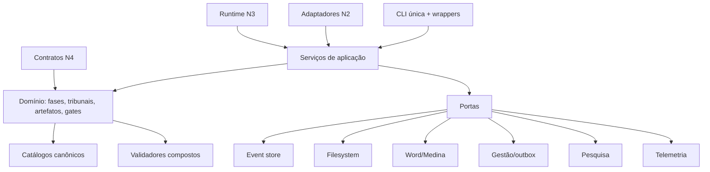

# PRD — FORJA R1: Refatoração Estrutural Segura

**Versão:** R1.0-plan  
**Status:** planejamento; implementação não iniciada  
**Data:** 2026-07-15

## 1. Visão

Transformar a FORJA em um sistema modular, reproduzível, fácil de alterar e inteligível para humanos e IAs, reduzindo duplicidades e acoplamentos sem enfraquecer gates jurídicos, rastreabilidade ou compatibilidade operacional.

A R1 não cria uma especificação jurídica nova. Ela reorganiza e fortalece a implementação das especificações existentes.

## 2. Problema

N2, N3 e N4 cresceram de forma aditiva. A base possui bons mecanismos de eventos, replay, locks, hashes e validação, mas concentra na raiz runtime, testes, CLIs, pilotos, geradores, saídas e scripts pontuais. Definições de artefatos, tribunais, comandos, flags e validações aparecem em múltiplos lugares.

O risco dominante não é cópia literal: é drift entre fontes de verdade e caminhos paralelos de estado, resolução e entrega. Uma IA pode editar a cópia, script histórico ou camada errada.

Antes de qualquer movimentação estrutural, quatro falhas de confiança precisam ser fechadas: régua incompleta, gate de regimento insuficientemente bloqueante, fonte jurisprudencial autocertificável e scanner de injection fail-open.

## 3. Estado-alvo

Estrutura conceitual: `src/forja/{core,domain,application,adapters,rendering,cli}`, `tests/{unit,contract,integration,real}`, `tools`, `experiments`, `migrations`, `archive`, `contracts`, `docs` e `var`.

## 4. Objetivos

- eliminar duplicidade acidental e drift;
- preservar defesa em profundidade e anti-autocertificação;
- criar fronteiras entre domínio, aplicação e integrações;
- tornar instalação e testes reproduzíveis;
- criar régua completa e auditável;
- corrigir gates fail-open antes da reorganização;
- consolidar fontes de verdade;
- reduzir custo cognitivo de mudança;
- criar atlas Mermaid vivo e mapa de impacto;
- preservar eventos, contratos, histórico e compatibilidade;
- condicionar remoção a backup, equivalência, telemetria e rollback.

## 5. Não objetivos

- reescrever a FORJA de uma vez;
- promover N3 ou N4;
- flexibilizar gates jurídicos;
- alterar peças, teses ou fatos;
- eliminar contratos candidatos/históricos;
- substituir Word COM;
- introduzir banco, RAG, LLM-as-judge ou infraestrutura paga;
- automatizar envio, protocolo ou assinatura;
- apagar estado, evidência ou telemetria sem política de retenção;
- executar a refatoração dentro deste pacote de planejamento.

## 6. Requisitos funcionais

### RF-REF-001 — Baseline isolado

Registrar commit de origem, inventário, hashes, arquivos mutáveis, comandos, suíte inicial, backup e restore. Zero alteração involuntária em trabalho preexistente.

### RF-REF-002 — Régua canônica completa

Descobrir e classificar 100% dos testes; falhar se `test_*.py` ficar órfão; separar unidade, contrato, integração e real; eliminar mutação global de stdout durante import; relatar omitidos e justificativa.

### RF-REF-003 — Quatro gates de confiança

Regimento incorreto/incompleto/fora do caso bloqueia; fonte local permanece candidata até identidade, origem e literalidade; scanner de injection bloqueia em exceção, limite ou formato não analisado.

### RF-REF-004 — Projeto reproduzível

Criar `pyproject.toml`, versão Python, grupos `word`, `visual`, `science`, `dev`, entrypoint `forja`, lint, typing, pytest e lock reproduzível.

### RF-REF-005 — Fachadas compatíveis

Scripts e imports antigos delegam à implementação modular durante a janela de migração, preservando interface, exit code e outputs relevantes.

### RF-REF-006 — Catálogos canônicos

Criar fontes únicas e tipadas para fases/estados, tribunais/CNJ, artefatos, severidades, comandos, gates e invalidação.

### RF-REF-007 — Geração verificável

Derivar schemas, contratos, flags, índices e documentação quando aplicável. Um modo `--check` detecta drift sem escrever.

### RF-REF-008 — Preservação do event store

Manter append-only, idempotência, revisão otimista, replay determinístico, escrita atômica, compatibilidade e rejeição de regressão silenciosa.

### RF-REF-009 — Promoção transacional

Revalidar `contextHash`, `contractHash`, artefatos e gates imediatamente antes da promoção. Falha não deixa visão canônica parcial.

### RF-REF-010 — Resolvedor canônico de caso

Zero, um ou múltiplos matches têm resultado explícito. Nenhum runtime escolhe silenciosamente o primeiro caso.

### RF-REF-011 — Entrega por identidade e hash

Selecionar artefato por ID/hash; glob fica somente em adaptador legado com aviso de ambiguidade; retry é idempotente.

### RF-REF-012 — Outbox de gestão

Desacoplar sincronização da transação principal por outbox persistente e idempotente. Falha do painel não perde evento do caso.

### RF-REF-013 — Porta de renderização

Isolar template, Word COM, SVG→EMF, PDF e QA por contratos explícitos, distinguindo capacidade ausente, falha de render e QA bloqueado.

### RF-REF-014 — Decomposição de hotspots

Dividir `forja_visual.compor`, `forja_delivery.main`, `forja_render_docx.render`, `forja_pso_pet.validate_plan`, `forja_n4_m6_cycles.run`, `validate_adversarial_audit` e `forja_n4_validate.validate_case` após testes de caracterização.

### RF-REF-015 — Separação física

Separar runtime, testes, ferramentas, experimentos, migrações, histórico e outputs. Imports/buscas do runtime não percorrem `var`, `archive` ou projeto estrangeiro.

### RF-REF-016 — Sanitização por manifesto

Classificar cada item como canônico, wrapper, experimento, migração, output, duplicidade acidental, defesa em profundidade ou histórico protegido. Exclusão exige backup e restore.

### RF-REF-017 — CLI consolidada

Criar entrypoint único e subcomandos; scripts antigos viram wrappers; parsing não contém regra jurídica.

### RF-REF-018 — Taxonomia de erros

Distinguir configuração inválida, capacidade indisponível, entrada não verificada, bloqueio jurídico, falha transitória, conflito de revisão, ambiguidade e erro interno. Biblioteca não chama `SystemExit`.

### RF-REF-019 — Atlas Mermaid vivo

Manter diagramas de contexto, N2/N3/N4, F0–F10/F2-A, imports, eventos, attempts, render, fontes, entrega, catálogos, testes, invalidação, ownership, impacto e rollback. Todos renderizam e os estruturais são verificados contra código.

### RF-REF-020 — Navegação para IA

Cada domínio documenta responsabilidade, entrada, saída, fonte de verdade, invariantes, consumidores, testes, riscos e rollback. A matriz “alterar X → verificar Y” cobre as fontes canônicas.

### RF-REF-021 — Remoção observável de shims

Wrappers emitem telemetria sanitizada. Remoção exige ausência de referência, equivalência, janela sem uso e rollback.

### RF-REF-022 — Preservação F2-A

Manter 100 perguntas, 10 óticas, IDs, `supportIds`, lacunas bloqueadas, duas soluções, handoff F3–F7, compatibilidade histórica e bloqueio por questão material.

## 7. Requisitos não funcionais

| ID | Requisito | Prova |
|---|---|---|
| RNF-001 | segurança jurídica | zero gate degradado sem decisão normativa |
| RNF-002 | compatibilidade | 100% do corpus selecionado legível e replay equivalente |
| RNF-003 | auditabilidade | todo movimento registra origem, destino, hash, teste e rollback |
| RNF-004 | fail-closed | exceção/não analisado nunca vira `ok` |
| RNF-005 | determinismo | duas execuções limpas produzem equivalência declarada |
| RNF-006 | modularidade | teste de imports impede domínio → infraestrutura |
| RNF-007 | manutenibilidade | APIs públicas tipadas e orçamento de complexidade reduzido |
| RNF-008 | reprodutibilidade | instalação limpa executa suíte não-real |
| RNF-009 | desempenho | sem regressão material não justificada |
| RNF-010 | portabilidade controlada | núcleo roda sem Word; entrega real declara Windows |
| RNF-011 | observabilidade | IDs, hashes, duração, resultado e erro sanitizado |
| RNF-012 | privacidade | scanner de segredos e proveniência limpo |
| RNF-013 | legibilidade | Mermaid sem erro e texto ≥8 pt no PDF |
| RNF-014 | recuperabilidade | rollback ensaiado por marco |
| RNF-015 | limite normativo | manifest não promove spec por implicação |

## 8. Sentinelas de invariantes

Os itens `INV-*` abaixo **não criam norma nova**. São sentinelas técnicas para detectar regressão contra as fontes canônicas. Em conflito ou drift, prevalecem `../AGENTS.md`, `FORJA_SPEC_MANIFEST.json`, `FORJA_N3_CONFIG.json` e os protocolos próprios citados pelo AGENTS.

| ID | Invariante preservado |
|---|---|
| INV-01 | N2 permanece vigente até promoção formal. |
| INV-02 | Painel resume; comando orienta; anexo/fonte prova. |
| INV-03 | Regimento integral, correto e atualizado antes da redação. |
| INV-04 | `_LEIS_GERAIS`, Estatuto da OAB e LOMAN permanecem no fluxo. |
| INV-05 | Fonte não oficial só descobre; uso final exige fonte validada. |
| INV-06 | Fato, declaração, inferência, hipótese e não verificado permanecem separados. |
| INV-07 | Proveniência interna nunca entra na peça protocolável. |
| INV-08 | Processo volumoso exige cronologia e identidade de atos. |
| INV-09 | F2-A bloqueia saída externa se houver questão material pendente. |
| INV-10 | Helena e Cícero permanecem gates obrigatórios. |
| INV-11 | Auditoria adversarial permanece em peças responsivas. |
| INV-12 | Documento protocolável nasce do template ou peça anterior. |
| INV-13 | PDF final continua por Word COM. |
| INV-14 | Toda regeneração exige QA de todas as páginas. |
| INV-15 | Metadados finais são institucionais, nunca `python-docx`/IA. |
| INV-16 | `pronta_para_revisao` não é `cumprida`. |
| INV-17 | Entrega ao escritório exige evidência; protocolo é fronteira distinta. |
| INV-18 | Sem envio, protocolo ou assinatura automáticos. |
| INV-19 | Bloquear por falta de fonte/prova é sucesso de segurança. |
| INV-20 | Eventos, invalidados e contratos históricos não são apagados. |
| INV-21 | Recálculo independente de gates permanece. |
| INV-22 | “Não localizado” não vira “inexistente”. |
| INV-23 | Má-fé exige lastro e aprovação humana/Cícero. |
| INV-24 | Prescrição administrativa mantém matriz específica do AGENTS. |

### Proveniência normativa das sentinelas

| Sentinelas | Fonte canônica | Seção/data de referência | Controle de drift |
|---|---|---|---|
| INV-01, INV-20, INV-21 | `FORJA_SPEC_MANIFEST.json`; `FORJA_N3_CONFIG.json` | snapshot do baseline R0 | hash bruto + diff semântico |
| INV-02, INV-16–INV-19 | `../AGENTS.md` | §8 Hermes/gestão viva; atualizado em 14/07/2026 | hash/data + testes de gestão/entrega |
| INV-03–INV-05 | `../AGENTS.md` | §§1, 2, 7; atualizado em 14/07/2026 | hash/data + gates de fonte/regimento |
| INV-06–INV-08, INV-22–INV-24 | `../AGENTS.md` | §§7-A, 7-B, 7-D; atualizado em 14/07/2026 | hash/data + corpus adversarial |
| INV-09 | `../AGENTS.md`; `templates/F2A_EXPLORACAO_100_PERGUNTAS.md` | §7-C; contrato `FORJA-F2A-100-v1` | hash do template/validador |
| INV-10, INV-11 | `FORJA_SPEC_MANIFEST.json`; planos N3/N4 | snapshot do baseline R0 | hash + replay |
| INV-12–INV-15 | `../AGENTS.md`; `../_FERRAMENTAS/PADRAO_WORD_MEDINA_OSORIO.md` | §§3, 3-A, 4, 6 | hash/data + QA real |

R0 registra os hashes vigentes. Alteração posterior de fonte canônica invalida a sentinela derivada até revisão explícita; o PRD nunca sobrepõe a fonte.

## 9. Critérios globais de aceite

1. Quatro P0 corrigidos com testes negativos.
2. Todos os testes descobertos e classificados.
3. Unidade, contrato e integração integralmente verdes.
4. Word/PDF/telemetria verdes em casos-modelo.
5. Replay histórico equivalente.
6. N2/N3/N4 conservam estado normativo.
7. F2-A conserva contrato e compatibilidade.
8. Zero import proibido entre camadas.
9. Catálogos canônicos substituem definições divergentes.
10. Geradores têm `--check` determinístico.
11. Caso e entrega são resolvidos por identidade/hash.
12. Falha de promoção não deixa parcialidade silenciosa.
13. Gestão opera por outbox idempotente.
14. Wrappers permanecem enquanto houver uso.
15. Mermaid corresponde ao código e renderiza.
16. Ambiente nasce de manifesto/lock.
17. Outputs ficam separados do fonte.
18. Nenhum histórico protegido é perdido.
19. Backup e rollback são ensaiados.
20. Artefatos jurídicos não sofrem regressão factual, jurídica ou visual.
21. Auditoria de segredo/proveniência fica limpa.
22. Documentação informa onde alterar, impacto e testes.
23. Uma IA nova navega sem editar cópia, output ou experimento.
24. Todo shim removido possui evidência individual de não uso.
