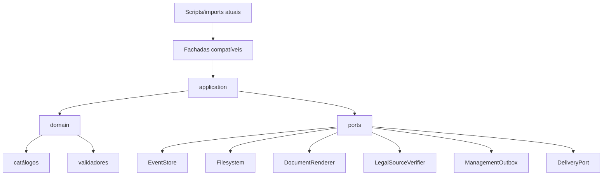
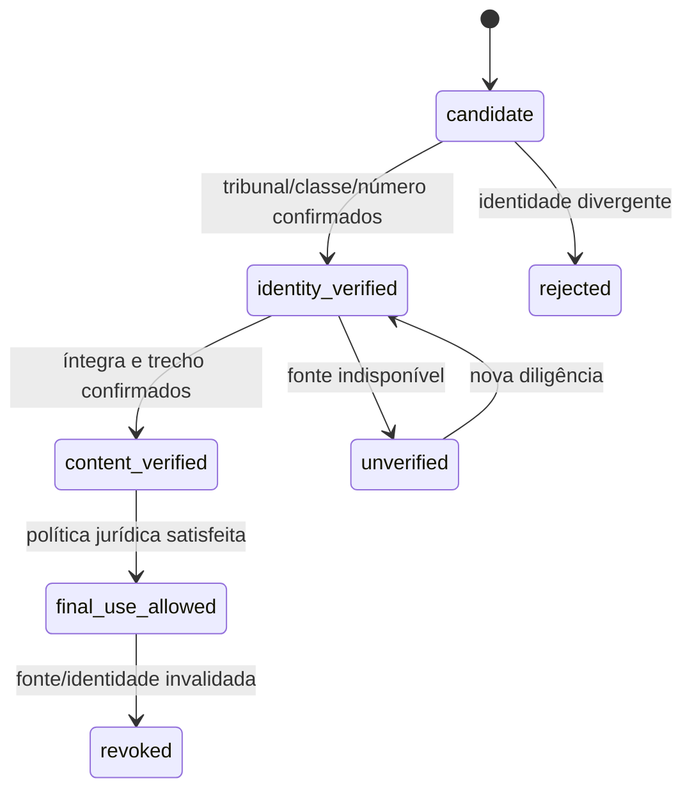
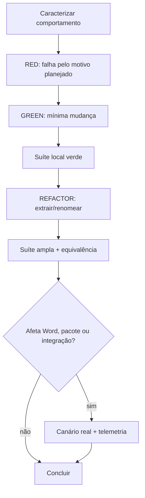

# TDD — FORJA R1: Refatoração Estrutural Segura

**Versão:** R1.0-plan  
**Status:** desenho técnico; execução não iniciada  
**Princípio:** uma mudança de comportamento por plano TDD; movimentações puras exigem caracterização e equivalência

## 1. Decisão arquitetural

R1 é um programa separado da promoção N3/N4. N2 continua vigente, N3 permanece em sombra e N4 em `pilot_blocking`. A refatoração usa strangler pattern: scripts e imports atuais chamam fachadas, que passam a delegar gradualmente a módulos novos.



## 2. Estrutura-alvo

```text
src/forja/
├── core/
│   ├── errors.py
│   ├── result.py
│   ├── json_io.py
│   ├── hashing.py
│   ├── locking.py
│   ├── paths.py
│   ├── ids.py
│   └── time.py
├── domain/
│   ├── phases.py
│   ├── tribunals.py
│   ├── artifacts.py
│   ├── severity.py
│   ├── release_policy.py
│   ├── transitions.py
│   └── gates/
├── application/
│   ├── prepare_attempt.py
│   ├── promote_attempt.py
│   ├── validate_case.py
│   ├── build_package.py
│   ├── close_cycle.py
│   ├── reconcile_case.py
│   └── sync_management.py
├── ports/
│   ├── case_repository.py
│   ├── event_store.py
│   ├── renderer.py
│   ├── legal_sources.py
│   ├── management.py
│   └── delivery.py
├── adapters/
│   ├── filesystem/
│   ├── word_medina/
│   ├── management_sidecar/
│   ├── legal_search/
│   └── legacy_n2/
├── rendering/
└── cli/
```

## 3. Interfaces de fronteira

```python
class CaseResolver(Protocol):
    def resolve(self, key: str | Path) -> Path: ...

class EventStore(Protocol):
    def read(self, case_id: str) -> tuple[Event, ...]: ...
    def append(self, event: Event, expected_revision: int) -> AppendResult: ...
    def replay(self, case_id: str) -> CaseState: ...

class ArtifactRepository(Protocol):
    def stage(self, attempt: AttemptId, artifact: ArtifactCandidate) -> ArtifactDigest: ...
    def promote_atomically(self, plan: PromotionPlan) -> PromotionReceipt: ...

class Gate(Protocol):
    name: str
    def evaluate(self, context: GateContext) -> GateDecision: ...

class LegalSourceVerifier(Protocol):
    def identify(self, candidate: SourceCandidate) -> SourceIdentityResult: ...
    def verify_content(self, identity: SourceIdentity, claim: Claim) -> SourceVerification: ...

class DocumentRenderer(Protocol):
    def capabilities(self) -> RenderCapabilities: ...
    def render(self, request: RenderRequest) -> RenderReceipt: ...
    def inspect_all_pages(self, receipt: RenderReceipt) -> VisualQaReceipt: ...

class ManagementOutbox(Protocol):
    def enqueue(self, event: ManagementEvent) -> OutboxReceipt: ...
    def flush(self) -> SyncReport: ...

class DeliveryPort(Protocol):
    def prepare(self, package: AuditedPackage) -> DeliveryDraft: ...
    def confirm(self, draft: DeliveryDraft, evidence: DeliveryEvidence) -> DeliveryReceipt: ...
```

Essas assinaturas são contratos de planejamento. Nomes auxiliares podem ser ajustados na implementação, mas a separação de responsabilidade e os comportamentos testáveis são obrigatórios.

## 4. ADRs propostos

| ADR | Decisão |
|---|---|
| ADR-001 | Arquitetura strangler com fachadas até remoção comprovada. |
| ADR-002 | Eventos são fonte canônica N3; snapshots são materializações. |
| ADR-003 | `ArtifactCatalog` tipado gera/verifica schemas, flags, métricas e docs. |
| ADR-004 | Domínio não importa Word, gestão, rede ou filesystem concreto. |
| ADR-005 | Gate crítico falha fechado em erro, ausência ou item não examinado. |
| ADR-006 | Seleção por `artifactId` + hash; glob legado rejeita ambiguidade. |
| ADR-007 | Gestão usa outbox file-first idempotente fora da transação do caso. |
| ADR-008 | Regras determinísticas não são autocertificadas por saída inteligente. |
| ADR-009 | Estado, cache, telemetria e renders são dados mutáveis com retenção própria. |
| ADR-010 | Descoberta canônica prova que nenhum teste ficou órfão. |
| ADR-011 | Mermaid é gerado ou verificado contra catálogo/AST. |
| ADR-012 | Alteração de política e movimentação de código não entram no mesmo passo. |
| ADR-013 | PDF/DOCX usam comparação semântica e visual, não apenas hash bruto. |

## 5. Estados explícitos de fonte



Nenhum caminho pode saltar de “arquivo encontrado” para `final_use_allowed`.

## 6. Política RED–GREEN–REFACTOR



RED inválido: import quebrado, fixture ausente, sintaxe, ambiente incorreto ou teste já verde sem investigação.

Cada plano TDD implementa um comportamento. Reorganização/configuração/glue usa tarefa executiva, mas sempre com caracterização antes/depois.

## 7. Planos TDD obrigatórios

### TDD-01 — Regimento fail-closed

**RED**

- regimento fora da pasta bloqueia F3;
- conteúdo curto/incompleto bloqueia;
- fonte, versão, download ou atualização ausentes bloqueiam;
- dois candidatos produzem `ambiguous`;
- F2 e F3 usam o mesmo catálogo de tribunal.

**GREEN**

- resolvedor estrito retorna `verified`, `missing`, `ambiguous`, `incomplete` ou `stale`;
- somente `verified` permite avanço.

**REFACTOR**

- extrair `TribunalCatalog` e `RegimentoVerifier`;
- `forja_sources.py` permanece wrapper.

### TDD-02 — Jurisprudência sem autocertificação

**RED**

- número apenas no nome do PDF não libera uso;
- ocorrência textual genérica não prova identidade;
- tribunal/classe divergente reprova;
- trecho literal ausente reprova;
- fonte indisponível retorna `unverified`, nunca “inexistente”.

**GREEN**

- pipeline candidato → identidade → conteúdo → uso final;
- `finalUseAllowed` exige identidade e correspondência literal.

**REFACTOR**

- separar detecção, identificação, literalidade e política.

### TDD-03 — Injection scan fail-closed

**RED**

- exceção produz P0/`unscanned`;
- PDF acima do limite é relatado e bloqueia;
- ilegível não desaparece;
- frase imperativa acadêmica não é executada nem se transforma sozinha em P0.

**GREEN**

- resultado exaustivo por arquivo;
- exit code não zero para material não examinado.

**REFACTOR**

- `ScanResult` tipado e adaptadores por formato.

### TDD-04 — Descoberta completa de testes

**RED**

- teste sintético órfão reprova a régua;
- coleta demonstra a quebra por `sys.stdout` no import.

**GREEN**

- remover mutação global de import;
- classificar todos os testes.

**REFACTOR**

- manifesto único gera suítes rápida, contrato, integração e real.

### TDD-05 — Core atômico compatível

Casos:

- JSON ausente, inválido e default permitido são distintos;
- escrita nunca expõe parcial;
- path escape é rejeitado;
- lock preserva timeout/stale;
- timestamps são timezone-aware;
- IDs mantêm formato;
- hashes canônicos permanecem idênticos.

Mover uma primitive por vez e reexportar por `forja_n3_common.py`.

### TDD-06 — Catálogos canônicos

Subplanos independentes:

1. `TribunalCatalog`;
2. `PhaseCatalog`;
3. `ArtifactCatalog`;
4. `Severity`/`ReleasePolicy`;
5. comandos/feature flags.

Casos: todo artefato tem schema, fase, flag, validador e política; valor duplicado/desconhecido reprova; `generate_n4_contracts.py --check` detecta drift; hashes permanecem quando a mudança é apenas estrutural.

### TDD-07 — Revalidação de contexto

Modificar contexto ou inputs após `prepare_attempt` bloqueia promoção antes de efeito canônico. Revalidar `contextHash`, `contractHash` e inputs imediatamente antes do commit.

### TDD-08 — Promoção sem parcialidade

Injetar falha entre validação N4, cópia e evento. Nenhuma visão canônica nova fica disponível. Construir `PromotionPlan`, validar antes, promover sob unidade transacional file-first e emitir recibo único após sucesso.

### TDD-09 — Replay equivalente

- mesmo log → mesmo estado/hash;
- idempotência não duplica;
- concorrência rejeita um escritor;
- evento parcial não é aplicado;
- eventos históricos continuam legíveis.

### TDD-10 — Entrega por identidade

- múltiplos DOCX fazem adaptador legado reprovar;
- pacote seleciona um `artifactId` + hash;
- hash divergente bloqueia;
- retry é idempotente;
- draft não conclui demanda.

### TDD-11 — Outbox de gestão

- falha do painel não reverte evento do caso;
- outbox persiste;
- retry não duplica;
- evidência de entrega prevalece sobre snapshot atrasado;
- flags desligadas ignoram N4 sem apagar artefatos.

### TDD-12 — Render e QA

TDD determinístico para parser Markdown, modelo de blocos e SVG; teste real para Word/PDF.

Casos: todas as páginas inspecionadas; template e metadados preservados; nenhum placeholder; paridade de títulos/parágrafos/tabelas/ressalvas; compositor não aprova o próprio `runId`; regressões Natura, Libra Sul, Patrícia e CORSAN continuam detectadas.

### TDD-13 — CLI compatível

Caracterizar argumentos, help, exit code, stdout/stderr sanitizados e efeito de cada wrapper. A nova CLI unifica comportamento; comando antigo delega sem drift.

### TDD-14 — Atlas vivo

Alterar catálogo/import sem regenerar ou validar Mermaid deve reprovar. Gerador ignora `var`, cache, outputs, experimentos e projetos estrangeiros.

## 8. Gates de equivalência

| Área | Prova |
|---|---|
| imports | mesmos símbolos públicos nos módulos antigos |
| CLI | argumentos, exit codes e efeitos observáveis equivalentes |
| JSON | schemas e serialização canônica preservados |
| eventos | replay idêntico para logs congelados |
| estado | campos/hash equivalentes em movimento puro |
| contratos | hashes iguais quando não há mudança normativa |
| artefatos | conteúdo/hash iguais em extrações puras |
| pacote | mesmo conjunto de IDs e hashes |
| gestão | sidecar equivalente e nenhuma conclusão falsa |
| DOCX | blocos, estilos, template, cabeçalho, rodapé e fólio |
| PDF | texto, ordem, páginas, geometria e QA |
| segurança | casos negativos continuam bloqueados |
| compatibilidade | flags desligadas reproduzem caminho anterior |

Correções P0 terão diferenças esperadas explicitamente versionadas; não serão mascaradas como equivalência.

## 9. Orçamento de arquitetura

- zero ciclo de import;
- `domain` não importa `adapters`, Word, gestão, rede ou filesystem concreto;
- função pública nova tem tipos;
- cada CLI é fina;
- complexidade/hotspot não aumenta sem justificativa;
- nenhuma nova fonte de verdade manual paralela;
- toda dependência externa entra por porta;
- todo wrapper registra uso sanitizado.

## 10. Comandos de verificação previstos

```powershell
$env:PYTHONDONTWRITEBYTECODE = "1"
python -m pytest -q -p no:cacheprovider tests/unit
python -m pytest -q -p no:cacheprovider tests/contract
python -m pytest -q -p no:cacheprovider tests/integration
python -m pytest -q -p no:cacheprovider
python -m ruff check . --no-cache
python -m mypy src/forja
python generate_n4_contracts.py --check
python validate_forja_n3.py --run-replay
python validate_forja_n3.py --real-word --run-replay
python forja_regua.py --rapida
python forja_regua.py
```

Os nomes finais dos flags serão definidos no plano de implementação da régua. Até a nova descoberta existir, cada RED roda isoladamente para não confundir a falha planejada com a coleta global defeituosa.

## 11. Testes reais obrigatórios

- Word COM e inserção EMF;
- PDF final e render de todas as páginas;
- metadados institucionais;
- pacote e seleção por hash;
- sidecar/outbox de gestão;
- replay de corpus congelado;
- casos prospectivos sem reuso de texto pronto;
- restauração a partir de backup.

## 12. Rollback

1. trabalhar em baseline isolado;
2. commits RED, GREEN e REFACTOR separados;
3. não apagar eventos, contratos ou artefatos N4;
4. manter fachadas e wrappers;
5. ativar módulos por flag quando necessário;
6. registrar versão/hash em cada execução;
7. desligar flag para retornar ao adaptador anterior;
8. restaurar sidecar a partir de eventos/outbox;
9. não publicar ponteiro canônico em promoção falha;
10. testar restore antes de limpeza física;
11. rollback nunca transforma caso em pronto;
12. contrato novo nunca reinterpreta evento antigo silenciosamente.

## 13. Definition of Done técnico — G9A

- 100% dos testes descobertos/classificados;
- quatro P0 fail-closed;
- pacote/entrega por identidade e hash;
- eventos e replay preservados;
- promoção atômica;
- catálogos únicos verificáveis;
- fachadas com responsabilidade apenas compatível;
- dependências direcionais e zero ciclo;
- domínio sem infraestrutura;
- CLIs compatíveis ou remoção comprovada;
- outputs/projetos estrangeiros fora da fonte;
- Word/PDF/EMF aprovados em QA real;
- seis replays representativos aprovados e compatibilidade preservada;
- restore demonstrado;
- Mermaid ligado ao código;
- docs, runbooks e manifestos coerentes;
- zero dado ativo ou defesa removida indevidamente.

## 14. Elegibilidade de promoção — G9B

G9B é deliberadamente separado da conclusão técnica. Exige três ciclos prospectivos completos, mutação semântica ≥0,8 nas famílias aplicáveis, controles benignos, decisão normativa própria e autorização correspondente. Enquanto G9B estiver pendente, nenhum shim, flag ou compatibilidade cuja segurança dependa desses ciclos pode ser removido; N4 permanece `pilot_blocking`.
