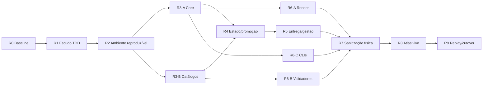
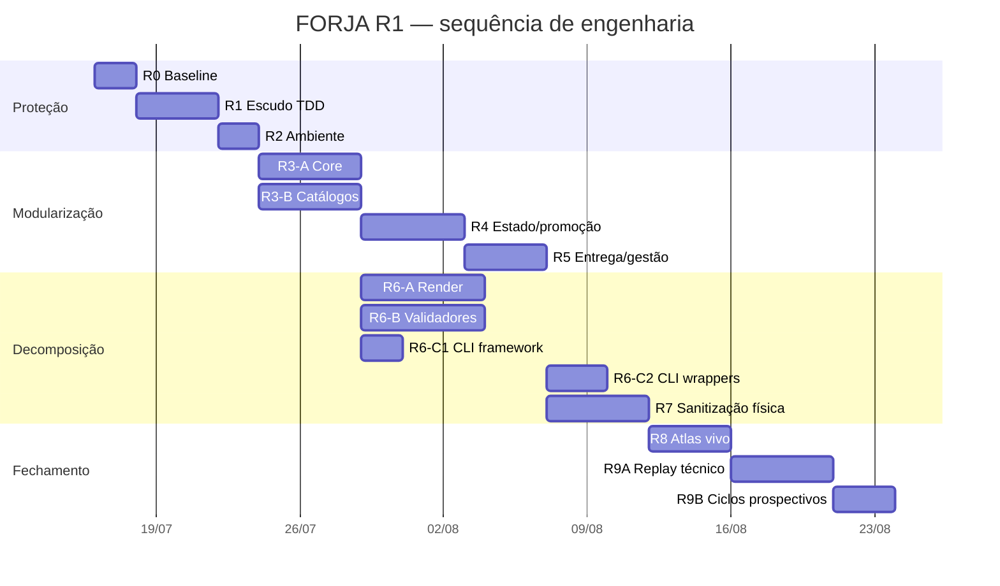

# ROADMAP — FORJA R1: Refatoração Estrutural Segura

**Versão:** R1.0-plan  
**Status:** execução não iniciada  
**Estimativa de engenharia:** 28–48 dias úteis, mais a janela dos ciclos reais  
**Regra:** esforço é faixa de planejamento, não promessa de calendário

## 1. Não replanejar

- N2 M0–M5 já foram concluídos.
- U1–U8 do plano estado da arte já foram implementados; U9/U10 continuam condicionais.
- N3 já possui event store, state machine, attempts, contexto, pacote, QA e gestão; extrair e preservar, não recriar.
- N4 M0–M5 e M6.1–M6.3 já existem em sombra/piloto.
- N4 M6.4/M6.5 ainda dependem de ciclos prospectivos; não promover durante R1.
- Alertas, LocalContext, métricas, ordem de pareceres, mutação semântica, ledger e QA já têm implementações; tratar apenas integração/refatoração comprovada.
- Projeto 3D descartado não será reaberto.
- RAG, LLM-as-judge, DataJud/Sinapses, firewall genérico e protocolo automático não entram.

## 2. Dependências

Paralelismo permitido:

- R3-A e R3-B, com ownership de arquivos separado;
- R6-A, R6-B e R6-C após estabilização das fachadas.

Não paralelizar:

- promoção/state machine no mesmo arquivo;
- movimentação física antes das fachadas;
- alteração de política junto com extração estrutural.

## 3. R0 — Baseline, isolamento e contrato

**Esforço:** 1–2 dias  
**Dependência:** pesquisa concluída

### Entrada

- `.planning/codebase` e este pacote legíveis;
- manifesto/configuração atuais válidos;
- nenhuma autorização implícita de limpeza destrutiva.

### Trabalho

- criar branch/worktree isolado;
- registrar itens sujos por categoria;
- inventariar código, testes, contratos, schemas, estado e integrações;
- salvar hashes de fontes protegidas;
- criar backup verificável e ensaio de restore;
- caracterizar CLIs, flags, eventos, schemas e outputs;
- classificar cada item: preservar, extrair, adaptar, arquivar, excluir depois.

### Gate G0

- baseline reproduzível;
- backup e restore demonstrados;
- zero trabalho do usuário perdido;
- flags inalteradas;
- manifesto de migração pronto.

### Rollback

Abandonar worktree/branch; produção permanece intacta.

## 4. R1 — Escudo de confiança por TDD

**Esforço:** 2–4 dias  
**Bloqueia:** todas as ondas estruturais

### Trabalho

- descoberta canônica dos testes;
- classificar todos os arquivos em `unit`, `contract`, `integration`, `mutation`, `real`;
- remover mutação de `sys.stdout` no import;
- atualizar teste de gestão desatualizado;
- falhar se teste ficar órfão;
- TDD regimento fail-closed;
- TDD fonte jurisprudencial sem autocertificação;
- TDD scanner de injection fail-closed;
- caracterizar `contextHash`, promoção parcial, tribunais e geração `--check`.

### Gate G1

- 100% dos testes descobertos/classificados;
- pares `DEVE_PEGAR` / `NÃO_PODE_TRAVAR` verdes;
- quatro P0 corrigidos;
- bateria real separada e identificada;
- régua relata exatamente executados e omitidos.

### Rollback

Commits por gate; reverter correção isolada sem tocar em contratos históricos.

## 5. R2 — Ambiente reproduzível e esqueleto modular

**Esforço:** 1–2 dias

### Trabalho

- `pyproject.toml` e versão Python suportada;
- grupos `core`, `word`, `visual`, `science`, `dev`;
- pytest, Ruff e typing gradual;
- lock reproduzível;
- `src/forja` e entrypoint futuro;
- verificador de capacidades externas;
- wrappers antigos permanecem ativos;
- baseline Ruff controlado, sem autofix massivo.

### Gate G2

- ambiente limpo instala e executa suíte não-real;
- testes/imports independem do diretório atual;
- nenhum comando antigo quebra;
- capacidade ausente é declarada, não mascarada.

### Rollback

Remover configuração/esqueleto; scripts antigos continuam autossuficientes.

## 6. R3 — Core e fontes de verdade

**Esforço:** 4–7 dias

### R3-A — Core

Extrair JSON atômico, collections, tempo, IDs, hashes, locks, paths e erros. `forja_n3_common.py` permanece fachada.

### R3-B — Domínio

Centralizar fases, tribunais/CNJ, severidades, comandos, flags, estados epistemológicos e `ArtifactCatalog`. Gerar/verificar schemas, contratos derivados, índices, métricas, documentação e invalidação.

### Gate G3

- clones utilitários substituídos por fachada;
- comportamento equivalente;
- catálogo cobre 100% dos artefatos;
- `--check` sem drift;
- contratos vigentes/candidatos continuam separados;
- nenhuma defesa independente removida.

### Rollback

Fachadas apontam à implementação antiga; catálogos novos podem ser desligados.

## 7. R4 — Resolução, estado e promoção transacional

**Esforço:** 3–5 dias

### Trabalho

- resolvedor estrito N3 canônico;
- glob legado apenas adaptador com ambiguidade explícita;
- escritas diretas substituídas por portas atômicas;
- revalidar `contractHash`, `contextHash` e inputs;
- pipeline `prepare → validate → commit`;
- evento/visão canônica apenas após gates;
- falha preserva attempt, não publica parcialidade;
- eventos históricos/replay compatíveis;
- `resolvedAt/resolvedBy` em eventos.

### Gate G4

- replay determinístico;
- concorrência rejeita writer antigo;
- cada fronteira suporta interrupção/retomada;
- falha N4 não altera visão canônica;
- zero regressão silenciosa.

### Rollback

Porta transacional é desligada; eventos novos permanecem preservados/legíveis.

## 8. R5 — Entrega e gestão

**Esforço:** 3–5 dias

### Trabalho

- `artifactId + sha256` vira identidade de entrega;
- heurística N2 fica somente em descoberta legada;
- unificar package/close/delivery integrity por serviço;
- `ManagementOutbox` durável e idempotente;
- gestão sai da transação principal;
- evidência de entrega prevalece sobre snapshot atrasado;
- distinguir escritório de protocolo judicial;
- retries não duplicam draft, comentário ou evidência.

### Gate G5

- arquivo entregue é exatamente o auditado;
- pane de gestão não corrompe caso;
- outbox sincroniza uma vez;
- draft não conclui demanda;
- rollback N2/N3 demonstrado.

## 9. R6 — Decomposição dos hotspots

**Esforço:** 5–8 dias

### R6-A — Render/visual

Separar parsing, layout, emissão, Word COM e QA em `forja_visual.compor` e `forja_render_docx.render`. Criar `DocumentRenderer` e preservar adaptador Medina.

### R6-B — Validação

Decompor `forja_n4_validate.validate_case`, PSO, auditoria adversarial e regras contextuais em validadores compostos.

### R6-C — CLI/orquestração

Separar em dois planos: P13A estabiliza framework, `doctor`, `qa` e exit codes sem tocar wrappers de serviço; P13B, somente após P09–P12, migra wrappers por allowlist, um a um, sem arquivo compartilhado com outros owners.

### Gate G6

- APIs públicas tipadas;
- biblioteca não chama `sys.exit`;
- Word/PDF/EMF reais equivalentes;
- QA de todas as páginas;
- mutação, replay e telemetria reais verdes;
- corpus representativo sem regressão material.

### Rollback

Wrapper por hotspot retorna à implementação antiga. A cadeia visual nunca é substituída de uma vez.

## 10. R7 — Sanitização física

**Esforço:** 3–5 dias + backup

### Trabalho

- testes → `tests/`;
- geradores → `tools/`;
- pilotos → `experiments/n4/`;
- scripts datados → `migrations/`;
- outputs → `var/` por configuração;
- retirar cópia aninhada do FocoEdital apenas após backup/comparação/ausência de referência/link/restore;
- política de retenção de cache, telemetria, reports e renders;
- preservar estados, eventos, contratos e invalidados.

### Gate G7

- árvore fonte pequena/navegável;
- imports/CLIs antigos funcionam por wrappers;
- zero referência quebrada;
- backup/restore comprovados;
- telemetria identifica acessos legados.

### Rollback

Manifesto de movimento restaura origem/destino por hash.

## 11. R8 — CLI única e atlas vivo

**Esforço:** 3–5 dias

### Trabalho

- entrypoint `forja` com subcomandos;
- wrappers emitem telemetria;
- separar arquitetura, ADRs, operações e changelog;
- gerar/verificar diagramas contra AST/catálogos;
- matriz alterar X → verificar Y;
- PDF técnico atualizado;
- links/Mermaid validados automaticamente.

### Gate G8

- IA encontra módulo, fonte, testes e impacto em poucos passos;
- 100% Mermaid renderiza;
- grafos correspondem ao código;
- PDF legível/inspecionado;
- documentação não afirma promoção inexistente.

## 12. R9 — Replay, canários e compatibilidade

**Esforço de engenharia:** 3–5 dias  
**Calendário:** depende de demandas reais

### Trabalho

- seis replays representativos;
- três ciclos prospectivos reais;
- N4 permanece `pilot_blocking` durante a avaliação;
- mutação semântica por família, sem mascarar fraqueza;
- medir falsos bloqueios benignos;
- pareceres Helena/Cícero antes da redação;
- regimento e ledger material comprovados;
- flags N3 uma a uma;
- shim removido apenas após janela sem uso.

### Gate G9A — conclusão técnica da refatoração

- zero divergência evento/estado/pacote/gestão/evidência;
- zero P0 conhecido escapando;
- controles benignos publicados;
- rollback demonstrado;
- seis replays representativos aprovados;
- shims necessários e compatibilidade dependente de ciclo prospectivo preservados;
- decisão normativa separada para qualquer promoção.

G9A encerra tecnicamente R1. Arquitetura limpa não promove N4.

### Gate G9B — elegibilidade de cutover/promoção

- três ciclos prospectivos completos;
- mutação semântica ≥0,8 nas famílias aplicáveis;
- controles benignos e falsos bloqueios avaliados;
- decisão normativa própria e autorização correspondente.

G9B pode permanecer pendente sem invalidar G9A. Enquanto pendente, proíbe remover compatibilidade ou alterar flags que dependam da prova prospectiva; N4 continua `pilot_blocking`.

## 13. Visão temporal

A data inicial é meramente ilustrativa para visualizar dependências. Execução só começa mediante comando posterior.

## 14. Riscos e controles

| Risco | Controle |
|---|---|
| workspace sujo | worktree, hashes e backup |
| remover defesa independente | classificar duplicação antes de extrair |
| quebrar histórico | replay e schemas versionados |
| arquivo errado | ID + hash; nunca primeiro glob |
| promoção informal | flags e decisão normativa separadas |
| testes sintéticos verdes | corpus real Word/PDF/telemetria |
| automação oculta quebrada | wrappers + telemetria + janela sem uso |
| documentação obsoleta | geração/verificação automática |
| autofix semântico | Ruff incremental após caracterização |
| limpeza destrutiva | decisão item a item, backup e restore |
| gestão dentro da transação | outbox idempotente |
| citação/regimento degradados | P0 fail-closed antes da arquitetura |

## 15. Critério de conclusão do programa

Todos os gates G0–G9A devem ter evidência para classificar a refatoração estrutural como concluída. G9B governa apenas elegibilidade de cutover/promoção. Sua pendência não reabre G9A, mas bloqueia qualquer remoção de compatibilidade ou alteração de flag dependente de prova prospectiva.
