# Diagramas — FORJA R1

**Versão:** R1.0-plan  
**Regra:** diagramas de estado atual descrevem observação de 2026-07-15; diagramas-alvo descrevem intenção, não implementação concluída

## D01 — Estado normativo atual

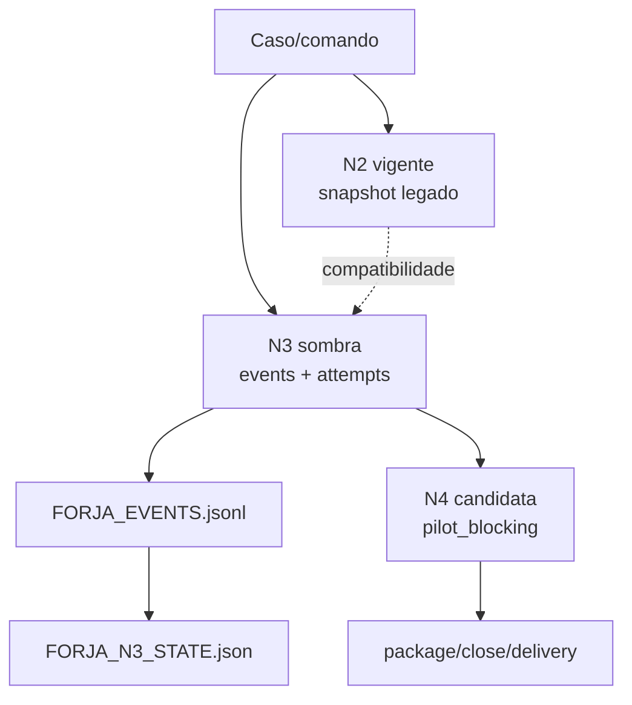

## D02 — Arquitetura-alvo

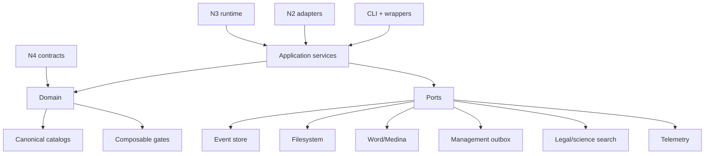

## D03 — F0–F10 com F2-A

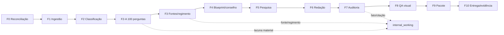

## D04 — Direção de dependências

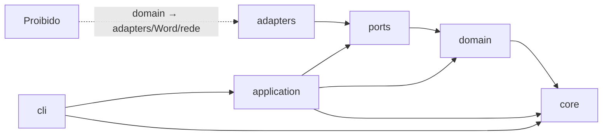

## D05 — Event store e replay

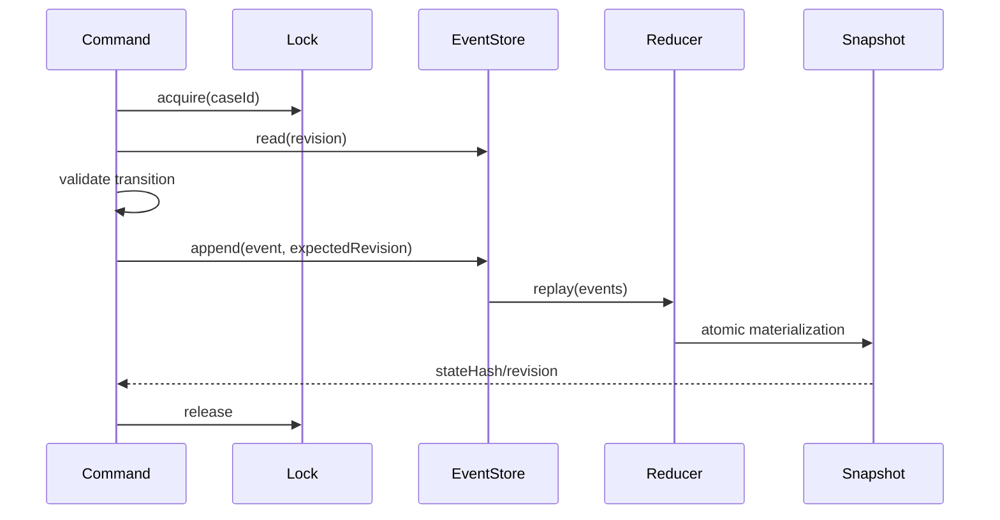

## D06 — Attempt e promoção transacional

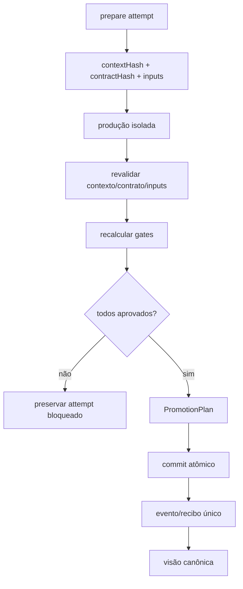

## D07 — ArtifactCatalog

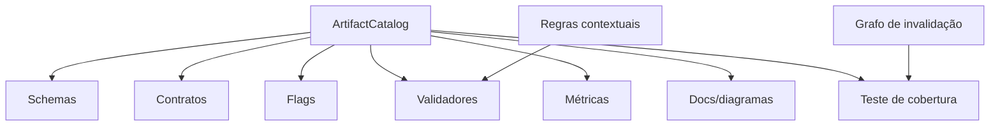

## D08 — Regimento fail-closed

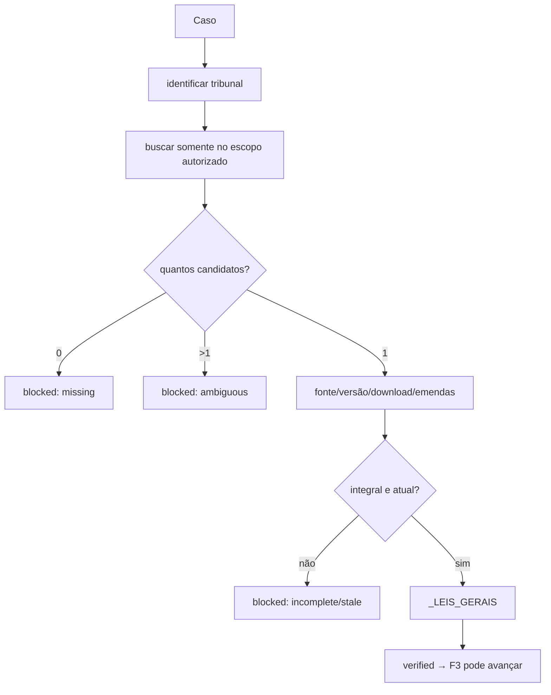

## D09 — Verificação de citação

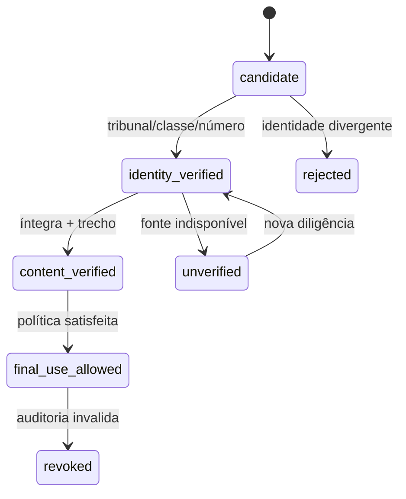

## D10 — Injection scan fail-closed

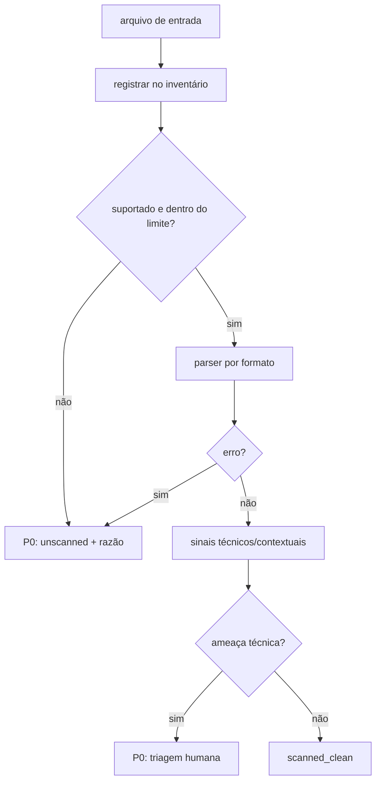

## D11 — Entrega por identidade

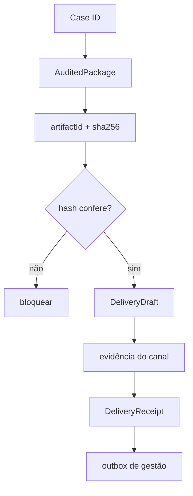

## D12 — ManagementOutbox

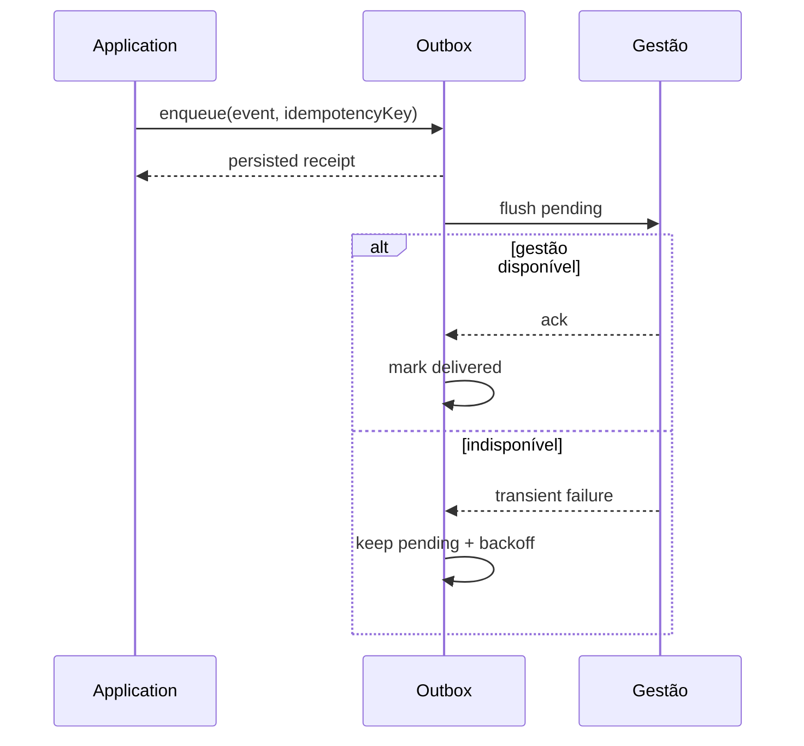

## D13 — Renderização e QA

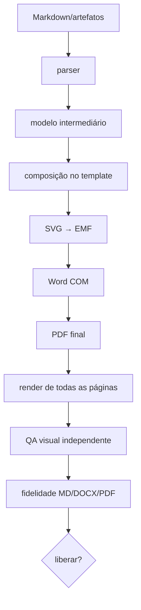

## D14 — Pirâmide de testes

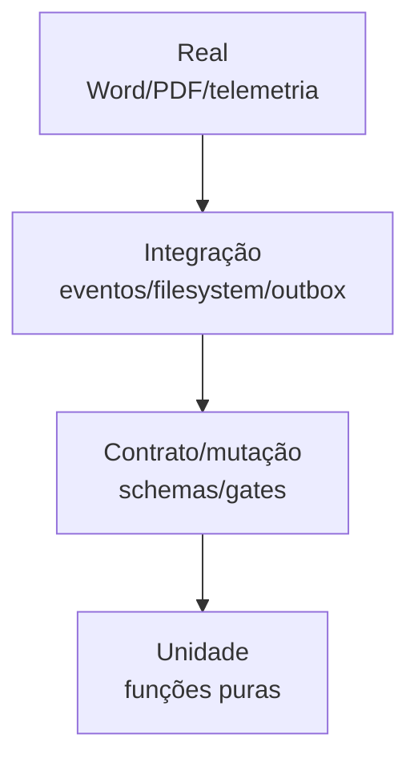

## D15 — Descoberta canônica

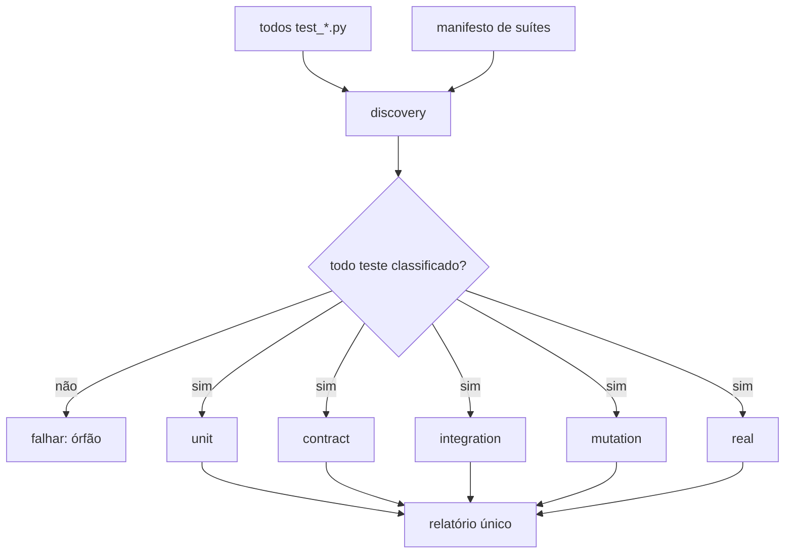

## D16 — Ciclo TDD

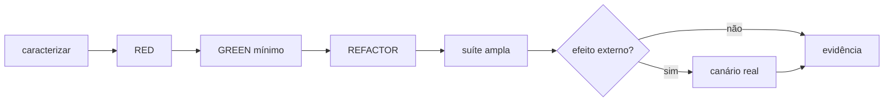

## D17 — Estrutura atual e alvo

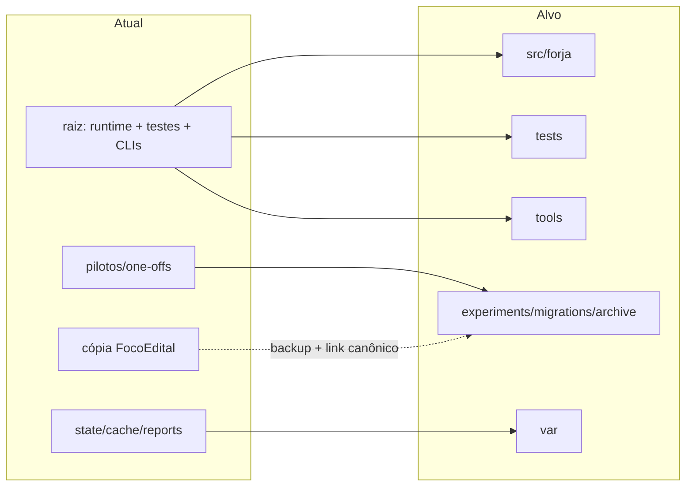

## D18 — Migração física por fachada

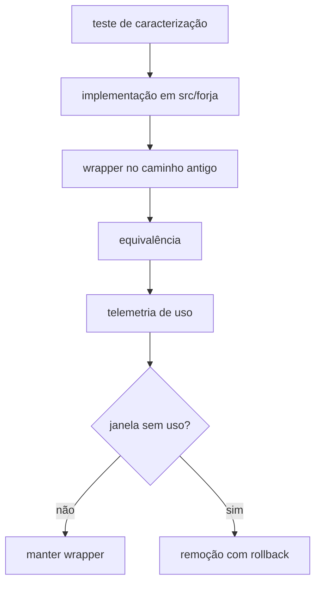

## D19 — Ciclo de shim

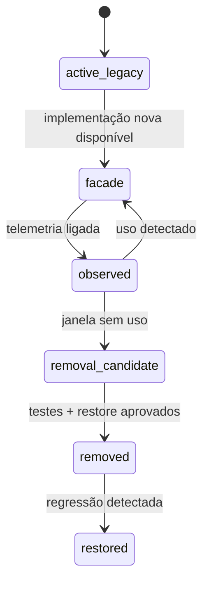

## D20 — Mapa de impacto

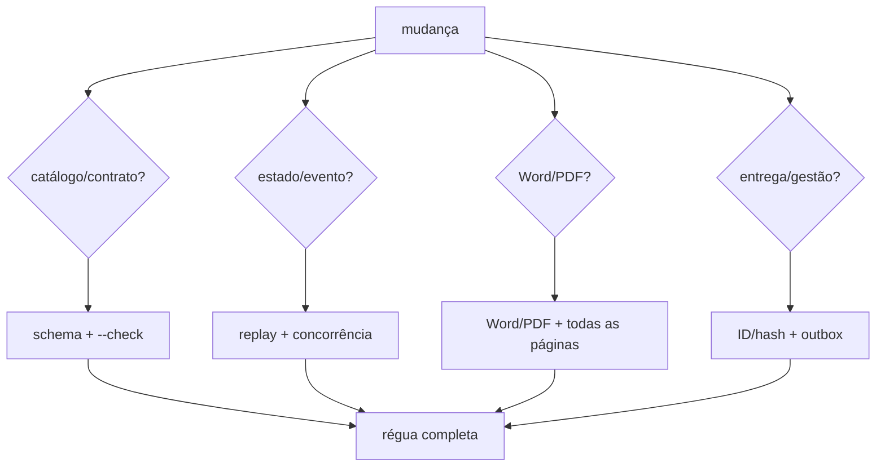

## D21 — Ownership paralelo

```mermaid
flowchart TD
    Coordinator["coordenador"] --> Core["owner core"]
    Coordinator --> Domain["owner domain/catalogs"]
    Coordinator --> Render["owner render"]
    Coordinator --> Validate["owner validators"]
    Coordinator --> CLI["owner CLI framework/docs"]
    Core -. "sem arquivo compartilhado" .- Domain
    Render -. "sem arquivo compartilhado" .- Validate
    CLI --> Merge["integração após gates"]
    Core --> Merge
    Domain --> Merge
    Render --> Merge
    Validate --> Merge
    Merge --> Wrappers["migração sequencial de wrappers após P09-P12"]
```

## D22 — Rollback por onda

```mermaid
flowchart LR
    Change["onda executada"] --> Gate{"gate aprovado?"}
    Gate -->|sim| Next["próxima onda"]
    Gate -->|não| Preserve["preservar evidência"]
    Preserve --> Flag["desligar flag/fachada"]
    Flag --> Restore["restore por manifesto/hash"]
    Restore --> Recheck["reexecutar baseline"]
    Recheck --> Stop["parar e diagnosticar"]
```
