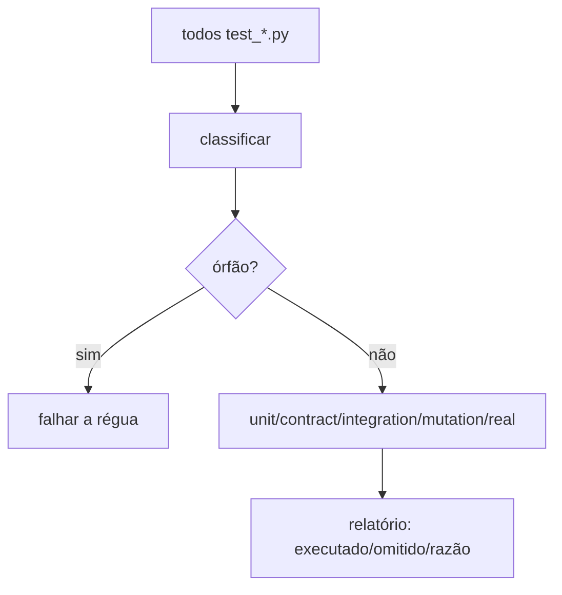
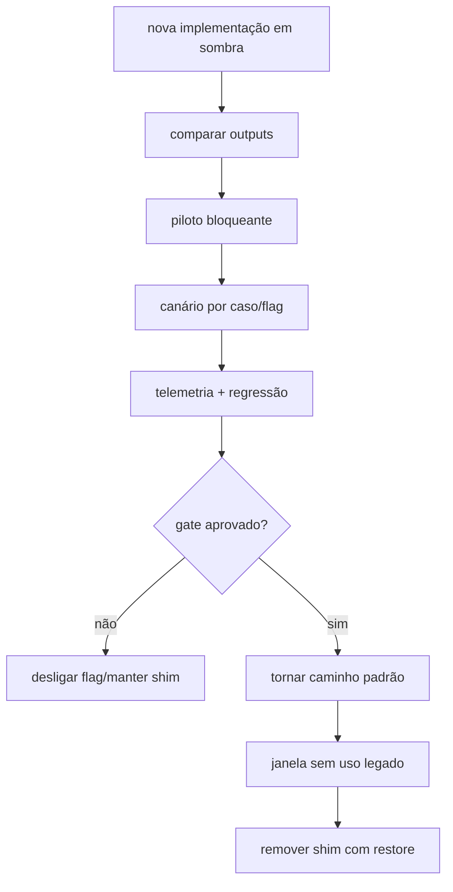

# Estratégia de testes, rollback e cutover — FORJA R1

## 1. Princípio

Nenhuma limpeza é concluída por ausência de erro aparente. Cada onda deve provar preservação, diferenças intencionais, recuperabilidade e cobertura do próprio verificador.

## 2. Camadas de teste

| Camada | Escopo | Frequência |
|---|---|---|
| unidade | funções puras, reducers, parsers, catálogos | toda tarefa |
| contrato | schemas, geração, wrappers, CLI, F2-A | toda onda |
| integração | filesystem, locks, events, promotion, outbox | toda onda afetada |
| mutação/adversarial | citações, contexto, parte, valor, pedido | gates jurídicos |
| real | Word COM, EMF, PDF, páginas, telemetria | R1 baseline, R6 e R9 |

## 3. Descoberta da régua

O manifesto da suíte é parte do produto testado. Um teste novo sem classificação deve tornar a validação vermelha.

## 4. Testes P0

### Regimento

- correto e completo passa;
- ausente, fora do caso, ambíguo, curto, sem fonte, sem versão, sem download ou sem emendas bloqueia;
- tribunal divergente bloqueia;
- `_LEIS_GERAIS` ausente bloqueia a liberação aplicável.

### Citação

- nome de arquivo não prova identidade;
- número em texto genérico não prova fonte;
- tribunal/classe divergentes bloqueiam;
- trecho inexistente bloqueia;
- indisponibilidade vira `unverified`;
- fonte revogada invalida uso.

### Injection

- exceção, arquivo ilegível, grande ou não suportado vira `unscanned` P0;
- todo input aparece no resultado;
- conteúdo imperativo externo nunca vira comando;
- citação acadêmica benigna não trava sem sinal técnico.

### Régua

- teste órfão trava;
- stdout global não é trocado no import;
- N2/N3/N4/F2-A aparecem no relatório;
- bateria real nunca é reportada como executada quando omitida.

## 5. Oráculos de equivalência

| Objeto | Comparação |
|---|---|
| evento | sequência, tipo, payload canônico e revisão |
| estado | campos e hash normalizado |
| contrato/schema | hash bruto quando estruturalmente inalterado |
| JSON gerado | conteúdo canônico sem timestamp volátil |
| CLI | argumentos, exit, stdout/stderr sanitizados, efeitos |
| pacote | IDs, hashes, bytes e anexos |
| DOCX | estrutura OOXML, estilos, blocos, tabelas, metadados |
| PDF | texto, páginas, geometria, imagens e QA visual |
| gestão | sidecar, precedência, links e idempotência |

Correções de P0 têm diferenças esperadas registradas; somente caminhos inseguros devem mudar.

## 6. Fault injection

Injetar falhas em:

1. leitura de input;
2. lock;
3. escrita de artifact staging;
4. revalidação de contexto;
5. validação N4;
6. cópia/promote;
7. append do evento;
8. materialização do snapshot;
9. enqueue da gestão;
10. flush da outbox;
11. Word COM;
12. exportação PDF;
13. render de página.

Para cada ponto, declarar estado permitido, artefatos preservados, retry e rollback.

## 7. Corpus

### Replays mínimos

- Azimut — isolamento e fontes pendentes;
- CORSAN — cartões, overflow e timeline;
- Libra Sul — memoriais longos e sobreposição;
- Natura — sequência visual e colisões;
- Patrícia/Fábio — números, caixas e JSON;
- Plano de Saúde — pacote múltiplo e regressão de fase.

Cada replay usa cópia imutável e não reescreve peça histórica.

### Ciclos prospectivos

Três casos novos, com F2-A, regimento, conselho, redação, auditoria, QA e entrega. Texto final preexistente não pode ser usado como oráculo de geração.

## 8. Orçamento de desempenho

Baseline deve medir:

- descoberta e suíte rápida;
- suíte não-real completa;
- replay por caso;
- validação N4;
- render DOCX/PDF;
- sincronização de gestão.

Regressão >15% exige explicação e aceite técnico; regressão >30% bloqueia a onda, salvo correção de segurança que justifique explicitamente o custo.

## 9. Backup e restore

Antes de mover/apagar:

- inventário com tamanho/função/consumidor;
- hash de cada arquivo protegido;
- backup fora do destino da limpeza;
- manifest origem → destino;
- comando de restauração;
- ensaio em diretório temporário;
- comparação pós-restore;
- decisão `manter`, `mover`, `arquivar`, `excluir depois`.

Nunca apagar diretamente durante R0–R6.

## 10. Rollback por onda

| Onda | Rollback |
|---|---|
| R0 | abandonar baseline isolado |
| R1 | reverter gate isolado; manter testes RED como evidência |
| R2 | remover manifesto/esqueleto; usar scripts atuais |
| R3 | fachada aponta para implementação antiga |
| R4 | desligar porta transacional; preservar eventos |
| R5 | usar rota anterior; reprocessar outbox |
| R6 | wrapper retorna hotspot antigo |
| R7 | restaurar por manifest/hash |
| R8 | docs/CLI antiga continuam disponíveis |
| R9 | manter shims e flags no estado anterior |

## 11. Cutover

Refatoração estrutural e promoção N3/N4 são decisões diferentes. Um módulo pode se tornar padrão interno sem mudar a especificação jurídica, desde que o manifest e as flags expressem isso corretamente.

## 12. Gate final técnico — G9A

- suíte completa e cobertura da régua;
- replay equivalente;
- Word/PDF/EMF e todas as páginas;
- outbox/entrega por hash;
- segurança e segredos;
- links e Mermaid;
- backup/restore;
- manifestos e runbooks coerentes;
- nenhum shim removido sem prova;
- nenhuma promoção normativa implícita.

## 13. Gate de elegibilidade — G9B

Somente se houver intenção posterior de cutover/promoção:

- três ciclos prospectivos reais completos;
- mutação semântica ≥0,8 nas famílias aplicáveis;
- falsos bloqueios benignos medidos;
- decisão normativa própria e autorização correspondente.

G9B pendente não impede fechar tecnicamente a refatoração em G9A, mas mantém shims, flags e compatibilidade cuja segurança dependa dos ciclos prospectivos.
