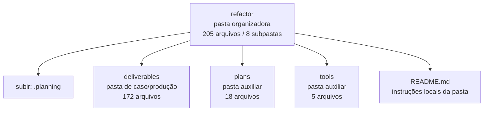

<!-- IA_NAVIGACAO:GERADO_AUTO:v1 -->
# Mapa IA - refactor

Atualizado automaticamente em: **2026-08-05 13:56:04 -0300**

- Caminho: `C:\Users\IgorPC\.claude\projects\Escritório fabio osório\fabricas de melhoria de petições\_FORJA_HARNESS\.planning\refactor`
- Tipo: **pasta organizadora**
- Função para navegação: agrega subpastas; abrir mapa filho conforme objetivo
- Conteúdo recursivo: **205 arquivos**, **8 subpastas**, **21.2 MB**
- Tipos de arquivo: .png: 60, .svg: 50, .mmd: 37, .md: 27, .emf: 17, .json: 7, .py: 5, .docx: 1, .pdf: 1
- Mapa raiz: [MAPA_IA.md](<../../../MAPA_IA.md>)
- Índice geral: [INDICE_GERAL_IA.md](<../../../00_IA_NAVIGACAO/INDICE_GERAL_IA.md>)
- Protocolo de navegação: [PROTOCOLO_NAVEGACAO_IA.md](<../../../00_IA_NAVIGACAO/PROTOCOLO_NAVEGACAO_IA.md>)
- Inventário JSON para agentes: [inventario_ia.json](<../../../00_IA_NAVIGACAO/dados/inventario_ia.json>)
- Mapa superior: [.planning](<../MAPA_IA.md>)

## GPS Mermaid

## Ordem de leitura recomendada

1. Ler este `MAPA_IA.md` antes de abrir arquivos pesados.
2. Subir para a raiz se precisar das regras globais `AGENTS.md`, `CLAUDE.md` e `_LEIS_GERAIS`.
3. Usar builds, renders e QA apenas para validar entrega ou rastrear geração; não começar por eles.

## Subpastas diretas

| Subpasta | Tipo | Conteúdo | Atualização | Próximo passo |
|---|---|---:|---:|---|
| [deliverables](<deliverables/MAPA_IA.md>) | pasta de caso/produção | 172 arquivos / 5 subpastas | 2026-07-15 19:33 | contém peça, parecer, memorial, relatório ou plano |
| [plans](<plans/MAPA_IA.md>) | pasta auxiliar | 18 arquivos / 0 subpastas | 2026-07-16 23:24 | conteúdo auxiliar ou residual |
| [tools](<tools/MAPA_IA.md>) | pasta auxiliar | 5 arquivos / 0 subpastas | 2026-07-15 19:33 | conteúdo auxiliar ou residual |

## Arquivos diretos

| Arquivo | Papel | Tamanho | Modificado | Observação |
|---|---:|---:|---:|---|
| [README.md](<README.md>) | regras | 1.5 KB | 2026-07-15 19:16 | instruções locais da pasta \| tópicos: FORJA R1 — Plano mestre de refatoração estrutural; Leitura obrigatória; Regra central |
| [REFACTOR_PLAN_MANIFEST.json](<REFACTOR_PLAN_MANIFEST.json>) | dados/script | 2.3 KB | 2026-07-15 19:33 | dado estruturado ou rotina técnica |
| [00-CONTEXT.md](<00-CONTEXT.md>) | outro | 4.1 KB | 2026-07-15 18:56 | arquivo não classificado automaticamente \| tópicos: FORJA R1 — Contexto travado; Limite do programa; Decisões de implementação |
| [01-PRD_REFATORACAO_FORJA.md](<01-PRD_REFATORACAO_FORJA.md>) | outro | 13.1 KB | 2026-07-15 19:15 | arquivo não classificado automaticamente \| tópicos: PRD — FORJA R1: Refatoração Estrutural Segura; 1. Visão; 2. Problema |
| [02-TDD_REFATORACAO_FORJA.md](<02-TDD_REFATORACAO_FORJA.md>) | outro | 14.7 KB | 2026-07-15 19:15 | arquivo não classificado automaticamente \| tópicos: TDD — FORJA R1: Refatoração Estrutural Segura; 1. Decisão arquitetural; 2. Estrutura-alvo |
| [03-ROADMAP_REFATORACAO_FORJA.md](<03-ROADMAP_REFATORACAO_FORJA.md>) | outro | 12.4 KB | 2026-07-15 19:15 | arquivo não classificado automaticamente \| tópicos: ROADMAP — FORJA R1: Refatoração Estrutural Segura; 1. Não replanejar; 2. Dependências |
| [04-DIAGRAMAS_REFATORACAO_FORJA.md](<04-DIAGRAMAS_REFATORACAO_FORJA.md>) | outro | 10.5 KB | 2026-07-15 19:15 | arquivo não classificado automaticamente \| tópicos: Diagramas — FORJA R1; D01 — Estado normativo atual; D02 — Arquitetura-alvo |
| [05-MATRIZ_RASTREABILIDADE.md](<05-MATRIZ_RASTREABILIDADE.md>) | outro | 5.2 KB | 2026-07-15 19:15 | arquivo não classificado automaticamente \| tópicos: Matriz de rastreabilidade — FORJA R1; 1. Requisitos funcionais; 2. RNFs |
| [06-TESTES_ROLLBACK_E_CUTOVER.md](<06-TESTES_ROLLBACK_E_CUTOVER.md>) | outro | 6.5 KB | 2026-07-15 19:15 | arquivo não classificado automaticamente \| tópicos: Estratégia de testes, rollback e cutover — FORJA R1; 1. Princípio; 2. Camadas de teste |
| [CLAUDE-CODE-REVIEW-FIX-2026-07-16.md](<CLAUDE-CODE-REVIEW-FIX-2026-07-16.md>) | outro | 2.4 KB | 2026-07-17 02:07 | arquivo não classificado automaticamente \| tópicos: Correções da auditoria da mudança do Claude Code; Resultado; Correções aplicadas |

## Leitura por papel

- **regras**: [README.md](<README.md>)
- **dados/script**: [REFACTOR_PLAN_MANIFEST.json](<REFACTOR_PLAN_MANIFEST.json>)
- **outro**: [00-CONTEXT.md](<00-CONTEXT.md>), [01-PRD_REFATORACAO_FORJA.md](<01-PRD_REFATORACAO_FORJA.md>), [02-TDD_REFATORACAO_FORJA.md](<02-TDD_REFATORACAO_FORJA.md>), [03-ROADMAP_REFATORACAO_FORJA.md](<03-ROADMAP_REFATORACAO_FORJA.md>), [04-DIAGRAMAS_REFATORACAO_FORJA.md](<04-DIAGRAMAS_REFATORACAO_FORJA.md>), [05-MATRIZ_RASTREABILIDADE.md](<05-MATRIZ_RASTREABILIDADE.md>), [06-TESTES_ROLLBACK_E_CUTOVER.md](<06-TESTES_ROLLBACK_E_CUTOVER.md>), [CLAUDE-CODE-REVIEW-FIX-2026-07-16.md](<CLAUDE-CODE-REVIEW-FIX-2026-07-16.md>)

## Observações anti-alucinação

- Este mapa classifica por nomes, extensões e posição na árvore; não substitui leitura de fonte primária.
- Fato, citação, ID processual, prazo e jurisprudência só entram em peça depois de conferência no arquivo-fonte ou fonte oficial.
- Se a pasta tiver regimento, a peça deve refletir o regimento vigente na data do protocolo.
