<!-- IA_NAVIGACAO:GERADO_AUTO:v1 -->
# Mapa IA - deliverables

Atualizado automaticamente em: **2026-08-05 13:55:56 -0300**

- Caminho: `C:\Users\IgorPC\.claude\projects\Escritório fabio osório\fabricas de melhoria de petições\_FORJA_HARNESS\.planning\refactor\deliverables`
- Tipo: **pasta de caso/produção**
- Função para navegação: contém peça, parecer, memorial, relatório ou plano
- Conteúdo recursivo: **172 arquivos**, **5 subpastas**, **21.0 MB**
- Tipos de arquivo: .png: 60, .svg: 50, .mmd: 37, .emf: 17, .json: 6, .docx: 1, .pdf: 1
- Mapa raiz: [MAPA_IA.md](<../../../../MAPA_IA.md>)
- Índice geral: [INDICE_GERAL_IA.md](<../../../../00_IA_NAVIGACAO/INDICE_GERAL_IA.md>)
- Protocolo de navegação: [PROTOCOLO_NAVEGACAO_IA.md](<../../../../00_IA_NAVIGACAO/PROTOCOLO_NAVEGACAO_IA.md>)
- Inventário JSON para agentes: [inventario_ia.json](<../../../../00_IA_NAVIGACAO/dados/inventario_ia.json>)
- Mapa superior: [refactor](<../MAPA_IA.md>)

## GPS Mermaid

```mermaid
flowchart TD
  N23f774a95d["deliverables<br/>pasta de caso/produção<br/>172 arquivos / 5 subpastas"]
  Ne3d23866fe["subir: refactor"]
  N23f774a95d --> Ne3d23866fe
  click Ne3d23866fe "../MAPA_IA.md" "Abrir mapa superior"
  Na007915018["diagramas<br/>pasta auxiliar<br/>61 arquivos"]
  N23f774a95d --> Na007915018
  click Na007915018 "diagramas/MAPA_IA.md" "Abrir mapa da pasta"
  N721d181751["diagramas_pdf<br/>pasta auxiliar<br/>45 arquivos"]
  N23f774a95d --> N721d181751
  click N721d181751 "diagramas_pdf/MAPA_IA.md" "Abrir mapa da pasta"
  Nc58d14c042["qa_contact_sheets<br/>artefatos técnicos<br/>12 arquivos"]
  N23f774a95d --> Nc58d14c042
  click Nc58d14c042 "qa_contact_sheets/MAPA_IA.md" "Abrir mapa da pasta"
  N95beef3926["qa_docx_renderer<br/>artefatos técnicos<br/>0 arquivos"]
  N23f774a95d --> N95beef3926
  click N95beef3926 "qa_docx_renderer/MAPA_IA.md" "Abrir mapa da pasta"
  Ne0d471609f["qa_word_pdf<br/>artefatos técnicos<br/>48 arquivos"]
  N23f774a95d --> Ne0d471609f
  click Ne0d471609f "qa_word_pdf/MAPA_IA.md" "Abrir mapa da pasta"
  Ndc0a12af49["PLANO_MESTRE_REFATORACAO_FORJA_2026-07-15.docx<br/>contexto, planejamento ou dossiê"]
  N23f774a95d --> Ndc0a12af49
  click Ndc0a12af49 "PLANO_MESTRE_REFATORACAO_FORJA_2026-07-15.docx" "Abrir arquivo"
  N6d8e771271["PLANO_MESTRE_REFATORACAO_FORJA_2026-07-15.pdf<br/>contexto, planejamento ou dossiê"]
  N23f774a95d --> N6d8e771271
  click N6d8e771271 "PLANO_MESTRE_REFATORACAO_FORJA_2026-07-15.pdf" "Abrir arquivo"
```

## Ordem de leitura recomendada

1. Ler este `MAPA_IA.md` antes de abrir arquivos pesados.
2. Subir para a raiz se precisar das regras globais `AGENTS.md`, `CLAUDE.md` e `_LEIS_GERAIS`.
3. Usar builds, renders e QA apenas para validar entrega ou rastrear geração; não começar por eles.

## Subpastas diretas

| Subpasta | Tipo | Conteúdo | Atualização | Próximo passo |
|---|---|---:|---:|---|
| [diagramas](<diagramas/MAPA_IA.md>) | pasta auxiliar | 61 arquivos / 0 subpastas | 2026-07-15 19:18 | conteúdo auxiliar ou residual |
| [diagramas_pdf](<diagramas_pdf/MAPA_IA.md>) | pasta auxiliar | 45 arquivos / 0 subpastas | 2026-07-15 19:31 | conteúdo auxiliar ou residual |
| [qa_contact_sheets](<qa_contact_sheets/MAPA_IA.md>) | artefatos técnicos | 12 arquivos / 0 subpastas | 2026-07-15 19:32 | build, extração ou QA; ler só quando precisar validar entrega |
| [qa_docx_renderer](<qa_docx_renderer/MAPA_IA.md>) | artefatos técnicos | 0 arquivos / 0 subpastas | - | build, extração ou QA; ler só quando precisar validar entrega |
| [qa_word_pdf](<qa_word_pdf/MAPA_IA.md>) | artefatos técnicos | 48 arquivos / 0 subpastas | 2026-07-15 19:32 | build, extração ou QA; ler só quando precisar validar entrega |

## Arquivos diretos

| Arquivo | Papel | Tamanho | Modificado | Observação |
|---|---:|---:|---:|---|
| [PLANO_MESTRE_REFATORACAO_FORJA_2026-07-15.docx](<PLANO_MESTRE_REFATORACAO_FORJA_2026-07-15.docx>) | plano/contexto | 859.9 KB | 2026-07-15 19:32 | contexto, planejamento ou dossiê |
| [PLANO_MESTRE_REFATORACAO_FORJA_2026-07-15.pdf](<PLANO_MESTRE_REFATORACAO_FORJA_2026-07-15.pdf>) | plano/contexto | 1.6 MB | 2026-07-15 19:32 | contexto, planejamento ou dossiê |
| [build_report.json](<build_report.json>) | dados/script | 546 B | 2026-07-15 19:32 | dado estruturado ou rotina técnica |
| [PLANNING_PACKAGE_HASHES.json](<PLANNING_PACKAGE_HASHES.json>) | dados/script | 5.4 KB | 2026-07-15 19:33 | dado estruturado ou rotina técnica |
| [visual_qa_draft.json](<visual_qa_draft.json>) | dados/script | 7.3 KB | 2026-07-15 19:32 | dado estruturado ou rotina técnica |
| [visual_qa_report.json](<visual_qa_report.json>) | dados/script | 1016 B | 2026-07-15 19:33 | dado estruturado ou rotina técnica |

## Leitura por papel

- **plano/contexto**: [PLANO_MESTRE_REFATORACAO_FORJA_2026-07-15.docx](<PLANO_MESTRE_REFATORACAO_FORJA_2026-07-15.docx>), [PLANO_MESTRE_REFATORACAO_FORJA_2026-07-15.pdf](<PLANO_MESTRE_REFATORACAO_FORJA_2026-07-15.pdf>)
- **dados/script**: [build_report.json](<build_report.json>), [PLANNING_PACKAGE_HASHES.json](<PLANNING_PACKAGE_HASHES.json>), [visual_qa_draft.json](<visual_qa_draft.json>), [visual_qa_report.json](<visual_qa_report.json>)

## Observações anti-alucinação

- Este mapa classifica por nomes, extensões e posição na árvore; não substitui leitura de fonte primária.
- Fato, citação, ID processual, prazo e jurisprudência só entram em peça depois de conferência no arquivo-fonte ou fonte oficial.
- Se a pasta tiver regimento, a peça deve refletir o regimento vigente na data do protocolo.
