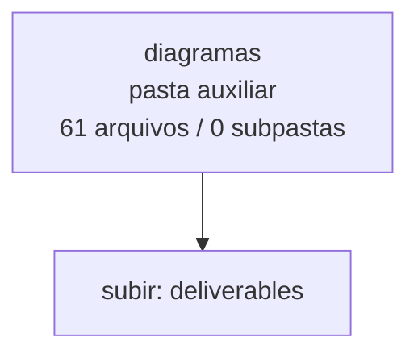

<!-- IA_NAVIGACAO:GERADO_AUTO:v1 -->
# Mapa IA - diagramas

Atualizado automaticamente em: **2026-08-05 13:33:28 -0300**

- Caminho: `C:\Users\IgorPC\.claude\projects\Escritório fabio osório\fabricas de melhoria de petições\_FORJA_HARNESS\.planning\refactor\deliverables\diagramas`
- Tipo: **pasta auxiliar**
- Função para navegação: conteúdo auxiliar ou residual
- Conteúdo recursivo: **61 arquivos**, **0 subpastas**, **693.1 KB**
- Tipos de arquivo: .svg: 30, .mmd: 30, .json: 1
- Mapa raiz: [MAPA_IA.md](<../../../../../MAPA_IA.md>)
- Índice geral: [INDICE_GERAL_IA.md](<../../../../../00_IA_NAVIGACAO/INDICE_GERAL_IA.md>)
- Protocolo de navegação: [PROTOCOLO_NAVEGACAO_IA.md](<../../../../../00_IA_NAVIGACAO/PROTOCOLO_NAVEGACAO_IA.md>)
- Inventário JSON para agentes: [inventario_ia.json](<../../../../../00_IA_NAVIGACAO/dados/inventario_ia.json>)
- Mapa superior: [deliverables](<../MAPA_IA.md>)

## GPS Mermaid

## Ordem de leitura recomendada

1. Ler este `MAPA_IA.md` antes de abrir arquivos pesados.
2. Subir para a raiz se precisar das regras globais `AGENTS.md`, `CLAUDE.md` e `_LEIS_GERAIS`.
3. Usar builds, renders e QA apenas para validar entrega ou rastrear geração; não começar por eles.

## Subpastas diretas

_Sem subpastas diretas._

## Arquivos diretos

| Arquivo | Papel | Tamanho | Modificado | Observação |
|---|---:|---:|---:|---|
| [01-PRD_REFATORACAO_FORJA-01-3_Estado-alvo.svg](<01-PRD_REFATORACAO_FORJA-01-3_Estado-alvo.svg>) | imagem/visual | 29.3 KB | 2026-07-15 19:17 | imagem ou elemento visual |
| [02-TDD_REFATORACAO_FORJA-01-1_Decis_o_arquitetural.svg](<02-TDD_REFATORACAO_FORJA-01-1_Decis_o_arquitetural.svg>) | imagem/visual | 26.5 KB | 2026-07-15 19:17 | imagem ou elemento visual |
| [02-TDD_REFATORACAO_FORJA-02-5_Estados_expl_citos_de_fonte.svg](<02-TDD_REFATORACAO_FORJA-02-5_Estados_expl_citos_de_fonte.svg>) | imagem/visual | 17.2 KB | 2026-07-15 19:17 | imagem ou elemento visual |
| [02-TDD_REFATORACAO_FORJA-03-6_Pol_tica_RED_GREEN_REFACTOR.svg](<02-TDD_REFATORACAO_FORJA-03-6_Pol_tica_RED_GREEN_REFACTOR.svg>) | imagem/visual | 21.5 KB | 2026-07-15 19:17 | imagem ou elemento visual |
| [03-ROADMAP_REFATORACAO_FORJA-01-2_Depend_ncias.svg](<03-ROADMAP_REFATORACAO_FORJA-01-2_Depend_ncias.svg>) | imagem/visual | 29.7 KB | 2026-07-15 19:17 | imagem ou elemento visual |
| [03-ROADMAP_REFATORACAO_FORJA-02-13_Vis_o_temporal.svg](<03-ROADMAP_REFATORACAO_FORJA-02-13_Vis_o_temporal.svg>) | imagem/visual | 13.1 KB | 2026-07-15 19:17 | imagem ou elemento visual |
| [04-DIAGRAMAS_REFATORACAO_FORJA-01-D01_Estado_normativo_atual.svg](<04-DIAGRAMAS_REFATORACAO_FORJA-01-D01_Estado_normativo_atual.svg>) | imagem/visual | 18.8 KB | 2026-07-15 19:17 | imagem ou elemento visual |
| [04-DIAGRAMAS_REFATORACAO_FORJA-02-D02_Arquitetura-alvo.svg](<04-DIAGRAMAS_REFATORACAO_FORJA-02-D02_Arquitetura-alvo.svg>) | imagem/visual | 29.3 KB | 2026-07-15 19:17 | imagem ou elemento visual |
| [04-DIAGRAMAS_REFATORACAO_FORJA-03-D03_F0_F10_com_F2-A.svg](<04-DIAGRAMAS_REFATORACAO_FORJA-03-D03_F0_F10_com_F2-A.svg>) | imagem/visual | 29.1 KB | 2026-07-15 19:17 | imagem ou elemento visual |
| [04-DIAGRAMAS_REFATORACAO_FORJA-04-D04_Dire_o_de_depend_ncias.svg](<04-DIAGRAMAS_REFATORACAO_FORJA-04-D04_Dire_o_de_depend_ncias.svg>) | imagem/visual | 21.2 KB | 2026-07-15 19:18 | imagem ou elemento visual |
| [04-DIAGRAMAS_REFATORACAO_FORJA-05-D05_Event_store_e_replay.svg](<04-DIAGRAMAS_REFATORACAO_FORJA-05-D05_Event_store_e_replay.svg>) | imagem/visual | 26.9 KB | 2026-07-15 19:18 | imagem ou elemento visual |
| [04-DIAGRAMAS_REFATORACAO_FORJA-06-D06_Attempt_e_promo_o_transacional.svg](<04-DIAGRAMAS_REFATORACAO_FORJA-06-D06_Attempt_e_promo_o_transacional.svg>) | imagem/visual | 23.8 KB | 2026-07-15 19:18 | imagem ou elemento visual |
| [04-DIAGRAMAS_REFATORACAO_FORJA-07-D07_ArtifactCatalog.svg](<04-DIAGRAMAS_REFATORACAO_FORJA-07-D07_ArtifactCatalog.svg>) | imagem/visual | 22.2 KB | 2026-07-15 19:18 | imagem ou elemento visual |
| [04-DIAGRAMAS_REFATORACAO_FORJA-08-D08_Regimento_fail-closed.svg](<04-DIAGRAMAS_REFATORACAO_FORJA-08-D08_Regimento_fail-closed.svg>) | imagem/visual | 24.4 KB | 2026-07-15 19:18 | imagem ou elemento visual |
| [04-DIAGRAMAS_REFATORACAO_FORJA-09-D09_Verifica_o_de_cita_o.svg](<04-DIAGRAMAS_REFATORACAO_FORJA-09-D09_Verifica_o_de_cita_o.svg>) | imagem/visual | 17.3 KB | 2026-07-15 19:18 | imagem ou elemento visual |
| [04-DIAGRAMAS_REFATORACAO_FORJA-10-D10_Injection_scan_fail-closed.svg](<04-DIAGRAMAS_REFATORACAO_FORJA-10-D10_Injection_scan_fail-closed.svg>) | imagem/visual | 24.2 KB | 2026-07-15 19:18 | imagem ou elemento visual |
| [04-DIAGRAMAS_REFATORACAO_FORJA-11-D11_Entrega_por_identidade.svg](<04-DIAGRAMAS_REFATORACAO_FORJA-11-D11_Entrega_por_identidade.svg>) | imagem/visual | 21.0 KB | 2026-07-15 19:18 | imagem ou elemento visual |
| [04-DIAGRAMAS_REFATORACAO_FORJA-12-D12_ManagementOutbox.svg](<04-DIAGRAMAS_REFATORACAO_FORJA-12-D12_ManagementOutbox.svg>) | imagem/visual | 25.8 KB | 2026-07-15 19:18 | imagem ou elemento visual |
| [04-DIAGRAMAS_REFATORACAO_FORJA-14-D14_Pir_mide_de_testes.svg](<04-DIAGRAMAS_REFATORACAO_FORJA-14-D14_Pir_mide_de_testes.svg>) | imagem/visual | 13.6 KB | 2026-07-15 19:18 | imagem ou elemento visual |
| [04-DIAGRAMAS_REFATORACAO_FORJA-15-D15_Descoberta_can_nica.svg](<04-DIAGRAMAS_REFATORACAO_FORJA-15-D15_Descoberta_can_nica.svg>) | imagem/visual | 28.0 KB | 2026-07-15 19:18 | imagem ou elemento visual |
| [04-DIAGRAMAS_REFATORACAO_FORJA-16-D16_Ciclo_TDD.svg](<04-DIAGRAMAS_REFATORACAO_FORJA-16-D16_Ciclo_TDD.svg>) | imagem/visual | 20.8 KB | 2026-07-15 19:18 | imagem ou elemento visual |
| [04-DIAGRAMAS_REFATORACAO_FORJA-17-D17_Estrutura_atual_e_alvo.svg](<04-DIAGRAMAS_REFATORACAO_FORJA-17-D17_Estrutura_atual_e_alvo.svg>) | imagem/visual | 20.3 KB | 2026-07-15 19:18 | imagem ou elemento visual |
| [04-DIAGRAMAS_REFATORACAO_FORJA-18-D18_Migra_o_f_sica_por_fachada.svg](<04-DIAGRAMAS_REFATORACAO_FORJA-18-D18_Migra_o_f_sica_por_fachada.svg>) | imagem/visual | 19.5 KB | 2026-07-15 19:18 | imagem ou elemento visual |
| [04-DIAGRAMAS_REFATORACAO_FORJA-19-D19_Ciclo_de_shim.svg](<04-DIAGRAMAS_REFATORACAO_FORJA-19-D19_Ciclo_de_shim.svg>) | imagem/visual | 15.8 KB | 2026-07-15 19:18 | imagem ou elemento visual |
| [04-DIAGRAMAS_REFATORACAO_FORJA-20-D20_Mapa_de_impacto.svg](<04-DIAGRAMAS_REFATORACAO_FORJA-20-D20_Mapa_de_impacto.svg>) | imagem/visual | 25.5 KB | 2026-07-15 19:18 | imagem ou elemento visual |
| [04-DIAGRAMAS_REFATORACAO_FORJA-21-D21_Ownership_paralelo.svg](<04-DIAGRAMAS_REFATORACAO_FORJA-21-D21_Ownership_paralelo.svg>) | imagem/visual | 25.5 KB | 2026-07-15 19:18 | imagem ou elemento visual |
| [04-DIAGRAMAS_REFATORACAO_FORJA-22-D22_Rollback_por_onda.svg](<04-DIAGRAMAS_REFATORACAO_FORJA-22-D22_Rollback_por_onda.svg>) | imagem/visual | 19.8 KB | 2026-07-15 19:18 | imagem ou elemento visual |
| [06-TESTES_ROLLBACK_E_CUTOVER-01-3_Descoberta_da_r_gua.svg](<06-TESTES_ROLLBACK_E_CUTOVER-01-3_Descoberta_da_r_gua.svg>) | imagem/visual | 16.7 KB | 2026-07-15 19:18 | imagem ou elemento visual |
| [06-TESTES_ROLLBACK_E_CUTOVER-02-11_Cutover.svg](<06-TESTES_ROLLBACK_E_CUTOVER-02-11_Cutover.svg>) | imagem/visual | 22.5 KB | 2026-07-15 19:18 | imagem ou elemento visual |
| [render_report.json](<render_report.json>) | dados/script | 6.4 KB | 2026-07-15 19:18 | dado estruturado ou rotina técnica |
| [04-DIAGRAMAS_REFATORACAO_FORJA-13-D13_Renderiza_o_e_QA.mmd](<04-DIAGRAMAS_REFATORACAO_FORJA-13-D13_Renderiza_o_e_QA.mmd>) | artefato técnico | 455 B | 2026-07-15 19:18 | artefato técnico gerado |
| [04-DIAGRAMAS_REFATORACAO_FORJA-13-D13_Renderiza_o_e_QA.svg](<04-DIAGRAMAS_REFATORACAO_FORJA-13-D13_Renderiza_o_e_QA.svg>) | artefato técnico | 23.3 KB | 2026-07-15 19:18 | imagem/render de QA ou build |
| [01-PRD_REFATORACAO_FORJA-01-3_Estado-alvo.mmd](<01-PRD_REFATORACAO_FORJA-01-3_Estado-alvo.mmd>) | outro | 604 B | 2026-07-15 19:17 | arquivo não classificado automaticamente |
| [02-TDD_REFATORACAO_FORJA-01-1_Decis_o_arquitetural.mmd](<02-TDD_REFATORACAO_FORJA-01-1_Decis_o_arquitetural.mmd>) | outro | 517 B | 2026-07-15 19:17 | arquivo não classificado automaticamente |
| [02-TDD_REFATORACAO_FORJA-02-5_Estados_expl_citos_de_fonte.mmd](<02-TDD_REFATORACAO_FORJA-02-5_Estados_expl_citos_de_fonte.mmd>) | outro | 495 B | 2026-07-15 19:17 | arquivo não classificado automaticamente |
| [02-TDD_REFATORACAO_FORJA-03-6_Pol_tica_RED_GREEN_REFACTOR.mmd](<02-TDD_REFATORACAO_FORJA-03-6_Pol_tica_RED_GREEN_REFACTOR.mmd>) | outro | 478 B | 2026-07-15 19:17 | arquivo não classificado automaticamente |
| [03-ROADMAP_REFATORACAO_FORJA-01-2_Depend_ncias.mmd](<03-ROADMAP_REFATORACAO_FORJA-01-2_Depend_ncias.mmd>) | outro | 520 B | 2026-07-15 19:17 | arquivo não classificado automaticamente |
| [03-ROADMAP_REFATORACAO_FORJA-02-13_Vis_o_temporal.mmd](<03-ROADMAP_REFATORACAO_FORJA-02-13_Vis_o_temporal.mmd>) | outro | 1002 B | 2026-07-15 19:17 | arquivo não classificado automaticamente |
| [04-DIAGRAMAS_REFATORACAO_FORJA-01-D01_Estado_normativo_atual.mmd](<04-DIAGRAMAS_REFATORACAO_FORJA-01-D01_Estado_normativo_atual.mmd>) | outro | 353 B | 2026-07-15 19:17 | arquivo não classificado automaticamente |
| [04-DIAGRAMAS_REFATORACAO_FORJA-02-D02_Arquitetura-alvo.mmd](<04-DIAGRAMAS_REFATORACAO_FORJA-02-D02_Arquitetura-alvo.mmd>) | outro | 544 B | 2026-07-15 19:17 | arquivo não classificado automaticamente |
| [04-DIAGRAMAS_REFATORACAO_FORJA-03-D03_F0_F10_com_F2-A.mmd](<04-DIAGRAMAS_REFATORACAO_FORJA-03-D03_F0_F10_com_F2-A.mmd>) | outro | 551 B | 2026-07-15 19:17 | arquivo não classificado automaticamente |
| [04-DIAGRAMAS_REFATORACAO_FORJA-04-D04_Dire_o_de_depend_ncias.mmd](<04-DIAGRAMAS_REFATORACAO_FORJA-04-D04_Dire_o_de_depend_ncias.mmd>) | outro | 301 B | 2026-07-15 19:18 | arquivo não classificado automaticamente |
| [04-DIAGRAMAS_REFATORACAO_FORJA-05-D05_Event_store_e_replay.mmd](<04-DIAGRAMAS_REFATORACAO_FORJA-05-D05_Event_store_e_replay.mmd>) | outro | 413 B | 2026-07-15 19:18 | arquivo não classificado automaticamente |
| [04-DIAGRAMAS_REFATORACAO_FORJA-06-D06_Attempt_e_promo_o_transacional.mmd](<04-DIAGRAMAS_REFATORACAO_FORJA-06-D06_Attempt_e_promo_o_transacional.mmd>) | outro | 524 B | 2026-07-15 19:18 | arquivo não classificado automaticamente |
| [04-DIAGRAMAS_REFATORACAO_FORJA-07-D07_ArtifactCatalog.mmd](<04-DIAGRAMAS_REFATORACAO_FORJA-07-D07_ArtifactCatalog.mmd>) | outro | 418 B | 2026-07-15 19:18 | arquivo não classificado automaticamente |
| [04-DIAGRAMAS_REFATORACAO_FORJA-08-D08_Regimento_fail-closed.mmd](<04-DIAGRAMAS_REFATORACAO_FORJA-08-D08_Regimento_fail-closed.mmd>) | outro | 556 B | 2026-07-15 19:18 | arquivo não classificado automaticamente |
| [04-DIAGRAMAS_REFATORACAO_FORJA-09-D09_Verifica_o_de_cita_o.mmd](<04-DIAGRAMAS_REFATORACAO_FORJA-09-D09_Verifica_o_de_cita_o.mmd>) | outro | 452 B | 2026-07-15 19:18 | arquivo não classificado automaticamente |
| [04-DIAGRAMAS_REFATORACAO_FORJA-10-D10_Injection_scan_fail-closed.mmd](<04-DIAGRAMAS_REFATORACAO_FORJA-10-D10_Injection_scan_fail-closed.mmd>) | outro | 516 B | 2026-07-15 19:18 | arquivo não classificado automaticamente |
| [04-DIAGRAMAS_REFATORACAO_FORJA-11-D11_Entrega_por_identidade.mmd](<04-DIAGRAMAS_REFATORACAO_FORJA-11-D11_Entrega_por_identidade.mmd>) | outro | 374 B | 2026-07-15 19:18 | arquivo não classificado automaticamente |
| [04-DIAGRAMAS_REFATORACAO_FORJA-12-D12_ManagementOutbox.mmd](<04-DIAGRAMAS_REFATORACAO_FORJA-12-D12_ManagementOutbox.mmd>) | outro | 398 B | 2026-07-15 19:18 | arquivo não classificado automaticamente |
| [04-DIAGRAMAS_REFATORACAO_FORJA-14-D14_Pir_mide_de_testes.mmd](<04-DIAGRAMAS_REFATORACAO_FORJA-14-D14_Pir_mide_de_testes.mmd>) | outro | 262 B | 2026-07-15 19:18 | arquivo não classificado automaticamente |
| [04-DIAGRAMAS_REFATORACAO_FORJA-15-D15_Descoberta_can_nica.mmd](<04-DIAGRAMAS_REFATORACAO_FORJA-15-D15_Descoberta_can_nica.mmd>) | outro | 568 B | 2026-07-15 19:18 | arquivo não classificado automaticamente |
| [04-DIAGRAMAS_REFATORACAO_FORJA-16-D16_Ciclo_TDD.mmd](<04-DIAGRAMAS_REFATORACAO_FORJA-16-D16_Ciclo_TDD.mmd>) | outro | 325 B | 2026-07-15 19:18 | arquivo não classificado automaticamente |
| [04-DIAGRAMAS_REFATORACAO_FORJA-17-D17_Estrutura_atual_e_alvo.mmd](<04-DIAGRAMAS_REFATORACAO_FORJA-17-D17_Estrutura_atual_e_alvo.mmd>) | outro | 535 B | 2026-07-15 19:18 | arquivo não classificado automaticamente |
| [04-DIAGRAMAS_REFATORACAO_FORJA-18-D18_Migra_o_f_sica_por_fachada.mmd](<04-DIAGRAMAS_REFATORACAO_FORJA-18-D18_Migra_o_f_sica_por_fachada.mmd>) | outro | 387 B | 2026-07-15 19:18 | arquivo não classificado automaticamente |
| [04-DIAGRAMAS_REFATORACAO_FORJA-19-D19_Ciclo_de_shim.mmd](<04-DIAGRAMAS_REFATORACAO_FORJA-19-D19_Ciclo_de_shim.mmd>) | outro | 355 B | 2026-07-15 19:18 | arquivo não classificado automaticamente |
| [04-DIAGRAMAS_REFATORACAO_FORJA-20-D20_Mapa_de_impacto.mmd](<04-DIAGRAMAS_REFATORACAO_FORJA-20-D20_Mapa_de_impacto.mmd>) | outro | 511 B | 2026-07-15 19:18 | arquivo não classificado automaticamente |
| [04-DIAGRAMAS_REFATORACAO_FORJA-21-D21_Ownership_paralelo.mmd](<04-DIAGRAMAS_REFATORACAO_FORJA-21-D21_Ownership_paralelo.mmd>) | outro | 585 B | 2026-07-15 19:18 | arquivo não classificado automaticamente |
| [04-DIAGRAMAS_REFATORACAO_FORJA-22-D22_Rollback_por_onda.mmd](<04-DIAGRAMAS_REFATORACAO_FORJA-22-D22_Rollback_por_onda.mmd>) | outro | 359 B | 2026-07-15 19:18 | arquivo não classificado automaticamente |
| [06-TESTES_ROLLBACK_E_CUTOVER-01-3_Descoberta_da_r_gua.mmd](<06-TESTES_ROLLBACK_E_CUTOVER-01-3_Descoberta_da_r_gua.mmd>) | outro | 287 B | 2026-07-15 19:18 | arquivo não classificado automaticamente |
| [06-TESTES_ROLLBACK_E_CUTOVER-02-11_Cutover.mmd](<06-TESTES_ROLLBACK_E_CUTOVER-02-11_Cutover.mmd>) | outro | 498 B | 2026-07-15 19:18 | arquivo não classificado automaticamente |

## Leitura por papel

- **imagem/visual**: [01-PRD_REFATORACAO_FORJA-01-3_Estado-alvo.svg](<01-PRD_REFATORACAO_FORJA-01-3_Estado-alvo.svg>), [02-TDD_REFATORACAO_FORJA-01-1_Decis_o_arquitetural.svg](<02-TDD_REFATORACAO_FORJA-01-1_Decis_o_arquitetural.svg>), [02-TDD_REFATORACAO_FORJA-02-5_Estados_expl_citos_de_fonte.svg](<02-TDD_REFATORACAO_FORJA-02-5_Estados_expl_citos_de_fonte.svg>), [02-TDD_REFATORACAO_FORJA-03-6_Pol_tica_RED_GREEN_REFACTOR.svg](<02-TDD_REFATORACAO_FORJA-03-6_Pol_tica_RED_GREEN_REFACTOR.svg>), [03-ROADMAP_REFATORACAO_FORJA-01-2_Depend_ncias.svg](<03-ROADMAP_REFATORACAO_FORJA-01-2_Depend_ncias.svg>), [03-ROADMAP_REFATORACAO_FORJA-02-13_Vis_o_temporal.svg](<03-ROADMAP_REFATORACAO_FORJA-02-13_Vis_o_temporal.svg>), [04-DIAGRAMAS_REFATORACAO_FORJA-01-D01_Estado_normativo_atual.svg](<04-DIAGRAMAS_REFATORACAO_FORJA-01-D01_Estado_normativo_atual.svg>), [04-DIAGRAMAS_REFATORACAO_FORJA-02-D02_Arquitetura-alvo.svg](<04-DIAGRAMAS_REFATORACAO_FORJA-02-D02_Arquitetura-alvo.svg>), [04-DIAGRAMAS_REFATORACAO_FORJA-03-D03_F0_F10_com_F2-A.svg](<04-DIAGRAMAS_REFATORACAO_FORJA-03-D03_F0_F10_com_F2-A.svg>), [04-DIAGRAMAS_REFATORACAO_FORJA-04-D04_Dire_o_de_depend_ncias.svg](<04-DIAGRAMAS_REFATORACAO_FORJA-04-D04_Dire_o_de_depend_ncias.svg>), [04-DIAGRAMAS_REFATORACAO_FORJA-05-D05_Event_store_e_replay.svg](<04-DIAGRAMAS_REFATORACAO_FORJA-05-D05_Event_store_e_replay.svg>), [04-DIAGRAMAS_REFATORACAO_FORJA-06-D06_Attempt_e_promo_o_transacional.svg](<04-DIAGRAMAS_REFATORACAO_FORJA-06-D06_Attempt_e_promo_o_transacional.svg>), [04-DIAGRAMAS_REFATORACAO_FORJA-07-D07_ArtifactCatalog.svg](<04-DIAGRAMAS_REFATORACAO_FORJA-07-D07_ArtifactCatalog.svg>), [04-DIAGRAMAS_REFATORACAO_FORJA-08-D08_Regimento_fail-closed.svg](<04-DIAGRAMAS_REFATORACAO_FORJA-08-D08_Regimento_fail-closed.svg>), [04-DIAGRAMAS_REFATORACAO_FORJA-09-D09_Verifica_o_de_cita_o.svg](<04-DIAGRAMAS_REFATORACAO_FORJA-09-D09_Verifica_o_de_cita_o.svg>), [04-DIAGRAMAS_REFATORACAO_FORJA-10-D10_Injection_scan_fail-closed.svg](<04-DIAGRAMAS_REFATORACAO_FORJA-10-D10_Injection_scan_fail-closed.svg>), [04-DIAGRAMAS_REFATORACAO_FORJA-11-D11_Entrega_por_identidade.svg](<04-DIAGRAMAS_REFATORACAO_FORJA-11-D11_Entrega_por_identidade.svg>), [04-DIAGRAMAS_REFATORACAO_FORJA-12-D12_ManagementOutbox.svg](<04-DIAGRAMAS_REFATORACAO_FORJA-12-D12_ManagementOutbox.svg>), [04-DIAGRAMAS_REFATORACAO_FORJA-14-D14_Pir_mide_de_testes.svg](<04-DIAGRAMAS_REFATORACAO_FORJA-14-D14_Pir_mide_de_testes.svg>), [04-DIAGRAMAS_REFATORACAO_FORJA-15-D15_Descoberta_can_nica.svg](<04-DIAGRAMAS_REFATORACAO_FORJA-15-D15_Descoberta_can_nica.svg>), [04-DIAGRAMAS_REFATORACAO_FORJA-16-D16_Ciclo_TDD.svg](<04-DIAGRAMAS_REFATORACAO_FORJA-16-D16_Ciclo_TDD.svg>), [04-DIAGRAMAS_REFATORACAO_FORJA-17-D17_Estrutura_atual_e_alvo.svg](<04-DIAGRAMAS_REFATORACAO_FORJA-17-D17_Estrutura_atual_e_alvo.svg>), [04-DIAGRAMAS_REFATORACAO_FORJA-18-D18_Migra_o_f_sica_por_fachada.svg](<04-DIAGRAMAS_REFATORACAO_FORJA-18-D18_Migra_o_f_sica_por_fachada.svg>), [04-DIAGRAMAS_REFATORACAO_FORJA-19-D19_Ciclo_de_shim.svg](<04-DIAGRAMAS_REFATORACAO_FORJA-19-D19_Ciclo_de_shim.svg>), [04-DIAGRAMAS_REFATORACAO_FORJA-20-D20_Mapa_de_impacto.svg](<04-DIAGRAMAS_REFATORACAO_FORJA-20-D20_Mapa_de_impacto.svg>), [04-DIAGRAMAS_REFATORACAO_FORJA-21-D21_Ownership_paralelo.svg](<04-DIAGRAMAS_REFATORACAO_FORJA-21-D21_Ownership_paralelo.svg>), [04-DIAGRAMAS_REFATORACAO_FORJA-22-D22_Rollback_por_onda.svg](<04-DIAGRAMAS_REFATORACAO_FORJA-22-D22_Rollback_por_onda.svg>), [06-TESTES_ROLLBACK_E_CUTOVER-01-3_Descoberta_da_r_gua.svg](<06-TESTES_ROLLBACK_E_CUTOVER-01-3_Descoberta_da_r_gua.svg>), [06-TESTES_ROLLBACK_E_CUTOVER-02-11_Cutover.svg](<06-TESTES_ROLLBACK_E_CUTOVER-02-11_Cutover.svg>)
- **dados/script**: [render_report.json](<render_report.json>)
- **artefato técnico**: [04-DIAGRAMAS_REFATORACAO_FORJA-13-D13_Renderiza_o_e_QA.mmd](<04-DIAGRAMAS_REFATORACAO_FORJA-13-D13_Renderiza_o_e_QA.mmd>), [04-DIAGRAMAS_REFATORACAO_FORJA-13-D13_Renderiza_o_e_QA.svg](<04-DIAGRAMAS_REFATORACAO_FORJA-13-D13_Renderiza_o_e_QA.svg>)
- **outro**: [01-PRD_REFATORACAO_FORJA-01-3_Estado-alvo.mmd](<01-PRD_REFATORACAO_FORJA-01-3_Estado-alvo.mmd>), [02-TDD_REFATORACAO_FORJA-01-1_Decis_o_arquitetural.mmd](<02-TDD_REFATORACAO_FORJA-01-1_Decis_o_arquitetural.mmd>), [02-TDD_REFATORACAO_FORJA-02-5_Estados_expl_citos_de_fonte.mmd](<02-TDD_REFATORACAO_FORJA-02-5_Estados_expl_citos_de_fonte.mmd>), [02-TDD_REFATORACAO_FORJA-03-6_Pol_tica_RED_GREEN_REFACTOR.mmd](<02-TDD_REFATORACAO_FORJA-03-6_Pol_tica_RED_GREEN_REFACTOR.mmd>), [03-ROADMAP_REFATORACAO_FORJA-01-2_Depend_ncias.mmd](<03-ROADMAP_REFATORACAO_FORJA-01-2_Depend_ncias.mmd>), [03-ROADMAP_REFATORACAO_FORJA-02-13_Vis_o_temporal.mmd](<03-ROADMAP_REFATORACAO_FORJA-02-13_Vis_o_temporal.mmd>), [04-DIAGRAMAS_REFATORACAO_FORJA-01-D01_Estado_normativo_atual.mmd](<04-DIAGRAMAS_REFATORACAO_FORJA-01-D01_Estado_normativo_atual.mmd>), [04-DIAGRAMAS_REFATORACAO_FORJA-02-D02_Arquitetura-alvo.mmd](<04-DIAGRAMAS_REFATORACAO_FORJA-02-D02_Arquitetura-alvo.mmd>), [04-DIAGRAMAS_REFATORACAO_FORJA-03-D03_F0_F10_com_F2-A.mmd](<04-DIAGRAMAS_REFATORACAO_FORJA-03-D03_F0_F10_com_F2-A.mmd>), [04-DIAGRAMAS_REFATORACAO_FORJA-04-D04_Dire_o_de_depend_ncias.mmd](<04-DIAGRAMAS_REFATORACAO_FORJA-04-D04_Dire_o_de_depend_ncias.mmd>), [04-DIAGRAMAS_REFATORACAO_FORJA-05-D05_Event_store_e_replay.mmd](<04-DIAGRAMAS_REFATORACAO_FORJA-05-D05_Event_store_e_replay.mmd>), [04-DIAGRAMAS_REFATORACAO_FORJA-06-D06_Attempt_e_promo_o_transacional.mmd](<04-DIAGRAMAS_REFATORACAO_FORJA-06-D06_Attempt_e_promo_o_transacional.mmd>), [04-DIAGRAMAS_REFATORACAO_FORJA-07-D07_ArtifactCatalog.mmd](<04-DIAGRAMAS_REFATORACAO_FORJA-07-D07_ArtifactCatalog.mmd>), [04-DIAGRAMAS_REFATORACAO_FORJA-08-D08_Regimento_fail-closed.mmd](<04-DIAGRAMAS_REFATORACAO_FORJA-08-D08_Regimento_fail-closed.mmd>), [04-DIAGRAMAS_REFATORACAO_FORJA-09-D09_Verifica_o_de_cita_o.mmd](<04-DIAGRAMAS_REFATORACAO_FORJA-09-D09_Verifica_o_de_cita_o.mmd>), [04-DIAGRAMAS_REFATORACAO_FORJA-10-D10_Injection_scan_fail-closed.mmd](<04-DIAGRAMAS_REFATORACAO_FORJA-10-D10_Injection_scan_fail-closed.mmd>), [04-DIAGRAMAS_REFATORACAO_FORJA-11-D11_Entrega_por_identidade.mmd](<04-DIAGRAMAS_REFATORACAO_FORJA-11-D11_Entrega_por_identidade.mmd>), [04-DIAGRAMAS_REFATORACAO_FORJA-12-D12_ManagementOutbox.mmd](<04-DIAGRAMAS_REFATORACAO_FORJA-12-D12_ManagementOutbox.mmd>), [04-DIAGRAMAS_REFATORACAO_FORJA-14-D14_Pir_mide_de_testes.mmd](<04-DIAGRAMAS_REFATORACAO_FORJA-14-D14_Pir_mide_de_testes.mmd>), [04-DIAGRAMAS_REFATORACAO_FORJA-15-D15_Descoberta_can_nica.mmd](<04-DIAGRAMAS_REFATORACAO_FORJA-15-D15_Descoberta_can_nica.mmd>), [04-DIAGRAMAS_REFATORACAO_FORJA-16-D16_Ciclo_TDD.mmd](<04-DIAGRAMAS_REFATORACAO_FORJA-16-D16_Ciclo_TDD.mmd>), [04-DIAGRAMAS_REFATORACAO_FORJA-17-D17_Estrutura_atual_e_alvo.mmd](<04-DIAGRAMAS_REFATORACAO_FORJA-17-D17_Estrutura_atual_e_alvo.mmd>), [04-DIAGRAMAS_REFATORACAO_FORJA-18-D18_Migra_o_f_sica_por_fachada.mmd](<04-DIAGRAMAS_REFATORACAO_FORJA-18-D18_Migra_o_f_sica_por_fachada.mmd>), [04-DIAGRAMAS_REFATORACAO_FORJA-19-D19_Ciclo_de_shim.mmd](<04-DIAGRAMAS_REFATORACAO_FORJA-19-D19_Ciclo_de_shim.mmd>), [04-DIAGRAMAS_REFATORACAO_FORJA-20-D20_Mapa_de_impacto.mmd](<04-DIAGRAMAS_REFATORACAO_FORJA-20-D20_Mapa_de_impacto.mmd>), [04-DIAGRAMAS_REFATORACAO_FORJA-21-D21_Ownership_paralelo.mmd](<04-DIAGRAMAS_REFATORACAO_FORJA-21-D21_Ownership_paralelo.mmd>), [04-DIAGRAMAS_REFATORACAO_FORJA-22-D22_Rollback_por_onda.mmd](<04-DIAGRAMAS_REFATORACAO_FORJA-22-D22_Rollback_por_onda.mmd>), [06-TESTES_ROLLBACK_E_CUTOVER-01-3_Descoberta_da_r_gua.mmd](<06-TESTES_ROLLBACK_E_CUTOVER-01-3_Descoberta_da_r_gua.mmd>), [06-TESTES_ROLLBACK_E_CUTOVER-02-11_Cutover.mmd](<06-TESTES_ROLLBACK_E_CUTOVER-02-11_Cutover.mmd>)

## Observações anti-alucinação

- Este mapa classifica por nomes, extensões e posição na árvore; não substitui leitura de fonte primária.
- Fato, citação, ID processual, prazo e jurisprudência só entram em peça depois de conferência no arquivo-fonte ou fonte oficial.
- Se a pasta tiver regimento, a peça deve refletir o regimento vigente na data do protocolo.
