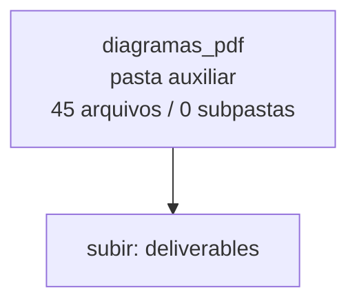

<!-- IA_NAVIGACAO:GERADO_AUTO:v1 -->
# Mapa IA - diagramas_pdf

Atualizado automaticamente em: **2026-08-05 13:55:48 -0300**

- Caminho: `C:\Users\IgorPC\.claude\projects\Escritório fabio osório\fabricas de melhoria de petições\_FORJA_HARNESS\.planning\refactor\deliverables\diagramas_pdf`
- Tipo: **pasta auxiliar**
- Função para navegação: conteúdo auxiliar ou residual
- Conteúdo recursivo: **45 arquivos**, **0 subpastas**, **3.6 MB**
- Tipos de arquivo: .svg: 20, .emf: 17, .mmd: 7, .json: 1
- Mapa raiz: [MAPA_IA.md](<../../../../../MAPA_IA.md>)
- Índice geral: [INDICE_GERAL_IA.md](<../../../../../00_IA_NAVIGACAO/INDICE_GERAL_IA.md>)
- Protocolo de navegação: [PROTOCOLO_NAVEGACAO_IA.md](<../../../../../00_IA_NAVIGACAO/PROTOCOLO_NAVEGACAO_IA.md>)
- Inventário JSON para agentes: [inventario_ia.json](<../../../../../00_IA_NAVIGACAO/dados/inventario_ia.json>)
- Mapa superior: [deliverables](<../MAPA_IA.md>)

## GPS Mermaid

## Ordem de leitura recomendada

1. Ler este `MAPA_IA.md` antes de abrir arquivos pesados.
2. Subir para a raiz se precisar das regras globais `AGENTS.md`, `CLAUDE.md` e `_LEIS_GERAIS`.

## Subpastas diretas

_Sem subpastas diretas._

## Arquivos diretos

| Arquivo | Papel | Tamanho | Modificado | Observação |
|---|---:|---:|---:|---|
| [A01.emf](<A01.emf>) | imagem/visual | 102.9 KB | 2026-07-15 19:31 | imagem ou elemento visual |
| [A01.svg](<A01.svg>) | imagem/visual | 14.8 KB | 2026-07-15 19:21 | imagem ou elemento visual |
| [A01_word.svg](<A01_word.svg>) | imagem/visual | 16.5 KB | 2026-07-15 19:31 | imagem ou elemento visual |
| [A02.emf](<A02.emf>) | imagem/visual | 166.5 KB | 2026-07-15 19:31 | imagem ou elemento visual |
| [A02.svg](<A02.svg>) | imagem/visual | 14.8 KB | 2026-07-15 19:21 | imagem ou elemento visual |
| [A02_word.svg](<A02_word.svg>) | imagem/visual | 16.7 KB | 2026-07-15 19:31 | imagem ou elemento visual |
| [A03.emf](<A03.emf>) | imagem/visual | 111.1 KB | 2026-07-15 19:31 | imagem ou elemento visual |
| [A03.svg](<A03.svg>) | imagem/visual | 13.2 KB | 2026-07-15 19:21 | imagem ou elemento visual |
| [A03_word.svg](<A03_word.svg>) | imagem/visual | 15.3 KB | 2026-07-15 19:31 | imagem ou elemento visual |
| [D01.emf](<D01.emf>) | imagem/visual | 203.5 KB | 2026-07-15 19:31 | imagem ou elemento visual |
| [D01_word.svg](<D01_word.svg>) | imagem/visual | 21.2 KB | 2026-07-15 19:31 | imagem ou elemento visual |
| [D06.emf](<D06.emf>) | imagem/visual | 197.7 KB | 2026-07-15 19:31 | imagem ou elemento visual |
| [D06_word.svg](<D06_word.svg>) | imagem/visual | 20.5 KB | 2026-07-15 19:31 | imagem ou elemento visual |
| [D09.emf](<D09.emf>) | imagem/visual | 261.1 KB | 2026-07-15 19:31 | imagem ou elemento visual |
| [D09_word.svg](<D09_word.svg>) | imagem/visual | 19.7 KB | 2026-07-15 19:31 | imagem ou elemento visual |
| [D10.emf](<D10.emf>) | imagem/visual | 169.3 KB | 2026-07-15 19:31 | imagem ou elemento visual |
| [D10_word.svg](<D10_word.svg>) | imagem/visual | 18.8 KB | 2026-07-15 19:31 | imagem ou elemento visual |
| [D11.emf](<D11.emf>) | imagem/visual | 164.5 KB | 2026-07-15 19:31 | imagem ou elemento visual |
| [D11_word.svg](<D11_word.svg>) | imagem/visual | 22.8 KB | 2026-07-15 19:31 | imagem ou elemento visual |
| [D12.emf](<D12.emf>) | imagem/visual | 250.9 KB | 2026-07-15 19:31 | imagem ou elemento visual |
| [D12_word.svg](<D12_word.svg>) | imagem/visual | 26.5 KB | 2026-07-15 19:31 | imagem ou elemento visual |
| [D13.emf](<D13.emf>) | imagem/visual | 169.7 KB | 2026-07-15 19:31 | imagem ou elemento visual |
| [D13_word.svg](<D13_word.svg>) | imagem/visual | 19.4 KB | 2026-07-15 19:31 | imagem ou elemento visual |
| [D14.emf](<D14.emf>) | imagem/visual | 142.8 KB | 2026-07-15 19:31 | imagem ou elemento visual |
| [D14_word.svg](<D14_word.svg>) | imagem/visual | 15.2 KB | 2026-07-15 19:31 | imagem ou elemento visual |
| [D18.emf](<D18.emf>) | imagem/visual | 209.5 KB | 2026-07-15 19:31 | imagem ou elemento visual |
| [D18_word.svg](<D18_word.svg>) | imagem/visual | 22.3 KB | 2026-07-15 19:31 | imagem ou elemento visual |
| [D19.emf](<D19.emf>) | imagem/visual | 229.1 KB | 2026-07-15 19:31 | imagem ou elemento visual |
| [D19_word.svg](<D19_word.svg>) | imagem/visual | 19.0 KB | 2026-07-15 19:31 | imagem ou elemento visual |
| [S01.emf](<S01.emf>) | imagem/visual | 314.4 KB | 2026-07-15 19:31 | imagem ou elemento visual |
| [S01_word.svg](<S01_word.svg>) | imagem/visual | 21.0 KB | 2026-07-15 19:31 | imagem ou elemento visual |
| [S02.emf](<S02.emf>) | imagem/visual | 207.2 KB | 2026-07-15 19:31 | imagem ou elemento visual |
| [S02_word.svg](<S02_word.svg>) | imagem/visual | 21.9 KB | 2026-07-15 19:31 | imagem ou elemento visual |
| [S13.emf](<S13.emf>) | imagem/visual | 160.7 KB | 2026-07-15 19:31 | imagem ou elemento visual |
| [S13_word.svg](<S13_word.svg>) | imagem/visual | 18.3 KB | 2026-07-15 19:31 | imagem ou elemento visual |
| [S14.emf](<S14.emf>) | imagem/visual | 288.3 KB | 2026-07-15 19:31 | imagem ou elemento visual |
| [S14_word.svg](<S14_word.svg>) | imagem/visual | 25.9 KB | 2026-07-15 19:31 | imagem ou elemento visual |
| [mermaid_word_config.json](<mermaid_word_config.json>) | dados/script | 412 B | 2026-07-15 19:31 | dado estruturado ou rotina técnica |
| [A01.mmd](<A01.mmd>) | outro | 169 B | 2026-07-15 19:31 | arquivo não classificado automaticamente |
| [A02.mmd](<A02.mmd>) | outro | 211 B | 2026-07-15 19:31 | arquivo não classificado automaticamente |
| [A03.mmd](<A03.mmd>) | outro | 178 B | 2026-07-15 19:31 | arquivo não classificado automaticamente |
| [D06_compact.mmd](<D06_compact.mmd>) | outro | 260 B | 2026-07-15 19:31 | arquivo não classificado automaticamente |
| [D10_compact.mmd](<D10_compact.mmd>) | outro | 219 B | 2026-07-15 19:31 | arquivo não classificado automaticamente |
| [D13_compact.mmd](<D13_compact.mmd>) | outro | 242 B | 2026-07-15 19:31 | arquivo não classificado automaticamente |
| [S02_compact.mmd](<S02_compact.mmd>) | outro | 277 B | 2026-07-15 19:31 | arquivo não classificado automaticamente |

## Leitura por papel

- **imagem/visual**: [A01.emf](<A01.emf>), [A01.svg](<A01.svg>), [A01_word.svg](<A01_word.svg>), [A02.emf](<A02.emf>), [A02.svg](<A02.svg>), [A02_word.svg](<A02_word.svg>), [A03.emf](<A03.emf>), [A03.svg](<A03.svg>), [A03_word.svg](<A03_word.svg>), [D01.emf](<D01.emf>), [D01_word.svg](<D01_word.svg>), [D06.emf](<D06.emf>), [D06_word.svg](<D06_word.svg>), [D09.emf](<D09.emf>), [D09_word.svg](<D09_word.svg>), [D10.emf](<D10.emf>), [D10_word.svg](<D10_word.svg>), [D11.emf](<D11.emf>), [D11_word.svg](<D11_word.svg>), [D12.emf](<D12.emf>), [D12_word.svg](<D12_word.svg>), [D13.emf](<D13.emf>), [D13_word.svg](<D13_word.svg>), [D14.emf](<D14.emf>), [D14_word.svg](<D14_word.svg>), [D18.emf](<D18.emf>), [D18_word.svg](<D18_word.svg>), [D19.emf](<D19.emf>), [D19_word.svg](<D19_word.svg>), [S01.emf](<S01.emf>), [S01_word.svg](<S01_word.svg>), [S02.emf](<S02.emf>), [S02_word.svg](<S02_word.svg>), [S13.emf](<S13.emf>), [S13_word.svg](<S13_word.svg>), [S14.emf](<S14.emf>), [S14_word.svg](<S14_word.svg>)
- **dados/script**: [mermaid_word_config.json](<mermaid_word_config.json>)
- **outro**: [A01.mmd](<A01.mmd>), [A02.mmd](<A02.mmd>), [A03.mmd](<A03.mmd>), [D06_compact.mmd](<D06_compact.mmd>), [D10_compact.mmd](<D10_compact.mmd>), [D13_compact.mmd](<D13_compact.mmd>), [S02_compact.mmd](<S02_compact.mmd>)

## Observações anti-alucinação

- Este mapa classifica por nomes, extensões e posição na árvore; não substitui leitura de fonte primária.
- Fato, citação, ID processual, prazo e jurisprudência só entram em peça depois de conferência no arquivo-fonte ou fonte oficial.
- Se a pasta tiver regimento, a peça deve refletir o regimento vigente na data do protocolo.
