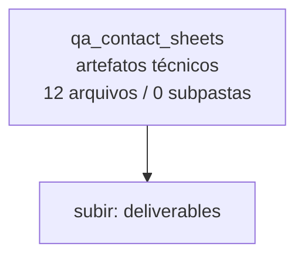

<!-- IA_NAVIGACAO:GERADO_AUTO:v1 -->
# Mapa IA - qa_contact_sheets

Atualizado automaticamente em: **2026-08-05 13:55:48 -0300**

- Caminho: `C:\Users\IgorPC\.claude\projects\Escritório fabio osório\fabricas de melhoria de petições\_FORJA_HARNESS\.planning\refactor\deliverables\qa_contact_sheets`
- Tipo: **artefatos técnicos**
- Função para navegação: build, extração ou QA; ler só quando precisar validar entrega
- Conteúdo recursivo: **12 arquivos**, **0 subpastas**, **7.9 MB**
- Tipos de arquivo: .png: 12
- Mapa raiz: [MAPA_IA.md](<../../../../../MAPA_IA.md>)
- Índice geral: [INDICE_GERAL_IA.md](<../../../../../00_IA_NAVIGACAO/INDICE_GERAL_IA.md>)
- Protocolo de navegação: [PROTOCOLO_NAVEGACAO_IA.md](<../../../../../00_IA_NAVIGACAO/PROTOCOLO_NAVEGACAO_IA.md>)
- Inventário JSON para agentes: [inventario_ia.json](<../../../../../00_IA_NAVIGACAO/dados/inventario_ia.json>)
- Mapa superior: [deliverables](<../MAPA_IA.md>)

## GPS Mermaid

## Ordem de leitura recomendada

1. Ler este `MAPA_IA.md` antes de abrir arquivos pesados.
2. Subir para a raiz se precisar das regras globais `AGENTS.md`, `CLAUDE.md` e `_LEIS_GERAIS`.
3. Usar builds, renders e QA apenas para validar entrega ou rastrear geração; não começar por eles.

## Subpastas diretas

_Sem subpastas diretas._

## Arquivos diretos

| Arquivo | Papel | Tamanho | Modificado | Observação |
|---|---:|---:|---:|---|
| [contact_01.png](<contact_01.png>) | artefato técnico | 435.2 KB | 2026-07-15 19:32 | imagem/render de QA ou build |
| [contact_02.png](<contact_02.png>) | artefato técnico | 1.0 MB | 2026-07-15 19:32 | imagem/render de QA ou build |
| [contact_03.png](<contact_03.png>) | artefato técnico | 895.8 KB | 2026-07-15 19:32 | imagem/render de QA ou build |
| [contact_04.png](<contact_04.png>) | artefato técnico | 977.7 KB | 2026-07-15 19:32 | imagem/render de QA ou build |
| [contact_05.png](<contact_05.png>) | artefato técnico | 924.7 KB | 2026-07-15 19:32 | imagem/render de QA ou build |
| [contact_06.png](<contact_06.png>) | artefato técnico | 842.0 KB | 2026-07-15 19:32 | imagem/render de QA ou build |
| [contact_07.png](<contact_07.png>) | artefato técnico | 678.3 KB | 2026-07-15 19:32 | imagem/render de QA ou build |
| [contact_08.png](<contact_08.png>) | artefato técnico | 1.1 MB | 2026-07-15 19:32 | imagem/render de QA ou build |
| [contact_09.png](<contact_09.png>) | artefato técnico | 413.7 KB | 2026-07-15 19:32 | imagem/render de QA ou build |
| [contact_10.png](<contact_10.png>) | artefato técnico | 274.1 KB | 2026-07-15 19:32 | imagem/render de QA ou build |
| [contact_11.png](<contact_11.png>) | artefato técnico | 238.1 KB | 2026-07-15 19:32 | imagem/render de QA ou build |
| [contact_12.png](<contact_12.png>) | artefato técnico | 299.3 KB | 2026-07-15 19:32 | imagem/render de QA ou build |

## Leitura por papel

- **artefato técnico**: [contact_01.png](<contact_01.png>), [contact_02.png](<contact_02.png>), [contact_03.png](<contact_03.png>), [contact_04.png](<contact_04.png>), [contact_05.png](<contact_05.png>), [contact_06.png](<contact_06.png>), [contact_07.png](<contact_07.png>), [contact_08.png](<contact_08.png>), [contact_09.png](<contact_09.png>), [contact_10.png](<contact_10.png>), [contact_11.png](<contact_11.png>), [contact_12.png](<contact_12.png>)

## Observações anti-alucinação

- Este mapa classifica por nomes, extensões e posição na árvore; não substitui leitura de fonte primária.
- Fato, citação, ID processual, prazo e jurisprudência só entram em peça depois de conferência no arquivo-fonte ou fonte oficial.
- Se a pasta tiver regimento, a peça deve refletir o regimento vigente na data do protocolo.
