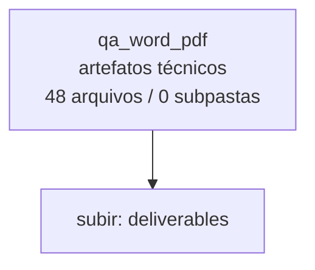

<!-- IA_NAVIGACAO:GERADO_AUTO:v1 -->
# Mapa IA - qa_word_pdf

Atualizado automaticamente em: **2026-08-05 13:55:48 -0300**

- Caminho: `C:\Users\IgorPC\.claude\projects\Escritório fabio osório\fabricas de melhoria de petições\_FORJA_HARNESS\.planning\refactor\deliverables\qa_word_pdf`
- Tipo: **artefatos técnicos**
- Função para navegação: build, extração ou QA; ler só quando precisar validar entrega
- Conteúdo recursivo: **48 arquivos**, **0 subpastas**, **6.3 MB**
- Tipos de arquivo: .png: 48
- Mapa raiz: [MAPA_IA.md](<../../../../../MAPA_IA.md>)
- Índice geral: [INDICE_GERAL_IA.md](<../../../../../00_IA_NAVIGACAO/INDICE_GERAL_IA.md>)
- Protocolo de navegação: [PROTOCOLO_NAVEGACAO_IA.md](<../../../../../00_IA_NAVIGACAO/PROTOCOLO_NAVEGACAO_IA.md>)
- Inventário JSON para agentes: [inventario_ia.json](<../../../../../00_IA_NAVIGACAO/dados/inventario_ia.json>)
- Mapa superior: [deliverables](<../MAPA_IA.md>)

## GPS Mermaid

## Ordem de leitura recomendada

1. Ler este `MAPA_IA.md` antes de abrir arquivos pesados.
2. Subir para a raiz se precisar das regras globais `AGENTS.md`, `CLAUDE.md` e `_LEIS_GERAIS`.
3. Usar builds, renders e QA apenas para validar entrega ou rastrear geração; não começar por eles.

## Subpastas diretas

_Sem subpastas diretas._

## Arquivos diretos

| Arquivo | Papel | Tamanho | Modificado | Observação |
|---|---:|---:|---:|---|
| [p01.png](<p01.png>) | artefato técnico | 103.6 KB | 2026-07-15 19:32 | imagem/render de QA ou build |
| [p02.png](<p02.png>) | artefato técnico | 113.8 KB | 2026-07-15 19:32 | imagem/render de QA ou build |
| [p03.png](<p03.png>) | artefato técnico | 91.8 KB | 2026-07-15 19:32 | imagem/render de QA ou build |
| [p04.png](<p04.png>) | artefato técnico | 48.7 KB | 2026-07-15 19:32 | imagem/render de QA ou build |
| [p05.png](<p05.png>) | artefato técnico | 229.2 KB | 2026-07-15 19:32 | imagem/render de QA ou build |
| [p06.png](<p06.png>) | artefato técnico | 119.5 KB | 2026-07-15 19:32 | imagem/render de QA ou build |
| [p07.png](<p07.png>) | artefato técnico | 209.1 KB | 2026-07-15 19:32 | imagem/render de QA ou build |
| [p08.png](<p08.png>) | artefato técnico | 230.6 KB | 2026-07-15 19:32 | imagem/render de QA ou build |
| [p09.png](<p09.png>) | artefato técnico | 211.3 KB | 2026-07-15 19:32 | imagem/render de QA ou build |
| [p10.png](<p10.png>) | artefato técnico | 226.3 KB | 2026-07-15 19:32 | imagem/render de QA ou build |
| [p11.png](<p11.png>) | artefato técnico | 125.1 KB | 2026-07-15 19:32 | imagem/render de QA ou build |
| [p12.png](<p12.png>) | artefato técnico | 143.9 KB | 2026-07-15 19:32 | imagem/render de QA ou build |
| [p13.png](<p13.png>) | artefato técnico | 201.9 KB | 2026-07-15 19:32 | imagem/render de QA ou build |
| [p14.png](<p14.png>) | artefato técnico | 163.7 KB | 2026-07-15 19:32 | imagem/render de QA ou build |
| [p15.png](<p15.png>) | artefato técnico | 199.9 KB | 2026-07-15 19:32 | imagem/render de QA ou build |
| [p16.png](<p16.png>) | artefato técnico | 199.1 KB | 2026-07-15 19:32 | imagem/render de QA ou build |
| [p17.png](<p17.png>) | artefato técnico | 176.8 KB | 2026-07-15 19:32 | imagem/render de QA ou build |
| [p18.png](<p18.png>) | artefato técnico | 195.2 KB | 2026-07-15 19:32 | imagem/render de QA ou build |
| [p19.png](<p19.png>) | artefato técnico | 172.3 KB | 2026-07-15 19:32 | imagem/render de QA ou build |
| [p20.png](<p20.png>) | artefato técnico | 182.7 KB | 2026-07-15 19:32 | imagem/render de QA ou build |
| [p21.png](<p21.png>) | artefato técnico | 177.9 KB | 2026-07-15 19:32 | imagem/render de QA ou build |
| [p22.png](<p22.png>) | artefato técnico | 195.0 KB | 2026-07-15 19:32 | imagem/render de QA ou build |
| [p23.png](<p23.png>) | artefato técnico | 75.4 KB | 2026-07-15 19:32 | imagem/render de QA ou build |
| [p24.png](<p24.png>) | artefato técnico | 220.1 KB | 2026-07-15 19:32 | imagem/render de QA ou build |
| [p25.png](<p25.png>) | artefato técnico | 161.4 KB | 2026-07-15 19:32 | imagem/render de QA ou build |
| [p26.png](<p26.png>) | artefato técnico | 53.8 KB | 2026-07-15 19:32 | imagem/render de QA ou build |
| [p27.png](<p27.png>) | artefato técnico | 171.0 KB | 2026-07-15 19:32 | imagem/render de QA ou build |
| [p28.png](<p28.png>) | artefato técnico | 166.9 KB | 2026-07-15 19:32 | imagem/render de QA ou build |
| [p29.png](<p29.png>) | artefato técnico | 172.3 KB | 2026-07-15 19:32 | imagem/render de QA ou build |
| [p30.png](<p30.png>) | artefato técnico | 232.4 KB | 2026-07-15 19:32 | imagem/render de QA ou build |
| [p31.png](<p31.png>) | artefato técnico | 229.3 KB | 2026-07-15 19:32 | imagem/render de QA ou build |
| [p32.png](<p32.png>) | artefato técnico | 245.0 KB | 2026-07-15 19:32 | imagem/render de QA ou build |
| [p33.png](<p33.png>) | artefato técnico | 113.1 KB | 2026-07-15 19:32 | imagem/render de QA ou build |
| [p34.png](<p34.png>) | artefato técnico | 105.8 KB | 2026-07-15 19:32 | imagem/render de QA ou build |
| [p35.png](<p35.png>) | artefato técnico | 63.1 KB | 2026-07-15 19:32 | imagem/render de QA ou build |
| [p36.png](<p36.png>) | artefato técnico | 60.3 KB | 2026-07-15 19:32 | imagem/render de QA ou build |
| [p37.png](<p37.png>) | artefato técnico | 57.8 KB | 2026-07-15 19:32 | imagem/render de QA ou build |
| [p38.png](<p38.png>) | artefato técnico | 73.2 KB | 2026-07-15 19:32 | imagem/render de QA ou build |
| [p39.png](<p39.png>) | artefato técnico | 55.7 KB | 2026-07-15 19:32 | imagem/render de QA ou build |
| [p40.png](<p40.png>) | artefato técnico | 54.0 KB | 2026-07-15 19:32 | imagem/render de QA ou build |
| [p41.png](<p41.png>) | artefato técnico | 57.8 KB | 2026-07-15 19:32 | imagem/render de QA ou build |
| [p42.png](<p42.png>) | artefato técnico | 53.0 KB | 2026-07-15 19:32 | imagem/render de QA ou build |
| [p43.png](<p43.png>) | artefato técnico | 43.9 KB | 2026-07-15 19:32 | imagem/render de QA ou build |
| [p44.png](<p44.png>) | artefato técnico | 58.2 KB | 2026-07-15 19:32 | imagem/render de QA ou build |
| [p45.png](<p45.png>) | artefato técnico | 65.9 KB | 2026-07-15 19:32 | imagem/render de QA ou build |
| [p46.png](<p46.png>) | artefato técnico | 50.1 KB | 2026-07-15 19:32 | imagem/render de QA ou build |
| [p47.png](<p47.png>) | artefato técnico | 64.6 KB | 2026-07-15 19:32 | imagem/render de QA ou build |
| [p48.png](<p48.png>) | artefato técnico | 73.4 KB | 2026-07-15 19:32 | imagem/render de QA ou build |

## Leitura por papel

- **artefato técnico**: [p01.png](<p01.png>), [p02.png](<p02.png>), [p03.png](<p03.png>), [p04.png](<p04.png>), [p05.png](<p05.png>), [p06.png](<p06.png>), [p07.png](<p07.png>), [p08.png](<p08.png>), [p09.png](<p09.png>), [p10.png](<p10.png>), [p11.png](<p11.png>), [p12.png](<p12.png>), [p13.png](<p13.png>), [p14.png](<p14.png>), [p15.png](<p15.png>), [p16.png](<p16.png>), [p17.png](<p17.png>), [p18.png](<p18.png>), [p19.png](<p19.png>), [p20.png](<p20.png>), [p21.png](<p21.png>), [p22.png](<p22.png>), [p23.png](<p23.png>), [p24.png](<p24.png>), [p25.png](<p25.png>), [p26.png](<p26.png>), [p27.png](<p27.png>), [p28.png](<p28.png>), [p29.png](<p29.png>), [p30.png](<p30.png>), [p31.png](<p31.png>), [p32.png](<p32.png>), [p33.png](<p33.png>), [p34.png](<p34.png>), [p35.png](<p35.png>), [p36.png](<p36.png>), [p37.png](<p37.png>), [p38.png](<p38.png>), [p39.png](<p39.png>), [p40.png](<p40.png>), [p41.png](<p41.png>), [p42.png](<p42.png>), [p43.png](<p43.png>), [p44.png](<p44.png>), [p45.png](<p45.png>), [p46.png](<p46.png>), [p47.png](<p47.png>), [p48.png](<p48.png>)

## Observações anti-alucinação

- Este mapa classifica por nomes, extensões e posição na árvore; não substitui leitura de fonte primária.
- Fato, citação, ID processual, prazo e jurisprudência só entram em peça depois de conferência no arquivo-fonte ou fonte oficial.
- Se a pasta tiver regimento, a peça deve refletir o regimento vigente na data do protocolo.
