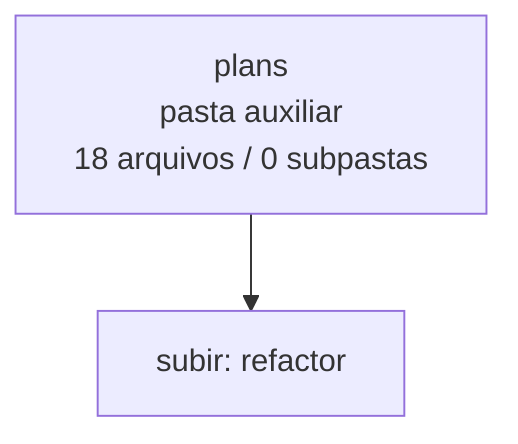

<!-- IA_NAVIGACAO:GERADO_AUTO:v1 -->
# Mapa IA - plans

Atualizado automaticamente em: **2026-08-05 13:33:35 -0300**

- Caminho: `C:\Users\IgorPC\.claude\projects\Escritório fabio osório\fabricas de melhoria de petições\_FORJA_HARNESS\.planning\refactor\plans`
- Tipo: **pasta auxiliar**
- Função para navegação: conteúdo auxiliar ou residual
- Conteúdo recursivo: **18 arquivos**, **0 subpastas**, **55.1 KB**
- Tipos de arquivo: .md: 18
- Mapa raiz: [MAPA_IA.md](<../../../../MAPA_IA.md>)
- Índice geral: [INDICE_GERAL_IA.md](<../../../../00_IA_NAVIGACAO/INDICE_GERAL_IA.md>)
- Protocolo de navegação: [PROTOCOLO_NAVEGACAO_IA.md](<../../../../00_IA_NAVIGACAO/PROTOCOLO_NAVEGACAO_IA.md>)
- Inventário JSON para agentes: [inventario_ia.json](<../../../../00_IA_NAVIGACAO/dados/inventario_ia.json>)
- Mapa superior: [refactor](<../MAPA_IA.md>)

## GPS Mermaid

## Ordem de leitura recomendada

1. Ler este `MAPA_IA.md` antes de abrir arquivos pesados.
2. Subir para a raiz se precisar das regras globais `AGENTS.md`, `CLAUDE.md` e `_LEIS_GERAIS`.
3. Usar builds, renders e QA apenas para validar entrega ou rastrear geração; não começar por eles.

## Subpastas diretas

_Sem subpastas diretas._

## Arquivos diretos

| Arquivo | Papel | Tamanho | Modificado | Observação |
|---|---:|---:|---:|---|
| [P11-RENDER-PIPELINE-PLAN.md](<P11-RENDER-PIPELINE-PLAN.md>) | artefato técnico | 3.1 KB | 2026-07-15 19:14 | artefato técnico gerado |
| [P00-BASELINE-PLAN.md](<P00-BASELINE-PLAN.md>) | outro | 4.1 KB | 2026-07-15 19:14 | arquivo não classificado automaticamente |
| [P01-TEST-DISCOVERY-PLAN.md](<P01-TEST-DISCOVERY-PLAN.md>) | outro | 3.3 KB | 2026-07-15 19:02 | arquivo não classificado automaticamente |
| [P02-REGIMENTO-PLAN.md](<P02-REGIMENTO-PLAN.md>) | outro | 3.0 KB | 2026-07-15 19:14 | arquivo não classificado automaticamente |
| [P03-CITATION-PLAN.md](<P03-CITATION-PLAN.md>) | outro | 2.8 KB | 2026-07-15 19:02 | arquivo não classificado automaticamente |
| [P04-INJECTION-PLAN.md](<P04-INJECTION-PLAN.md>) | outro | 2.7 KB | 2026-07-15 19:02 | arquivo não classificado automaticamente |
| [P05-ENVIRONMENT-PLAN.md](<P05-ENVIRONMENT-PLAN.md>) | outro | 2.5 KB | 2026-07-15 19:02 | arquivo não classificado automaticamente |
| [P06-CORE-FACADE-PLAN.md](<P06-CORE-FACADE-PLAN.md>) | outro | 2.8 KB | 2026-07-15 19:03 | arquivo não classificado automaticamente |
| [P07-CATALOGS-PLAN.md](<P07-CATALOGS-PLAN.md>) | outro | 3.5 KB | 2026-07-15 19:14 | arquivo não classificado automaticamente |
| [P08-STATE-PROMOTION-PLAN.md](<P08-STATE-PROMOTION-PLAN.md>) | outro | 3.0 KB | 2026-07-15 19:03 | arquivo não classificado automaticamente |
| [P09-DELIVERY-IDENTITY-PLAN.md](<P09-DELIVERY-IDENTITY-PLAN.md>) | outro | 2.7 KB | 2026-07-15 19:03 | arquivo não classificado automaticamente |
| [P10-MANAGEMENT-OUTBOX-PLAN.md](<P10-MANAGEMENT-OUTBOX-PLAN.md>) | outro | 2.8 KB | 2026-07-15 19:03 | arquivo não classificado automaticamente |
| [P12-VALIDATION-PIPELINE-PLAN.md](<P12-VALIDATION-PIPELINE-PLAN.md>) | outro | 2.9 KB | 2026-07-15 19:04 | arquivo não classificado automaticamente |
| [P13A-CLI-FRAMEWORK-PLAN.md](<P13A-CLI-FRAMEWORK-PLAN.md>) | outro | 2.1 KB | 2026-07-15 19:14 | arquivo não classificado automaticamente |
| [P13B-CLI-WRAPPERS-PLAN.md](<P13B-CLI-WRAPPERS-PLAN.md>) | outro | 2.4 KB | 2026-07-15 19:14 | arquivo não classificado automaticamente |
| [P14-PHYSICAL-SANITIZATION-PLAN.md](<P14-PHYSICAL-SANITIZATION-PLAN.md>) | outro | 5.5 KB | 2026-07-16 23:24 | arquivo não classificado automaticamente |
| [P15-LIVE-ATLAS-PLAN.md](<P15-LIVE-ATLAS-PLAN.md>) | outro | 2.5 KB | 2026-07-15 19:04 | arquivo não classificado automaticamente |
| [P16-REPLAY-CUTOVER-PLAN.md](<P16-REPLAY-CUTOVER-PLAN.md>) | outro | 3.5 KB | 2026-07-15 19:15 | arquivo não classificado automaticamente |

## Leitura por papel

- **artefato técnico**: [P11-RENDER-PIPELINE-PLAN.md](<P11-RENDER-PIPELINE-PLAN.md>)
- **outro**: [P00-BASELINE-PLAN.md](<P00-BASELINE-PLAN.md>), [P01-TEST-DISCOVERY-PLAN.md](<P01-TEST-DISCOVERY-PLAN.md>), [P02-REGIMENTO-PLAN.md](<P02-REGIMENTO-PLAN.md>), [P03-CITATION-PLAN.md](<P03-CITATION-PLAN.md>), [P04-INJECTION-PLAN.md](<P04-INJECTION-PLAN.md>), [P05-ENVIRONMENT-PLAN.md](<P05-ENVIRONMENT-PLAN.md>), [P06-CORE-FACADE-PLAN.md](<P06-CORE-FACADE-PLAN.md>), [P07-CATALOGS-PLAN.md](<P07-CATALOGS-PLAN.md>), [P08-STATE-PROMOTION-PLAN.md](<P08-STATE-PROMOTION-PLAN.md>), [P09-DELIVERY-IDENTITY-PLAN.md](<P09-DELIVERY-IDENTITY-PLAN.md>), [P10-MANAGEMENT-OUTBOX-PLAN.md](<P10-MANAGEMENT-OUTBOX-PLAN.md>), [P12-VALIDATION-PIPELINE-PLAN.md](<P12-VALIDATION-PIPELINE-PLAN.md>), [P13A-CLI-FRAMEWORK-PLAN.md](<P13A-CLI-FRAMEWORK-PLAN.md>), [P13B-CLI-WRAPPERS-PLAN.md](<P13B-CLI-WRAPPERS-PLAN.md>), [P14-PHYSICAL-SANITIZATION-PLAN.md](<P14-PHYSICAL-SANITIZATION-PLAN.md>), [P15-LIVE-ATLAS-PLAN.md](<P15-LIVE-ATLAS-PLAN.md>), [P16-REPLAY-CUTOVER-PLAN.md](<P16-REPLAY-CUTOVER-PLAN.md>)

## Observações anti-alucinação

- Este mapa classifica por nomes, extensões e posição na árvore; não substitui leitura de fonte primária.
- Fato, citação, ID processual, prazo e jurisprudência só entram em peça depois de conferência no arquivo-fonte ou fonte oficial.
- Se a pasta tiver regimento, a peça deve refletir o regimento vigente na data do protocolo.
