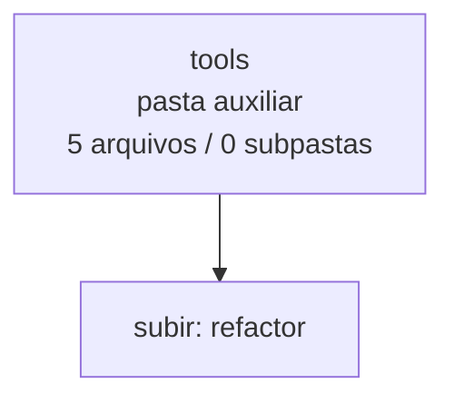

<!-- IA_NAVIGACAO:GERADO_AUTO:v1 -->
# Mapa IA - tools

Atualizado automaticamente em: **2026-08-05 13:33:35 -0300**

- Caminho: `C:\Users\IgorPC\.claude\projects\Escritório fabio osório\fabricas de melhoria de petições\_FORJA_HARNESS\.planning\refactor\tools`
- Tipo: **pasta auxiliar**
- Função para navegação: conteúdo auxiliar ou residual
- Conteúdo recursivo: **5 arquivos**, **0 subpastas**, **47.9 KB**
- Tipos de arquivo: .py: 5
- Mapa raiz: [MAPA_IA.md](<../../../../MAPA_IA.md>)
- Índice geral: [INDICE_GERAL_IA.md](<../../../../00_IA_NAVIGACAO/INDICE_GERAL_IA.md>)
- Protocolo de navegação: [PROTOCOLO_NAVEGACAO_IA.md](<../../../../00_IA_NAVIGACAO/PROTOCOLO_NAVEGACAO_IA.md>)
- Inventário JSON para agentes: [inventario_ia.json](<../../../../00_IA_NAVIGACAO/dados/inventario_ia.json>)
- Mapa superior: [refactor](<../MAPA_IA.md>)

## GPS Mermaid

## Ordem de leitura recomendada

1. Ler este `MAPA_IA.md` antes de abrir arquivos pesados.
2. Subir para a raiz se precisar das regras globais `AGENTS.md`, `CLAUDE.md` e `_LEIS_GERAIS`.

## Subpastas diretas

_Sem subpastas diretas._

## Arquivos diretos

| Arquivo | Papel | Tamanho | Modificado | Observação |
|---|---:|---:|---:|---|
| [build_master_report.py](<build_master_report.py>) | dados/script | 29.6 KB | 2026-07-15 19:31 | dado estruturado ou rotina técnica |
| [generate_hash_manifest.py](<generate_hash_manifest.py>) | dados/script | 1.3 KB | 2026-07-15 19:33 | dado estruturado ou rotina técnica |
| [qa_master_report.py](<qa_master_report.py>) | dados/script | 5.2 KB | 2026-07-15 19:21 | dado estruturado ou rotina técnica |
| [render_mermaid_atlas.py](<render_mermaid_atlas.py>) | dados/script | 2.4 KB | 2026-07-15 19:06 | dado estruturado ou rotina técnica |
| [validate_refactor_plan.py](<validate_refactor_plan.py>) | dados/script | 9.3 KB | 2026-07-15 19:17 | dado estruturado ou rotina técnica |

## Leitura por papel

- **dados/script**: [build_master_report.py](<build_master_report.py>), [generate_hash_manifest.py](<generate_hash_manifest.py>), [qa_master_report.py](<qa_master_report.py>), [render_mermaid_atlas.py](<render_mermaid_atlas.py>), [validate_refactor_plan.py](<validate_refactor_plan.py>)

## Observações anti-alucinação

- Este mapa classifica por nomes, extensões e posição na árvore; não substitui leitura de fonte primária.
- Fato, citação, ID processual, prazo e jurisprudência só entram em peça depois de conferência no arquivo-fonte ou fonte oficial.
- Se a pasta tiver regimento, a peça deve refletir o regimento vigente na data do protocolo.
