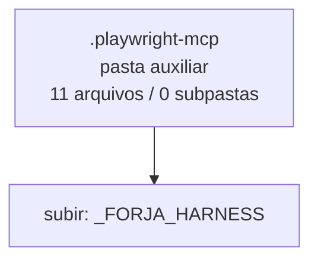

<!-- IA_NAVIGACAO:GERADO_AUTO:v1 -->
# Mapa IA - .playwright-mcp

Atualizado automaticamente em: **2026-08-05 13:56:09 -0300**

- Caminho: `C:\Users\IgorPC\.claude\projects\Escritório fabio osório\fabricas de melhoria de petições\_FORJA_HARNESS\.playwright-mcp`
- Tipo: **pasta auxiliar**
- Função para navegação: conteúdo auxiliar ou residual
- Conteúdo recursivo: **11 arquivos**, **0 subpastas**, **266.5 KB**
- Tipos de arquivo: .yml: 7, .png: 3, .log: 1
- Mapa raiz: [MAPA_IA.md](<../../MAPA_IA.md>)
- Índice geral: [INDICE_GERAL_IA.md](<../../00_IA_NAVIGACAO/INDICE_GERAL_IA.md>)
- Protocolo de navegação: [PROTOCOLO_NAVEGACAO_IA.md](<../../00_IA_NAVIGACAO/PROTOCOLO_NAVEGACAO_IA.md>)
- Inventário JSON para agentes: [inventario_ia.json](<../../00_IA_NAVIGACAO/dados/inventario_ia.json>)
- Mapa superior: [_FORJA_HARNESS](<../MAPA_IA.md>)

## GPS Mermaid

## Ordem de leitura recomendada

1. Ler este `MAPA_IA.md` antes de abrir arquivos pesados.
2. Subir para a raiz se precisar das regras globais `AGENTS.md`, `CLAUDE.md` e `_LEIS_GERAIS`.

## Subpastas diretas

_Sem subpastas diretas._

## Arquivos diretos

| Arquivo | Papel | Tamanho | Modificado | Observação |
|---|---:|---:|---:|---|
| [element-2026-07-12T13-37-57-397Z.png](<element-2026-07-12T13-37-57-397Z.png>) | imagem/visual | 18.8 KB | 2026-07-12 10:37 | imagem ou elemento visual |
| [element-2026-07-12T15-56-17-658Z.png](<element-2026-07-12T15-56-17-658Z.png>) | imagem/visual | 18.8 KB | 2026-07-12 12:56 | imagem ou elemento visual |
| [page-2026-07-12T13-38-06-750Z.png](<page-2026-07-12T13-38-06-750Z.png>) | imagem/visual | 153.0 KB | 2026-07-12 10:38 | imagem ou elemento visual |
| [console-2026-07-23T16-55-05-560Z.log](<console-2026-07-23T16-55-05-560Z.log>) | outro | 143 B | 2026-07-23 13:55 | arquivo não classificado automaticamente |
| [page-2026-07-12T13-32-07-718Z.yml](<page-2026-07-12T13-32-07-718Z.yml>) | outro | 8.4 KB | 2026-07-12 10:32 | arquivo não classificado automaticamente |
| [page-2026-07-12T13-36-42-671Z.yml](<page-2026-07-12T13-36-42-671Z.yml>) | outro | 8.4 KB | 2026-07-12 10:36 | arquivo não classificado automaticamente |
| [page-2026-07-12T15-52-47-627Z.yml](<page-2026-07-12T15-52-47-627Z.yml>) | outro | 9.8 KB | 2026-07-12 12:52 | arquivo não classificado automaticamente |
| [page-2026-07-12T17-12-05-770Z.yml](<page-2026-07-12T17-12-05-770Z.yml>) | outro | 8.5 KB | 2026-07-12 14:12 | arquivo não classificado automaticamente |
| [page-2026-07-23T16-55-06-081Z.yml](<page-2026-07-23T16-55-06-081Z.yml>) | outro | 13.4 KB | 2026-07-23 13:55 | arquivo não classificado automaticamente |
| [page-2026-07-23T16-57-18-964Z.yml](<page-2026-07-23T16-57-18-964Z.yml>) | outro | 13.7 KB | 2026-07-23 13:57 | arquivo não classificado automaticamente |
| [page-2026-07-23T16-59-38-987Z.yml](<page-2026-07-23T16-59-38-987Z.yml>) | outro | 13.6 KB | 2026-07-23 13:59 | arquivo não classificado automaticamente |

## Leitura por papel

- **imagem/visual**: [element-2026-07-12T13-37-57-397Z.png](<element-2026-07-12T13-37-57-397Z.png>), [element-2026-07-12T15-56-17-658Z.png](<element-2026-07-12T15-56-17-658Z.png>), [page-2026-07-12T13-38-06-750Z.png](<page-2026-07-12T13-38-06-750Z.png>)
- **outro**: [console-2026-07-23T16-55-05-560Z.log](<console-2026-07-23T16-55-05-560Z.log>), [page-2026-07-12T13-32-07-718Z.yml](<page-2026-07-12T13-32-07-718Z.yml>), [page-2026-07-12T13-36-42-671Z.yml](<page-2026-07-12T13-36-42-671Z.yml>), [page-2026-07-12T15-52-47-627Z.yml](<page-2026-07-12T15-52-47-627Z.yml>), [page-2026-07-12T17-12-05-770Z.yml](<page-2026-07-12T17-12-05-770Z.yml>), [page-2026-07-23T16-55-06-081Z.yml](<page-2026-07-23T16-55-06-081Z.yml>), [page-2026-07-23T16-57-18-964Z.yml](<page-2026-07-23T16-57-18-964Z.yml>), [page-2026-07-23T16-59-38-987Z.yml](<page-2026-07-23T16-59-38-987Z.yml>)

## Observações anti-alucinação

- Este mapa classifica por nomes, extensões e posição na árvore; não substitui leitura de fonte primária.
- Fato, citação, ID processual, prazo e jurisprudência só entram em peça depois de conferência no arquivo-fonte ou fonte oficial.
- Se a pasta tiver regimento, a peça deve refletir o regimento vigente na data do protocolo.
