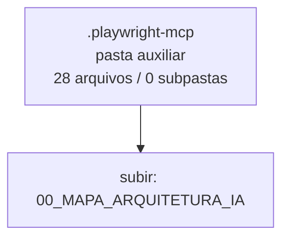

<!-- IA_NAVIGACAO:GERADO_AUTO:v1 -->
# Mapa IA - .playwright-mcp

Atualizado automaticamente em: **2026-08-05 13:56:04 -0300**

- Caminho: `C:\Users\IgorPC\.claude\projects\Escritório fabio osório\fabricas de melhoria de petições\_FORJA_HARNESS\00_MAPA_ARQUITETURA_IA\.playwright-mcp`
- Tipo: **pasta auxiliar**
- Função para navegação: conteúdo auxiliar ou residual
- Conteúdo recursivo: **28 arquivos**, **0 subpastas**, **1.7 MB**
- Tipos de arquivo: .yml: 15, .log: 11, .png: 2
- Mapa raiz: [MAPA_IA.md](<../../../MAPA_IA.md>)
- Índice geral: [INDICE_GERAL_IA.md](<../../../00_IA_NAVIGACAO/INDICE_GERAL_IA.md>)
- Protocolo de navegação: [PROTOCOLO_NAVEGACAO_IA.md](<../../../00_IA_NAVIGACAO/PROTOCOLO_NAVEGACAO_IA.md>)
- Inventário JSON para agentes: [inventario_ia.json](<../../../00_IA_NAVIGACAO/dados/inventario_ia.json>)
- Mapa superior: [00_MAPA_ARQUITETURA_IA](<../MAPA_IA.md>)

## GPS Mermaid

## Ordem de leitura recomendada

1. Ler este `MAPA_IA.md` antes de abrir arquivos pesados.
2. Subir para a raiz se precisar das regras globais `AGENTS.md`, `CLAUDE.md` e `_LEIS_GERAIS`.

## Subpastas diretas

_Sem subpastas diretas._

## Arquivos diretos

| Arquivo | Papel | Tamanho | Modificado | Observação |
|---|---:|---:|---:|---|
| [ddef3758-33e9-4ca3-8cfd-7acad668e631.png](<ddef3758-33e9-4ca3-8cfd-7acad668e631.png>) | imagem/visual | 737.7 KB | 2026-07-23 02:47 | imagem ou elemento visual |
| [forja-fabrica-o-de-peti-es-melhoria-cont-nua.png](<forja-fabrica-o-de-peti-es-melhoria-cont-nua.png>) | imagem/visual | 737.7 KB | 2026-07-23 02:46 | imagem ou elemento visual |
| [console-2026-07-23T04-29-58-830Z.log](<console-2026-07-23T04-29-58-830Z.log>) | outro | 143 B | 2026-07-23 01:30 | arquivo não classificado automaticamente |
| [console-2026-07-23T05-26-56-911Z.log](<console-2026-07-23T05-26-56-911Z.log>) | outro | 143 B | 2026-07-23 02:27 | arquivo não classificado automaticamente |
| [console-2026-07-23T05-41-02-275Z.log](<console-2026-07-23T05-41-02-275Z.log>) | outro | 143 B | 2026-07-23 02:41 | arquivo não classificado automaticamente |
| [console-2026-07-23T05-45-51-150Z.log](<console-2026-07-23T05-45-51-150Z.log>) | outro | 143 B | 2026-07-23 02:45 | arquivo não classificado automaticamente |
| [console-2026-07-23T17-15-04-366Z.log](<console-2026-07-23T17-15-04-366Z.log>) | outro | 143 B | 2026-07-23 14:15 | arquivo não classificado automaticamente |
| [console-2026-07-23T17-24-53-095Z.log](<console-2026-07-23T17-24-53-095Z.log>) | outro | 143 B | 2026-07-23 14:24 | arquivo não classificado automaticamente |
| [console-2026-07-23T17-39-07-687Z.log](<console-2026-07-23T17-39-07-687Z.log>) | outro | 143 B | 2026-07-23 14:39 | arquivo não classificado automaticamente |
| [console-2026-07-23T23-08-30-118Z.log](<console-2026-07-23T23-08-30-118Z.log>) | outro | 143 B | 2026-07-23 20:08 | arquivo não classificado automaticamente |
| [console-2026-07-24T02-11-06-073Z.log](<console-2026-07-24T02-11-06-073Z.log>) | outro | 299 B | 2026-07-23 23:11 | arquivo não classificado automaticamente |
| [console-2026-07-24T02-11-34-249Z.log](<console-2026-07-24T02-11-34-249Z.log>) | outro | 161 B | 2026-07-23 23:11 | arquivo não classificado automaticamente |
| [console-2026-07-24T02-11-58-879Z.log](<console-2026-07-24T02-11-58-879Z.log>) | outro | 143 B | 2026-07-23 23:11 | arquivo não classificado automaticamente |
| [page-2026-07-23T04-30-13-682Z.yml](<page-2026-07-23T04-30-13-682Z.yml>) | outro | 14.5 KB | 2026-07-23 01:30 | arquivo não classificado automaticamente |
| [page-2026-07-23T05-27-13-147Z.yml](<page-2026-07-23T05-27-13-147Z.yml>) | outro | 14.9 KB | 2026-07-23 02:27 | arquivo não classificado automaticamente |
| [page-2026-07-23T05-41-02-533Z.yml](<page-2026-07-23T05-41-02-533Z.yml>) | outro | 10.8 KB | 2026-07-23 02:41 | arquivo não classificado automaticamente |
| [page-2026-07-23T05-45-51-404Z.yml](<page-2026-07-23T05-45-51-404Z.yml>) | outro | 14.7 KB | 2026-07-23 02:45 | arquivo não classificado automaticamente |
| [page-2026-07-23T17-15-04-590Z.yml](<page-2026-07-23T17-15-04-590Z.yml>) | outro | 25.2 KB | 2026-07-23 14:15 | arquivo não classificado automaticamente |
| [page-2026-07-23T17-16-25-727Z.yml](<page-2026-07-23T17-16-25-727Z.yml>) | outro | 25.7 KB | 2026-07-23 14:16 | arquivo não classificado automaticamente |
| [page-2026-07-23T17-18-21-868Z.yml](<page-2026-07-23T17-18-21-868Z.yml>) | outro | 25.6 KB | 2026-07-23 14:18 | arquivo não classificado automaticamente |
| [page-2026-07-23T17-24-53-344Z.yml](<page-2026-07-23T17-24-53-344Z.yml>) | outro | 22.5 KB | 2026-07-23 14:24 | arquivo não classificado automaticamente |
| [page-2026-07-23T17-27-04-547Z.yml](<page-2026-07-23T17-27-04-547Z.yml>) | outro | 22.8 KB | 2026-07-23 14:27 | arquivo não classificado automaticamente |
| [page-2026-07-23T17-27-53-099Z.yml](<page-2026-07-23T17-27-53-099Z.yml>) | outro | 22.8 KB | 2026-07-23 14:27 | arquivo não classificado automaticamente |
| [page-2026-07-23T17-39-08-133Z.yml](<page-2026-07-23T17-39-08-133Z.yml>) | outro | 22.8 KB | 2026-07-23 14:39 | arquivo não classificado automaticamente |
| [page-2026-07-23T23-08-30-430Z.yml](<page-2026-07-23T23-08-30-430Z.yml>) | outro | 23.5 KB | 2026-07-23 20:08 | arquivo não classificado automaticamente |
| [page-2026-07-24T02-11-06-420Z.yml](<page-2026-07-24T02-11-06-420Z.yml>) | outro | 86 B | 2026-07-23 23:11 | arquivo não classificado automaticamente |
| [page-2026-07-24T02-11-34-287Z.yml](<page-2026-07-24T02-11-34-287Z.yml>) | outro | 88 B | 2026-07-23 23:11 | arquivo não classificado automaticamente |
| [page-2026-07-24T02-11-59-698Z.yml](<page-2026-07-24T02-11-59-698Z.yml>) | outro | 26.9 KB | 2026-07-23 23:11 | arquivo não classificado automaticamente |

## Leitura por papel

- **imagem/visual**: [ddef3758-33e9-4ca3-8cfd-7acad668e631.png](<ddef3758-33e9-4ca3-8cfd-7acad668e631.png>), [forja-fabrica-o-de-peti-es-melhoria-cont-nua.png](<forja-fabrica-o-de-peti-es-melhoria-cont-nua.png>)
- **outro**: [console-2026-07-23T04-29-58-830Z.log](<console-2026-07-23T04-29-58-830Z.log>), [console-2026-07-23T05-26-56-911Z.log](<console-2026-07-23T05-26-56-911Z.log>), [console-2026-07-23T05-41-02-275Z.log](<console-2026-07-23T05-41-02-275Z.log>), [console-2026-07-23T05-45-51-150Z.log](<console-2026-07-23T05-45-51-150Z.log>), [console-2026-07-23T17-15-04-366Z.log](<console-2026-07-23T17-15-04-366Z.log>), [console-2026-07-23T17-24-53-095Z.log](<console-2026-07-23T17-24-53-095Z.log>), [console-2026-07-23T17-39-07-687Z.log](<console-2026-07-23T17-39-07-687Z.log>), [console-2026-07-23T23-08-30-118Z.log](<console-2026-07-23T23-08-30-118Z.log>), [console-2026-07-24T02-11-06-073Z.log](<console-2026-07-24T02-11-06-073Z.log>), [console-2026-07-24T02-11-34-249Z.log](<console-2026-07-24T02-11-34-249Z.log>), [console-2026-07-24T02-11-58-879Z.log](<console-2026-07-24T02-11-58-879Z.log>), [page-2026-07-23T04-30-13-682Z.yml](<page-2026-07-23T04-30-13-682Z.yml>), [page-2026-07-23T05-27-13-147Z.yml](<page-2026-07-23T05-27-13-147Z.yml>), [page-2026-07-23T05-41-02-533Z.yml](<page-2026-07-23T05-41-02-533Z.yml>), [page-2026-07-23T05-45-51-404Z.yml](<page-2026-07-23T05-45-51-404Z.yml>), [page-2026-07-23T17-15-04-590Z.yml](<page-2026-07-23T17-15-04-590Z.yml>), [page-2026-07-23T17-16-25-727Z.yml](<page-2026-07-23T17-16-25-727Z.yml>), [page-2026-07-23T17-18-21-868Z.yml](<page-2026-07-23T17-18-21-868Z.yml>), [page-2026-07-23T17-24-53-344Z.yml](<page-2026-07-23T17-24-53-344Z.yml>), [page-2026-07-23T17-27-04-547Z.yml](<page-2026-07-23T17-27-04-547Z.yml>), [page-2026-07-23T17-27-53-099Z.yml](<page-2026-07-23T17-27-53-099Z.yml>), [page-2026-07-23T17-39-08-133Z.yml](<page-2026-07-23T17-39-08-133Z.yml>), [page-2026-07-23T23-08-30-430Z.yml](<page-2026-07-23T23-08-30-430Z.yml>), [page-2026-07-24T02-11-06-420Z.yml](<page-2026-07-24T02-11-06-420Z.yml>), [page-2026-07-24T02-11-34-287Z.yml](<page-2026-07-24T02-11-34-287Z.yml>), [page-2026-07-24T02-11-59-698Z.yml](<page-2026-07-24T02-11-59-698Z.yml>)

## Observações anti-alucinação

- Este mapa classifica por nomes, extensões e posição na árvore; não substitui leitura de fonte primária.
- Fato, citação, ID processual, prazo e jurisprudência só entram em peça depois de conferência no arquivo-fonte ou fonte oficial.
- Se a pasta tiver regimento, a peça deve refletir o regimento vigente na data do protocolo.
