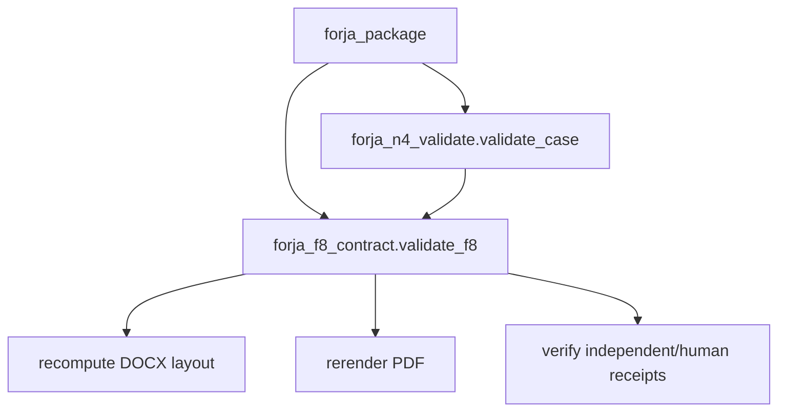

# Execução arquitetural P0 — FORJA Harness

## Resultado implementado

O ciclo real `forja_package ↔ forja_n4_validate` foi rompido. O gate visual F8 vive agora em `forja_f8_contract.py`, módulo neutro que não depende nem do empacotador nem do agregador N4. `forja_package.validate_f8` permanece como fachada pública compatível.

## Invariantes preservados

- F8 continua fail-closed para ledger inválido, hash divergente, páginas ausentes, autoaprovação, revisão incompleta, DOCX não auditável e PDF não reproduzível.
- política `strict_protocol` continua exigindo recibo humano assinado e vinculado aos hashes do DOCX/PDF/páginas.
- exceções e formato do resultado público foram preservados.
- N4 não importa mais `forja_package`; ambos dependem apenas do contrato neutro.

## Regressões arquiteturais

`test_forja_architecture.py` inspeciona o AST e exige: pacote pode depender de N4, N4 não pode depender do pacote, ambos devem depender de F8 neutro, e a API pública deve ser exatamente o contrato neutro.

## Evidência após regeneração

- 68 módulos; 534 símbolos; 52 schemas; 2.258 relações; 99 vínculos `tested_by`.
- Grafo: 1.448 nós e 4.502 arestas.
- Ciclos detectados: 0; erros de parse: 0; arestas pendentes: 0.
- 87 testes e 3 subtestes passaram no corte de pacote, anti-cheat e N4.
- Próximo corte: mover a orquestração de `build_package` para um serviço de aplicação com portas explícitas para estado, validação e publicação.
