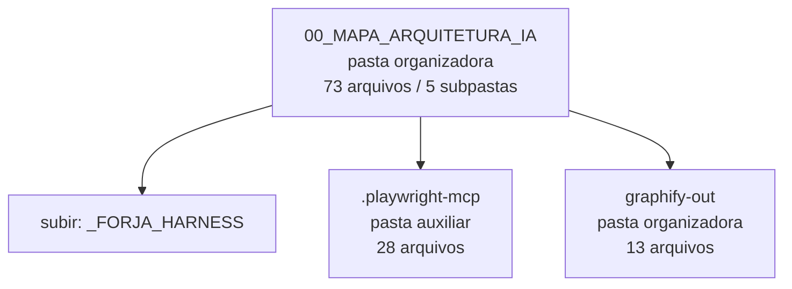

<!-- IA_NAVIGACAO:GERADO_AUTO:v1 -->
# Mapa IA - 00_MAPA_ARQUITETURA_IA

Atualizado automaticamente em: **2026-08-05 13:32:39 -0300**

- Caminho: `C:\Users\IgorPC\.claude\projects\Escritório fabio osório\fabricas de melhoria de petições\_FORJA_HARNESS\00_MAPA_ARQUITETURA_IA`
- Tipo: **pasta organizadora**
- Função para navegação: agrega subpastas; abrir mapa filho conforme objetivo
- Conteúdo recursivo: **73 arquivos**, **5 subpastas**, **23.0 MB**
- Tipos de arquivo: .json: 17, .yml: 15, .log: 11, .md: 10, .html: 9, (sem extensão): 3, .bak: 2, .png: 2, .py: 1, .csv: 1, +2 tipos
- Mapa raiz: [MAPA_IA.md](<../../MAPA_IA.md>)
- Índice geral: [INDICE_GERAL_IA.md](<../../00_IA_NAVIGACAO/INDICE_GERAL_IA.md>)
- Protocolo de navegação: [PROTOCOLO_NAVEGACAO_IA.md](<../../00_IA_NAVIGACAO/PROTOCOLO_NAVEGACAO_IA.md>)
- Inventário JSON para agentes: [inventario_ia.json](<../../00_IA_NAVIGACAO/dados/inventario_ia.json>)
- Mapa superior: [_FORJA_HARNESS](<../MAPA_IA.md>)

## GPS Mermaid

## Ordem de leitura recomendada

1. Ler este `MAPA_IA.md` antes de abrir arquivos pesados.
2. Subir para a raiz se precisar das regras globais `AGENTS.md`, `CLAUDE.md` e `_LEIS_GERAIS`.

## Subpastas diretas

| Subpasta | Tipo | Conteúdo | Atualização | Próximo passo |
|---|---|---:|---:|---|
| [.playwright-mcp](<.playwright-mcp/MAPA_IA.md>) | pasta auxiliar | 28 arquivos / 0 subpastas | 2026-07-23 23:11 | conteúdo auxiliar ou residual |
| [graphify-out](<graphify-out/MAPA_IA.md>) | pasta organizadora | 13 arquivos / 3 subpastas | 2026-08-05 03:09 | agrega subpastas; abrir mapa filho conforme objetivo |

## Arquivos diretos

| Arquivo | Papel | Tamanho | Modificado | Observação |
|---|---:|---:|---:|---|
| [ajustar_fontes_diagrama.py](<ajustar_fontes_diagrama.py>) | dados/script | 1.3 KB | 2026-07-23 14:27 | dado estruturado ou rotina técnica |
| [CENARIOS_E_FALHAS.json](<CENARIOS_E_FALHAS.json>) | dados/script | 5.3 KB | 2026-08-05 03:09 | dado estruturado ou rotina técnica |
| [DECISOES_ARQUITETURAIS.json](<DECISOES_ARQUITETURAIS.json>) | dados/script | 2.9 KB | 2026-08-05 03:09 | dado estruturado ou rotina técnica |
| [FORJA_AUTORESEARCH_LOOP.workflow.json](<FORJA_AUTORESEARCH_LOOP.workflow.json>) | dados/script | 8.7 KB | 2026-08-05 03:09 | dado estruturado ou rotina técnica |
| [FORJA_FLUXO_COMPLETO_COM_AUTORESEARCH.architecture.json](<FORJA_FLUXO_COMPLETO_COM_AUTORESEARCH.architecture.json>) | dados/script | 19.4 KB | 2026-07-23 14:26 | dado estruturado ou rotina técnica |
| [FORJA_HARNESS_ARCHITECTURE.architecture.json](<FORJA_HARNESS_ARCHITECTURE.architecture.json>) | dados/script | 9.7 KB | 2026-08-05 03:09 | dado estruturado ou rotina técnica |
| [FORJA_HARNESS_IMPROVEMENT_ROADMAP.workflow.json](<FORJA_HARNESS_IMPROVEMENT_ROADMAP.workflow.json>) | dados/script | 3.7 KB | 2026-08-05 03:09 | dado estruturado ou rotina técnica |
| [FORJA_HARNESS_INTERFACE_CALLS.sequence.json](<FORJA_HARNESS_INTERFACE_CALLS.sequence.json>) | dados/script | 3.8 KB | 2026-08-05 00:53 | dado estruturado ou rotina técnica |
| [FORJA_HARNESS_OPERATIONAL_FLOW.workflow.json](<FORJA_HARNESS_OPERATIONAL_FLOW.workflow.json>) | dados/script | 5.1 KB | 2026-08-05 00:22 | dado estruturado ou rotina técnica |
| [FORJA_HARNESS_TARGET_ARCHITECTURE.architecture.json](<FORJA_HARNESS_TARGET_ARCHITECTURE.architecture.json>) | dados/script | 5.2 KB | 2026-08-05 00:53 | dado estruturado ou rotina técnica |
| [FORJA_HARNESS_TRUST_DATAFLOW.dataflow.json](<FORJA_HARNESS_TRUST_DATAFLOW.dataflow.json>) | dados/script | 6.7 KB | 2026-08-05 03:09 | dado estruturado ou rotina técnica |
| [INTERFACES_INFERIORES.json](<INTERFACES_INFERIORES.json>) | dados/script | 4.0 MB | 2026-08-05 03:09 | dado estruturado ou rotina técnica |
| [INVENTARIO_ESTRUTURAL.json](<INVENTARIO_ESTRUTURAL.json>) | dados/script | 259.8 KB | 2026-08-05 03:09 | dado estruturado ou rotina técnica |
| [MATRIZ_RASTREABILIDADE_INTERFACES.csv](<MATRIZ_RASTREABILIDADE_INTERFACES.csv>) | dados/script | 142.7 KB | 2026-08-05 03:09 | dado estruturado ou rotina técnica |
| [SHA256SUMS.json](<SHA256SUMS.json>) | dados/script | 13.9 KB | 2026-08-05 03:09 | dado estruturado ou rotina técnica |
| [ANALISE_ARQUITETURAL_E_PROPOSTAS.md](<ANALISE_ARQUITETURAL_E_PROPOSTAS.md>) | outro | 10.0 KB | 2026-08-05 03:09 | arquivo não classificado automaticamente \| tópicos: Diagnóstico arquitetural e propostas — FORJA Harness; 1. Veredito executivo; Decisão recomendada |
| [ARCHIFY_ANALISE_DETALHADA.md](<ARCHIFY_ANALISE_DETALHADA.md>) | outro | 7.4 KB | 2026-08-05 03:09 | arquivo não classificado automaticamente \| tópicos: Archify — arquitetura de FORJA Harness; Resultado executivo; O que este mapa responde |
| [DOCUMENTACAO_ARQUITETURAL_COMPLETA.md](<DOCUMENTACAO_ARQUITETURAL_COMPLETA.md>) | outro | 26.4 KB | 2026-08-05 03:09 | arquivo não classificado automaticamente \| tópicos: Documentação arquitetural completa — FORJA Harness; 1. Resumo executivo; O que está coberto |
| [EXECUCAO_P0_ARQUITETURA_2026-07-22.md](<EXECUCAO_P0_ARQUITETURA_2026-07-22.md>) | outro | 1.7 KB | 2026-07-22 02:26 | arquivo não classificado automaticamente \| tópicos: Execução arquitetural P0 — FORJA Harness; Resultado implementado; Invariantes preservados |
| [FORJA_AUTORESEARCH_LOOP.html](<FORJA_AUTORESEARCH_LOOP.html>) | outro | 605.1 KB | 2026-08-05 03:09 | arquivo não classificado automaticamente |
| [FORJA_FLUXO_COMPLETO_COM_AUTORESEARCH.architecture.json.pre-ultracode.bak](<FORJA_FLUXO_COMPLETO_COM_AUTORESEARCH.architecture.json.pre-ultracode.bak>) | outro | 12.9 KB | 2026-07-23 13:39 | arquivo não classificado automaticamente |
| [FORJA_FLUXO_COMPLETO_COM_AUTORESEARCH.html](<FORJA_FLUXO_COMPLETO_COM_AUTORESEARCH.html>) | outro | 627.2 KB | 2026-08-05 03:09 | arquivo não classificado automaticamente |
| [FORJA_HARNESS_ARCHITECTURE.architecture.json.pre-autoresearch-20260723.bak](<FORJA_HARNESS_ARCHITECTURE.architecture.json.pre-autoresearch-20260723.bak>) | outro | 10.9 KB | 2026-07-23 02:26 | arquivo não classificado automaticamente |
| [FORJA_HARNESS_ARCHITECTURE.html](<FORJA_HARNESS_ARCHITECTURE.html>) | outro | 609.0 KB | 2026-08-05 03:09 | arquivo não classificado automaticamente |
| [FORJA_HARNESS_IMPROVEMENT_ROADMAP.html](<FORJA_HARNESS_IMPROVEMENT_ROADMAP.html>) | outro | 588.2 KB | 2026-08-05 03:09 | arquivo não classificado automaticamente |
| [FORJA_HARNESS_INTERFACE_CALLS.html](<FORJA_HARNESS_INTERFACE_CALLS.html>) | outro | 593.5 KB | 2026-08-05 03:09 | arquivo não classificado automaticamente |
| [FORJA_HARNESS_OPERATIONAL_FLOW.html](<FORJA_HARNESS_OPERATIONAL_FLOW.html>) | outro | 592.8 KB | 2026-08-05 03:09 | arquivo não classificado automaticamente |
| [FORJA_HARNESS_TARGET_ARCHITECTURE.html](<FORJA_HARNESS_TARGET_ARCHITECTURE.html>) | outro | 594.6 KB | 2026-08-05 03:09 | arquivo não classificado automaticamente |
| [FORJA_HARNESS_TRUST_DATAFLOW.html](<FORJA_HARNESS_TRUST_DATAFLOW.html>) | outro | 599.7 KB | 2026-08-05 03:09 | arquivo não classificado automaticamente |
| [GRAPHIFY_ANALISE_DETALHADA.md](<GRAPHIFY_ANALISE_DETALHADA.md>) | outro | 10.0 KB | 2026-08-05 03:09 | arquivo não classificado automaticamente \| tópicos: Graphify — grafo de FORJA Harness; Resultado executivo; Modelo de confiança |
| [INTERFACES_INFERIORES.md](<INTERFACES_INFERIORES.md>) | outro | 701.6 KB | 2026-08-05 03:09 | arquivo não classificado automaticamente \| tópicos: Interfaces inferiores — FORJA Harness; 1. O que este documento resolve; 2. Limite de confiança e privacidade |
| [LEIA_PRIMEIRO.md](<LEIA_PRIMEIRO.md>) | outro | 2.2 KB | 2026-08-05 03:09 | arquivo não classificado automaticamente \| tópicos: Mapa de arquitetura para humanos e IAs; Leia nesta ordem; Contrato de leitura |

## Leitura por papel

- **dados/script**: [ajustar_fontes_diagrama.py](<ajustar_fontes_diagrama.py>), [CENARIOS_E_FALHAS.json](<CENARIOS_E_FALHAS.json>), [DECISOES_ARQUITETURAIS.json](<DECISOES_ARQUITETURAIS.json>), [FORJA_AUTORESEARCH_LOOP.workflow.json](<FORJA_AUTORESEARCH_LOOP.workflow.json>), [FORJA_FLUXO_COMPLETO_COM_AUTORESEARCH.architecture.json](<FORJA_FLUXO_COMPLETO_COM_AUTORESEARCH.architecture.json>), [FORJA_HARNESS_ARCHITECTURE.architecture.json](<FORJA_HARNESS_ARCHITECTURE.architecture.json>), [FORJA_HARNESS_IMPROVEMENT_ROADMAP.workflow.json](<FORJA_HARNESS_IMPROVEMENT_ROADMAP.workflow.json>), [FORJA_HARNESS_INTERFACE_CALLS.sequence.json](<FORJA_HARNESS_INTERFACE_CALLS.sequence.json>), [FORJA_HARNESS_OPERATIONAL_FLOW.workflow.json](<FORJA_HARNESS_OPERATIONAL_FLOW.workflow.json>), [FORJA_HARNESS_TARGET_ARCHITECTURE.architecture.json](<FORJA_HARNESS_TARGET_ARCHITECTURE.architecture.json>), [FORJA_HARNESS_TRUST_DATAFLOW.dataflow.json](<FORJA_HARNESS_TRUST_DATAFLOW.dataflow.json>), [INTERFACES_INFERIORES.json](<INTERFACES_INFERIORES.json>), [INVENTARIO_ESTRUTURAL.json](<INVENTARIO_ESTRUTURAL.json>), [MATRIZ_RASTREABILIDADE_INTERFACES.csv](<MATRIZ_RASTREABILIDADE_INTERFACES.csv>), [SHA256SUMS.json](<SHA256SUMS.json>)
- **outro**: [ANALISE_ARQUITETURAL_E_PROPOSTAS.md](<ANALISE_ARQUITETURAL_E_PROPOSTAS.md>), [ARCHIFY_ANALISE_DETALHADA.md](<ARCHIFY_ANALISE_DETALHADA.md>), [DOCUMENTACAO_ARQUITETURAL_COMPLETA.md](<DOCUMENTACAO_ARQUITETURAL_COMPLETA.md>), [EXECUCAO_P0_ARQUITETURA_2026-07-22.md](<EXECUCAO_P0_ARQUITETURA_2026-07-22.md>), [FORJA_AUTORESEARCH_LOOP.html](<FORJA_AUTORESEARCH_LOOP.html>), [FORJA_FLUXO_COMPLETO_COM_AUTORESEARCH.architecture.json.pre-ultracode.bak](<FORJA_FLUXO_COMPLETO_COM_AUTORESEARCH.architecture.json.pre-ultracode.bak>), [FORJA_FLUXO_COMPLETO_COM_AUTORESEARCH.html](<FORJA_FLUXO_COMPLETO_COM_AUTORESEARCH.html>), [FORJA_HARNESS_ARCHITECTURE.architecture.json.pre-autoresearch-20260723.bak](<FORJA_HARNESS_ARCHITECTURE.architecture.json.pre-autoresearch-20260723.bak>), [FORJA_HARNESS_ARCHITECTURE.html](<FORJA_HARNESS_ARCHITECTURE.html>), [FORJA_HARNESS_IMPROVEMENT_ROADMAP.html](<FORJA_HARNESS_IMPROVEMENT_ROADMAP.html>), [FORJA_HARNESS_INTERFACE_CALLS.html](<FORJA_HARNESS_INTERFACE_CALLS.html>), [FORJA_HARNESS_OPERATIONAL_FLOW.html](<FORJA_HARNESS_OPERATIONAL_FLOW.html>), [FORJA_HARNESS_TARGET_ARCHITECTURE.html](<FORJA_HARNESS_TARGET_ARCHITECTURE.html>), [FORJA_HARNESS_TRUST_DATAFLOW.html](<FORJA_HARNESS_TRUST_DATAFLOW.html>), [GRAPHIFY_ANALISE_DETALHADA.md](<GRAPHIFY_ANALISE_DETALHADA.md>), [INTERFACES_INFERIORES.md](<INTERFACES_INFERIORES.md>), [LEIA_PRIMEIRO.md](<LEIA_PRIMEIRO.md>)

## Observações anti-alucinação

- Este mapa classifica por nomes, extensões e posição na árvore; não substitui leitura de fonte primária.
- Fato, citação, ID processual, prazo e jurisprudência só entram em peça depois de conferência no arquivo-fonte ou fonte oficial.
- Se a pasta tiver regimento, a peça deve refletir o regimento vigente na data do protocolo.
