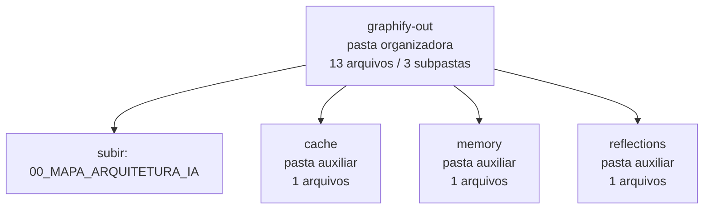

<!-- IA_NAVIGACAO:GERADO_AUTO:v1 -->
# Mapa IA - graphify-out

Atualizado automaticamente em: **2026-08-05 13:33:43 -0300**

- Caminho: `C:\Users\IgorPC\.claude\projects\Escritório fabio osório\fabricas de melhoria de petições\_FORJA_HARNESS\00_MAPA_ARQUITETURA_IA\graphify-out`
- Tipo: **pasta organizadora**
- Função para navegação: agrega subpastas; abrir mapa filho conforme objetivo
- Conteúdo recursivo: **13 arquivos**, **3 subpastas**, **11.4 MB**
- Tipos de arquivo: .json: 4, (sem extensão): 3, .md: 3, .txt: 1, .html: 1, .prev: 1
- Mapa raiz: [MAPA_IA.md](<../../../MAPA_IA.md>)
- Índice geral: [INDICE_GERAL_IA.md](<../../../00_IA_NAVIGACAO/INDICE_GERAL_IA.md>)
- Protocolo de navegação: [PROTOCOLO_NAVEGACAO_IA.md](<../../../00_IA_NAVIGACAO/PROTOCOLO_NAVEGACAO_IA.md>)
- Inventário JSON para agentes: [inventario_ia.json](<../../../00_IA_NAVIGACAO/dados/inventario_ia.json>)
- Mapa superior: [00_MAPA_ARQUITETURA_IA](<../MAPA_IA.md>)

## GPS Mermaid

## Ordem de leitura recomendada

1. Ler este `MAPA_IA.md` antes de abrir arquivos pesados.
2. Subir para a raiz se precisar das regras globais `AGENTS.md`, `CLAUDE.md` e `_LEIS_GERAIS`.

## Subpastas diretas

| Subpasta | Tipo | Conteúdo | Atualização | Próximo passo |
|---|---|---:|---:|---|
| [cache](<cache/MAPA_IA.md>) | pasta auxiliar | 1 arquivos / 0 subpastas | 2026-07-30 13:39 | conteúdo auxiliar ou residual |
| [memory](<memory/MAPA_IA.md>) | pasta auxiliar | 1 arquivos / 0 subpastas | 2026-07-24 18:31 | conteúdo auxiliar ou residual |
| [reflections](<reflections/MAPA_IA.md>) | pasta auxiliar | 1 arquivos / 0 subpastas | 2026-07-24 18:55 | conteúdo auxiliar ou residual |

## Arquivos diretos

| Arquivo | Papel | Tamanho | Modificado | Observação |
|---|---:|---:|---:|---|
| [.graphify_analysis.json](<.graphify_analysis.json>) | dados/script | 93.0 KB | 2026-07-22 02:07 | dado estruturado ou rotina técnica |
| [.graphify_learning.json](<.graphify_learning.json>) | dados/script | 3.8 KB | 2026-07-24 18:55 | dado estruturado ou rotina técnica |
| [ANALISE_ESTRUTURAL.json](<ANALISE_ESTRUTURAL.json>) | dados/script | 16.4 KB | 2026-08-05 03:09 | dado estruturado ou rotina técnica |
| [graph.json](<graph.json>) | dados/script | 5.2 MB | 2026-08-05 03:09 | dado estruturado ou rotina técnica |
| [.graphify_python](<.graphify_python>) | outro | 69 B | 2026-08-05 00:22 | arquivo não classificado automaticamente |
| [.graphify_root](<.graphify_root>) | outro | 108 B | 2026-08-05 00:22 | arquivo não classificado automaticamente |
| [.vocab.txt](<.vocab.txt>) | outro | 8.5 KB | 2026-07-24 18:25 | arquivo não classificado automaticamente |
| [graph.html](<graph.html>) | outro | 3.3 MB | 2026-08-05 03:09 | arquivo não classificado automaticamente |
| [graph.json.prev](<graph.json.prev>) | outro | 2.8 MB | 2026-07-23 14:31 | arquivo não classificado automaticamente |
| [GRAPH_REPORT.md](<GRAPH_REPORT.md>) | outro | 10.0 KB | 2026-08-05 03:09 | arquivo não classificado automaticamente \| tópicos: Graph Report - C:\\Users\\IgorPC\\.claude\\projects\\Escritório fabio osório\\fabricas de melhoria de petições\\_FORJA_HARNESS ; Corpus Check; Summary |

## Leitura por papel

- **dados/script**: [.graphify_analysis.json](<.graphify_analysis.json>), [.graphify_learning.json](<.graphify_learning.json>), [ANALISE_ESTRUTURAL.json](<ANALISE_ESTRUTURAL.json>), [graph.json](<graph.json>)
- **outro**: [.graphify_python](<.graphify_python>), [.graphify_root](<.graphify_root>), [.vocab.txt](<.vocab.txt>), [graph.html](<graph.html>), [graph.json.prev](<graph.json.prev>), [GRAPH_REPORT.md](<GRAPH_REPORT.md>)

## Observações anti-alucinação

- Este mapa classifica por nomes, extensões e posição na árvore; não substitui leitura de fonte primária.
- Fato, citação, ID processual, prazo e jurisprudência só entram em peça depois de conferência no arquivo-fonte ou fonte oficial.
- Se a pasta tiver regimento, a peça deve refletir o regimento vigente na data do protocolo.
