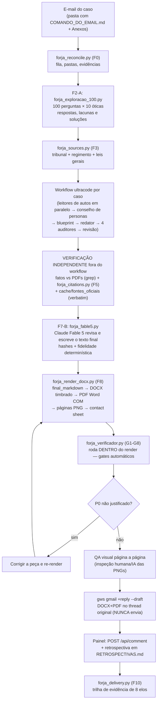
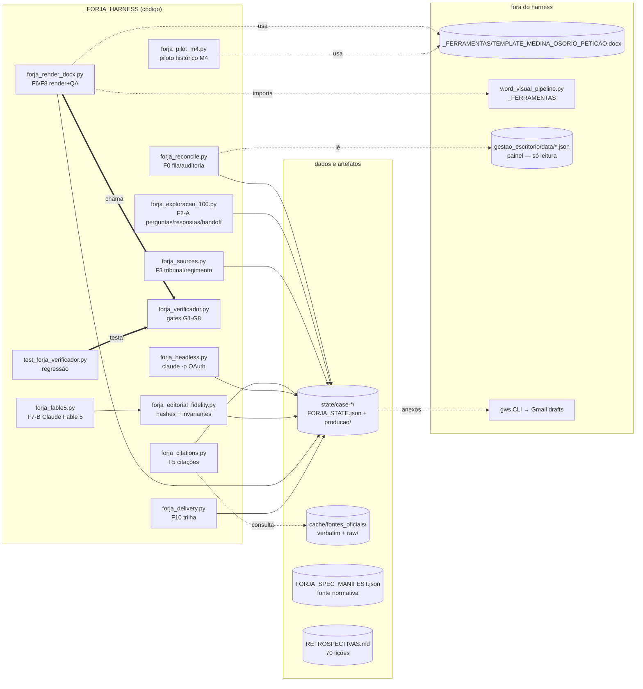

# FORJA — Documentação técnica e mapa do código

> Escrito para OUTRAS IAs (e humanos) acharem qualquer parte do sistema, ajustarem com segurança e não recriarem o que já existe. Atualizado em **26/07/2026**, com a blindagem de lastro documental (§ 20) e a auditoria de regimentos (§ 21). Estado consolidado do sistema na § 22.
> Regra de ouro deste harness: **detecção agressiva, bloqueio conservador** — o verificador avisa muito (P1) e trava pouco (P0). Nunca transformar aviso em trava sem passar pela regressão (`test_forja_verificador.py`).

## 0. Estado real em 15/07/2026 — N3 implementada, promoção ainda controlada

A FORJA N3.0-r2 está implementada como camada aditiva. A N2 continua sendo a especificação vigente para os casos existentes; nenhuma peça histórica foi reescrita. O sidecar da gestão e a ponte de atualização estão ativos. Máquina de estados, executor, contexto, fidelidade, QA visual e fechamento canônico permanecem sob feature flags até os replays bloqueados serem corrigidos e três ciclos novos terminarem estáveis.

| Capacidade N3 | Módulo | Estado |
|---|---|---|
| eventos atômicos, revisão e reabertura formal | `forja_state_machine.py` | implementado em sombra |
| contratos F0-F10 e promoção isolada | `forja_run.py` + `phase_contracts/` | implementado em sombra |
| F2-A: 100 perguntas, 10 óticas, respostas e handoff | `forja_exploracao_100.py` + `F2_QUESTION_TREE.json` | **obrigatório em novos ciclos F2** |
| F7-B: revisão editorial e escrita final | `forja_editorial.py` (era `forja_fable5.py`) + `forja_editorial_fidelity.py` | **obrigatório antes de F8 em novas tentativas F7**; modelo padrão `claude-opus-5` desde 25/07/2026 |
| lastro documental verbatim (L1-L8) | `forja_lastro.py` | **bloqueante em F7 e na entrega** desde 26/07/2026 |
| atualidade dos regimentos arquivados | `forja_regimentos.py` | ativo; acervo em 16/16 desde 26/07/2026 |
| índice, cobertura, fatos, proposições e proveniência | `forja_context.py` | implementado em sombra |
| fidelidade Markdown→DOCX→PDF | `forja_fidelity.py` | implementado e obrigatório no pacote N3 |
| lint SVG, DOCX e PDF com revisor independente | `forja_visual_qa.py` + `medina_visual_lint.py` | implementado em sombra |
| pacote, draft, entrega e F10 por IDs/hashes | `forja_package.py` + `forja_close_cycle.py` | implementado em sombra |
| painel sem alterar `demandas.json` | `sync_forja_gestao.py` + `forja_status.json` | **ativo** |
| atualização após evento N3 canônico | `forja_management_bridge.py` | **ativa somente para caso diretamente em `state/`** |
| validação consolidada | `validate_forja_n3.py` | última execução completa publicada em 10/07: 11/11 grupos; reexecutar após mudanças |

Evidência atual: `reports/N3_SHADOW_REPLAY_2026-07-09.md` reproduziu 21/21 estados e preservou 21/21 hashes. Seis casos abriram bloqueio real: Plano de Saúde por regressão e fonte pendente; CASO-02, CASO-07, CASO-16, CASO-17 e CASO-19/Fábio por diagramas que o gate V2 rejeitou. O gate visual não foi ativado globalmente por essa razão.

Validação canônica:

```powershell
python validate_forja_n3.py --real-word --run-replay
```

O relatório fica em `reports/N3_VALIDATION_2026-07-10.json`. O teste real converte três produtos e 60 páginas em Word/PDF; a conversão agora ocorre em processo isolado, com limite de tempo, uma retomada e promoção atômica do PDF.

Regra de isolamento: eventos criados em diretório temporário, teste ou replay não podem atualizar o painel. A ponte valida que o caso está diretamente em `_FORJA_HARNESS/state/`. Se o sidecar contiver uma entrada N3 sem `FORJA_N3_STATE.json` canônico correspondente, `sync_forja_gestao.py --legacy --apply` restaura o estado N2 real. Essa regra possui regressão automatizada em `test_forja_n3_management.py`.

Rollback: desligar `managementSidecarV1` e `forjaManagementBridge` em `FORJA_N3_CONFIG.json`. Isso faz o painel ignorar novas sincronizações N3 sem apagar eventos, pacotes ou o sidecar e sem alterar `demandas.json`.

## 1. O que o FORJA é, em um parágrafo

Esteira que transforma um e-mail do escritório Medina Osório em minuta de peça jurídica revisável: baixa o comando e os anexos, lê os autos, planeja com conselho adversarial, redige, audita fatos e direito, entrega o texto auditado ao Claude Fable 5 para a revisão e escrita final, recompõe os gates de fidelidade, gera DOCX+PDF com QA visual página a página e deixa um RASCUNHO (nunca envia) no thread original do Gmail para o Igor revisar e encaminhar. Motor de IA: Claude Code com a assinatura OAuth do Igor (sem API paga). Tudo em "modo sombra": artefatos só em `_FORJA_HARNESS\state\<caseId>\`.

## 2. Mapa do pipeline de um caso (Mermaid)



## 3. Mapa dos módulos e dependências (Mermaid)



### 3-A. Camada N4 implantada

```mermaid
flowchart LR
    F2["F2-A: classificação + 100 perguntas<br/>10 óticas, respostas e soluções"] --> F3["F3: eventos, comparação e grafo"]
    F3 --> F4["F4: cobertura, teses, testes e cenários"]
    F4 --> F5["F5: fontes jurídicas e ciência interdisciplinar"]
    F5 --> F7["F7: testes, metacognição e consistência global"]
    F7 --> F7B["F7-B: Fable 5 + gates editoriais"]
    F7B --> F8["F8: fidelidade semântica e QA visual"]
    F8 --> F9["F9: arquivo selecionado = hash do pacote"]
    F9 --> F10["F10: evidência da entrega e aprendizado"]
    F10 --> Gestão["Sidecar e painel do escritório"]
```



Estado operacional após o Conselho de 11/07/2026: CASO-04, CASO-19/Fábio, CASO-16 e Saúde estão no piloto `pilot_blocking`. CASO-04 permanece bloqueada; os outros três são baselines retrospectivas mecanicamente reproduzidas, com zero P0, dois P1 de conselho por caso, `promotionEligible=false` e `legalReleaseStatus=human_review_required`. Os demais casos ficam em sombra. Relatório canônico: `reports/CONSELHO_SINTESE_IMPLEMENTACAO_FORJA_N4_2026-07-11.md`.

## 4. Índice — onde está cada coisa

| Caminho (relativo a `_FORJA_HARNESS\`) | O que é | Quando consultar |
|---|---|---|
| `forja_visual_build.py` | **Entrada única de produção visual** (gates F7 → brief → mapa → figuras → compor → montar → F8-S) | Toda entrega visual; nunca chamar `compor()` por fora |
| `forja_assinatura_visual.py` | Gate F8-S: verificação AFIRMATIVA de presença dos elementos no DOCX | Ao mexer em densidade, taxonomia VIS ou limiar de negrito |
| `..\_FERRAMENTAS\medina_svg_colisao.py` | Gate SVGC (bloqueante): oclusão, texto sobre texto, cor inválida, contraste | Ao alterar qualquer gerador de SVG ou investigar figura quebrada |
| `forja_calibra_monetario.py` | Calibração reexecutável da detecção de material econômico | Antes de tornar bloqueante qualquer gate econômico (plano 41) |
| `templates\F7_5_BRIEF_VISUAL.md` | Contrato do brief visual declarado pelo autor da peça | Toda peça com cronologia ou cadeia argumentativa |
| `FORJA_SPEC_MANIFEST.json` | Fonte normativa: fases F0-F10, milestones, componentes, regras | Antes de qualquer mudança de arquitetura |
| `RETROSPECTIVAS.md` | 103 lições numeradas, incluindo Conselho N4, anti-autocertificação e PSO-Pet | Antes de montar QUALQUER workflow novo |
| `APRENDIZADOS_CONSELHO_N4_2026-07-11.md` | Estado canônico, invariantes, pendências e métricas válidas da auditoria N4 | Antes de alterar ou promover a N4 |
| `RUNBOOK_VALIDACAO_CONSELHO_N4.md` | Comandos, critérios de aceite, interpretação e rollback | Depois de qualquer alteração N4 |
| `planejamento/14_METODO_VAN_AKEN_APLICADO_A_PETICOES.md` | Método completo de definição, diagnóstico, desenho, validação e aprendizado da petição | Antes do blueprint de casos completos ou intensivos |
| `templates/F4_METODO_SOLUCAO_PROBLEMA_PETICAO.md` | Roteiro interno preenchível do perfil PSO-Pet | Durante F2-F4 e nas reaberturas até F7 |
| `templates/F2A_EXPLORACAO_100_PERGUNTAS.md` | Contrato humano das 100 perguntas, respostas, hipóteses e handoff | Todo caso novo, após F1 e antes de F3/F4 |
| `forja_exploracao_100.py` | Andaime, CLI e validador determinístico F2-A | Inicializar e validar `F2_QUESTION_TREE.json` |
| `test_forja_exploracao_100.py` | Regressão de contagem, óticas, diversidade, lastro, bloqueio e rotas | Após qualquer mudança no protocolo F2-A |
| `planejamento/20_F2A_EXPLORACAO_100_PERGUNTAS.md` | Decisão arquitetural, posição no fluxo e compatibilidade | Antes de alterar contratos F2–F4 |
| `PROTOCOLO_EDITORIAL_ESCRITA_FINAL.md` | Runbook normativo da revisão e escrita final | Antes de executar ou alterar F7-B |
| `planejamento/21_F7B_FABLE5_REVISAO_ESCRITA_FINAL.md` | Decisão arquitetural, alternativas e compatibilidade de F7-B | Antes de alterar modelo, autenticação, retry ou invariantes |
| `docs/` | Guias de arquitetura, configuração, início, desenvolvimento e testes | Entrada técnica modular para manutenção |
| `forja_pso_pet.py` | Validador, indicadores vetoriais, auditoria de compatibilidade e benchmark PSO-Pet | Pilotos e auditoria de valor |
| `reports/RELATORIO_PSO_PET_SOLUCAO_PROBLEMAS_E_METRICAS_2026-07-11.md` | Resultado do benchmark real, métricas, limites e decisão de implantação | Antes de promover o perfil PSO-Pet |
| `reports/FORJA_EXPLICADA_PARA_ADVOGADOS.html` | Explicação navegável com 41 diagramas e linguagem voltada a advogados; o nome anterior permanece como endereço compatível | Compreender e apresentar a FORJA sem vocabulário de desenvolvimento |
| `C:\Users\IgorPC\.claude\projects\Forja visual 3d\reports_atlas_blender\` | Edição Blender 2D do atlas e auditoria comparativa V1/V2 — ARQUIVADAS fora do harness em 16/07/2026 (junto com o projeto 3D eliminado em 12/07) | Consultar apenas como histórico; a versão em uso é o atlas para advogados acima |
| `reports/ATLAS_VISUAL_FORJA_ATUAL_E_PSO_PET_2026-07-11.md` | Fonte Mermaid integral do atlas visual | Auditar ou atualizar os diagramas |
| `render_forja_atlas.py` | Render local e autocontido do Markdown/Mermaid para HTML, com zoom e navegação | Regenerar o atlas após mudança arquitetural |
| `DOCUMENTACAO_TECNICA.md` | Este arquivo — mapa e índices | Porta de entrada |
| `INDICE_FORJA.md` | Índice curto de 1 tela | Navegação rápida |
| `forja_verificador.py` | Gates G1-G8 (ver §6) | Ajustar detecção de erro |
| `test_forja_verificador.py` | Regressão do verificador (10 detecções + 8 não-travas) | OBRIGATÓRIO após mudar o verificador |
| `forja_render_docx.py` | Render md→DOCX+PDF+QA; chama o verificador | Ajustar formatação/QA |
| `forja_headless.py` | `claude -p` com OAuth (consultivo; orquestrador grava) | Rodar fase de IA sem workflow |
| `forja_fable5.py` | Passe F7-B pelo `claude-fable-5`, via assinatura OAuth, com prompt por stdin | Revisão editorial e escrita final do texto auditado |
| `forja_editorial_fidelity.py` | Recalcula hashes, evidência OAuth, títulos, retenção mínima e preservação de números, citações, pedidos, marcadores e ressalvas | Bloquear mudança material antes de F8 |
| `forja_reconcile.py` | F0 — audita fila de demandas em modo sombra | Reconciliar fila/painel |
| `forja_sources.py` | F3 — tribunal, regimento, leis gerais | Caso novo/pasta nova |
| `forja_citations.py` | F5 — extrai citações de DOCX/MD e confere no cache | Auditoria de citações |
| `forja_legal_search.py` + `FORJA_SEARCH_CONFIG.json` | Ponte JSON auditável para o TeiaJus: busca, processo, coleta, ranking, TJDFT/TRF1 e STJ (10 espelhos + Diário/íntegra + DataJud) | Pesquisa F5 e comando do Sistema de Busca Jurídica |
| `forja_delivery.py` | F10 — trilha de evidência de 8 elos + pacote de revisão | Fechar entrega |
| `forja_pilot_m4.py` | Piloto histórico do M4 (mantido como referência; produção usa o render) | Arqueologia |
| `cache/fontes_oficiais/*.txt` | Enunciados VERBATIM com fonte e data (súmulas STF/STJ, Tema 1368, art. 406 CC, Lei 14.905, Selic BCB) | Antes de citar qualquer fonte |
| `cache/fontes_oficiais/raw/` | Capturas brutas das páginas (auditoria da extração) | Conferir procedência |
| `state/case-<id>/producao/` | Peça .md, DOCX, PDF, páginas PNG, e-mail, relatório | Retomar/da revisar um caso |
| `state/case-<id>/FORJA_STATE.json` | Estado do caso (fases, gates, artefatos) | Diagnóstico de caso |
| `planejamento/01..06_*.md` | Spec N2 (PRD, TDD, roadmap, diagramas, análise, gates) | Comparar executado × planejado |
| `planejamento/10..13_*.md` | PRD, TDD, roadmap e diagramas finais da candidata N4 | Arquitetura de raciocínio, prova, ciência e entrega |
| `forja_n4_validate.py` | Validação agregada de schema, envelope, conteúdo e relações | Antes de promover fase ou fechar pacote N4 |
| `forja_reasoning.py` / `forja_consistency.py` | Questões, cobertura, grafo, terminologia, tempo, cálculo e consistência | Auditoria estrutural do caso |
| `forja_science.py` | Pesquisa e auditoria científica interdisciplinar | Quando a tese depende de conhecimento não jurídico |
| `forja_delivery_integrity.py` | Seleção F9 e confirmação F10 pelo hash | Antes e depois da entrega |
| `n4_schemas/` / `phase_contracts_n4/` | Contratos executáveis da N4 | Evolução sem substituir contratos N3 |
| `reports/` | Relatórios de reconciliação, implementação, Conselho e anti-autocertificação | Auditoria e histórico das decisões |

Fora do harness: template timbrado e pipeline visual em `..\_FERRAMENTAS\`; regimentos nas pastas dos casos; painel em `..\gestao_escritorio\` (HTML sempre gerado por `render_dashboard.py`, nunca editar direto); aprendizados de feedback humano em `..\APRENDIZADOS_FEEDBACK_HUMANO.md`.

### Integração com o Sistema de Busca Jurídica (TeiaJus)

- Diagnóstico: `python forja_legal_search.py capabilities` e `python forja_legal_search.py health`.
- Busca: `python forja_legal_search.py search "termos" --tribunal TJSP --limit 20 --artifact-dir <attempt-dir>`.
- Processo: `python forja_legal_search.py case <numero-cnj> --artifact-dir <attempt-dir>`.
- STJ: `stj-health`; `stj-catalog --include-resources`; `stj-search "termos" --orgao primeira_turma`; `stj-daily "REsp" --include-text`; `stj-datajud --source-timeout 5`.
- Coleta STJ mutável: `--db <banco> stj-collect --max N --allow-mutation`.
- Recursos mutáveis usam `execute <acao> --params '<json>' --allow-mutation`; sem a flag, a ponte falha fechada.
- Cada chamada grava telemetria em `telemetria/legal_search/`. Com `--artifact-dir`, grava `F5_TEIAJUS_SEARCH_<requestId>.json`, sempre `internal_working`.
- O resultado do TeiaJus não autocertifica citação: uso na peça continua bloqueado pelos gates de fonte oficial, literalidade, identidade do ato e atribuição da F5/F7. `textGaps` do STJ bloqueia alegação sobre a íntegra ausente.

## 5. "Quero ajustar X" → mexa em Y

| Quero... | Arquivo | Onde |
|---|---|---|
| Adicionar persona/jargão proibido | `forja_verificador.py` | listas `PERSONAS` / `JARGAO` |
| Aprovar novo marcador deliberado | `forja_verificador.py` | lista `PLACEHOLDER_OK` |
| Ensinar novo par súmula×tribunal | `forja_verificador.py` | sets `SUMULAS_STJ` / `SUMULAS_STF` |
| Adicionar dispositivo notório trocado | `forja_verificador.py` | lista `DISPOSITIVOS_ERRADOS` |
| Adicionar instituto direcional | `forja_verificador.py` | `INSTITUTOS_DIRECIONAIS` (+ negações em `NEGACOES_G5`) |
| Mudar severidade de um gate | `forja_verificador.py` | função `gate_gN` — e rodar a regressão! |
| Mudar fonte/margem/recuo do Word | `forja_render_docx.py` | função `render()` (Pt/Cm) |
| Mudar detecção de assinatura/título | `forja_render_docx.py` | `eh_assinatura()` |
| Trocar modelo/timeout do headless geral | `forja_headless.py` | constantes `MODELO` / `TIMEOUT_S` |
| Ajustar o passe final editorial (F7-B) | `forja_editorial.py` + `forja_editorial_fidelity.py` | prompt, timeout e invariantes F7-B; modelo dentro da allowlist de `forja_editorial_model.py` e sempre OAuth |
| Mudar gate de lastro documental | `forja_lastro.py` | gate novo exige falha real nomeada + caso de detecção **e** de não-trava (`test_forja_lastro.py`) |
| Auditar atualidade de regimento | `forja_regimentos.py` | `RUNBOOK_AUDITORIA_REGIMENTOS.md`; padrão de cabeçalho novo está lá |
| Acrescentar fonte oficial ao cache | `cache/fontes_oficiais/` | arquivo novo com cabeçalho FONTE/URL/data; bruto em `raw/` |
| Mudar regra de fase/gate normativo | `FORJA_SPEC_MANIFEST.json` | e refletir aqui e no CLAUDE.md da fábrica |
| Ligar/desligar módulo N4 ou escolher piloto | `FORJA_N3_CONFIG.json` | `features.n4*`, `n4.mode` e `n4.pilotCases` |
| Alterar schema/contrato N4 | `generate_n4_contracts.py` + `forja_n4_common.py` | regenerar e rodar `test_forja_n4.py` |
| Auditar autocertificação N4 | `forja_n4_e2e_adversarial.py` + `forja_n4_anti_fraud_audit.py` | rodar o runbook completo e conferir matriz de confusão |
| Interpretar baseline/conselho/promoção | `APRENDIZADOS_CONSELHO_N4_2026-07-11.md` | não confundir aprovação estrutural com liberação |
| Registrar lição nova | `RETROSPECTIVAS.md` | numerar sequencialmente; se determinística, virar gate + caso na regressão |
| Mudar pesos/fatores do score da fila | `forja_fila.py` | função `pontuar` + PRD `planejamento/15` §5 + caso novo em `test_forja_fila.py` |
| Ampliar léxico de decisão do cliente (fila) | `forja_fila.py` | constante `LEXICO_DECISAO_CLIENTE`; validar contra casos reais (`--dry`) |
| Ligar/desligar a fila priorizada | `FORJA_N3_CONFIG.json` | `features.filaPriorizadaV1` (off = painel e pipeline idênticos) |

## 6. Gates e política anti-trava

| Gate | Detecta | Severidade | Racional |
|---|---|---|---|
| G1 | personas internas (Helena, Efesto...) e jargão de processo | P0 / P1 (jargão) | nome interno em peça = vazamento certo |
| G2 | placeholders | P0 só p/ dado esquecido (`[NOME]`, `[OAB]`...) e `[BLOQUEADOR...]`; `[dia]` e marcadores deliberados = P1 | não travar o fluxo por marcador consciente |
| G3 | contagem agregada sem fonte/método | P1 | pode ser legítima; humano decide |
| G4 | súmula no tribunal errado; dispositivos notórios trocados | P0 | erro objetivo |
| G5 | instituto jurídico na direção errada (execução fiscal por particular etc.) | P0, com lista de negações (texto que NEGA o instituto passa) | erro conceitual grave |
| G6 | emojis (P0); separadores `---` no fonte (P1 — o render já os ignora); fecho "FIM DO DOCUMENTO" | P0/P1 | cara de IA |
| G7 | intervalo de datas declarado ≠ recalculado | P0 | aritmética objetiva |
| G8 | peça sem endereçamento/assinatura | P1 | aviso de formato |

Regras: (1) exit code 1 só com P0; (2) TODA mudança no verificador passa por `python test_forja_verificador.py` — a lista `NAO_PODE_TRAVAR` é tão importante quanto a `DEVE_PEGAR`; (3) P0 pode ser aceito conscientemente, mas a justificativa vai no relatório de entrega do caso.

## 7. Auditoria crítica de 09/07/2026 — achados e decisões

**Corrigido nesta rodada** (custo baixo, ganho real):
- `forja_citations.py`: import morto `unicodedata` removido.
- `forja_headless.py`: timeout e saída não-JSON agora produzem erro claro (antes: exceção crua sem contexto).
- `forja_render_docx.py` e `forja_pilot_m4.py`: guarda explícita se o template do escritório sumir (antes: erro críptico de zipfile).
- Render: separador `---` de markdown não vaza mais como texto no Word.
- Temporários de scraping removidos; capturas brutas movidas para `cache/fontes_oficiais/raw/`.

**Rejeitado conscientemente** (anti-excesso — reavaliar só se a dor aparecer):
- *Extrair `forja_utils.py`* com `now_iso`/`read_json`/`append_unique` (6 duplicatas): são funções de 2-5 linhas ("cola"); centralizar criaria acoplamento entre módulos hoje independentes e um ponto único de quebra. Duplicação aceita e documentada.
- *Refatorar as 3 funções longas* (`processar_caso`, `render`, `montar_piloto`): funcionam e foram validadas em 5 casos reais; refatorar sem suíte de testes é risco sem ganho imediato. Pré-condição para mexer: escrever testes de característica antes.
- *Suítes de teste para todos os módulos*: o ponto crítico (verificador) tem regressão; os demais são exercitados a cada caso real. Custo > benefício agora.

**Auditoria geral Efesto (09/07, madrugada)** — evidência executada, não opinião:
- Regressão do verificador verde (10 detecções + 8 não-travas); os 6 módulos importam sem erro.
- Os 5 rascunhos conferidos VIVOS no Gmail (`gws drafts list`) com thread ids corretos.
- Painel: JSONs válidos (BOM em `status_integracoes.json`/`whatsapp_candidates.json` é tolerado por design — todos os leitores usam `utf-8-sig`); HTML regenerado pela API a cada comentário.
- Cache de fontes: 15/15 arquivos com cabeçalho FONTE/URL/data. Manifest válido.
- **Corrigido**: 6 FORJA_STATE.json defasados sincronizados com a realidade (5 entregues → `draft_awaiting_review` com draftId; Jorge Haroldo → `blocked`); estado do CASO-02 criado retroativamente (produção existia sem estado — P0) e o case duplicado `case-email-auto-19f3ed5bdbdcf159` marcado `superseded` apontando para o canônico.
- **Falso positivo do auditor-agente descartado**: "5 referências quebradas de planejamento" não existem (a doc usa o glob correto `01..06_*.md`) — ver Lição 34.
- **Tolerado**: case CASO-04 AgInt em F10 sem pasta `producao/` (entrega histórica está em `..\gestao_escritorio\entregas_fabio_osorio\`); sonda `drive_access_probe` do caso CASO-17 mantida como evidência de inacessibilidade do Drive.

**Aplicação da auditoria externa Efesto/5.5 (09/07, `reports/RELATORIO_EFESTO_AUDITORIA_FORJA_PETICOES_2026-07-09.md`)**:
- **Circuito F7→F10 FECHADO** (recomendação central do relatório): `forja_render_docx.py` persiste `F7_VERIFICADOR_FORJA.json` na pasta de produção; `forja_delivery.py` ganhou o elo 9 bloqueante (`p0 == 0`) — peça com P0 não fecha F10. Testado ponta a ponta com caso descartável.
- **P0 CASO-16 confirmado e corrigido**: rótulo estrutural "IDENTIFICAÇÃO DO PROCESSO" estava no DOCX entregue; removido, re-render limpo, rascunho substituído (r-2094364308504934560).
- **CASO-07**: todas as menções a "13 inquéritos" amarradas à origem (e-mail do escritório, item 16) + léxico de fonte do G3 ampliado; rascunho substituído (r-9065022275353955467).
- **Gates F3 defasados fechados por evidência**: o REGIMENTO_INTERNO_TJRJ.md JÁ EXISTIA na pasta do caso CASO-19/Fábio (gate não fora atualizado); CASO-17 classificado como produto consultivo (parecer/quesitos — sem tribunal de endereçamento; reabrir o gate se o parecer final identificar processo concreto).
- **Distinção de status (pedida pelo relatório)**: `fulfilled` em `F0_RECONCILIACAO_FILA` = cumprimento por reconciliação/`manual_override` de demanda histórica, NÃO esteira F0-F10 completa; `fulfilled` só significa peça auditada quando `currentPhase = F10...` com trilha. Não normalizar estados legados em massa.
- **F7 standalone**: casos entregues sem re-render nesta rodada (CASO-19/Fábio, CASO-17, CASO-02) receberam `F7_VERIFICADOR_FORJA.json` gerado avulso (0 P0; CASO-02 com o P1 `[dia]` deliberado — preencher no protocolo é item do checklist F9/F10).

**Pequenas inconsistências conhecidas e toleradas**: `merge_gates` existe só em `forja_sources.py` (citations usa `merge_by_id`) — comportamentos ligeiramente diferentes de deduplicação, sem efeito prático observado; `read_json` tem nomes de parâmetro diferentes entre módulos (`fallback` × `fb`).

## 8. Executado × planejado (spec N2)

| Plano (manifest/planejamento 01-06) | Executado | Δ |
|---|---|---|
| M0-M5 (reconcile → delivery) | Todos concluídos e registrados no manifest | ✔ conforme |
| Motor: headless OAuth consultivo por fase | Casos reais usaram **workflows ultracode multiagente** + verificação independente externa — mais forte que o previsto | evolução acima do plano; headless mantido para fases pontuais |
| F6 redação sobre template | `forja_render_docx.py` substituiu o piloto M4 (que fica como referência) | ✔ evolução prevista |
| Gates de qualidade (06_GATES) | Parte determinística virou CÓDIGO (`forja_verificador.py` G1-G8, integrado ao render) | acima do plano |
| Fontes oficiais | Cache verbatim com data + rotas mapeadas (BCB/Planalto diretos; SCON/STF via Chrome real) | acima do plano |
| Ingestão Gmail contínua em sombra | **NÃO implementada** — decisão: ingestão manual por caso enquanto o volume é baixo | pendência deliberada |
| Orquestrador automático da fila | **NÃO implementado** — loop é conduzido pela sessão (humano no circuito) | pendência deliberada |
| Verificação de citações 100% automática | Parcial: cache + forja_citations; SCON com desafio anti-bot exige navegador | limite externo conhecido |

## 9. Números da produção (lote 1, 08-09/07/2026)

5 casos entregues como rascunho no Gmail (CASO-16, CASO-19/Fábio, CASO-07, CASO-17, CASO-02), 1 bloqueado por documento externo (Jorge Haroldo). Padrão confirmado: nenhuma peça saiu protocolável direto do workflow — a verificação independente externa achou erro material em 5 de 5 casos (dois com achado que MUDOU a peça: Tema 1368 transitado e fatores Selic oficiais). É por isso que os gates existem e por isso a verificação em fonte oficial não é opcional.

## 9-A. Camada visual law (PADRÃO das entregas desde 09/07/2026 — ordem do Igor)

Toda peça/documento entregável sai na **edição visual law** do padrão `padrao-visual-medina` (skill em `~\.claude\skills\`). O fluxo:

1. **Conteúdo congelado**: o md auditado da pasta `producao/` NUNCA muda nesta fase.
2. **Mapa visual**: `producao/_visual/compor_<caso>_mapa.py` — dicionário `MAPA` declarativo (pull quotes, caixas, figuras, rótulos de síntese, linhas-síntese). Pode ser escrito por agente: as âncoras são validadas contra o md e o corpo é protegido pelo gate.
3. **Composição**: `forja_visual.py: compor(md, docx, MAPA)` — o texto entra por EXTRAÇÃO do md (fidelidade por construção); **gate de fidelidade embutido** aborta se 1 parágrafo faltar (Lição 37: agentes que transcrevem resumem — 5 de 5 reprovados na auditoria). O fólio áureo (identidade oculta do escritório) é aplicado automaticamente pelo kit; `tipo: "estudo"` no MAPA desliga o fólio (estudo/parecer interno não é peça protocolável) — implementado em 09/07/2026.
4. **Diagramas**: SVGs com `medina_svg_kit` (fontes ≥ 9px; números SEMPRE conferidos contra o md).
5. **Montagem**: `_FERRAMENTAS\montar_visual.py: montar(docx, figs)` — SVG→EMF (gate de legibilidade), inserção Word COM, PDF, páginas de QA; `anti_placeholder(pdf)` no final.
6. **QA visual página a página** (inegociável) e só então o rascunho no Gmail.
7. **Gate F10**: o `forja_delivery.py` tem elo bloqueante 4-B — sem um `*VISUAL_LAW*.docx` na pasta de produção (ou do caso), a demanda não fecha (adicionado 09/07/2026). Desde 11/07/2026 (conselho quadripartite, Lição 61) o elo exige também LASTRO: `forja_visual.py` grava `FIDELIDADE_VISUAL.json` (docxSha256/mdSha256) após o gate de fidelidade, e o elo 4-B recomputa o hash do DOCX — versão errada/alterada não fecha; composições pré-gate valem por evidência legada. Na mesma data: elo 2 valida que o F3 CITA o regimento do tribunal (lição CASO-16), e trilha reprovada grava `trilhaBloqueadores` no FORJA_STATE.json + exit code 2 (Lição 62). Regressão: `test_forja_conselho_1107.py`.

`forja_render_docx.py` permanece para render simples + gates (F7); o verificador roda sobre o MESMO md, então vale para as duas saídas.

## 10. Monitoramento vivo (painel de estágio)

O acompanhamento de estágio de cada demanda vive no painel do escritório, NÃO neste arquivo:

- **Fonte de dados**: `..\gestao_escritorio\data\demandas.json` (base) + `data\intervencoes_manuais.json` (comentários e overrides de status).
- **HTML**: `..\gestao_escritorio\PAINEL_ESCRITORIO_MEDINA_OSORIO.html` — gerado por `scripts\render_dashboard.py`; **nunca editar direto**.
- **Como atualizar estágio**: `POST http://127.0.0.1:8765/api/comment` com `{"id": "<demanda>", "text": "...", "autor": "FORJA/ONIR"}` — o servidor grava, aplica e re-renderiza o HTML automaticamente. Status: `POST /api/item-status` (`aberta`/`cumprida` — só marcar cumprida com evidência de entrega ao Fábio).
- **Convenção FORJA**: todo avanço de fase de um caso gera 1 comentário "Estágio DD/MM: ..." na demanda correspondente. Rascunho no Gmail = demanda continua `aberta` (cumprida só após Igor revisar e enviar).
- **Regra da Lição 33**: atualizar o `state/case-*/FORJA_STATE.json` (fase, status, deliveryEvidence com draftId) é passo obrigatório do pós-workflow — a produção via workflow NÃO atualiza o estado sozinha.
- Última sincronização completa de estágio: 09/07/2026 (7 demandas atualizadas: 5 entregues, 1 bloqueada, 1 protocolo de aprendizados).

## 11. Upgrades estado da arte 2026 (executados em 09/07/2026)

Plano completo com adoções, rejeições e critérios: `planejamento/07_PLANO_UPGRADE_ESTADO_DA_ARTE_2026.md` (seção 4 traz o status de execução). Módulos novos e pontos de contato:

| Módulo | Papel | Quando roda |
|---|---|---|
| `forja_injection_scan.py` + `test_forja_injection.py` | detecta injeção indireta de prompt em PDFs (fonte <2pt, cor invisível, padrões de instrução PT/EN); achado vira P0 de triagem humana em `F1_INJECTION_SCAN.json` | ingestão F1, antes de qualquer leitor engolir PDF de terceiro |
| `BLINDAGEM_IDPI` em `forja_headless.py` | prefixo inviolável em todo prompt de fase: conteúdo dos autos é dado, nunca instrução | toda chamada headless |
| `test_forja_citacoes.py` + `conferir_aspas` em `forja_citations.py` | regressão de veneno de citação — um caso por modo da taxonomia de 6 falhas (inexistente, nome trocado, misquote, pincite, tese deturpada, precedente superado) | após qualquer mudança no processo de conferência |
| `forja_metricas_f7.py` (+ `test_f7_campos.py`) | enriquece `F7_VERIFICADOR_FORJA.json`: citações não conferidas nominalmente, pontos a conferir remanescentes, campo de vigência das autoridades decisivas | dentro do render (`forja_render_docx.py`) |
| `forja_diff_docx.py` | diff pós-entrega protocolada × nossa, pré-classificado (formato / estilo-voz / conteúdo jurídico), pronto para `APRENDIZADOS_FEEDBACK_HUMANO.md` | quando a versão protocolada voltar (Diretriz nº 5 do Fábio) |
| `forja_learning.py` (`feedbackAssimilation`) | agrupa a rajada conversacional sem guardar conteúdo bruto, distingue texto humano de material importado e registra, tese por tese, quem suscitou, selecionou, validou e decidiu | em F10 após feedback ou retorno de versão humana; também antes de promover aprendizado amplo |
| `..\_MODELOS\LEIA-ME.md` | peça-modelo aprovada por tipo, lida INTEIRA antes de redigir (sem RAG) | blueprint/redator, antes da redação |

Protocolo (sem código): taxonomia de 6 modos, red team com 9 perguntas, tabela de lastro das proposições decisivas e bloco "Pontos que exigem o seu olho" no e-mail — tudo em `planejamento/06_GATES_QUALIDADE_FORJA.md` e no checklist de `..\APRENDIZADOS_FEEDBACK_HUMANO.md`. Rejeições com fundamento (não reabrir sem fato novo): RAG/GraphRAG, governança de confidencialidade por IA, LLM-as-judge, RCT interno, firewall de saída dedicado, DataJud/Sinapses, rerankers de domínio.

O `feedbackAssimilation` é uma extensão compatível de `F10_HUMAN_DIFF_CLASSIFICATION.json`.
Ele contém apenas IDs e sínteses sanitizadas: `conversationUnits`, `signals`, `contributions` e
`workflowChanges`. Conteúdo bruto, transcrição ou citação literal de WhatsApp é P0. Inferência sobre
preferência ou personalidade nunca se autopromove; regra de escritório/global exige aprovação e duas
evidências independentes. Tese adicionada ou fortalecida só pode ser marcada `external_ready` com fonte
jurídica e decisão registrada, ainda que tenha origem humana.

## 12. Conselho obrigatório Helena + Cícero (ordem do Igor, 09/07/2026)

Toda peça (manual ou FORJA) exige, ANTES da redação final, parecer escrito das skills `/helena`
(estratégia: prioridade, riscos de negócio, alinhamento com o objetivo do cliente) e `/cicero`
(jurídico: cabimento, juridicidade, compliance OAB, blindagem recursal, ética), cada um com
recomendações numeradas e decisão registrada por recomendação (acatada/rejeitada/por quê).
Arquivos canônicos: `F4_PARECER_HELENA.md` e `F4_PARECER_CICERO.md` em `state/<caseId>/`.
Enforcement em três camadas: gate G5.7 (`planejamento/06_GATES_QUALIDADE_FORJA.md`), item do
checklist de `..\APRENDIZADOS_FEEDBACK_HUMANO.md` e elo 10 BLOQUEANTE do `forja_delivery.py`
(testado em 09/07 com caso descartável: sem pareceres reprova, com pareceres aprova o elo).
O relatório de melhorias da peça resume os dois pareceres e as decisões tomadas.

## 13. Auditoria adversarial e pontos decisivos — A1 (10/07/2026)

Peças que respondem manifestações adversárias têm uma trilha própria e bloqueante. O módulo `forja_adversarial_audit.py` inventaria e confere citações da parte contrária, cruza fatos e posições, registra contradições, qualifica indícios de má-fé e exige consequência concreta para qualquer ponto classificado como decisivo.

| Fase | Artefato | Conteúdo mínimo |
|---|---|---|
| F3 | `adversarial_audit` | leitura integral, pedidos, citações, fontes oficiais, contradições, indícios e pontos decisivos |
| F4 | `adversarial_strategy` | decisão por achado, contribuição de Helena/Cícero e autorização de linguagem sensível |
| F7 | `adversarial_recheck` | tentativa de falso positivo, hipótese inocente e revisão das alegações externas |

`forja_headless.py` acrescenta o protocolo a todo prompt F3/F4/F7; `forja_run.py` valida antes de promover; `forja_package.py` vincula os três registros por hash; `forja_delivery.py` acrescenta o elo 11 às novas peças reconhecidas como resposta. “Não localizado” exige dois canais oficiais documentados e jamais equivale automaticamente a “inexistente”. O protocolo completo está em `planejamento/09_AUDITORIA_ADVERSARIAL_PONTOS_DECISIVOS.md`; a regressão fica em `test_forja_adversarial_audit.py`.

## 14. FORJA FILA — priorização painel → FORJA (implementada em 12/07/2026)

R1.1 do parecer Helena (`reports/conselho_2026-07-11/RELATORIO_HELENA.md`), aprovada pelo Igor.
Motor: `forja_fila.py` (score determinístico e explicável; a fila PROPÕE, o humano dispara).
Artefatos: `state/FILA_PRIORIZADA.json` (canônico) + `reports/FILA_<data>.md` (humano) +
`gestao_escritorio/data/forja_fila.json` (painel; seção "Próximas peças (FORJA)" com degradação
limpa — sem o arquivo, o painel fica idêntico). Encadeada em DOIS pontos, ambos com isolamento de falha: fim do `forja_reconcile.py` (F0) e ciclo de
atualização do painel (`gestao_escritorio/scripts/update_dashboard_local.ps1`, antes do render —
o botão "Atualizar" sempre entrega fila fresca), sob a flag `filaPriorizadaV1`. Consumo: `python forja_fila.py --proxima`
(exit 3 se não houver demanda pronta). Regressão: `test_forja_fila.py` (21 casos). Planejamento:
`planejamento/15..18_*FILA_PRIORIZADA.md`. Anti-requisitos (não reabrir sem fato novo): disparo
automático de produção, escrita em `demandas.json`, LLM no score, daemon próprio.

**Política de calendário (feedback Igor, 12/07/2026 — INVIOLÁVEL):** marco interno de
engenharia/FORJA NUNCA vira evento ou alarme no Google Calendar do Igor — o calendário é dele,
para compromissos humanos reais (audiência, prazo processual, reunião). Pendência interna de
acompanhamento vive DENTRO da FORJA: `FORJA_N3_CONFIG.json -> fila.operacaoAssistidaAte` +
`pendencia_operacao_assistida()` no `forja_fila.py` — aparece no rodapé da seção do painel e no
relatório diário da fila; quando vence, vira selo âmbar persistente até o fechamento (sem push,
sem alarme). Para encerrar o acompanhamento: remover a chave `fila.operacaoAssistidaAte` do config.

## 15. Melhorias do plano 19 (implementadas em 12/07/2026)

Plano: `planejamento/19_PLANO_INSTALACAO_MELHORIAS_FORJA_2026-07-12.md` (M1-M4).
(O projeto irmão de visualização 3D foi eliminado por decisão do Igor em 12/07 — não reabrir.)

- **M1.1 Alertas P0** — `forja_alertas.py`: `notificar_p0()` publica comentário `forja-p0`
  na demanda do painel (`intervencoes_manuais.json`, com lock do office_io), log global em
  `reports/ALERTAS_P0.jsonl`, dedupe 6h por (caso, gate), fallback durável em
  `state/<caso>/ALERTAS_PENDENTES.jsonl` (drenar: `python forja_alertas.py --drenar <case_dir>`).
  Integrado no `forja_delivery.py` (reprovação da trilha) e `forja_verificador.py --case-dir`.
  Fail-open em todos os caminhos. Regressão: `test_forja_alertas.py` (9 casos).
- **M1.2 LocalContext** — `forja_local_context.py` (hook SessionStart em `.claude/settings.json`
  desta pasta): injeta resumo vivo da fila (ativos, fase, P0/P1, prazo, idade) ao abrir sessão.
- **M1.3 Métricas de gates** — `python forja_metricas_gates.py` →
  `reports/METRICAS_GATES.json` (ranking de gates, tempo médio por fase, P0 abertos);
  ranking de gates, tempo médio por fase e P0 abertos para consumo do painel.
- **M2.1 Ordem dos pareceres** — `parecer_antes_da_redacao()` no `forja_delivery.py`:
  parecer Helena/Cícero nascido DEPOIS do início do F6 reprova o elo 10 com
  `PARECER_POS_REDACAO` (ordem do Igor 09/07, lição 62). Corte: F6 iniciado antes de
  12/07/2026 segue a regra antiga. Regressão: `test_forja_ordem_parecer.py` (6 casos).
- **M3.3 Runbook prospectivo** — `RUNBOOK_CICLO_PROSPECTIVO.md`: checklist do ciclo com
  congelamento pré-redação; contagem de ciclos válidos (0/3 em 12/07).

### 15-b. M3 e M4 (implementados na tarde de 12/07/2026)

- **M3.1 Mutação semântica** — `python forja_mutation_semantic.py <caso>` →
  `n4_artifacts/F7_SEMANTIC_MUTATION.json`. Operadores S1-S6 determinísticos
  (inversão de tese, troca de parte, valor/data, pedido, sobreabstração,
  deturpação de precedente) + controles benignos que não podem morrer.
  Canais de morte: suíte de testes do caso + verificador (novo P0 vs baseline).
  GATE DE SANIDADE anti-autocertificação: suíte que reprova o ORIGINAL invalida
  o canal case_test (primeiro run real dava 24/24 falso com a minuta errada —
  o texto canônico é `n4_cycle_m6/CANONICAL_TEXT_FROM_FINAL_DOCX.txt`).
  Baselines 12/07: CASO-19 0.17, CASO-16 0.20, Saúde 0.0 (alvo 0.8 —
  famílias fracas nominadas no JSON dizem qual detector construir; o conserto
  da Súmula 362 no G4 já subiu S6 de CASO-19 de 0/2 para 2/2).
  Regressão: `test_forja_mutation_semantic.py` (10).
- **M3.2 Ledger material** — `python forja_ledger_material.py <caso>` →
  `F5_LEDGER_MATERIAL.json` (citações extraídas × cache oficial/fonte local/
  sourceLedger + tabela `producao/PROPOSICOES_DECISIVAS.md`, template gerado
  quando ausente). Sem fonte primária = P1 nominado, nunca silencioso.
  Regressão: `test_forja_ledger_material.py` (7).
- **M4.1** — `test_forja_run.py` (9): executor N3 coberto (fluxo feliz F0 com
  promoção real, autorrevisão, gates, excesso de tentativas, replay idempotente,
  bloqueio formal).
- **M4.3** — `forja_f2_check.py`: coerência tribunal×CNJ (J4→TRF, 8.27→TJTO,
  AREsp→STJ...), perfil PSO-Pet e complexidade em enum; achado = P1 nominado.
  Regressão: `test_forja_f2_check.py` (11).
- **G4 ampliado**: pares súmula×tribunal acrescidos (STJ: 43, 54, 227, 297,
  326, 362, 385; STF: 282, 356) — motivado pela sobrevivência do S6.

- **M4.2 QA de páginas** — `python forja_qa_paginas.py <pasta-de-pngs>`:
  densidade anômala por página (MAD, não desvio-padrão — o outlier infla o σ e
  se esconde), página em branco no meio do documento e conteúdo colado na borda
  inferior (1ª página isenta: o rodapé institucional do template encosta na
  borda POR PROJETO, densidade ~0.93 nos renders reais). Achado = P1 nominado;
  regenerar é decisão do agente. Validado em 37 páginas reais sem falso
  positivo. Regressão: `test_forja_qa_paginas.py` (8, com PNGs sintéticos).


Pendência restante do plano 19: `resolvedAt` nos bloqueadores (writer-side).
O hook LocalContext (M1.2) lê state/ diretamente e não depende de nenhum módulo externo.

## 16. Gate de escrita humana (15/07/2026)

Contrato editorial: `PROTOCOLO_ESCRITA_HUMANA_FORJA.md`. Implementação:
`forja_estilo_humano.py`; regressão: `test_forja_estilo_humano.py`.

O gate não atribui probabilidade de autoria por IA. Ele devolve sinais verificáveis com trecho,
contagem e ação corretiva: contraste formular, metadiscurso vazio, clichê, conectores em série,
travessões repetidos, absolutismo sem lastro, redundância consecutiva, ritmo robótico, simetria
estrutural e conclusão tautológica. Em e-mails, também bloqueia aberturas traduzidas, fórmulas
burocráticas, autonarração do esforço, fechos inflados e corpo com formato de relatório. `P0` é
recomputado sobre o texto real nas seguintes barreiras:

1. prompt obrigatório de F6/F7 para a peça e de F9 para o e-mail (`forja_headless.py`);
2. promoção de artefatos F6/F7 (`forja_run.py`);
3. render simples e composição visual (`forja_render_docx.py` e `forja_visual.py`);
4. validação hash-bound da peça e do corpo do e-mail no pacote (`forja_package.py`);
5. registro do rascunho somente com `bodySha256` idêntico ao e-mail aprovado (`forja_close_cycle.py`);
6. F10, pelo `F7_VERIFICADOR_FORJA.json` e pelo pacote canônico já existentes.

Assim, `p0=0`, `anti_ai_style_passed=pass` ou `email_human_style_passed=pass` declarados manualmente
não aprovam texto viciado, e uma edição no corpo depois do pacote invalida o registro do rascunho.

## 17. F7-B — revisão e escrita final pelo modelo editorial (15/07/2026)

> **Atualização de 25 e 26/07/2026.** O modelo editorial padrão passou a ser `claude-opus-5` por determinação do titular; o Fable 5 continua autorizado como legado, e a allowlist vive em `forja_editorial_model.py` — modelo fora dela não executa. O executor foi renomeado de `forja_fable5.py` para **`forja_editorial.py`** (o nome antigo permanece como shim com `DeprecationWarning`), e o protocolo, de `PROTOCOLO_FABLE5_ESCRITA_FINAL.md` para **`PROTOCOLO_EDITORIAL_ESCRITA_FINAL.md`**. Os leitores ainda aceitam os nomes antigos de artefato (`FABLE5_RESULT.json`, `fable5_usage`). A revisão cruzada entre famílias de modelo virou gate de produção: `familyAssurance` assume `cross_family`, `cross_session_same_family` ou `unverified`, é recomposto pelo orquestrador e nunca aceito por declaração. O texto abaixo descreve a mecânica, que não mudou.


F7-B é uma subfase bloqueante dentro de `F7_AUDITORIA_JURIDICA_FACTUAL`; ela não renumera F8–F10. O operador ou workflow a aciona depois de `f7_gate_result.json` comprovar zero P0:

```powershell
python forja_fable5.py <caso> <attempt-dir> --source audited_markdown.md --f7-gate f7_gate_result.json
```

`forja_run.py` não chama o Fable automaticamente. O executor envia o texto auditado integral por `stdin` ao Claude Code, com ferramentas desabilitadas, exige autenticação `claude.ai`/assinatura `max` e comprova no envelope o modelo `claude-fable-5`. Isso implica processamento remoto pela conta do Igor, embora não use API key nem cobrança de API.

O bundle produzido contém `final_markdown*.md`, `editorial_report*.json`, `editorial_diff*.patch`, `fable5_usage*.json`, `editorial_fidelity*.json` e o fragmento `FABLE5_RESULT*.json`. O fragmento não é um `PHASE_RESULT.json` completo: seus artefatos e quatro gates devem ser incorporados ao resultado F7, mantendo produtor `forja-auditor-juridico`, revisor `forja-gate-controller` e todos os demais requisitos da fase.

O executor isolado só comprova imediatamente a ausência de `p0 > 0` no arquivo de gate. A regra do workflow é mais forte: todos os gates F7 devem estar satisfeitos antes da integração e a promoção final volta a validá-los. Não tratar a ausência de P0, sozinha, como aprovação jurídica completa.

| Gate agregado | O que o runner recompõe |
|---|---|
| `fable5_oauth_confirmed` | conta Claude Max, sessão e modelo canônico |
| `editorial_source_hash_match` | SHA-256 real do `audited_markdown` |
| `editorial_fidelity_pass` | protocolo, hashes e sinais estruturais/lexicais preservados |
| `human_style_final_pass` | ausência de P0 do gate de escrita humana no texto final |

Os sinais determinísticos incluem multiconjuntos de números, datas/valores, marcadores processuais, autoridades, aspas duplas e marcadores de auditoria; títulos; retenção mínima de 90%; pedidos/fecho quando reconhecidos; e ausência de origem operacional. Eles não provam equivalência semântica universal nem cobrem toda mudança factual sem números, adição semanticamente nova, aspas simples ou pedido sem heading reconhecido. Por isso o diff e a revisão humana permanecem obrigatórios.

Uma chamada pode durar até 1.800 segundos. Há no máximo três candidatas editoriais internas no total — a inicial e até dois retries —, sempre a partir do `audited_markdown` original; isso não se confunde com as quatro tentativas de fase admitidas pelo contrato F7. Depois de três reprovações, a tentativa fica bloqueada. O suporte a documentos adicionais usa sufixo comum no bundle, mas o bundle-base permanece obrigatório e ainda falta regressão específica para multi-documento.

O campo `duvidas` do `editorial_report` não possui gate automático. Ele deve ser triado antes de F8: dúvida material sobre fato, estrutura, tese, pedido ou sentido volta à auditoria e bloqueia a composição; dúvida puramente editorial pode ser mantida com decisão humana registrada. O CLI direto `forja_editorial_fidelity.py <audited> <final> <report>` também não recebe `fable5_usage`; a recomposição completa da prova OAuth ocorre no executor, na promoção e no pacote.

Na promoção, `forja_run.py` recompõe os gates. F8 recebe `final_markdown` como cânone, e `forja_package.py` revalida o bundle do entregável selecionado. Pacotes históricos permanecem legíveis conforme o contrato de sua época; novas tentativas F7 não podem usar essa compatibilidade como atalho.

Evidências de 15/07/2026: regressão integrada com 42/42 testes e execução standalone real sobre aproximadamente 36 KB, aprovada na primeira tentativa. Essa execução comprova o passe editorial e seus gates; não comprova promoção, render e pacote E2E. Protocolo completo: `PROTOCOLO_EDITORIAL_ESCRITA_FINAL.md`; decisão: `planejamento/21_F7B_FABLE5_REVISAO_ESCRITA_FINAL.md`; artefatos sanitizados: `reports/fable5_live_validation_20260715/`.

## 18. Gate visual e jurisprudencial anti-trapaça (21/07/2026)

O incidente CASO-17 demonstrou que lint automático e `approved=true` não provam diagramação. O arquivo enviado tinha somente 20 de 245 parágrafos de corpo justificados. A correção passou a usar quatro provas independentes e reproduzíveis:

1. `forja_docx_layout.py`: inspeção OOXML do corpo (Times New Roman 12, justificado), consistência de tabelas, fólio lateral e assinatura de fidelidade textual antes/depois;
2. `forja_visual_review.py`: formulário inicialmente pendente, hashes exatos e oito checks obrigatórios em todas as páginas, sem preenchimento automático; em liberação estrita, `forja_human_review.py` exige recibo humano Ed25519 da inspeção visual integral;
3. `forja_visual_qa.py`: separação explícita entre lint automático e revisão visual independente;
4. `forja_package.py`/`forja_n4_validate.py`: recomputação do DOCX, rerender do PDF e replay do atestado, sem confiar no ledger produzido pela etapa.

Na F7, `forja_official_sources.py` faz replay HTTPS da página oficial e exige que identidade e trecho material existam tanto na captura arquivada quanto na resposta viva. `forja_package.py` exige cobertura de todas as citações extraídas e hash do trecho. `forja_human_review.py` rejeita o rótulo declaratório `type=human`: a aderência entre proposição e fonte só passa com recibo Ed25519 assinado por chave presente em `~/.hermes/trust/FORJA_HUMAN_REVIEW_TRUST.json`. O caminho não é substituível por variável do processo e o SHA-256 do trust store precisa coincidir com `FORJA_HUMAN_REVIEW_TRUST_PIN.json`, arquivo protegido pela régua. A FORJA não cria nem guarda a chave privada. HTTP 403, WAF, timeout, fonte sem verbatim, assinatura ausente, ambiguidade ou falta de revisor bloqueiam. O extrator também distingue processos CNJ estaduais: uma ADI `...8.26...` é TJSP e não pode ser promovida a ADI do STF.

A barreira é deliberadamente fail-closed. Ela prepara material íntegro para revisão humana; não pretende transformar validação técnica em aprovação jurídica. Regressão: `test_forja_anti_cheat.py`, além das suítes visual e de pacote. Registro do incidente: `INCIDENTE_NATURA_QA_VISUAL_2026-07-21.md`.

## 19. AUTO-RESEARCH — ciclo AR de auto-melhoria anti-trapaça (23/07/2026)

Subsistema que institucionaliza o loop de auto-melhoria da fábrica: mede a qualidade das
entregas com indicadores ancorados nas falhas reais mineradas, testa variantes de artefatos
da esteira contra material real e só permite promoção que sobreviva a canários adversariais,
holdout com orçamento e cadeia de aprovação em três estados. Normativa: `planejamento/22_PRD_AUTORESEARCH_FORJA.md`
e `planejamento/23_TDD_AUTORESEARCH_FORJA.md` (v1.1 — a v1.0 foi REPROVADA em review
adversarial do Codex GPT-5.5 com 13 P1; todas as recomendações foram incorporadas e a
triagem está no §14 do PRD).

Arquitetura em seis módulos determinísticos (LLM nunca é chamado pelo Python; passos de
modelo são explícitos, no padrão F7-B):

1. `forja_ar_corpus.py` — inventário do corpus real de `state/` com split train/holdout/sealed
   por HMAC de LINHAGEM (grupo do mesmo litígio nunca se separa), estratificado por
   produto×tribunal. O sealed não é listado no workspace: vive em
   `%USERPROFILE%\.forja_ar_secrets\sealed_registry.json` com orçamento VITALÍCIO de consultas.
2. `forja_ar_indicadores.py` — painel I1–I10 reutilizando os sensores vivos
   (`forja_verificador`, `forja_metricas_f7`, `forja_estilo_humano`, `forja_human_review`).
   Cobertura e correção separadas contra ledgers congelados pré-geração (anti-otimização
   por exclusão de conteúdo); sensor ausente vira `null` motivado, nunca zero; em comparação
   vigente×variante a máscara é pareada e novo `null` BLOQUEIA (nunca renormaliza).
3. `forja_ar_canarios.py` — canários de FALHA ÚNICA por mutação sobre peça-base real:
   o sensor-alvo deve matar a mutação, os demais não podem mudar (atribuição limpa) e o
   controle benigno deve sobreviver. Camada pública em `autoresearch/canarios/` + camada
   secreta rotativa fora do workspace.
4. `forja_ar_runpair.py` — execução pareada vigente×variante (mesmo input congelado,
   manifests de execução com modelo/parâmetros/hashes); paridade violada não chega ao juiz.
5. `forja_ar_blind.py` — julgamento cego pairwise com swap obrigatório (A/B e B/A),
   mapping HMAC fora do workspace, consolidação por `artifactSha256` (mesma POSIÇÃO
   vencendo nas duas ordens = viés posicional → par anulado), mínimo de 2 famílias de
   juiz e proibição de a família geradora julgar a própria variante.
6. `forja_ar_ciclo.py` — orquestrador com log encadeado por hash e gate de promoção em
   três estados: `technical_candidate_passed` → `independent_review_passed` (família
   distinta) → `human_promotion_approved` (recibo Ed25519 da trilha `forja_human_review`).
   Sem sealed elegível, o teto é `estudo_descritivo` e nenhuma variante é promovida.

Regressão: `test_forja_autoresearch.py` (23 testes, 12 sabotagens nominais: split-shopping,
mapping vazado, injeção contra o juiz, supressão de ledger, inflação de páginas, remoção de
citações, stuffing, edição de manifest pós-resultado, replay do sealed, linhagem separada,
pesos hardcoded, controle benigno morto). A suíte integra a Régua e os 13 arquivos AR são
protegidos por hash no `REGUA_MANIFEST.json`.

Calibração real (ciclo AR-0, 23/07/2026): painel sobre 22 peças reais (5 do corpus + 17 do
experimento `.autoresearch/fabrica-peticoes-v1`); σ 0.29–0.47 nos determinísticos; flags de
origem operacional auditados manualmente (7/7 verdadeiros positivos — caminho local vazado
em peças históricas); canários 7/7 com atribuição limpa. Relatório:
`autoresearch/ciclos/ciclo-0/AR_CICLO_0_RELATORIO.md`. Segredos (chave HMAC, sealed,
canários secretos) em `%USERPROFILE%\.forja_ar_secrets\` — nunca no repositório; testes
redirecionam via `FORJA_AR_SECRETS_DIR`.

### 19.1 Camada evolutiva Karpathy e primeiro ciclo real (23/07/2026, noite)

`forja_ar_evolucao.py` implementa o modelo AutoResearch/Karpathy da skill `autoresearch` sobre os
trilhos anti-trapaça do ciclo AR: experimentos com baseline congelado, gerações de variantes com
estratégia de mutação declarada (rephrase/expand/compress/pivot/hybrid) e eixo conceitual do diff,
seleção de vencedor SÓ com evidência de ciclo (julgamento cego válido + não-inferioridade),
snapshot em `autoresearch/evolucao/<exp>/winners/gen-N.md` e convergência por K gerações sem ganho.

Primeiro ciclo real (AR-1, geração 0 de `prompt-mestre-v2`): alvo = prompt-mestre da fábrica;
mutações autoradas pelo Codex; tarefa real do split train executada em paridade 3× (766k tokens);
2 rounds de julgamento INVALIDADOS pelo harness (âncoras + troca de rótulos) antes de um round
válido com kappa 1.0; vencedora varB (compress); revisão independente APTA COM RESSALVAS;
`independent_review_passed` alcançado; SEM propagação (gate humano Ed25519 pendente). Relatório:
`autoresearch/ciclos/ciclo-1/AR_CICLO_1_RELATORIO.md`. Protocolo de juiz corrigido: um par por
sessão; âncora literal exclusiva do vencedor, verificada antes da devolutiva.

## 20. Blindagem contra lastro aparente (26/07/2026)

Módulo `forja_lastro.py` (`FORJA-LASTRO-v1`). Protocolo completo em `PROTOCOLO_LASTRO_DOCUMENTAL.md`; incidente que o originou em `INCIDENTE_VALE_TRADING_LASTRO_APARENTE_2026-07-26.md`; catálogo em § U12 de `planejamento/06_GATES_QUALIDADE_FORJA.md`.

**O problema.** No caso CASO-23, três camadas de revisão — red team interno de 12 perguntas, gate F7 e dois revisores externos de famílias distintas — devolveram zero P0 sobre uma minuta que continha quatro P0. Todas examinaram o TEXTO. Os erros estavam na FONTE, e a fonte não fora aberta. O `fact_ledger` marcava F012 como `confirmed_document` com apoio em `E252-ANEXO-AI-p20-31`: a página existia, o documento existia, e o documento dizia o contrário.

**O eixo.** Citar o localizador não é ter lido o localizador. A única prova barata de leitura é a transcrição verbatim — um modelo obrigado a colar o trecho tem de abrir a fonte; um modelo que só precisa citar a página pode inventá-la com aparência perfeita.

**Os oito gates**, cada um com uma falha real desta execução como âncora (não há gate especulativo no módulo):

| Gate | Sev | Âncora |
|---|---|---|
| L1-lastro | P0 | status documental sem transcrição verbatim |
| L1-lastro-pendente | P1 | mesma falta, porém **declarada** (`groundingPending`) |
| L2-transcricao | P0 | transcrição que não existe na fonte apontada |
| L3-superlativo | P0/P1 | "confirmada em todas as instâncias" sobre REsp **não conhecido** |
| L4-denominador | P1 | "93% dessa distância" — denominador trocado no meio da frase |
| L5-identidade | P0 | "mesmas partes e a mesma liquidação" — eram liquidações distintas |
| L6-norma-por-ano | P0 | "normas de 2002, 2016 e 2018" — a de 2018 não existia |
| L7-criterio-vigente | P0 | base de cálculo recomendada contra critério já fixado nos autos |
| L8-objecao | P0 | objeção externa acatada sem reabrir a fonte, contra minuta correta |

**Acoplamento** (importável não é acoplado — a regressão verifica os quatro pontos): `fact_grounding_verbatim` nos `requiredGates` do `phase_contracts/F7.json`; elo bloqueante **9-B** no `forja_delivery.py` via `fatos_sem_lastro()`; gates lexicais na bateria do `forja_verificador.py`; e `test_forja_lastro.py` (37 casos) no `SUITES_SCRIPT` do baseline.

> ⚠ **Correção de 03/08/2026 — verificar a ligação não é verificar o cálculo.** Medido por busca de chamadores: `validar_lastro_fatos` (L1/L2), `exigir_criterio_vigente` (L7) e `validar_decisoes_revisao` (L8) **não têm chamador fora do teste**. Da produção sobrevivem `analisar_texto` (L3–L6, pelo verificador) e `fatos_sem_lastro` (elo 9-B). O ponto 1 é **declarativo**: `forja_run._validate_result` confere `requiredGates` lendo o campo `gates` do `PHASE_RESULT.json`, escrito pelo próprio agente da fase — de modo que `fact_grounding_verbatim` está no contrato e ninguém o calcula. **Acrescentar gate a contrato que ninguém computa aumenta a autoatestação.** Ligar isso é o passo 1 do plano 41. Lição 100.

**Duas regras de calibração que valem para todo gate futuro.** Pendência declarada é P1, não P0 — punir honestidade com a pena da invenção ensina o sistema a esconder lacuna. E negação nunca trava: o L5 chegou a bloquear "não se trata da mesma liquidação", que é a correção desejada; hoje há detector de negação por janela curta e as duas frases corrigidas reais estão fixadas como não-travas.

**Limite.** São escudos lexicais e estruturais: obrigam a colar o trecho e conferem que ele está no arquivo apontado; **não** julgam se o trecho sustenta a proposição. Isso continua sendo auditoria F7 e leitura humana.

## 21. Auditoria de atualidade dos regimentos (26/07/2026 — E11)

Módulo `forja_regimentos.py` (`FORJA-REGIMENTOS-v1`). Runbook operacional em `RUNBOOK_AUDITORIA_REGIMENTOS.md`.

Converte em checagem recorrente a exigência do protocolo da fábrica de que a peça reflita o regimento vigente **na data do protocolo**. Varre `REGIMENTO_INTERNO_*.md` na fábrica inteira e reporta, por arquivo: versão consolidada, data de verificação, URL oficial e presença da seção "Emendas posteriores". Exit 1 com qualquer bloqueio.

Códigos: `sem_versao` (P0), `sem_data_verificacao` (P0), `verificacao_vencida` (P1, padrão 30 dias), `sem_fonte` (P1), `sem_secao_emendas` (P1). Regra conservadora: na dúvida reporta desconhecido, nunca aprovado — ausência de data não é data recente; e verificação vencida é ressalva, porque o arquivo não está errado, está por conferir.

**O parser é a parte delicada e errou três vezes antes de acertar**: regex guloso truncando data em célula de tabela; frontmatter YAML ignorado; e leitura da primeira data da linha em vez da data depois do rótulo (a linha do TJRJ tem duas datas e devolvia 2024 para arquivo conferido em 2026). Dos 8 bloqueios da primeira execução, **7 eram defeito do auditor**. Por isso `test_forja_regimentos.py` fixa quatro cabeçalhos reais do acervo como não-travas.

Estado em 26/07/2026: **16 arquivos, 16 em ordem, 0 bloqueio, 0 ressalva**. Achado a carregar: **o TJSP tem os AR 594 e 595/2026 posteriores à compilação arquivada de 30/04/2026** — ressalva registrada dentro do arquivo. Dois arquivos do TRF4 parados no AR 35 receberam aviso expresso de desatualização, sem reescrita do corpo.

## 22. Estado consolidado em 26/07/2026

| Frente | Estado |
|---|---|
| Baseline (`forja_baseline.py`) | **41/41 suítes verdes** · 463 testes pytest (+44 subtests) · 7 regressões em script |
| Régua (`forja_regua.py`) | **APROVADA**, rebaselinada com motivo enumerado |
| Regimentos | 16/16 em ordem |
| Modelo editorial F7-B | `claude-opus-5` padrão; allowlist em `forja_editorial_model.py` |
| Revisão cruzada | `familyAssurance` é gate; `unverified` bloqueia em qualquer modo |
| Fontes oficiais | nove artigos do RISTJ arquivados verbatim, o que destravou a bateria REAL |

Duas manutenções silenciosas que explicam sintomas anteriores: um `.git/index.lock` obsoleto de três dias travava todo o git e fazia o sync diário parar em 22/07; e a bateria REAL vinha reprovando desde E9/E10 porque peças de produção citavam o RISTJ sem verbatim arquivado — resolvido pelo arquivamento das fontes, não por afrouxamento do gate.

Caso CASO-23: permanece `internal_working`, bloqueado em F7 pelos dois gates humanos (`human_claim_review_signed_receipt` e `external_human_trust_store_verified`), que nenhum modelo pode satisfazer. As diligências externas pendentes estão declaradas no incidente e nos artefatos do caso, nunca descartadas em silêncio.

## 23. Esteira visual reconstruída (30/07 a 03/08/2026)

**Ordem de origem (Igor, 30/07):** nenhuma peça sai da FORJA sem elementos visuais completos. Sem atalho, sem waiver, sem exceção para produto interno.

**Causa medida da regressão:** a edição visual não degradou, **parou em 10/07/2026**. O `compor()` funcionava, mas exigia um mapa escrito à mão por caso — cinco mapas manuais na semana em que o kit era novidade, nenhum depois. Cobertura em 03/08 nas 22 entregas recentes: 9%. A lição é de arquitetura, não de disciplina: **recurso que depende de esforço manual por caso não sobrevive ao volume.**

### 23.1 Entrada única de produção

`forja_visual_build.py` é a **única** rota de produção visual. Fluxo: gates F7 (fail-closed) → brief `F7_5_BRIEF_VISUAL.json` → mapa automático (`forja_visual_mapa_gen.py`) → figuras (`forja_visual_figuras.py` + geradores em `_FERRAMENTAS\medina_svg_kit.py`) → `forja_visual.compor()` → `montar_visual.py` (EMF/Word COM/PDF/QA) → gate F8-S. **7 a 15 segundos por peça, fidelidade textual 100%.**

**Decisão registrada, não reabrir sem fato novo:** NÃO integrar `compor()` dentro de `forja_render_docx.render()`. Constrói a peça duas vezes, uma pobre e uma rica, e deixa dois DOCX parecidos na mesma pasta — modo de falha do caso CASO-19 (Lição 48). O render simples é prévia; a produção passa pela entrada única.

### 23.2 Nunca inferir conteúdo semântico de figura

Foi tentado e reprovado: a cronologia inferida da prosa misturou data de documento com prazo interno e leu fragmento de CNJ como data; a cadeia de tese colocou a **tese da parte adversária** como elo do raciocínio da cliente. Cada frase era verbatim e o conjunto mentia. **Figura fabricada é pior que figura ausente, porque parece prova.** Daí o brief F7.5 declarado pelo autor da peça (`templates\F7_5_BRIEF_VISUAL.md`, 1 a 2 minutos); sem ele saem apenas as figuras estruturalmente seguras.

### 23.3 Os dois gates, e o que cada um vê

| Gate | Módulo | O que verifica | Estado |
|---|---|---|---|
| **F8-S** — assinatura visual | `forja_assinatura_visual.py` | **PRESENÇA** de elementos no DOCX final: timbre, síntese de abertura em tabela, figuras vetoriais e destaques por faixa de extensão, negrito entre 2% e 20% do corpo, paleta. Taxonomia VIS-02/03/04/05/06/11 | **observação** — grava `F8S_ASSINATURA_VISUAL.json`, não bloqueia |
| **SVGC** — desenho do SVG | `_FERRAMENTAS\medina_svg_colisao.py` | **CORRETUDE do desenho**: SVGC-01 texto ocluído por forma opaca posterior, SVGC-02 texto sobre texto, SVGC-04 cor inválida; avisos SVGC-03 (traço cruzando texto) e SVGC-05 (contraste < 2,0:1) | **bloqueante**, dentro de `svg_para_emf` |

O F8-S nasceu porque **gate que só procura defeito nunca detecta pobreza**: o `forja_visual_qa` procura markdown vazado, marcador literal e clipping — uma peça de texto corrido, sem um único destaque, passa limpa nele. O SVGC nasceu porque o F8-S conta presença e não vê um diagrama internamente quebrado (Lições 96 e 98).

Regressão: `test_forja_assinatura_visual.py` (mutação + teste-âncora) e `test_medina_svg_colisao.py` (10 casos, com o diagrama defeituoso real como fixture e a correção como contraprova).

### 23.4 Regras de calibração que custaram caro

1. **Nunca detectar identidade visual por valor de cor.** A arte do timbre usa `3a5c61`/`d9936a`, um dígito fora dos tokens `395C60`/`D9926A`; a prova correta é estrutural — desenho vetorial no cabeçalho. Um gate calibrado por cor quebraria no primeiro retoque da marca (Lição 94).
2. **Contraste em 2,0:1, não nos 3,0:1 da WCAG.** O rótulo terracota sobre painel terra da casa dá 2,3:1 e está aprovado desde 09/07; calibrar na norma reprovaria a paleta do escritório.
3. **Manter o teste-âncora contra a peça aprovada.** Gate que reprova o padrão aprovado pelo dono está errado, não a peça. Foi ele que pegou a regressão do item 1.
4. **Defeito só é defeito contra o padrão aprovado.** Os retângulos cinza da capa e o vazio inferior são identidade, não erro.
5. **Calibrar contra o acervo antes de bloquear.** O SVGC foi medido nos 228 SVGs existentes: 5 reprovações, **todas confirmadas por render como defeito real**, zero falso positivo sobrevivente. Os dois falsos positivos corrigidos no caminho: `!important` dentro de `style=` lido como parte da cor, e `<tspan>` sem `x` próprio tratado como começando no `x` do pai.
6. **Nenhuma rota é universal até que se prove.** `medina_svg_kit.salvar()` parecia cobrir tudo e não cobre o SVG desenhado à mão — por isso o gate mora em `svg_para_emf`. O mesmo erro reapareceu no plano 41 com `PecaVisual.salvar()`, que não cobre `forja_render_docx` (python-docx direto). Lição 101.

### 23.5 Comitê não substitui revisão de código

O conselho de quatro personas leu o dossiê do construtor e recomendou arquitetura já rejeitada, citando função inexistente. A circularidade de autovalidação — quem constrói escreve o gate, mede com ele e se aprova — só foi quebrada pela revisão cruzada com a outra família de modelo, lendo o XML. Achado material: a contagem de caixas casava qualquer célula sem borda superior, contando 521 fantasmas no CASO-07 e **mascarando ausência total de destaque** (Lição 93).

### 23.6 Calibração de material econômico

`forja_calibra_monetario.py` mede a incidência da detecção de conteúdo econômico sobre o acervo, para os gates L9–L13 planejados (plano 41). Existe porque a primeira medição foi feita por script não persistido e os números iriam ao cliente como evidência — **número em relatório de evidência sem meio de reexecução é atestação sem lastro**. Comando: `python forja_calibra_monetario.py --saida CALIBRACAO_MONETARIA.json`. Resultado de 03/08: a regra ampla tocaria 39,3% dos documentos contra 13,9% da estreita, e 29,7% das ocorrências com separador de milhar são citação normativa lida como dinheiro (Lição 102).
