# O caminho de uma petição na FORJA — do pedido à entrega

> Este documento explica, em um único mapa visual, como funciona a fábrica de petições do escritório Medina Osório: o que acontece desde a chegada de um pedido até a entrega da peça pronta, com todos os pontos de checagem no meio do caminho.
> Ele foi escrito para leitura humana — pensado para um advogado, não para um técnico. Os desenhos usam a notação Mermaid, que qualquer visualizador de texto moderno transforma em diagrama (por exemplo, o endereço mermaid.live).
> Atualizado em 15/07/2026, com a subfase bloqueante F7-B de revisão e escrita final pelo Claude Fable 5.

## Como ler o mapa

- O fluxo corre de cima para baixo, dividido em **etapas numeradas** (a fábrica as chama de F0 a F10 — mantivemos esses nomes curtos porque são a identidade de cada etapa).
- Os **losangos são pontos de checagem**: perguntas objetivas que a peça precisa responder antes de seguir adiante. Quando a resposta é "não", o trabalho volta para a etapa de origem — nunca se "corrige depois".
- As **cores indicam quem faz o trabalho**: azul é trabalho automático do computador; roxo é a inteligência artificial; laranja são as pessoas (Igor e Fábio); vermelho são os pontos de checagem; verde é registro de aprendizado.
- Alguns quadros aparecem em **âmbar tracejado**: são reforços novos de raciocínio e prova que hoje rodam em fase de observação, sem travar os casos comuns.

```mermaid
flowchart TB

%% ==================== CORES (quem faz o quê) ====================
classDef script fill:#dbeafe,stroke:#1d4ed8,color:#1e3a5f
classDef ia fill:#ede9fe,stroke:#7c3aed,color:#3b2a63
classDef humano fill:#ffedd5,stroke:#c2410c,color:#7c2d12
classDef artefato fill:#dcfce7,stroke:#15803d,color:#14532d
classDef gate fill:#fee2e2,stroke:#b91c1c,color:#7f1d1d
classDef inicio fill:#395C60,stroke:#1f3538,color:#ffffff
classDef fim fill:#D9926A,stroke:#9a5a35,color:#3d2213
classDef n4 fill:#fff7e6,stroke:#b45309,color:#7c4a03,stroke-dasharray:6 4

%% ==================== CHEGADA DO PEDIDO ====================
subgraph ENTRADA["CHEGADA DO PEDIDO — por onde o trabalho entra na fábrica"]
    E1(["Pedido por e-mail do escritório<br/>mensagem arquivada com os anexos"]):::inicio
    E2(["Pedido por WhatsApp<br/>áudio transcrito com autorização"]):::inicio
    E3(["Pedido lançado no painel<br/>de demandas do escritório"]):::inicio
    E4(["Caso antigo reaberto<br/>a partir da pasta existente"]):::inicio
    E5["Abre-se a pasta de trabalho do caso,<br/>com uma ficha que acompanha a peça<br/>do início ao fim e registra cada passo"]:::script
    E1 --> E5
    E2 --> E5
    E3 --> E5
    E4 --> E5
end

%% ==================== F0 ====================
subgraph F0["ETAPA F0 — CONFERÊNCIA DA FILA — antes de trabalhar, conferir o que existe"]
    F0A["Conferir os canais de comunicação:<br/>e-mail, WhatsApp e agenda<br/>estão funcionando ou não?"]:::script
    F0B["Conferir cada demanda da fila:<br/>a pasta existe? o pedido está escrito?<br/>o prazo está correto? há contradição?"]:::script
    F0C["Procurar pastas esquecidas:<br/>casos com material mas<br/>sem registro no painel"]:::script
    F0D["Registrar o resultado da conferência<br/>em relatório datado, sem alterar<br/>nada no painel do escritório"]:::artefato
    G0{"Checagem inicial:<br/>pasta, pedido e situação<br/>estão coerentes entre si?"}:::gate
    F0A --> F0B --> F0C --> F0D --> G0
end

E5 --> F0A
G0 -- "algo falta ou se contradiz" --> H0["Igor corrige o registro<br/>no painel do escritório"]:::humano
H0 --> F0A
G0 -- "tudo em ordem" --> F1A

%% ==================== F1 ====================
subgraph F1["ETAPA F1 — RECEBIMENTO SEGURO — garantir que os documentos estão completos e são confiáveis"]
    F1A["Vasculhar os documentos recebidos<br/>em busca de armadilhas escondidas:<br/>texto invisível ou instruções ocultas<br/>plantadas para enganar a inteligência artificial"]:::script
    F1B["Conferir os anexos um a um:<br/>tudo que o pedido menciona<br/>de fato chegou?"]:::script
    F1C["Registrar o inventário do que chegou,<br/>com a impressão digital de cada arquivo,<br/>para provar depois que nada foi trocado"]:::artefato
    F1D["Separar duas camadas de registro:<br/>a origem interna de cada documento fica<br/>no controle da fábrica; a peça só usará<br/>referências processuais verdadeiras"]:::script
    G1{"Checagem de segurança:<br/>encontrou armadilha?<br/>falta documento essencial?"}:::gate
    F1A --> F1B --> F1C --> F1D --> G1
end

G1 -- "armadilha encontrada" --> H1["Igor examina o documento<br/>original e decide com registro<br/>escrito da decisão"]:::humano
H1 --> F1A
G1 -- "falta documento essencial<br/>(autos, decisão ou regimento)" --> H1B["Igor localiza o documento<br/>ou pede ao cliente"]:::humano
H1B --> F1B
G1 -- "tudo seguro e completo" --> F2A

%% ==================== F2 ====================
subgraph F2["ETAPA F2 — ENQUADRAMENTO — entender que peça é essa e quanto cuidado ela exige"]
    F2A["Identificar o tipo de peça<br/>(petição, embargos, parecer, memorial),<br/>o tribunal competente, o risco envolvido<br/>e o prazo disponível"]:::ia
    F2B["Escolher a profundidade do trabalho:<br/>caso simples pede tratamento leve;<br/>caso controverso pede tratamento completo;<br/>caso de alto risco pede tratamento intensivo"]:::ia
    F2C["Registrar o enquadramento por escrito<br/>na pasta do caso"]:::artefato
    F2D["Reforço de raciocínio: montar a árvore<br/>de perguntas do caso — todas as questões<br/>de fato, de processo, de mérito e de pedido<br/>que a peça precisará responder, cada uma<br/>com sua situação: respondida, parcial ou pendente"]:::n4
    G2{"Checagem de enquadramento:<br/>o tipo de peça e o tribunal<br/>estão claros?"}:::gate
    F2A --> F2B --> F2C --> F2D --> G2
end

G2 -- "tipo de peça em dúvida" --> H2["Fábio decide<br/>o enquadramento"]:::humano
H2 --> F2A
G2 -- "claros" --> F3A

%% ==================== F3 ====================
subgraph F3["ETAPA F3 — REGIMENTO E FONTES — nenhuma linha é escrita sem o regimento em vigor"]
    F3A["Identificar o tribunal pelo número<br/>do processo, pelo endereçamento<br/>e pelas decisões nos autos"]:::script
    F3B{"O regimento interno desse<br/>tribunal já está na pasta<br/>do caso, em texto integral?"}:::gate
    F3C["Baixar a versão oficial mais recente,<br/>guardar o texto integral na pasta<br/>e anotar a fonte e a data"]:::humano
    F3D["Verificar as emendas ao regimento<br/>publicadas até o dia do protocolo<br/>e consultar o Estatuto da Advocacia<br/>e a Lei Orgânica da Magistratura"]:::script
    F3E["Ler primeiro o que já está em casa:<br/>a peça anterior do caso, a decisão<br/>atacada e o caminho do processo —<br/>antes de qualquer pesquisa externa"]:::ia
    F3F["Escrever, em uma única frase,<br/>a pergunta que o juiz precisará<br/>responder — ela guia toda a peça"]:::ia
    F3G["Contar o prazo duas vezes,<br/>por caminhos independentes,<br/>considerando feriados e dias úteis;<br/>divergência entre as contagens trava o caso"]:::script
    F3H["Classificar cada fato importante:<br/>tem prova nos autos? é declaração<br/>de alguém? é dedução nossa?<br/>ou ainda não foi verificado?"]:::ia
    F3I["Em processo volumoso, montar a<br/>linha do tempo completa: cada recurso<br/>e cada decisão com nome próprio, data,<br/>quem fez, o que atacou e onde está nos autos"]:::ia
    F3J["Registrar o mapa de fontes do caso,<br/>citando expressamente o regimento —<br/>essa citação é conferida no fechamento"]:::artefato
    F3A --> F3B
    F3B -- "não está" --> F3C --> F3D
    F3B -- "está" --> F3D
    F3D --> F3E --> F3F --> F3G --> F3H --> F3I --> F3J
end

subgraph A1F3["EXAME DA PEÇA CONTRÁRIA — apenas quando a nossa peça responde a uma manifestação da outra parte"]
    A1A["Ler a peça da outra parte inteira<br/>e listar tudo o que ela afirma,<br/>pede e cita"]:::script
    A1B["Conferir cada citação da parte contrária<br/>na fonte oficial: o julgado existe?<br/>diz mesmo aquilo? continua valendo?<br/>Se não encontrado, registrar duas buscas<br/>oficiais antes de afirmar que não existe"]:::ia
    A1C["Registrar as contradições encontradas<br/>mostrando os dois lados com suas fontes —<br/>e sempre perguntar: existe explicação<br/>inocente para isso?"]:::ia
    A1D["Guardar a impressão digital da peça<br/>contrária examinada, para garantir que<br/>toda a análise se refere à mesma versão"]:::script
    A1A --> A1B --> A1C --> A1D
end

F3J --> G3{"Checagem de fontes:<br/>regimento presente e citado?<br/>prazo conferido duas vezes?<br/>pergunta central definida?"}:::gate
F3J -.->|"quando a peça responde à outra parte"| A1A
A1D --> G3
G3 -- "falta regimento ou<br/>as contagens divergem" --> F3C
G3 -- "em ordem" --> F4A

%% ==================== F4 ====================
subgraph F4["ETAPA F4 — PLANO DA PEÇA E CONSELHO — nada vai para a redação sem dois pareceres"]
    F4A["Desenhar a estratégia: quais teses,<br/>quais riscos, em que ordem argumentar"]:::ia
    F4B["Montar o quadro de segurança dos fatos,<br/>antes de escrever: para cada afirmação<br/>decisiva, qual é a fonte, o que ela é<br/>(fato, alegação ou dedução) e como<br/>formulá-la sem se expor"]:::ia
    F4C["Varrer as questões processuais laterais<br/>que costumam passar despercebidas:<br/>prevenção, preclusão, competência interna,<br/>composição atual do órgão julgador<br/>e fatos novos em capítulo próprio"]:::ia
    F4D["Parecer de Helena — visão estratégica:<br/>prioridade, riscos para o cliente<br/>e alinhamento com o objetivo dele,<br/>em recomendações numeradas"]:::ia
    F4E["Parecer de Cícero — visão jurídica:<br/>cabimento, ética profissional,<br/>blindagem contra recursos e limites<br/>de linguagem, em recomendações numeradas"]:::ia
    F4F["Cada recomendação recebe resposta<br/>registrada por escrito: acatada ou<br/>rejeitada, e por quê — sem consenso<br/>de fachada"]:::ia
    F4G["Questão jurídica em aberto vira<br/>dois cenários alternativos —<br/>nunca aposta única"]:::ia
    F4I["Reforço de prova: escrever de dez a<br/>vinte e cinco testes objetivos que a peça<br/>terá de passar, definidos e travados ANTES<br/>da redação; e classificar cada tese como<br/>principal, subsidiária ou de reserva"]:::n4
    F4H["Registrar o plano da peça: resumo<br/>executivo previsto, prequestionamento,<br/>vocabulário protegido contra as súmulas<br/>que barram reexame de prova, e o desenho<br/>visual justificado elemento por elemento"]:::artefato
    F4A --> F4B --> F4C --> F4D --> F4E --> F4F --> F4G --> F4I --> F4H
end

G3 -.->|"quando responsiva: estratégia sobre a peça contrária"| F4A
F4H --> G4{"Checagem do conselho:<br/>os dois pareceres existem, têm conteúdo<br/>real e cada recomendação tem resposta?<br/>o quadro de fatos está completo?"}:::gate
G4 -- "parecer vazio ou<br/>quadro incompleto" --> F4D
G4 -- "em ordem" --> F5A

%% ==================== F5 ====================
subgraph F5["ETAPA F5 — CONFERÊNCIA DE CITAÇÕES — fonte oficial ou nada"]
    F5A["Listar todas as citações previstas<br/>no plano: súmulas, julgados,<br/>temas repetitivos e artigos de lei"]:::script
    F5B["Conferir cada uma somente em fonte<br/>oficial: os bancos de jurisprudência<br/>do Superior Tribunal de Justiça e do<br/>Supremo, o portal do Planalto para as leis<br/>e o Banco Central para índices"]:::ia
    F5C["Testar cada citação contra os seis<br/>erros típicos: julgado que não existe;<br/>número ou tribunal trocado; frase citada<br/>que não está no julgado; página errada;<br/>tese distorcida; e precedente já superado"]:::script
    F5D["Registrar a lista de citações conferidas,<br/>uma a uma, com a fonte de cada conferência"]:::artefato
    F5E{"A peça depende de alguma afirmação<br/>fora do direito — de medicina,<br/>economia ou contabilidade?"}:::gate
    F5F["Reforço científico: buscar estudos<br/>acadêmicos em bases reconhecidas,<br/>confirmar a identidade de cada estudo,<br/>procurar também a evidência contrária<br/>e usar a conclusão com a devida cautela"]:::n4
    F5A --> F5B --> F5C --> F5E
    F5E -- "sim" --> F5F --> F5D
    F5E -- "não: registrar que<br/>não se aplica" --> F5D
end

F5D --> G5{"Checagem de citações:<br/>todas confirmadas na fonte<br/>ou expressamente retiradas?"}:::gate
G5 -- "citação central sem confirmação" --> F5B
G5 -- "não confirmável: retirar<br/>ou trocar a tese" --> F4A
G5 -- "em ordem" --> F6A

%% ==================== F6 ====================
subgraph F6["ETAPA F6 — REDAÇÃO — sempre a partir do modelo timbrado do escritório"]
    F6A["Redigir a peça: resumo executivo<br/>logo no início, cada fato importante<br/>com a folha dos autos onde está provado,<br/>e citação de fala só com ata que a comprove"]:::ia
    F6B["Passar o texto pelo verificador automático,<br/>que barra dez tipos de defeito: nomes internos<br/>da equipe vazados, lacunas de preenchimento,<br/>números sem fonte, súmula atribuída ao tribunal<br/>errado, instituto jurídico usado na direção errada,<br/>aparência de texto de máquina, contas de datas<br/>erradas, falta de endereçamento, menção à origem<br/>interna e vícios objetivos de escrita"]:::script
    F6C["Montar o arquivo Word a partir do<br/>modelo timbrado do escritório — nunca<br/>de página em branco: letra Times 12,<br/>timbre na primeira página e recuo padrão"]:::script
    F6D["Registrar o resultado do verificador<br/>com a impressão digital do texto —<br/>garantia de que ninguém altera a peça<br/>depois da conferência"]:::artefato
    F6A --> F6B --> F6C --> F6D
end

F6D --> G6{"Checagem da redação:<br/>alguma falha grave apontada<br/>pelo verificador?"}:::gate
G6 -- "falha grave: corrigir o texto" --> F6A
G6 -- "falha justificada por escrito<br/>por Igor, com motivo registrado" --> F7A
G6 -- "nenhuma falha" --> F7A

%% ==================== F7 ====================
subgraph F7["ETAPA F7 — REVISÃO CRÍTICA — a peça é atacada por dentro antes de sair"]
    F7A["Conferir cada frase entre aspas,<br/>palavra por palavra, contra o texto<br/>original do julgado citado"]:::script
    F7Q["Sabatina de contestação: nove perguntas<br/>respondidas por escrito, entre elas —<br/>qual o melhor argumento contrário?<br/>que afirmação depende de documento frágil?<br/>há norma citada de memória?<br/>há documento mencionado que não está nos autos?<br/>e a mais importante: a peça aceitou alguma<br/>premissa do pedido que os autos não sustentam?"]:::ia
    F7C["Montar a tabela de lastro: as dez a quinze<br/>afirmações que decidem a peça, cada uma<br/>com sua fonte exata e sua situação<br/>(conferida, deduzida ou pendente)"]:::artefato
    F7D["Recontar o prazo de novo, por revisor<br/>independente, e comparar com a contagem<br/>da etapa de fontes"]:::script
    F7F["Reforço de autocrítica: as premissas<br/>declaradas foram confirmadas? a concordância<br/>entre os revisores é real ou repetição?<br/>algum critério mudou no meio do caminho<br/>sem justificativa? E os testes travados<br/>antes da redação: todos passam?"]:::n4
    F7E["Quando a peça responde à outra parte:<br/>tentar derrubar os próprios achados antes<br/>de usá-los; acusação só entra na peça<br/>com aval expresso de Cícero"]:::ia
    F7A --> F7Q --> F7C --> F7D --> F7F --> F7E
end

F7E --> G7{"Checagem crítica:<br/>alguma pergunta da sabatina ficou<br/>sem tratamento? alguma citação<br/>sem conferência palavra por palavra?"}:::gate
G7 -- "reprovada: voltar à redação" --> F6A
G7 -- "aprovada, sem P0" --> F7W1

%% ==================== F7-B ====================
subgraph F7FINAL["SUBFASE F7-B — REVISÃO E ESCRITA FINAL — o conteúdo fica fixo; a linguagem ganha sua forma final"]
    F7W1["Executar o Claude Fable 5 pela assinatura<br/>Claude Max do Igor, sem chave de API:<br/>melhorar clareza, fluidez, ritmo, coesão<br/>e precisão sem criar ou alterar conteúdo"]:::ia
    F7W2["Guardar o texto final, o relatório da edição,<br/>a comparação com a origem e a prova<br/>da sessão/modelo usados"]:::artefato
    F7W3["Recalcular fora do modelo os hashes e<br/>os sinais verificáveis: números, datas,<br/>autoridades, citações, pedidos e fecho;<br/>o diff factual continua sob revisão humana"]:::script
    F7W1 --> F7W2 --> F7W3
end

F7W3 --> G7B{"Checagem editorial:<br/>OAuth Max e Fable 5 comprovados?<br/>conteúdo preservado e escrita humana?"}:::gate
G7B -- "reprovada: descartar; são 3 candidatas<br/>no total, sempre da origem auditada" --> F7W1
G7B -- "três reprovações:<br/>bloquear a tentativa" --> F7A
G7B -- "dúvida material:<br/>voltar à auditoria" --> F7A
G7B -- "aprovada e dúvidas triadas:<br/>final_markdown é o cânone" --> F8A

%% ==================== F8 ====================
subgraph F8["ETAPA F8 — EDIÇÃO VISUAL E REVISÃO DE PÁGINAS — padrão obrigatório do escritório"]
    F8A["Congelar o final_markdown aprovado:<br/>a partir daqui ele não muda mais —<br/>a versão visual é construída por extração<br/>direta, nunca por redigitação"]:::script
    F8B["Escrever o roteiro visual da peça:<br/>onde entram destaques de margem, caixas<br/>de precedente, resumos de seção e gráficos —<br/>cada elemento amarrado a um trecho exato do texto"]:::ia
    F8C["Compor a versão visual com garantia<br/>de fidelidade total: se um único parágrafo<br/>do texto aprovado faltar, a montagem para<br/>na hora — e fica registrada a impressão<br/>digital que prova a correspondência"]:::script
    F8D["Desenhar os gráficos em formato<br/>que não perde qualidade na impressão,<br/>com letra de tamanho mínimo legível<br/>e sem texto cortado nas bordas"]:::script
    F8E["Montar o arquivo final no próprio Word,<br/>gerar o PDF e limpar os dados escondidos<br/>do arquivo — o autor registrado passa a ser<br/>o escritório, sem vestígio de ferramenta"]:::script
    F8F["Revisar o PDF página por página,<br/>a olho: timbre, quebras de página,<br/>gráfico separado da legenda, rodapé,<br/>legibilidade — e repetir a revisão inteira<br/>a cada nova geração do arquivo"]:::humano
    F8G["Última varredura automática do PDF:<br/>nenhuma lacuna de preenchimento<br/>ou marca interna pode ter sobrado"]:::script
    F8A --> F8B --> F8C --> F8D --> F8E --> F8F --> F8G
end

F8G --> G8{"Checagem visual:<br/>todas as páginas aprovadas?<br/>fidelidade ao texto comprovada?<br/>arquivo limpo?"}:::gate
G8 -- "defeito de conteúdo:<br/>voltar à redação" --> F6A
G8 -- "defeito só de montagem:<br/>refazer e revisar tudo de novo" --> F8C
G8 -- "aprovada" --> F9A

%% ==================== F9 ====================
subgraph F9["ETAPA F9 — PACOTE DE REVISÃO — tudo reunido para os olhos humanos"]
    F9A["Reunir em um pacote: a peça final,<br/>o plano, os dois pareceres, a lista de<br/>citações conferidas e o resultado de<br/>todas as checagens"]:::script
    F9B["Fechar o relatório de melhorias por último,<br/>com os números reais da versão final —<br/>páginas, gráficos e citações — e o registro<br/>de quais regras do regimento pesaram na peça"]:::ia
    F9A --> F9B
end

F9B --> F10A

%% ==================== F10 ====================
subgraph F10["ETAPA F10 — FECHAMENTO — onze verificações finais; uma reprovada e a entrega não sai"]
    F10A["1ª: o pedido original está arquivado<br/>2ª: o mapa de fontes cita o regimento<br/>3ª: as citações estão todas confirmadas<br/>4ª: a versão final da peça existe"]:::script
    F10B["5ª: a versão visual confere com o texto<br/>aprovado — a impressão digital é recalculada<br/>na hora; arquivo alterado depois da<br/>composição não passa"]:::script
    F10C["6ª: as lições do caso estão registradas<br/>7ª: a revisão de páginas foi feita<br/>8ª: a entrega está arquivada no e-mail<br/>9ª: há prova escrita do cumprimento"]:::script
    F10D["10ª: o verificador automático não aponta<br/>nenhuma falha grave e o texto conferido<br/>é exatamente o que será entregue"]:::script
    F10E["11ª: os pareceres de Helena e de Cícero<br/>existem, têm conteúdo de verdade e<br/>recomendações numeradas — parecer<br/>de fachada é recusado"]:::script
    F10F["E, quando a peça responde à outra parte:<br/>o exame da peça contrária foi aprovado"]:::script
    F10A --> F10B --> F10C --> F10D --> F10E --> F10F
end

F10F --> G10{"Checagem final:<br/>as onze verificações<br/>passaram?"}:::gate
G10 -- "alguma reprovada: o sistema<br/>recusa o fechamento e aponta<br/>a etapa a corrigir" --> F6A
G10 -- "todas aprovadas" --> ENT1

%% ==================== ENTREGA ====================
subgraph ENTREGA["ENTREGA AO ESCRITÓRIO — sempre rascunho; nunca envio automático"]
    ENT1["Criar o rascunho de e-mail na conversa<br/>original, com a peça em Word e PDF<br/>e a seção Pontos que exigem o seu olho:<br/>três a seis avisos com a página de cada um,<br/>dirigindo a atenção do revisor humano"]:::script
    ENT2["Anotar o andamento no painel do<br/>escritório — a demanda continua aberta<br/>até haver prova real do envio"]:::script
    ENT3["Igor revisa e envia a Fábio,<br/>guardando o registro do envio"]:::humano
    ENT4["Fábio revisa a peça:<br/>aprova, ajusta ou devolve"]:::humano
    ENT1 --> ENT2 --> ENT3 --> ENT4
end

ENT4 -- "devolvida com ajustes" --> F6A
ENT4 -- "aprovada e protocolada" --> POS1

subgraph POS["DEPOIS DA ENTREGA — toda correção vira aprendizado"]
    POS1["Arquivar a prova do protocolo ou envio —<br/>só com ela a demanda é dada por cumprida"]:::humano
    POS2["Comparar, trecho a trecho, a versão<br/>protocolada com a nossa, separando o que<br/>mudou de forma, de estilo e de conteúdo"]:::script
    POS3["Classificar cada mudança em uma diretriz<br/>já existente ou criar diretriz nova no<br/>caderno de aprendizados da fábrica"]:::ia
    POS4["Lição estrutural atualiza as regras<br/>permanentes da fábrica e fica vinculada<br/>ao caso no painel do escritório"]:::ia
    FIM(["DEMANDA CUMPRIDA<br/>com prova real — e a fábrica<br/>um pouco melhor do que antes"]):::fim
    POS1 --> POS2 --> POS3 --> POS4 --> FIM
end
```

## A vida de uma demanda — os estados possíveis

Cada demanda vive um destes estados, do início ao fim:

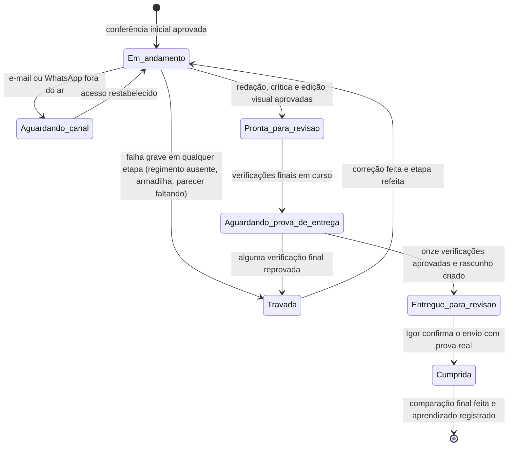

## Quem faz o quê

| Cor no mapa | Quem trabalha | O que faz |
|---|---|---|
| Azul | Programas automáticos do computador | Conferências repetitivas e incansáveis: prazos, citações, arquivos, impressões digitais, montagem do Word e do PDF, as onze verificações finais |
| Roxo | Inteligência artificial | O trabalho de análise: enquadrar o caso, planejar a peça, redigir, responder à sabatina de contestação, emitir os pareceres de Helena (estratégia) e Cícero (jurídico) |
| Laranja | Pessoas — Igor e Fábio | As decisões que só cabem a humanos: destravar pendências, revisar página por página, aprovar, enviar e dar a palavra final |

## As travas que nunca cedem

Nove situações interrompem o trabalho sempre, sem exceção:

1. Regimento do tribunal ausente da pasta ou não citado no mapa de fontes.
2. Armadilha escondida nos documentos sem exame humano registrado.
3. Parecer de Helena ou de Cícero ausente ou sem conteúdo real.
4. Falha grave apontada pelo verificador automático sem justificativa escrita.
5. Versão visual que não confere com o texto aprovado (a impressão digital denuncia qualquer alteração posterior).
6. Lacuna de preenchimento, nome interno da equipe, menção à origem dos arquivos ou aparência de texto de máquina na peça final.
7. Citação decisiva sem conferência palavra por palavra na fonte oficial.
8. Revisão de páginas não repetida depois de qualquer nova geração do arquivo.
9. Demanda dada por cumprida sem prova real da entrega.

## Os caminhos de volta

| A peça volta de... | ...para | Quando |
|---|---|---|
| Conferência da fila | Painel (Igor) | Pasta, pedido ou situação em contradição |
| Recebimento seguro | A própria etapa | Armadilha encontrada ou documento essencial faltando |
| Regimento e fontes | Busca do regimento oficial | Regimento ausente ou desatualizado |
| Plano e conselho | Os pareceres | Parecer vazio ou quadro de fatos incompleto |
| Conferência de citações | O plano da peça | Citação central inexistente: a tese precisa mudar |
| Redação e revisão crítica | A redação | Falha grave do verificador ou sabatina reprovada |
| Edição visual | Redação ou montagem | Defeito de conteúdo volta mais; defeito de montagem refaz menos |
| Fechamento | A etapa da verificação reprovada | Qualquer uma das onze verificações negada |
| Revisão do Fábio | A redação | Devolução com ajustes: nova versão e nova comparação |

---

# Aprofundamento — os mapas complementares

> Esta parte reúne, reescritos em linguagem simples, os demais mapas da documentação da fábrica: quem decide o quê, onde tudo funciona, os reforços de raciocínio em teste e o método de projetar a petição como uma intervenção.

## Quem decide o quê — a conversa entre as partes

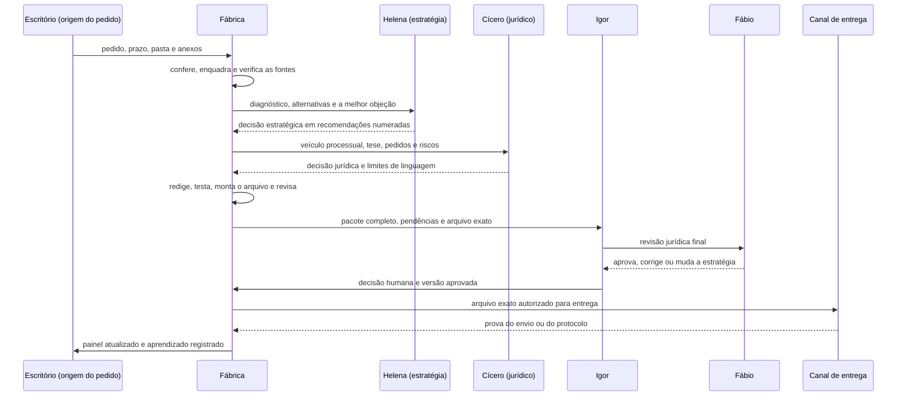

## Onde tudo funciona

Tudo roda no computador do escritório. Nada da peça passa por serviços externos, exceto as consultas às fontes oficiais.

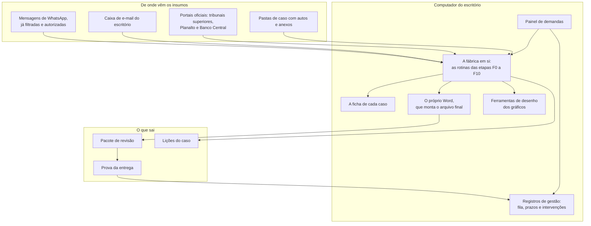

## As três camadas de verdade

A fábrica separa com rigor o que é gestão, o que é prova e o que é análise:

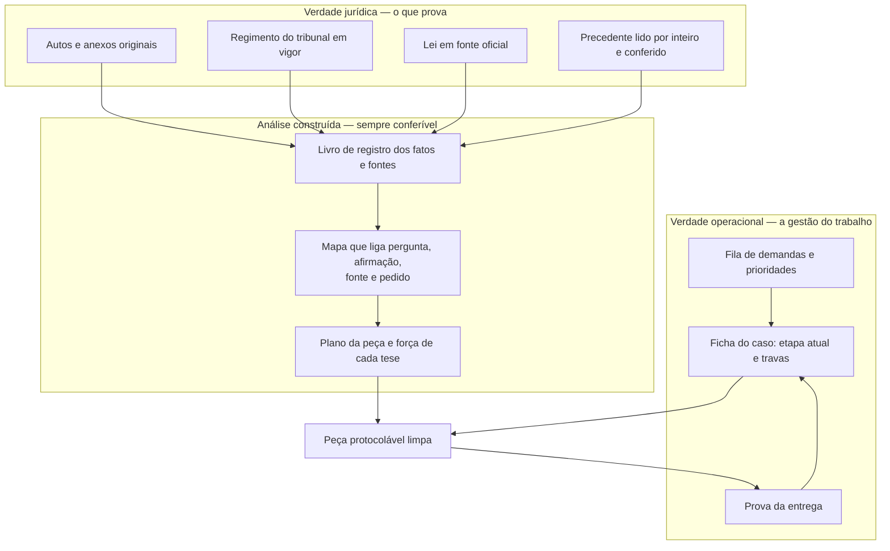

A regra de ouro: o painel de gestão organiza o trabalho, mas **nunca serve de prova jurídica**; e nenhuma demanda é dada por cumprida sem prova real da entrega.

## A camada de raciocínio e prova — os reforços em teste

Desde julho de 2026, uma camada extra de rigor roda por cima do fluxo, ainda em fase de observação: ela analisa e reporta, mas só trava os casos escolhidos como piloto. São seis reforços:

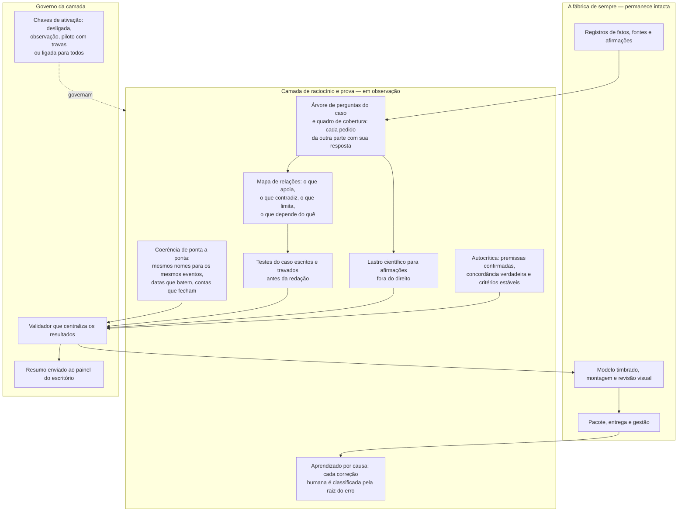

## Como a camada nova é ligada e desligada

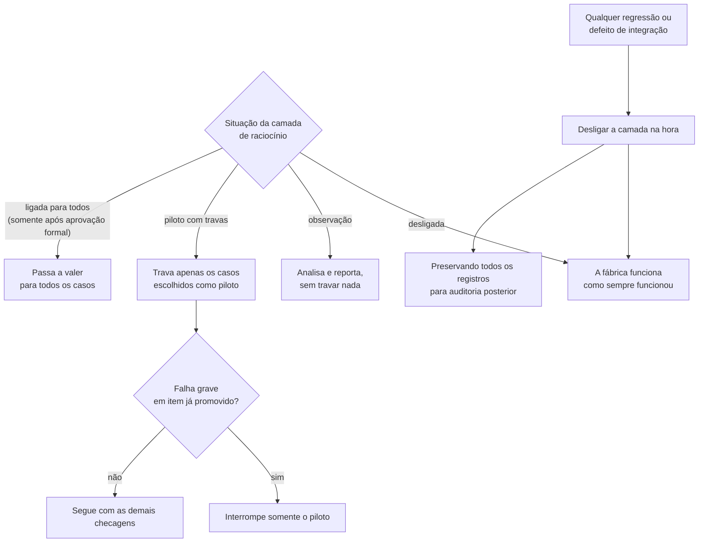

## O sistema não pode se aprovar sozinho

Uma proteção específica impede que a fábrica se autocertifique:

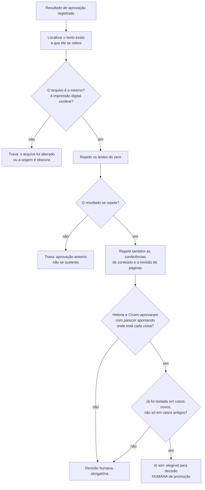

## Os casos de teste — situação em 11/07/2026

Quatro casos reais serviram de bancada de teste para a camada nova:

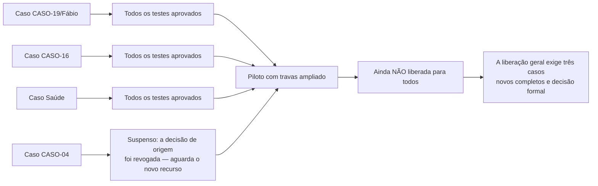

## A petição como projeto — o método do problema à solução

Em paralelo às etapas, a fábrica testa um método de engenharia de soluções adaptado ao direito (inspirado no professor holandês Joan van Aken): tratar cada petição como uma **intervenção projetada** — primeiro entender o problema, depois desenhar a solução, por fim validar antes de entregar.

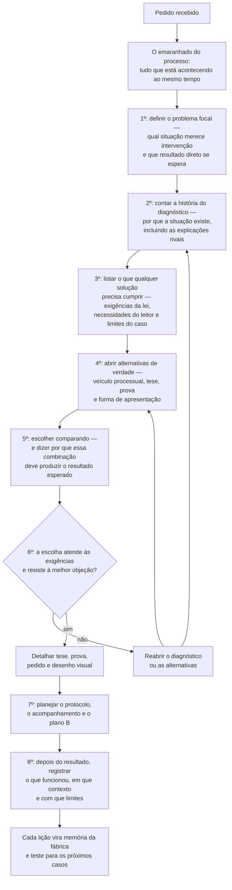

### O método e as etapas da fábrica, lado a lado

| Passo do método | Etapa da fábrica | Pergunta central | O que produz |
|---|---|---|---|
| Preparação | F0 e F1 | O que foi pedido e o que de fato chegou? | Pedido conferido e inventário dos documentos |
| 1º — Problema | F2 | Qual situação decisória merece intervenção? | Problema focal e resultado esperado |
| 2º — Diagnóstico | F3 e F4 | Por que a situação atual existe? | História diagnóstica com explicações rivais |
| 3º — Exigências | F4 | O que qualquer solução precisa cumprir? | Lista de exigências em quatro grupos |
| 4º — Alternativas | F4 e F5 | Quais caminhos são juridicamente viáveis? | Alternativas reais de solução |
| 5º — Escolha | F4 a F6 | Qual combinação atende melhor? | Arquitetura da peça e a razão da escolha |
| 6º — Validação | F7 e F7-B | Resiste à melhor objeção e preserva o conteúdo na escrita final? | Argumento de validação, testes e `final_markdown` auditável |
| 7º — Execução | F8 e F9 | Como protocolar, comunicar e acompanhar? | Plano de protocolo e pacote |
| 8º — Aprendizado | F10 e depois | O que funcionou e o que falhou? | Avaliação registrada para os próximos casos |

O método se aplica em três profundidades, conforme o caso: **leve** para questão única e simples, **completo** para recursos e respostas com várias teses, **intensivo** para casos de alto impacto, com ciência ou cálculo envolvidos. Em qualquer profundidade, a checagem jurídica final é a mesma.

## Disciplina de foco — trabalhar uma pergunta de cada vez

Para não se perder em processos volumosos, a fábrica organiza o conhecimento do caso em cinco camadas de proximidade, e trabalha sempre com a menor quantidade possível de material aberto:

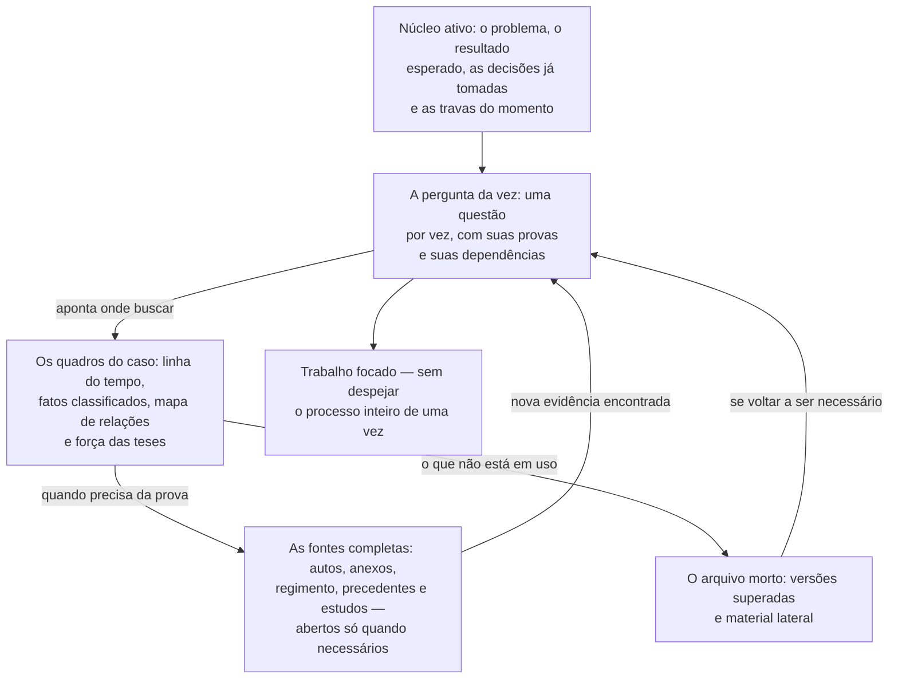

## O que está valendo, o que está em teste e o que está planejado

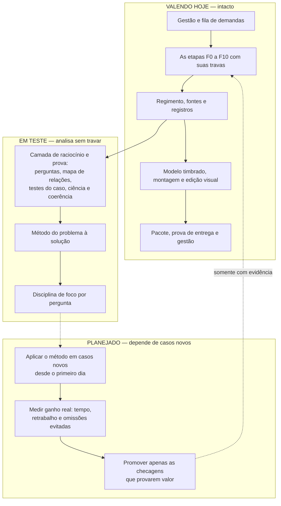
