<!-- IA_NAVIGACAO:GERADO_AUTO:v1 -->
# Mapa IA - _FORJA_HARNESS

Atualizado automaticamente em: **2026-08-05 13:32:40 -0300**

- Caminho: `C:\Users\IgorPC\.claude\projects\Escritório fabio osório\fabricas de melhoria de petições\_FORJA_HARNESS`
- Tipo: **pasta de caso/produção**
- Função para navegação: contém peça, parecer, memorial, relatório ou plano
- Conteúdo recursivo: **9329 arquivos**, **626 subpastas**, **842.4 MB**
- Tipos de arquivo: .json: 5621, .md: 1680, .png: 629, .pyc: 330, .py: 316, .svg: 156, .mmd: 138, .txt: 80, .pdf: 66, .jsonl: 55, +19 tipos
- Mapa raiz: [MAPA_IA.md](<../MAPA_IA.md>)
- Índice geral: [INDICE_GERAL_IA.md](<../00_IA_NAVIGACAO/INDICE_GERAL_IA.md>)
- Protocolo de navegação: [PROTOCOLO_NAVEGACAO_IA.md](<../00_IA_NAVIGACAO/PROTOCOLO_NAVEGACAO_IA.md>)
- Inventário JSON para agentes: [inventario_ia.json](<../00_IA_NAVIGACAO/dados/inventario_ia.json>)
- Mapa superior: [fabricas de melhoria de petições](<../MAPA_IA.md>)

## GPS Mermaid

```mermaid
flowchart TD
  Na81d4f690d["_FORJA_HARNESS<br/>pasta de caso/produção<br/>9329 arquivos / 626 subpastas"]
  Nabe59c188b["subir: fabricas de melhoria de petições"]
  Na81d4f690d --> Nabe59c188b
  click Nabe59c188b "../MAPA_IA.md" "Abrir mapa superior"
  Ncabb626bc1[".agents<br/>pasta organizadora<br/>1 arquivos"]
  Na81d4f690d --> Ncabb626bc1
  click Ncabb626bc1 ".agents/MAPA_IA.md" "Abrir mapa da pasta"
  Ndfd5b06886[".claude<br/>pasta auxiliar<br/>1 arquivos"]
  Na81d4f690d --> Ndfd5b06886
  click Ndfd5b06886 ".claude/MAPA_IA.md" "Abrir mapa da pasta"
  N028c7ff482[".codex<br/>pasta auxiliar<br/>1 arquivos"]
  Na81d4f690d --> N028c7ff482
  click N028c7ff482 ".codex/MAPA_IA.md" "Abrir mapa da pasta"
  N1d6ee505ad[".planning<br/>pasta organizadora<br/>224 arquivos"]
  Na81d4f690d --> N1d6ee505ad
  click N1d6ee505ad ".planning/MAPA_IA.md" "Abrir mapa da pasta"
  N2b3aa9b789[".playwright-mcp<br/>pasta auxiliar<br/>11 arquivos"]
  Na81d4f690d --> N2b3aa9b789
  click N2b3aa9b789 ".playwright-mcp/MAPA_IA.md" "Abrir mapa da pasta"
  N987f9ec24d[".pytest_cache<br/>pasta organizadora<br/>5 arquivos"]
  Na81d4f690d --> N987f9ec24d
  click N987f9ec24d ".pytest_cache/MAPA_IA.md" "Abrir mapa da pasta"
  Nec0beb1575[".ruff_cache<br/>pasta organizadora<br/>39 arquivos"]
  Na81d4f690d --> Nec0beb1575
  click Nec0beb1575 ".ruff_cache/MAPA_IA.md" "Abrir mapa da pasta"
  N9a757ca8b7["00_MAPA_ARQUITETURA_IA<br/>pasta organizadora<br/>73 arquivos"]
  Na81d4f690d --> N9a757ca8b7
  click N9a757ca8b7 "00_MAPA_ARQUITETURA_IA/MAPA_IA.md" "Abrir mapa da pasta"
  Nc972326b17["00_MAPA_ARQUITURA_IA<br/>pasta auxiliar<br/>1 arquivos"]
  Na81d4f690d --> Nc972326b17
  click Nc972326b17 "00_MAPA_ARQUITURA_IA/MAPA_IA.md" "Abrir mapa da pasta"
  N21be76e174["__pycache__<br/>artefatos técnicos<br/>326 arquivos"]
  Na81d4f690d --> N21be76e174
  click N21be76e174 "__pycache__/MAPA_IA.md" "Abrir mapa da pasta"
  Nf94b023b38["_scripts_oneoff<br/>pasta auxiliar<br/>21 arquivos"]
  Na81d4f690d --> Nf94b023b38
  click Nf94b023b38 "_scripts_oneoff/MAPA_IA.md" "Abrir mapa da pasta"
  Na78e1d93bf["ar_architecture<br/>pasta organizadora<br/>2 arquivos"]
  Na81d4f690d --> Na78e1d93bf
  click Na78e1d93bf "ar_architecture/MAPA_IA.md" "Abrir mapa da pasta"
  Ncaf3d73e84["autoresearch<br/>pasta organizadora<br/>241 arquivos"]
  Na81d4f690d --> Ncaf3d73e84
  click Ncaf3d73e84 "autoresearch/MAPA_IA.md" "Abrir mapa da pasta"
  Nb0f68dbe3a["bancada_cafelana_v7<br/>pasta de caso/produção<br/>45 arquivos"]
  Na81d4f690d --> Nb0f68dbe3a
  click Nb0f68dbe3a "bancada_cafelana_v7/MAPA_IA.md" "Abrir mapa da pasta"
  N3bc1519122["blender_atlas<br/>pasta auxiliar<br/>0 arquivos"]
  Na81d4f690d --> N3bc1519122
  click N3bc1519122 "blender_atlas/MAPA_IA.md" "Abrir mapa da pasta"
  N76288e550d["cache<br/>pasta de caso/produção<br/>57 arquivos"]
  Na81d4f690d --> N76288e550d
  click N76288e550d "cache/MAPA_IA.md" "Abrir mapa da pasta"
  N3adc499bb9["contracts<br/>pasta auxiliar<br/>2 arquivos"]
  Na81d4f690d --> N3adc499bb9
  click N3adc499bb9 "contracts/MAPA_IA.md" "Abrir mapa da pasta"
  N7aa9a35d7d["docs<br/>pasta auxiliar<br/>6 arquivos"]
  Na81d4f690d --> N7aa9a35d7d
  click N7aa9a35d7d "docs/MAPA_IA.md" "Abrir mapa da pasta"
  N12507007a7["FORJA<br/>pasta auxiliar<br/>1 arquivos"]
  Na81d4f690d --> N12507007a7
  click N12507007a7 "FORJA/MAPA_IA.md" "Abrir mapa da pasta"
  N7b0ed0504f["graphify-out<br/>pasta organizadora<br/>14 arquivos"]
  Na81d4f690d --> N7b0ed0504f
  click N7b0ed0504f "graphify-out/MAPA_IA.md" "Abrir mapa da pasta"
  Nfb307e1878["learning_registry<br/>pasta auxiliar<br/>1 arquivos"]
  Na81d4f690d --> Nfb307e1878
  click Nfb307e1878 "learning_registry/MAPA_IA.md" "Abrir mapa da pasta"
  Ne68582bf68["n4_fixtures<br/>pasta organizadora<br/>3 arquivos"]
  Na81d4f690d --> Ne68582bf68
  click Ne68582bf68 "n4_fixtures/MAPA_IA.md" "Abrir mapa da pasta"
  N0dbe46a852["n4_schemas<br/>pasta auxiliar<br/>34 arquivos"]
  Na81d4f690d --> N0dbe46a852
  click N0dbe46a852 "n4_schemas/MAPA_IA.md" "Abrir mapa da pasta"
  N00b24d5188["PETICAO_ACORDO_DOUTORADO_FORJA_20260715<br/>demanda operacional<br/>4 arquivos"]
  Na81d4f690d --> N00b24d5188
  click N00b24d5188 "PETICAO_ACORDO_DOUTORADO_FORJA_20260715/MAPA_IA.md" "Abrir mapa da pasta"
  N81c11658f9["PETICAO_ENDERECO_EXEQUIBILIDADE_FORJA_20260715<br/>demanda operacional<br/>4 arquivos"]
  Na81d4f690d --> N81c11658f9
  click N81c11658f9 "PETICAO_ENDERECO_EXEQUIBILIDADE_FORJA_20260715/MAPA_IA.md" "Abrir mapa da pasta"
  N28bb995ba1["phase_contracts<br/>pasta auxiliar<br/>11 arquivos"]
  Na81d4f690d --> N28bb995ba1
  click N28bb995ba1 "phase_contracts/MAPA_IA.md" "Abrir mapa da pasta"
  N7af17c9a36["phase_contracts_n4<br/>pasta auxiliar<br/>12 arquivos"]
  Na81d4f690d --> N7af17c9a36
  click N7af17c9a36 "phase_contracts_n4/MAPA_IA.md" "Abrir mapa da pasta"
  N27cde96529["planejamento<br/>área de trabalho<br/>52 arquivos"]
  Na81d4f690d --> N27cde96529
  click N27cde96529 "planejamento/MAPA_IA.md" "Abrir mapa da pasta"
  N917a7f915c["private<br/>pasta organizadora<br/>1 arquivos"]
  Na81d4f690d --> N917a7f915c
  click N917a7f915c "private/MAPA_IA.md" "Abrir mapa da pasta"
  Ne810c33b5e["pso_schemas<br/>pasta auxiliar<br/>2 arquivos"]
  Na81d4f690d --> Ne810c33b5e
  click Ne810c33b5e "pso_schemas/MAPA_IA.md" "Abrir mapa da pasta"
  N29fdb4d95d["AGENTS.md<br/>regras obrigatórias para agentes"]
  Na81d4f690d --> N29fdb4d95d
  click N29fdb4d95d "AGENTS.md" "Abrir arquivo"
  Nb6a112290c["README.md<br/>instruções locais da pasta"]
  Na81d4f690d --> Nb6a112290c
  click Nb6a112290c "README.md" "Abrir arquivo"
  N468c9b3b25["INDICE_FORJA.md<br/>índice/mapa existente"]
  Na81d4f690d --> N468c9b3b25
  click N468c9b3b25 "INDICE_FORJA.md" "Abrir arquivo"
  Nae01332bb8["INDICE_FORJA.md.bak-doctorplus-1785784981<br/>índice/mapa existente"]
  Na81d4f690d --> Nae01332bb8
  click Nae01332bb8 "INDICE_FORJA.md.bak-doctorplus-1785784981" "Abrir arquivo"
  Ne50c3dda7b["MEMORIAL_AZIMUT_12_PONTOS.txt<br/>peça, minuta, parecer ou memorial"]
  Na81d4f690d --> Ne50c3dda7b
  click Ne50c3dda7b "MEMORIAL_AZIMUT_12_PONTOS.txt" "Abrir arquivo"
  N532dcbfedc["MEMORIAL_AZIMUT_REsp_2237713_SP_DRAFT.md<br/>peça, minuta, parecer ou memorial"]
  Na81d4f690d --> N532dcbfedc
  click N532dcbfedc "MEMORIAL_AZIMUT_REsp_2237713_SP_DRAFT.md" "Abrir arquivo"
  N63d1fa630f["APRENDIZADOS_CONSELHO_N4_2026-07-11.md<br/>relatório, auditoria, checklist ou aprendizado"]
  Na81d4f690d --> N63d1fa630f
  click N63d1fa630f "APRENDIZADOS_CONSELHO_N4_2026-07-11.md" "Abrir arquivo"
  Ncc7e0777fc["AUDITORIA_PERDAS_2026-08-05.md<br/>relatório, auditoria, checklist ou aprendizado"]
  Na81d4f690d --> Ncc7e0777fc
  click Ncc7e0777fc "AUDITORIA_PERDAS_2026-08-05.md" "Abrir arquivo"
  Ncd93e4385e["RELATORIO_EVIDENCIA_GATE_DOCUMENTAL_2026-08.html<br/>relatório, auditoria, checklist ou aprendizado"]
  Na81d4f690d --> Ncd93e4385e
  click Ncd93e4385e "RELATORIO_EVIDENCIA_GATE_DOCUMENTAL_2026-08.html" "Abrir arquivo"
  N528318a7c7["RELATORIO_EVIDENCIA_GATE_DOCUMENTAL_2026-08.md<br/>relatório, auditoria, checklist ou aprendizado"]
  Na81d4f690d --> N528318a7c7
  click N528318a7c7 "RELATORIO_EVIDENCIA_GATE_DOCUMENTAL_2026-08.md" "Abrir arquivo"
  Nc8600bec4e["RELATORIO_REVISAO_CRUZADA_GATE_DOCUMENTAL_2026-08.md<br/>relatório, auditoria, checklist ou aprendizado"]
  Na81d4f690d --> Nc8600bec4e
  click Nc8600bec4e "RELATORIO_REVISAO_CRUZADA_GATE_DOCUMENTAL_2026-08.md" "Abrir arquivo"
  N599b71f2d7["RELATORIO_REVISAO_DIABOB_GATE_DOCUMENTAL_2026-08.md<br/>relatório, auditoria, checklist ou aprendizado"]
  Na81d4f690d --> N599b71f2d7
  click N599b71f2d7 "RELATORIO_REVISAO_DIABOB_GATE_DOCUMENTAL_2026-08.md" "Abrir arquivo"
  N12ba913a22["mais 5 subpastas listadas abaixo"]
  Na81d4f690d --> N12ba913a22
```

## Ordem de leitura recomendada

1. Ler este `MAPA_IA.md` antes de abrir arquivos pesados.
2. Subir para a raiz se precisar das regras globais `AGENTS.md`, `CLAUDE.md` e `_LEIS_GERAIS`.
3. Para fatos, datas, citações e IDs: verificar nos anexos/fontes antes de afirmar.
4. Usar builds, renders e QA apenas para validar entrega ou rastrear geração; não começar por eles.

## Subpastas diretas

| Subpasta | Tipo | Conteúdo | Atualização | Próximo passo |
|---|---|---:|---:|---|
| [.agents](<.agents/MAPA_IA.md>) | pasta organizadora | 1 arquivos / 2 subpastas | 2026-07-29 22:47 | agrega subpastas; abrir mapa filho conforme objetivo |
| [.claude](<.claude/MAPA_IA.md>) | pasta auxiliar | 1 arquivos / 0 subpastas | 2026-07-12 12:56 | conteúdo auxiliar ou residual |
| [.codex](<.codex/MAPA_IA.md>) | pasta auxiliar | 1 arquivos / 0 subpastas | 2026-08-05 02:50 | conteúdo auxiliar ou residual |
| [.planning](<.planning/MAPA_IA.md>) | pasta organizadora | 224 arquivos / 12 subpastas | 2026-08-05 03:09 | agrega subpastas; abrir mapa filho conforme objetivo |
| [.playwright-mcp](<.playwright-mcp/MAPA_IA.md>) | pasta auxiliar | 11 arquivos / 0 subpastas | 2026-07-23 13:59 | conteúdo auxiliar ou residual |
| [.pytest_cache](<.pytest_cache/MAPA_IA.md>) | pasta organizadora | 5 arquivos / 2 subpastas | 2026-08-05 08:04 | agrega subpastas; abrir mapa filho conforme objetivo |
| [.ruff_cache](<.ruff_cache/MAPA_IA.md>) | pasta organizadora | 39 arquivos / 1 subpastas | 2026-08-05 00:52 | agrega subpastas; abrir mapa filho conforme objetivo |
| [00_MAPA_ARQUITETURA_IA](<00_MAPA_ARQUITETURA_IA/MAPA_IA.md>) | pasta organizadora | 73 arquivos / 5 subpastas | 2026-08-05 03:09 | agrega subpastas; abrir mapa filho conforme objetivo |
| [00_MAPA_ARQUITURA_IA](<00_MAPA_ARQUITURA_IA/MAPA_IA.md>) | pasta auxiliar | 1 arquivos / 0 subpastas | 2026-08-05 02:50 | conteúdo auxiliar ou residual |
| [__pycache__](<__pycache__/MAPA_IA.md>) | artefatos técnicos | 326 arquivos / 0 subpastas | 2026-08-05 07:27 | build, extração ou QA; ler só quando precisar validar entrega |
| [_scripts_oneoff](<_scripts_oneoff/MAPA_IA.md>) | pasta auxiliar | 21 arquivos / 0 subpastas | 2026-08-05 03:09 | conteúdo auxiliar ou residual |
| [ar_architecture](<ar_architecture/MAPA_IA.md>) | pasta organizadora | 2 arquivos / 3 subpastas | 2026-07-29 01:22 | agrega subpastas; abrir mapa filho conforme objetivo |
| [autoresearch](<autoresearch/MAPA_IA.md>) | pasta organizadora | 241 arquivos / 37 subpastas | 2026-08-05 03:10 | agrega subpastas; abrir mapa filho conforme objetivo |
| [bancada_cafelana_v7](<bancada_cafelana_v7/MAPA_IA.md>) | pasta de caso/produção | 45 arquivos / 14 subpastas | 2026-07-27 16:22 | contém peça, parecer, memorial, relatório ou plano |
| [blender_atlas](<blender_atlas/MAPA_IA.md>) | pasta auxiliar | 0 arquivos / 0 subpastas | - | conteúdo auxiliar ou residual |
| [cache](<cache/MAPA_IA.md>) | pasta de caso/produção | 57 arquivos / 5 subpastas | 2026-08-05 03:09 | contém peça, parecer, memorial, relatório ou plano |
| [contracts](<contracts/MAPA_IA.md>) | pasta auxiliar | 2 arquivos / 0 subpastas | 2026-07-12 14:50 | conteúdo auxiliar ou residual |
| [docs](<docs/MAPA_IA.md>) | pasta auxiliar | 6 arquivos / 0 subpastas | 2026-08-05 03:09 | conteúdo auxiliar ou residual |
| [FORJA](<FORJA/MAPA_IA.md>) | pasta auxiliar | 1 arquivos / 0 subpastas | 2026-07-10 03:38 | conteúdo auxiliar ou residual |
| [graphify-out](<graphify-out/MAPA_IA.md>) | pasta organizadora | 14 arquivos / 3 subpastas | 2026-08-05 03:09 | agrega subpastas; abrir mapa filho conforme objetivo |
| [learning_registry](<learning_registry/MAPA_IA.md>) | pasta auxiliar | 1 arquivos / 0 subpastas | 2026-07-29 01:09 | conteúdo auxiliar ou residual |
| [n4_fixtures](<n4_fixtures/MAPA_IA.md>) | pasta organizadora | 3 arquivos / 1 subpastas | 2026-07-29 01:08 | agrega subpastas; abrir mapa filho conforme objetivo |
| [n4_schemas](<n4_schemas/MAPA_IA.md>) | pasta auxiliar | 34 arquivos / 0 subpastas | 2026-07-29 16:13 | conteúdo auxiliar ou residual |
| [PETICAO_ACORDO_DOUTORADO_FORJA_20260715](<PETICAO_ACORDO_DOUTORADO_FORJA_20260715/MAPA_IA.md>) | demanda operacional | 4 arquivos / 0 subpastas | 2026-07-15 16:20 | começar pelo comando e anexos antes de produzir |
| [PETICAO_ENDERECO_EXEQUIBILIDADE_FORJA_20260715](<PETICAO_ENDERECO_EXEQUIBILIDADE_FORJA_20260715/MAPA_IA.md>) | demanda operacional | 4 arquivos / 0 subpastas | 2026-07-15 16:20 | começar pelo comando e anexos antes de produzir |
| [phase_contracts](<phase_contracts/MAPA_IA.md>) | pasta auxiliar | 11 arquivos / 0 subpastas | 2026-08-04 10:22 | conteúdo auxiliar ou residual |
| [phase_contracts_n4](<phase_contracts_n4/MAPA_IA.md>) | pasta auxiliar | 12 arquivos / 0 subpastas | 2026-07-29 16:13 | conteúdo auxiliar ou residual |
| [planejamento](<planejamento/MAPA_IA.md>) | área de trabalho | 52 arquivos / 2 subpastas | 2026-08-05 04:03 | planejamento, execução, documentação ou material visual |
| [private](<private/MAPA_IA.md>) | pasta organizadora | 1 arquivos / 1 subpastas | 2026-08-05 13:23 | agrega subpastas; abrir mapa filho conforme objetivo |
| [pso_schemas](<pso_schemas/MAPA_IA.md>) | pasta auxiliar | 2 arquivos / 0 subpastas | 2026-07-11 18:34 | conteúdo auxiliar ou residual |
| [reports](<reports/MAPA_IA.md>) | pasta de caso/produção | 1429 arquivos / 14 subpastas | 2026-08-05 13:15 | contém peça, parecer, memorial, relatório ou plano |
| [state](<state/MAPA_IA.md>) | pasta organizadora | 5644 arquivos / 464 subpastas | 2026-08-05 13:23 | agrega subpastas; abrir mapa filho conforme objetivo |
| [telemetria](<telemetria/MAPA_IA.md>) | pasta organizadora | 750 arquivos / 22 subpastas | 2026-08-05 08:08 | agrega subpastas; abrir mapa filho conforme objetivo |
| [templates](<templates/MAPA_IA.md>) | pasta auxiliar | 5 arquivos / 0 subpastas | 2026-08-05 03:09 | conteúdo auxiliar ou residual |
| [youtube-transcript](<youtube-transcript/MAPA_IA.md>) | pasta organizadora | 6 arquivos / 3 subpastas | 2026-07-24 18:23 | agrega subpastas; abrir mapa filho conforme objetivo |

## Arquivos diretos

| Arquivo | Papel | Tamanho | Modificado | Observação |
|---|---:|---:|---:|---|
| [AGENTS.md](<AGENTS.md>) | regras | 3.3 KB | 2026-08-05 03:09 | regras obrigatórias para agentes \| tópicos: Instruções locais para agentes; Porta de entrada AI-friendly; Protocolo Archify + Graphify |
| [README.md](<README.md>) | regras | 9.1 KB | 2026-08-05 03:09 | instruções locais da pasta \| tópicos: FORJA — Fábrica de Melhoria de Petições; Estado do sistema; Gates anti-autocertificação obrigatórios |
| [INDICE_FORJA.md](<INDICE_FORJA.md>) | mapa/índice | 28.9 KB | 2026-08-05 06:36 | índice/mapa existente \| tópicos: Índice FORJA — 1 tela; GATES COMPUTADOS — fim da autovalidação (04/08/2026); LAPIDACAO AO RIGOR DO SQLITE TEST HARNESS (05/08/2026) |
| [INDICE_FORJA.md.bak-doctorplus-1785784981](<INDICE_FORJA.md.bak-doctorplus-1785784981>) | mapa/índice | 17.4 KB | 2026-08-03 16:23 | índice/mapa existente |
| [MEMORIAL_AZIMUT_12_PONTOS.txt](<MEMORIAL_AZIMUT_12_PONTOS.txt>) | peça/trabalho | 34.4 KB | 2026-07-08 23:10 | peça, minuta, parecer ou memorial |
| [MEMORIAL_AZIMUT_REsp_2237713_SP_DRAFT.md](<MEMORIAL_AZIMUT_REsp_2237713_SP_DRAFT.md>) | peça/trabalho | 19.6 KB | 2026-07-08 23:15 | peça, minuta, parecer ou memorial \| tópicos: MEMORIAL — RESP 2.237.713/SP; AZIMUT DO BRASIL FABRICAÇÃO DE IATES LTDA v. BRADESCO AUTO/RE COMPANHIA DE SEGUROS; 1. SÍNTESE EXECUTIVA (ART. 343-A RISTJ) |
| [APRENDIZADOS_CONSELHO_N4_2026-07-11.md](<APRENDIZADOS_CONSELHO_N4_2026-07-11.md>) | relatório/auditoria | 3.2 KB | 2026-07-11 01:37 | relatório, auditoria, checklist ou aprendizado \| tópicos: Aprendizados do Conselho FORJA N4; Decisão que deve sobreviver às próximas sessões; Estado canônico |
| [AUDITORIA_PERDAS_2026-08-05.md](<AUDITORIA_PERDAS_2026-08-05.md>) | relatório/auditoria | 3.6 KB | 2026-08-05 12:31 | relatório, auditoria, checklist ou aprendizado \| tópicos: Auditoria de perdas — o que a cirurgia apagou e o que foi recuperado; Resultado: nada foi perdido; para cada caminho da árvore do backup ausente do HEAD: |
| [RELATORIO_EVIDENCIA_GATE_DOCUMENTAL_2026-08.html](<RELATORIO_EVIDENCIA_GATE_DOCUMENTAL_2026-08.html>) | relatório/auditoria | 12.6 KB | 2026-08-05 03:09 | relatório, auditoria, checklist ou aprendizado |
| [RELATORIO_EVIDENCIA_GATE_DOCUMENTAL_2026-08.md](<RELATORIO_EVIDENCIA_GATE_DOCUMENTAL_2026-08.md>) | relatório/auditoria | 39.0 KB | 2026-08-05 03:09 | relatório, auditoria, checklist ou aprendizado \| tópicos: Memória de evidências — FORJA-LASTRO-v2 e materialização visual sem renderização; 1. Veredito executivo; 2. Requisito, mecanismo e evidência |
| [RELATORIO_REVISAO_CRUZADA_GATE_DOCUMENTAL_2026-08.md](<RELATORIO_REVISAO_CRUZADA_GATE_DOCUMENTAL_2026-08.md>) | relatório/auditoria | 10.0 KB | 2026-08-04 03:45 | relatório, auditoria, checklist ou aprendizado \| tópicos: Revisão cruzada independente — FORJA-LASTRO-v2; Veredito; Evidência lida |
| [RELATORIO_REVISAO_DIABOB_GATE_DOCUMENTAL_2026-08.md](<RELATORIO_REVISAO_DIABOB_GATE_DOCUMENTAL_2026-08.md>) | relatório/auditoria | 6.7 KB | 2026-08-04 03:42 | relatório, auditoria, checklist ou aprendizado \| tópicos: Revisão Diabob — FORJA-LASTRO-v2 e Plano 41; Verdict; O autoengano encontrado |
| [adocao_resultado.json](<adocao_resultado.json>) | dados/script | 16.3 KB | 2026-08-05 02:50 | dado estruturado ou rotina técnica |
| [AR_ARCH_MANIFEST.json](<AR_ARCH_MANIFEST.json>) | dados/script | 1.9 KB | 2026-07-29 00:17 | dado estruturado ou rotina técnica |
| [BASELINE_APROVADO.json](<BASELINE_APROVADO.json>) | dados/script | 2.8 KB | 2026-08-05 05:51 | dado estruturado ou rotina técnica |
| [CALIBRACAO_GATES_ECONOMICOS.json](<CALIBRACAO_GATES_ECONOMICOS.json>) | dados/script | 16.4 KB | 2026-08-03 23:23 | dado estruturado ou rotina técnica |
| [CALIBRACAO_MONETARIA.json](<CALIBRACAO_MONETARIA.json>) | dados/script | 2.8 KB | 2026-08-03 23:10 | dado estruturado ou rotina técnica |
| [calibrar_mapa_gen.py](<calibrar_mapa_gen.py>) | dados/script | 6.9 KB | 2026-07-30 13:20 | dado estruturado ou rotina técnica |
| [CANARIO_CATRACA.json](<CANARIO_CATRACA.json>) | dados/script | 5.1 KB | 2026-08-04 20:35 | dado estruturado ou rotina técnica |
| [debug_contagem.py](<debug_contagem.py>) | dados/script | 784 B | 2026-08-05 06:24 | dado estruturado ou rotina técnica |
| [forja_adocao_rota.py](<forja_adocao_rota.py>) | dados/script | 10.1 KB | 2026-08-05 05:51 | dado estruturado ou rotina técnica |
| [forja_adversarial_audit.py](<forja_adversarial_audit.py>) | dados/script | 25.0 KB | 2026-07-10 22:30 | dado estruturado ou rotina técnica |
| [forja_adversarial_gate.py](<forja_adversarial_gate.py>) | dados/script | 13.9 KB | 2026-08-04 16:33 | dado estruturado ou rotina técnica |
| [forja_alertas.py](<forja_alertas.py>) | dados/script | 7.7 KB | 2026-07-16 19:34 | dado estruturado ou rotina técnica |
| [forja_ar_architecture.py](<forja_ar_architecture.py>) | dados/script | 22.3 KB | 2026-07-29 01:21 | dado estruturado ou rotina técnica |
| [forja_ar_blind.py](<forja_ar_blind.py>) | dados/script | 10.9 KB | 2026-07-23 23:10 | dado estruturado ou rotina técnica |
| [forja_ar_canarios.py](<forja_ar_canarios.py>) | dados/script | 5.5 KB | 2026-07-23 02:01 | dado estruturado ou rotina técnica |
| [forja_ar_ciclo.py](<forja_ar_ciclo.py>) | dados/script | 19.8 KB | 2026-07-23 20:53 | dado estruturado ou rotina técnica |
| [forja_ar_corpus.py](<forja_ar_corpus.py>) | dados/script | 14.0 KB | 2026-07-23 02:03 | dado estruturado ou rotina técnica |
| [forja_ar_evolucao.py](<forja_ar_evolucao.py>) | dados/script | 8.8 KB | 2026-07-23 02:37 | dado estruturado ou rotina técnica |
| [forja_ar_indicadores.py](<forja_ar_indicadores.py>) | dados/script | 13.8 KB | 2026-07-23 02:01 | dado estruturado ou rotina técnica |
| [forja_ar_runpair.py](<forja_ar_runpair.py>) | dados/script | 7.6 KB | 2026-07-23 23:11 | dado estruturado ou rotina técnica |
| [forja_artefatos.py](<forja_artefatos.py>) | dados/script | 10.4 KB | 2026-08-04 14:46 | dado estruturado ou rotina técnica |
| [forja_assinatura_visual.py](<forja_assinatura_visual.py>) | dados/script | 16.1 KB | 2026-08-05 05:51 | dado estruturado ou rotina técnica |
| [forja_authorities.py](<forja_authorities.py>) | dados/script | 9.1 KB | 2026-07-23 14:21 | dado estruturado ou rotina técnica |
| [forja_axi.py](<forja_axi.py>) | dados/script | 28.8 KB | 2026-07-29 22:53 | dado estruturado ou rotina técnica |
| [forja_baseline.py](<forja_baseline.py>) | dados/script | 10.9 KB | 2026-08-05 05:51 | dado estruturado ou rotina técnica |
| [forja_baseline_aprovado.py](<forja_baseline_aprovado.py>) | dados/script | 7.8 KB | 2026-08-05 05:51 | dado estruturado ou rotina técnica |
| [forja_bench_modelos.py](<forja_bench_modelos.py>) | dados/script | 13.9 KB | 2026-07-26 01:24 | dado estruturado ou rotina técnica |
| [forja_calibra_gates_economicos.py](<forja_calibra_gates_economicos.py>) | dados/script | 5.7 KB | 2026-08-03 23:20 | dado estruturado ou rotina técnica |
| [forja_calibra_monetario.py](<forja_calibra_monetario.py>) | dados/script | 6.7 KB | 2026-08-03 16:50 | dado estruturado ou rotina técnica |
| [forja_canario_catraca.py](<forja_canario_catraca.py>) | dados/script | 7.5 KB | 2026-08-04 20:30 | dado estruturado ou rotina técnica |
| [forja_canario_mutacao.py](<forja_canario_mutacao.py>) | dados/script | 16.3 KB | 2026-08-05 05:51 | dado estruturado ou rotina técnica |
| [forja_case_tests.py](<forja_case_tests.py>) | dados/script | 11.4 KB | 2026-07-11 01:14 | dado estruturado ou rotina técnica |
| [forja_citations.py](<forja_citations.py>) | dados/script | 26.8 KB | 2026-08-04 13:25 | dado estruturado ou rotina técnica |
| [forja_claim_binding.py](<forja_claim_binding.py>) | dados/script | 4.7 KB | 2026-07-23 14:29 | dado estruturado ou rotina técnica |
| [forja_close_cycle.py](<forja_close_cycle.py>) | dados/script | 11.3 KB | 2026-08-04 12:31 | dado estruturado ou rotina técnica |
| [forja_conselho.py](<forja_conselho.py>) | dados/script | 11.9 KB | 2026-08-04 18:45 | dado estruturado ou rotina técnica |
| [forja_consistency.py](<forja_consistency.py>) | dados/script | 14.3 KB | 2026-07-11 01:19 | dado estruturado ou rotina técnica |
| [forja_context.py](<forja_context.py>) | dados/script | 13.0 KB | 2026-08-05 05:51 | dado estruturado ou rotina técnica |
| [forja_contexto.py](<forja_contexto.py>) | dados/script | 10.9 KB | 2026-08-04 16:39 | dado estruturado ou rotina técnica |
| [forja_delivery.py](<forja_delivery.py>) | dados/script | 25.9 KB | 2026-08-04 00:38 | dado estruturado ou rotina técnica |
| [forja_delivery_integrity.py](<forja_delivery_integrity.py>) | dados/script | 6.7 KB | 2026-07-29 00:11 | dado estruturado ou rotina técnica |
| [forja_diabob.py](<forja_diabob.py>) | dados/script | 3.6 KB | 2026-07-26 00:39 | dado estruturado ou rotina técnica |
| [forja_diff_docx.py](<forja_diff_docx.py>) | dados/script | 8.3 KB | 2026-08-05 03:09 | dado estruturado ou rotina técnica |
| [forja_document_compare.py](<forja_document_compare.py>) | dados/script | 25.0 KB | 2026-07-29 01:07 | dado estruturado ou rotina técnica |
| [forja_docx_layout.py](<forja_docx_layout.py>) | dados/script | 43.8 KB | 2026-08-05 03:09 | dado estruturado ou rotina técnica |
| [forja_editorial.py](<forja_editorial.py>) | dados/script | 24.5 KB | 2026-07-27 15:22 | dado estruturado ou rotina técnica |
| [forja_editorial_fidelity.py](<forja_editorial_fidelity.py>) | dados/script | 16.8 KB | 2026-08-04 14:41 | dado estruturado ou rotina técnica |
| [forja_editorial_model.py](<forja_editorial_model.py>) | dados/script | 5.2 KB | 2026-07-27 15:20 | dado estruturado ou rotina técnica |
| [forja_email.py](<forja_email.py>) | dados/script | 5.4 KB | 2026-08-04 01:07 | dado estruturado ou rotina técnica |
| [forja_entrega.py](<forja_entrega.py>) | dados/script | 14.0 KB | 2026-08-04 20:42 | dado estruturado ou rotina técnica |
| [forja_estilo_humano.py](<forja_estilo_humano.py>) | dados/script | 25.5 KB | 2026-07-27 17:31 | dado estruturado ou rotina técnica |
| [forja_exploracao_100.py](<forja_exploracao_100.py>) | dados/script | 51.2 KB | 2026-08-05 05:51 | dado estruturado ou rotina técnica |
| [forja_f10_contract.py](<forja_f10_contract.py>) | dados/script | 3.4 KB | 2026-08-04 12:31 | dado estruturado ou rotina técnica |
| [forja_f2_check.py](<forja_f2_check.py>) | dados/script | 5.2 KB | 2026-07-12 14:02 | dado estruturado ou rotina técnica |
| [forja_f8_contract.py](<forja_f8_contract.py>) | dados/script | 20.5 KB | 2026-08-04 14:13 | dado estruturado ou rotina técnica |
| [forja_fable5.py](<forja_fable5.py>) | dados/script | 1.8 KB | 2026-07-27 17:31 | dado estruturado ou rotina técnica |
| [forja_fidelity.py](<forja_fidelity.py>) | dados/script | 11.1 KB | 2026-08-03 23:36 | dado estruturado ou rotina técnica |
| [forja_fila.py](<forja_fila.py>) | dados/script | 16.7 KB | 2026-07-12 14:07 | dado estruturado ou rotina técnica |
| [forja_fontes_oficiais.py](<forja_fontes_oficiais.py>) | dados/script | 17.4 KB | 2026-08-04 17:04 | dado estruturado ou rotina técnica |
| [forja_forma_artefatos.py](<forja_forma_artefatos.py>) | dados/script | 6.5 KB | 2026-08-04 17:12 | dado estruturado ou rotina técnica |
| [forja_gate_liveness.py](<forja_gate_liveness.py>) | dados/script | 12.8 KB | 2026-08-05 05:51 | dado estruturado ou rotina técnica |
| [forja_headless.py](<forja_headless.py>) | dados/script | 8.6 KB | 2026-07-27 15:20 | dado estruturado ou rotina técnica |
| [forja_human_review.py](<forja_human_review.py>) | dados/script | 10.5 KB | 2026-07-23 14:13 | dado estruturado ou rotina técnica |
| [FORJA_HUMAN_REVIEW_TRUST.example.json](<FORJA_HUMAN_REVIEW_TRUST.example.json>) | dados/script | 217 B | 2026-07-21 21:22 | dado estruturado ou rotina técnica |
| [FORJA_HUMAN_REVIEW_TRUST_PIN.json](<FORJA_HUMAN_REVIEW_TRUST_PIN.json>) | dados/script | 332 B | 2026-07-21 21:31 | dado estruturado ou rotina técnica |
| [forja_identidade_processual.py](<forja_identidade_processual.py>) | dados/script | 20.5 KB | 2026-08-05 07:18 | dado estruturado ou rotina técnica |
| [forja_import_audited_cycle.py](<forja_import_audited_cycle.py>) | dados/script | 3.0 KB | 2026-07-11 00:07 | dado estruturado ou rotina técnica |
| [forja_ingestao.py](<forja_ingestao.py>) | dados/script | 11.7 KB | 2026-08-04 16:39 | dado estruturado ou rotina técnica |
| [forja_injection_scan.py](<forja_injection_scan.py>) | dados/script | 24.9 KB | 2026-08-05 06:22 | dado estruturado ou rotina técnica |
| [forja_lapidacao_governanca.py](<forja_lapidacao_governanca.py>) | dados/script | 26.9 KB | 2026-08-05 05:51 | dado estruturado ou rotina técnica |
| [forja_lastro.py](<forja_lastro.py>) | dados/script | 61.4 KB | 2026-08-05 05:51 | dado estruturado ou rotina técnica |
| [forja_learning.py](<forja_learning.py>) | dados/script | 12.9 KB | 2026-07-29 16:12 | dado estruturado ou rotina técnica |
| [forja_learning_registry.py](<forja_learning_registry.py>) | dados/script | 4.1 KB | 2026-07-29 01:09 | dado estruturado ou rotina técnica |
| [forja_ledger_material.py](<forja_ledger_material.py>) | dados/script | 7.5 KB | 2026-07-12 13:58 | dado estruturado ou rotina técnica |
| [forja_legal_search.py](<forja_legal_search.py>) | dados/script | 15.9 KB | 2026-07-27 17:31 | dado estruturado ou rotina técnica |
| [forja_local_context.py](<forja_local_context.py>) | dados/script | 3.7 KB | 2026-07-12 16:59 | dado estruturado ou rotina técnica |
| [forja_management_bridge.py](<forja_management_bridge.py>) | dados/script | 1.8 KB | 2026-07-10 01:16 | dado estruturado ou rotina técnica |
| [forja_mcp_email.py](<forja_mcp_email.py>) | dados/script | 10.3 KB | 2026-08-05 05:54 | dado estruturado ou rotina técnica |
| [forja_memoria_auditabilidade.py](<forja_memoria_auditabilidade.py>) | dados/script | 24.0 KB | 2026-08-04 12:34 | dado estruturado ou rotina técnica |
| [forja_metacognition.py](<forja_metacognition.py>) | dados/script | 2.9 KB | 2026-07-10 23:59 | dado estruturado ou rotina técnica |
| [forja_metadata.py](<forja_metadata.py>) | dados/script | 3.9 KB | 2026-07-27 17:31 | dado estruturado ou rotina técnica |
| [forja_metricas_f7.py](<forja_metricas_f7.py>) | dados/script | 6.0 KB | 2026-07-23 14:17 | dado estruturado ou rotina técnica |
| [forja_metricas_gates.py](<forja_metricas_gates.py>) | dados/script | 5.6 KB | 2026-07-16 19:34 | dado estruturado ou rotina técnica |
| [forja_modelos.py](<forja_modelos.py>) | dados/script | 16.8 KB | 2026-07-27 15:26 | dado estruturado ou rotina técnica |
| [forja_mutation_lote.py](<forja_mutation_lote.py>) | dados/script | 7.0 KB | 2026-08-05 07:06 | dado estruturado ou rotina técnica |
| [forja_mutation_semantic.py](<forja_mutation_semantic.py>) | dados/script | 17.0 KB | 2026-08-05 07:19 | dado estruturado ou rotina técnica |
| [forja_n3_common.py](<forja_n3_common.py>) | dados/script | 6.6 KB | 2026-07-25 18:26 | dado estruturado ou rotina técnica |
| [FORJA_N3_CONFIG.json](<FORJA_N3_CONFIG.json>) | dados/script | 2.2 KB | 2026-07-29 00:57 | dado estruturado ou rotina técnica |
| [forja_n3_shadow_replay.py](<forja_n3_shadow_replay.py>) | dados/script | 11.3 KB | 2026-07-10 00:10 | dado estruturado ou rotina técnica |
| [forja_n4_anti_fraud_audit.py](<forja_n4_anti_fraud_audit.py>) | dados/script | 9.5 KB | 2026-07-11 01:29 | dado estruturado ou rotina técnica |
| [forja_n4_baseline.py](<forja_n4_baseline.py>) | dados/script | 3.2 KB | 2026-07-11 00:06 | dado estruturado ou rotina técnica |
| [forja_n4_common.py](<forja_n4_common.py>) | dados/script | 12.4 KB | 2026-07-29 01:18 | dado estruturado ou rotina técnica |
| [forja_n4_corpus.py](<forja_n4_corpus.py>) | dados/script | 2.2 KB | 2026-07-11 00:08 | dado estruturado ou rotina técnica |
| [forja_n4_e2e_adversarial.py](<forja_n4_e2e_adversarial.py>) | dados/script | 7.9 KB | 2026-07-11 01:29 | dado estruturado ou rotina técnica |
| [forja_n4_invalidation.py](<forja_n4_invalidation.py>) | dados/script | 4.5 KB | 2026-07-25 23:41 | dado estruturado ou rotina técnica |
| [forja_n4_m6_cycles.py](<forja_n4_m6_cycles.py>) | dados/script | 24.0 KB | 2026-07-11 01:31 | dado estruturado ou rotina técnica |
| [forja_n4_m6_prepare.py](<forja_n4_m6_prepare.py>) | dados/script | 6.5 KB | 2026-07-11 01:14 | dado estruturado ou rotina técnica |
| [forja_n4_pilot_cafelana.py](<forja_n4_pilot_cafelana.py>) | dados/script | 18.6 KB | 2026-07-11 00:34 | dado estruturado ou rotina técnica |
| [forja_n4_pilot_science.py](<forja_n4_pilot_science.py>) | dados/script | 10.0 KB | 2026-07-11 00:53 | dado estruturado ou rotina técnica |
| [forja_n4_validate.py](<forja_n4_validate.py>) | dados/script | 34.4 KB | 2026-07-29 01:05 | dado estruturado ou rotina técnica |
| [forja_official_sources.py](<forja_official_sources.py>) | dados/script | 19.4 KB | 2026-07-23 14:16 | dado estruturado ou rotina técnica |
| [forja_p0.py](<forja_p0.py>) | dados/script | 7.9 KB | 2026-08-04 16:55 | dado estruturado ou rotina técnica |
| [forja_package.py](<forja_package.py>) | dados/script | 43.4 KB | 2026-08-04 00:56 | dado estruturado ou rotina técnica |
| [forja_paragrafos.py](<forja_paragrafos.py>) | dados/script | 10.8 KB | 2026-08-04 16:39 | dado estruturado ou rotina técnica |
| [forja_phase_contracts.py](<forja_phase_contracts.py>) | dados/script | 2.3 KB | 2026-07-11 00:01 | dado estruturado ou rotina técnica |
| [forja_pilot_m4.py](<forja_pilot_m4.py>) | dados/script | 6.0 KB | 2026-08-03 23:44 | dado estruturado ou rotina técnica |
| [forja_popula_identidade.py](<forja_popula_identidade.py>) | dados/script | 6.5 KB | 2026-08-05 07:09 | dado estruturado ou rotina técnica |
| [forja_post_protocol.py](<forja_post_protocol.py>) | dados/script | 81.9 KB | 2026-07-29 16:12 | dado estruturado ou rotina técnica |
| [forja_post_protocol_contracts.py](<forja_post_protocol_contracts.py>) | dados/script | 12.3 KB | 2026-07-29 16:12 | dado estruturado ou rotina técnica |
| [forja_precedente.py](<forja_precedente.py>) | dados/script | 18.5 KB | 2026-07-25 23:50 | dado estruturado ou rotina técnica |
| [forja_produto.py](<forja_produto.py>) | dados/script | 10.3 KB | 2026-08-04 16:58 | dado estruturado ou rotina técnica |
| [forja_pso_pet.py](<forja_pso_pet.py>) | dados/script | 40.5 KB | 2026-07-11 18:34 | dado estruturado ou rotina técnica |
| [forja_qa_paginas.py](<forja_qa_paginas.py>) | dados/script | 5.1 KB | 2026-07-12 14:11 | dado estruturado ou rotina técnica |
| [forja_reasoning.py](<forja_reasoning.py>) | dados/script | 25.7 KB | 2026-07-27 17:31 | dado estruturado ou rotina técnica |
| [forja_recomputo_censo.py](<forja_recomputo_censo.py>) | dados/script | 16.8 KB | 2026-08-04 20:38 | dado estruturado ou rotina técnica |
| [forja_reconcile.py](<forja_reconcile.py>) | dados/script | 13.8 KB | 2026-08-05 03:09 | dado estruturado ou rotina técnica |
| [forja_red_team.py](<forja_red_team.py>) | dados/script | 8.7 KB | 2026-08-04 14:07 | dado estruturado ou rotina técnica |
| [forja_redacao.py](<forja_redacao.py>) | dados/script | 7.8 KB | 2026-08-04 14:39 | dado estruturado ou rotina técnica |
| [forja_regimento_gate.py](<forja_regimento_gate.py>) | dados/script | 13.6 KB | 2026-08-04 18:46 | dado estruturado ou rotina técnica |
| [forja_regimentos.py](<forja_regimentos.py>) | dados/script | 11.6 KB | 2026-07-26 16:41 | dado estruturado ou rotina técnica |
| [forja_regua.py](<forja_regua.py>) | dados/script | 19.5 KB | 2026-08-05 05:51 | dado estruturado ou rotina técnica |
| [forja_release_audit.py](<forja_release_audit.py>) | dados/script | 2.3 KB | 2026-07-23 14:20 | dado estruturado ou rotina técnica |
| [forja_render_docx.py](<forja_render_docx.py>) | dados/script | 13.5 KB | 2026-08-03 22:53 | dado estruturado ou rotina técnica |
| [forja_replay.py](<forja_replay.py>) | dados/script | 10.0 KB | 2026-08-05 03:09 | dado estruturado ou rotina técnica |
| [forja_run.py](<forja_run.py>) | dados/script | 59.4 KB | 2026-08-04 18:49 | dado estruturado ou rotina técnica |
| [forja_run_metrics.py](<forja_run_metrics.py>) | dados/script | 6.5 KB | 2026-07-11 00:04 | dado estruturado ou rotina técnica |
| [forja_science.py](<forja_science.py>) | dados/script | 14.0 KB | 2026-07-11 00:14 | dado estruturado ou rotina técnica |
| [FORJA_SEARCH_CONFIG.json](<FORJA_SEARCH_CONFIG.json>) | dados/script | 3.1 KB | 2026-07-27 17:31 | dado estruturado ou rotina técnica |
| [forja_sources.py](<forja_sources.py>) | dados/script | 11.1 KB | 2026-07-16 19:26 | dado estruturado ou rotina técnica |
| [FORJA_SPEC_MANIFEST.json](<FORJA_SPEC_MANIFEST.json>) | dados/script | 25.7 KB | 2026-08-03 12:34 | dado estruturado ou rotina técnica |
| [forja_state_machine.py](<forja_state_machine.py>) | dados/script | 21.6 KB | 2026-08-04 12:31 | dado estruturado ou rotina técnica |
| [forja_svg_docx.py](<forja_svg_docx.py>) | dados/script | 9.0 KB | 2026-08-04 01:34 | dado estruturado ou rotina técnica |
| [forja_varredura_tipografica.py](<forja_varredura_tipografica.py>) | dados/script | 12.9 KB | 2026-08-04 19:51 | dado estruturado ou rotina técnica |
| [forja_verificador.py](<forja_verificador.py>) | dados/script | 32.6 KB | 2026-08-05 07:17 | dado estruturado ou rotina técnica |
| [forja_visual.py](<forja_visual.py>) | dados/script | 26.1 KB | 2026-08-05 05:51 | dado estruturado ou rotina técnica |
| [forja_visual_build.py](<forja_visual_build.py>) | dados/script | 9.4 KB | 2026-08-05 05:51 | dado estruturado ou rotina técnica |
| [forja_visual_figuras.py](<forja_visual_figuras.py>) | dados/script | 17.4 KB | 2026-08-03 14:40 | dado estruturado ou rotina técnica |
| [forja_visual_mapa_gen.py](<forja_visual_mapa_gen.py>) | dados/script | 22.3 KB | 2026-08-03 12:54 | dado estruturado ou rotina técnica |
| [forja_visual_qa.py](<forja_visual_qa.py>) | dados/script | 10.4 KB | 2026-07-21 20:26 | dado estruturado ou rotina técnica |
| [forja_visual_qa_structural.py](<forja_visual_qa_structural.py>) | dados/script | 5.3 KB | 2026-08-03 23:37 | dado estruturado ou rotina técnica |
| [forja_visual_review.py](<forja_visual_review.py>) | dados/script | 7.4 KB | 2026-07-21 20:23 | dado estruturado ou rotina técnica |
| [generate_n4_contracts.py](<generate_n4_contracts.py>) | dados/script | 28.7 KB | 2026-07-29 16:12 | dado estruturado ou rotina técnica |
| [MIGRATION_MANIFEST.json](<MIGRATION_MANIFEST.json>) | dados/script | 3.6 KB | 2026-07-17 02:07 | dado estruturado ou rotina técnica |
| [mutation_aperfeicoada.json](<mutation_aperfeicoada.json>) | dados/script | 2.0 KB | 2026-08-05 03:08 | dado estruturado ou rotina técnica |
| [mutation_results_temp.json](<mutation_results_temp.json>) | dados/script | 43.1 KB | 2026-08-05 02:50 | dado estruturado ou rotina técnica |
| [REGUA_MANIFEST.json](<REGUA_MANIFEST.json>) | dados/script | 74.1 KB | 2026-08-05 07:31 | dado estruturado ou rotina técnica |
| [render_forja_atlas.py](<render_forja_atlas.py>) | dados/script | 18.3 KB | 2026-07-12 09:48 | dado estruturado ou rotina técnica |
| [run_post_protocol_job.ps1](<run_post_protocol_job.ps1>) | dados/script | 640 B | 2026-07-29 00:18 | dado estruturado ou rotina técnica |
| [test_coerencia_processual_results.json](<test_coerencia_processual_results.json>) | dados/script | 14.8 KB | 2026-08-05 02:50 | dado estruturado ou rotina técnica |
| [test_f7_campos.py](<test_f7_campos.py>) | dados/script | 3.7 KB | 2026-08-05 03:09 | dado estruturado ou rotina técnica |
| [test_forja_adocao_rota.py](<test_forja_adocao_rota.py>) | dados/script | 1.4 KB | 2026-08-05 05:51 | dado estruturado ou rotina técnica |
| [test_forja_adversarial_audit.py](<test_forja_adversarial_audit.py>) | dados/script | 10.6 KB | 2026-07-10 22:30 | dado estruturado ou rotina técnica |
| [test_forja_adversarial_gate.py](<test_forja_adversarial_gate.py>) | dados/script | 9.8 KB | 2026-08-04 16:32 | dado estruturado ou rotina técnica |
| [test_forja_alertas.py](<test_forja_alertas.py>) | dados/script | 4.8 KB | 2026-07-12 12:55 | dado estruturado ou rotina técnica |
| [test_forja_anti_cheat.py](<test_forja_anti_cheat.py>) | dados/script | 30.9 KB | 2026-08-04 20:39 | dado estruturado ou rotina técnica |
| [test_forja_anti_hallucination_v2.py](<test_forja_anti_hallucination_v2.py>) | dados/script | 8.6 KB | 2026-07-23 14:30 | dado estruturado ou rotina técnica |
| [test_forja_ar_architecture.py](<test_forja_ar_architecture.py>) | dados/script | 3.7 KB | 2026-07-29 01:03 | dado estruturado ou rotina técnica |
| [test_forja_architecture.py](<test_forja_architecture.py>) | dados/script | 1.4 KB | 2026-07-22 02:14 | dado estruturado ou rotina técnica |
| [test_forja_artefatos.py](<test_forja_artefatos.py>) | dados/script | 5.7 KB | 2026-08-04 14:47 | dado estruturado ou rotina técnica |
| [test_forja_assinatura_antimoldagem.py](<test_forja_assinatura_antimoldagem.py>) | dados/script | 6.7 KB | 2026-08-05 05:51 | dado estruturado ou rotina técnica |
| [test_forja_assinatura_lite.py](<test_forja_assinatura_lite.py>) | dados/script | 48.8 KB | 2026-07-25 23:49 | dado estruturado ou rotina técnica |
| [test_forja_assinatura_visual.py](<test_forja_assinatura_visual.py>) | dados/script | 5.9 KB | 2026-08-03 15:47 | dado estruturado ou rotina técnica |
| [test_forja_autoresearch.py](<test_forja_autoresearch.py>) | dados/script | 23.7 KB | 2026-07-23 23:17 | dado estruturado ou rotina técnica |
| [test_forja_axi.py](<test_forja_axi.py>) | dados/script | 4.9 KB | 2026-07-29 22:53 | dado estruturado ou rotina técnica |
| [test_forja_axi_vacuidade.py](<test_forja_axi_vacuidade.py>) | dados/script | 5.9 KB | 2026-08-05 05:51 | dado estruturado ou rotina técnica |
| [test_forja_baseline_aprovado.py](<test_forja_baseline_aprovado.py>) | dados/script | 3.0 KB | 2026-08-05 05:51 | dado estruturado ou rotina técnica |
| [test_forja_bench_modelos.py](<test_forja_bench_modelos.py>) | dados/script | 3.6 KB | 2026-07-26 00:48 | dado estruturado ou rotina técnica |
| [test_forja_canario_catraca.py](<test_forja_canario_catraca.py>) | dados/script | 4.0 KB | 2026-08-04 20:36 | dado estruturado ou rotina técnica |
| [test_forja_canario_mutacao.py](<test_forja_canario_mutacao.py>) | dados/script | 6.4 KB | 2026-08-05 05:51 | dado estruturado ou rotina técnica |
| [test_forja_citacoes.py](<test_forja_citacoes.py>) | dados/script | 8.3 KB | 2026-07-21 21:19 | dado estruturado ou rotina técnica |
| [test_forja_conselho.py](<test_forja_conselho.py>) | dados/script | 8.3 KB | 2026-08-04 18:45 | dado estruturado ou rotina técnica |
| [test_forja_conselho_1107.py](<test_forja_conselho_1107.py>) | dados/script | 2.9 KB | 2026-07-11 01:41 | dado estruturado ou rotina técnica |
| [test_forja_context_proveniencia.py](<test_forja_context_proveniencia.py>) | dados/script | 10.2 KB | 2026-08-05 05:51 | dado estruturado ou rotina técnica |
| [test_forja_contexto.py](<test_forja_contexto.py>) | dados/script | 6.1 KB | 2026-08-04 14:37 | dado estruturado ou rotina técnica |
| [test_forja_editorial.py](<test_forja_editorial.py>) | dados/script | 19.7 KB | 2026-07-26 15:58 | dado estruturado ou rotina técnica |
| [test_forja_entrega.py](<test_forja_entrega.py>) | dados/script | 6.8 KB | 2026-08-04 17:01 | dado estruturado ou rotina técnica |
| [test_forja_estilo_humano.py](<test_forja_estilo_humano.py>) | dados/script | 8.4 KB | 2026-07-27 17:31 | dado estruturado ou rotina técnica |
| [test_forja_exploracao_100.py](<test_forja_exploracao_100.py>) | dados/script | 9.8 KB | 2026-08-05 03:09 | dado estruturado ou rotina técnica |
| [test_forja_exploracao_diversidade.py](<test_forja_exploracao_diversidade.py>) | dados/script | 10.4 KB | 2026-08-05 05:51 | dado estruturado ou rotina técnica |
| [test_forja_f2_check.py](<test_forja_f2_check.py>) | dados/script | 2.8 KB | 2026-07-12 14:03 | dado estruturado ou rotina técnica |
| [test_forja_f8_gates_contrato.py](<test_forja_f8_gates_contrato.py>) | dados/script | 5.9 KB | 2026-08-04 14:13 | dado estruturado ou rotina técnica |
| [test_forja_f8_pecas_reais.py](<test_forja_f8_pecas_reais.py>) | dados/script | 9.0 KB | 2026-08-05 03:09 | dado estruturado ou rotina técnica |
| [test_forja_f8_static.py](<test_forja_f8_static.py>) | dados/script | 2.7 KB | 2026-08-04 00:37 | dado estruturado ou rotina técnica |
| [test_forja_fila.py](<test_forja_fila.py>) | dados/script | 6.7 KB | 2026-07-12 14:08 | dado estruturado ou rotina técnica |
| [test_forja_fontes_oficiais.py](<test_forja_fontes_oficiais.py>) | dados/script | 8.1 KB | 2026-08-04 17:05 | dado estruturado ou rotina técnica |
| [test_forja_forma_artefatos.py](<test_forja_forma_artefatos.py>) | dados/script | 2.4 KB | 2026-08-04 17:12 | dado estruturado ou rotina técnica |
| [test_forja_gate_liveness.py](<test_forja_gate_liveness.py>) | dados/script | 3.3 KB | 2026-08-04 16:39 | dado estruturado ou rotina técnica |
| [test_forja_gates_emitidos.py](<test_forja_gates_emitidos.py>) | dados/script | 4.2 KB | 2026-08-04 14:10 | dado estruturado ou rotina técnica |
| [test_forja_identidade_citacoes.py](<test_forja_identidade_citacoes.py>) | dados/script | 5.8 KB | 2026-08-04 13:26 | dado estruturado ou rotina técnica |
| [test_forja_identidade_modelo.py](<test_forja_identidade_modelo.py>) | dados/script | 6.2 KB | 2026-07-27 15:23 | dado estruturado ou rotina técnica |
| [test_forja_identidade_processual.py](<test_forja_identidade_processual.py>) | dados/script | 11.3 KB | 2026-08-05 07:26 | dado estruturado ou rotina técnica |
| [test_forja_ingestao.py](<test_forja_ingestao.py>) | dados/script | 7.1 KB | 2026-08-04 14:33 | dado estruturado ou rotina técnica |
| [test_forja_injection.py](<test_forja_injection.py>) | dados/script | 8.3 KB | 2026-08-05 03:09 | dado estruturado ou rotina técnica |
| [test_forja_injection_gate.py](<test_forja_injection_gate.py>) | dados/script | 6.7 KB | 2026-08-05 06:26 | dado estruturado ou rotina técnica |
| [test_forja_lapidacao_governanca.py](<test_forja_lapidacao_governanca.py>) | dados/script | 11.0 KB | 2026-08-05 05:51 | dado estruturado ou rotina técnica |
| [test_forja_lastro.py](<test_forja_lastro.py>) | dados/script | 45.3 KB | 2026-08-05 05:51 | dado estruturado ou rotina técnica |
| [test_forja_lastro_rota_producao.py](<test_forja_lastro_rota_producao.py>) | dados/script | 8.5 KB | 2026-08-04 16:34 | dado estruturado ou rotina técnica |
| [test_forja_layout_antimoldagem.py](<test_forja_layout_antimoldagem.py>) | dados/script | 6.3 KB | 2026-08-05 05:51 | dado estruturado ou rotina técnica |
| [test_forja_layout_papeis.py](<test_forja_layout_papeis.py>) | dados/script | 9.1 KB | 2026-08-04 18:58 | dado estruturado ou rotina técnica |
| [test_forja_ledger_material.py](<test_forja_ledger_material.py>) | dados/script | 4.8 KB | 2026-07-12 13:58 | dado estruturado ou rotina técnica |
| [test_forja_legal_search.py](<test_forja_legal_search.py>) | dados/script | 3.6 KB | 2026-07-27 17:31 | dado estruturado ou rotina técnica |
| [test_forja_memoria_auditabilidade.py](<test_forja_memoria_auditabilidade.py>) | dados/script | 5.5 KB | 2026-08-04 12:35 | dado estruturado ou rotina técnica |
| [test_forja_metadata.py](<test_forja_metadata.py>) | dados/script | 1.8 KB | 2026-07-11 00:10 | dado estruturado ou rotina técnica |
| [test_forja_modelos.py](<test_forja_modelos.py>) | dados/script | 8.1 KB | 2026-07-26 01:24 | dado estruturado ou rotina técnica |
| [test_forja_mutation_semantic.py](<test_forja_mutation_semantic.py>) | dados/script | 5.2 KB | 2026-08-05 05:51 | dado estruturado ou rotina técnica |
| [test_forja_n3_context.py](<test_forja_n3_context.py>) | dados/script | 3.4 KB | 2026-07-10 01:13 | dado estruturado ou rotina técnica |
| [test_forja_n3_fidelity.py](<test_forja_n3_fidelity.py>) | dados/script | 3.3 KB | 2026-07-10 03:11 | dado estruturado ou rotina técnica |
| [test_forja_n3_headless.py](<test_forja_n3_headless.py>) | dados/script | 3.3 KB | 2026-07-14 14:40 | dado estruturado ou rotina técnica |
| [test_forja_n3_management.py](<test_forja_n3_management.py>) | dados/script | 15.2 KB | 2026-07-21 21:08 | dado estruturado ou rotina técnica |
| [test_forja_n3_metrics.py](<test_forja_n3_metrics.py>) | dados/script | 1.4 KB | 2026-07-10 00:07 | dado estruturado ou rotina técnica |
| [test_forja_n3_package.py](<test_forja_n3_package.py>) | dados/script | 21.6 KB | 2026-08-04 12:31 | dado estruturado ou rotina técnica |
| [test_forja_n3_runner.py](<test_forja_n3_runner.py>) | dados/script | 4.1 KB | 2026-08-04 17:49 | dado estruturado ou rotina técnica |
| [test_forja_n3_server_routes.py](<test_forja_n3_server_routes.py>) | dados/script | 4.3 KB | 2026-07-11 00:21 | dado estruturado ou rotina técnica |
| [test_forja_n3_state.py](<test_forja_n3_state.py>) | dados/script | 6.1 KB | 2026-07-10 00:58 | dado estruturado ou rotina técnica |
| [test_forja_n3_visual.py](<test_forja_n3_visual.py>) | dados/script | 12.8 KB | 2026-08-03 23:18 | dado estruturado ou rotina técnica |
| [test_forja_n4.py](<test_forja_n4.py>) | dados/script | 29.5 KB | 2026-07-25 21:17 | dado estruturado ou rotina técnica |
| [test_forja_ordem_parecer.py](<test_forja_ordem_parecer.py>) | dados/script | 3.1 KB | 2026-07-12 13:00 | dado estruturado ou rotina técnica |
| [test_forja_p0.py](<test_forja_p0.py>) | dados/script | 4.9 KB | 2026-08-04 16:55 | dado estruturado ou rotina técnica |
| [test_forja_paragrafos.py](<test_forja_paragrafos.py>) | dados/script | 5.1 KB | 2026-08-04 14:00 | dado estruturado ou rotina técnica |
| [test_forja_politica_citacoes.py](<test_forja_politica_citacoes.py>) | dados/script | 6.3 KB | 2026-08-04 13:12 | dado estruturado ou rotina técnica |
| [test_forja_porta_unica.py](<test_forja_porta_unica.py>) | dados/script | 8.8 KB | 2026-08-05 05:51 | dado estruturado ou rotina técnica |
| [test_forja_post_protocol.py](<test_forja_post_protocol.py>) | dados/script | 36.1 KB | 2026-07-29 16:12 | dado estruturado ou rotina técnica |
| [test_forja_produto.py](<test_forja_produto.py>) | dados/script | 7.1 KB | 2026-08-04 16:58 | dado estruturado ou rotina técnica |
| [test_forja_pso_pet.py](<test_forja_pso_pet.py>) | dados/script | 4.7 KB | 2026-07-11 18:32 | dado estruturado ou rotina técnica |
| [test_forja_qa_paginas.py](<test_forja_qa_paginas.py>) | dados/script | 4.1 KB | 2026-07-12 14:11 | dado estruturado ou rotina técnica |
| [test_forja_recomputo_censo.py](<test_forja_recomputo_censo.py>) | dados/script | 4.3 KB | 2026-08-04 20:40 | dado estruturado ou rotina técnica |
| [test_forja_reconcile.py](<test_forja_reconcile.py>) | dados/script | 3.8 KB | 2026-07-16 23:23 | dado estruturado ou rotina técnica |
| [test_forja_red_team.py](<test_forja_red_team.py>) | dados/script | 4.9 KB | 2026-08-04 14:07 | dado estruturado ou rotina técnica |
| [test_forja_redacao.py](<test_forja_redacao.py>) | dados/script | 4.5 KB | 2026-08-04 14:40 | dado estruturado ou rotina técnica |
| [test_forja_regimento_gate.py](<test_forja_regimento_gate.py>) | dados/script | 7.2 KB | 2026-08-04 18:46 | dado estruturado ou rotina técnica |
| [test_forja_regimentos.py](<test_forja_regimentos.py>) | dados/script | 6.2 KB | 2026-07-26 16:15 | dado estruturado ou rotina técnica |
| [test_forja_regua.py](<test_forja_regua.py>) | dados/script | 7.9 KB | 2026-07-21 21:47 | dado estruturado ou rotina técnica |
| [test_forja_rota_forma.py](<test_forja_rota_forma.py>) | dados/script | 5.6 KB | 2026-08-04 17:38 | dado estruturado ou rotina técnica |
| [test_forja_run.py](<test_forja_run.py>) | dados/script | 14.0 KB | 2026-08-04 17:44 | dado estruturado ou rotina técnica |
| [test_forja_sobreabstracao.py](<test_forja_sobreabstracao.py>) | dados/script | 6.1 KB | 2026-08-05 05:51 | dado estruturado ou rotina técnica |
| [test_forja_sobreabstracao_sabotagem.py](<test_forja_sobreabstracao_sabotagem.py>) | dados/script | 4.9 KB | 2026-08-05 05:51 | dado estruturado ou rotina técnica |
| [test_forja_svg_docx.py](<test_forja_svg_docx.py>) | dados/script | 2.9 KB | 2026-08-03 23:42 | dado estruturado ou rotina técnica |
| [test_forja_varredura_tipografica.py](<test_forja_varredura_tipografica.py>) | dados/script | 6.3 KB | 2026-08-04 19:52 | dado estruturado ou rotina técnica |
| [test_forja_verificador.py](<test_forja_verificador.py>) | dados/script | 6.6 KB | 2026-08-04 01:49 | dado estruturado ou rotina técnica |
| [test_forja_visual_build_peca_longa.py](<test_forja_visual_build_peca_longa.py>) | dados/script | 6.2 KB | 2026-08-05 03:09 | dado estruturado ou rotina técnica |
| [test_gmail_management_matching.py](<test_gmail_management_matching.py>) | dados/script | 3.0 KB | 2026-07-10 12:40 | dado estruturado ou rotina técnica |
| [test_licao41.py](<test_licao41.py>) | dados/script | 9.4 KB | 2026-08-05 03:09 | dado estruturado ou rotina técnica |
| [test_medina_svg_colisao.py](<test_medina_svg_colisao.py>) | dados/script | 7.3 KB | 2026-08-03 16:05 | dado estruturado ou rotina técnica |
| [test_real_telemetria_licao41.py](<test_real_telemetria_licao41.py>) | dados/script | 14.0 KB | 2026-07-21 21:40 | dado estruturado ou rotina técnica |
| [test_word_visual_pipeline_retry.py](<test_word_visual_pipeline_retry.py>) | dados/script | 2.0 KB | 2026-07-10 00:46 | dado estruturado ou rotina técnica |
| [validate_forja_n3.py](<validate_forja_n3.py>) | dados/script | 5.2 KB | 2026-07-16 23:23 | dado estruturado ou rotina técnica |
| [varredura_output.json](<varredura_output.json>) | dados/script | 12.4 KB | 2026-08-04 20:16 | dado estruturado ou rotina técnica |
| [INCIDENTE_NATURA_QA_VISUAL_2026-07-21.md](<INCIDENTE_NATURA_QA_VISUAL_2026-07-21.md>) | artefato técnico | 3.4 KB | 2026-07-21 21:27 | artefato técnico gerado \| tópicos: Incidente Natura — falha de diagramação e endurecimento da FORJA; Evidência do arquivo efetivamente enviado; Causa sistêmica |
| [painel_fila_qa.png](<painel_fila_qa.png>) | artefato técnico | 135.2 KB | 2026-07-12 10:32 | imagem/render de QA ou build |
| [qa_forja_fila_secao.png](<qa_forja_fila_secao.png>) | artefato técnico | 18.8 KB | 2026-07-12 10:36 | imagem/render de QA ou build |
| [.gitignore](<.gitignore>) | outro | 142 B | 2026-08-04 17:01 | arquivo não classificado automaticamente |
| [.graphifyignore](<.graphifyignore>) | outro | 672 B | 2026-08-05 00:22 | arquivo não classificado automaticamente |
| [ADEQUACAO_PLANO_41_2026-08-04.md](<ADEQUACAO_PLANO_41_2026-08-04.md>) | outro | 4.4 KB | 2026-08-05 02:50 | arquivo não classificado automaticamente \| tópicos: Adequação do Plano 41 ao estado atual — 04/08/2026; O que o painel acertou; O que o painel errou, e como |
| [ANALISE_VALIDACAO_DIFF_CAFELANA.md](<ANALISE_VALIDACAO_DIFF_CAFELANA.md>) | outro | 7.7 KB | 2026-07-09 16:51 | arquivo não classificado automaticamente \| tópicos: Resumo Executivo; Mapeamento de Achados vs. Diretrizes; 1. Diretriz nº 1 — Síntese executiva 343-A |
| [ARCHIFY_ARQUITETURA.md](<ARCHIFY_ARQUITETURA.md>) | outro | 8.5 KB | 2026-08-05 03:09 | arquivo não classificado automaticamente \| tópicos: Archify — arquitetura de FORJA Harness; Resultado executivo; O que este mapa responde |
| [CIRURGIA_COMMITS_2026-08-05.md](<CIRURGIA_COMMITS_2026-08-05.md>) | outro | 4.0 KB | 2026-08-05 08:09 | arquivo não classificado automaticamente \| tópicos: Cirurgia nos commits não publicados — o que foi feito e por que o push continua travado; Feito; Três erros meus no caminho, todos com custo real |
| [CONSELHO_DELEGADO_5_DECISOES_2026-08-05.md](<CONSELHO_DELEGADO_5_DECISOES_2026-08-05.md>) | outro | 8.1 KB | 2026-08-05 02:50 | arquivo não classificado automaticamente \| tópicos: Conselho delegado — as cinco decisões humanas do plano 41; Ressalva de integridade, registrada antes do conteúdo; O que os três decidiram |
| [CONSELHO_O_QUE_FALTA_2026-08-04.md](<CONSELHO_O_QUE_FALTA_2026-08-04.md>) | outro | 6.3 KB | 2026-08-05 02:50 | arquivo não classificado automaticamente \| tópicos: Conselho Helena + Efesto + Cícero + Diabob — o que falta na FORJA; Antes do conteúdo: o conselho falhou na primeira tentativa, e mentiu sobre isso; O diagnóstico em que os quatro convergem |
| [DIAGNOSTICO_AUTOCOMMIT_2026-08-05.md](<DIAGNOSTICO_AUTOCOMMIT_2026-08-05.md>) | outro | 7.2 KB | 2026-08-05 07:08 | arquivo não classificado automaticamente \| tópicos: Quem commita sozinho — diagnóstico fechado; O processo; Duas correções ao que eu havia relatado antes |
| [DIAGNOSTICO_F2A_DEGRADACAO_2026-08-05.md](<DIAGNOSTICO_F2A_DEGRADACAO_2026-08-05.md>) | outro | 6.4 KB | 2026-08-05 02:50 | arquivo não classificado automaticamente \| tópicos: Por que o F2A degradou — primeira medição; O que se sabia antes; Correção antes de tudo: a hipótese corrente NÃO estava errada |
| [DIAGNOSTICO_S2S4_2026-08-05.md](<DIAGNOSTICO_S2S4_2026-08-05.md>) | outro | 3.9 KB | 2026-08-05 06:27 | arquivo não classificado automaticamente \| tópicos: S2 e S4 — por que estão em zero, e por que a campanha planejada não resolveria; O que estava planejado, e está errado; A medição |
| [DIVERGENCIA_AGENTS_CLAUDE_2026-08-04.md](<DIVERGENCIA_AGENTS_CLAUDE_2026-08-04.md>) | outro | 3.5 KB | 2026-08-04 20:49 | arquivo não classificado automaticamente \| tópicos: Inventário da divergência entre `AGENTS.md` e `CLAUDE.md` — 04/08/2026; O achado que mais importa; Só no `AGENTS.md` — o Claude não vê |
| [DOCUMENTACAO_TECNICA.md](<DOCUMENTACAO_TECNICA.md>) | outro | 69.0 KB | 2026-08-03 21:36 | arquivo não classificado automaticamente \| tópicos: FORJA — Documentação técnica e mapa do código; 0. Estado real em 15/07/2026 — N3 implementada, promoção ainda controlada; 1. O que o FORJA é, em um parágrafo |
| [F8_PRIMEIRA_EXECUCAO_REAL_2026-08-04.md](<F8_PRIMEIRA_EXECUCAO_REAL_2026-08-04.md>) | outro | 4.7 KB | 2026-08-05 03:09 | arquivo não classificado automaticamente \| tópicos: Os 16 gates da F8 encontraram uma peça pela primeira vez — 04/08/2026; O resultado da primeira rodada: o gate reprovou as quatro; Três falsos positivos estruturais, corrigidos |
| [F8S_ANTICIRCULARIDADE_2026-08-04.md](<F8S_ANTICIRCULARIDADE_2026-08-04.md>) | outro | 6.9 KB | 2026-08-05 02:50 | arquivo não classificado automaticamente \| tópicos: F8-S: resposta medida à acusação de circularidade; 1. O gate mede o que diz medir? — **Não media. Dois falsos negativos.**; Falso negativo A: figura era arquivo no pacote, não figura na página |
| [FAILURE_TAXONOMY_ANTI_ALUCINACAO.md](<FAILURE_TAXONOMY_ANTI_ALUCINACAO.md>) | outro | 1.5 KB | 2026-07-27 00:34 | arquivo não classificado automaticamente \| tópicos: Taxonomia anti-alucinação jurídica |
| [FLUXO_BIZAGI_FORJA_PETICAO.md](<FLUXO_BIZAGI_FORJA_PETICAO.md>) | outro | 39.1 KB | 2026-07-15 22:50 | arquivo não classificado automaticamente \| tópicos: O caminho de uma petição na FORJA — do pedido à entrega; Como ler o mapa; A vida de uma demanda — os estados possíveis |
| [GOVERNANCA_LAPIDACAO_2026-08-05.md](<GOVERNANCA_LAPIDACAO_2026-08-05.md>) | outro | 13.2 KB | 2026-08-05 05:51 | arquivo não classificado automaticamente \| tópicos: Governança da lapidação da FORJA — Helena (estratégia) + Efesto (execução); PARTE I — DECISÃO EXECUTIVA (Helena); Status real e recomendação direta |
| [GRAPHIFY_GRAFO.md](<GRAPHIFY_GRAFO.md>) | outro | 11.0 KB | 2026-08-05 03:09 | arquivo não classificado automaticamente \| tópicos: Graphify — grafo de FORJA Harness; Resultado executivo; Modelo de confiança |
| [INCIDENTE_VALE_TRADING_LASTRO_APARENTE_2026-07-26.md](<INCIDENTE_VALE_TRADING_LASTRO_APARENTE_2026-07-26.md>) | outro | 9.9 KB | 2026-08-04 01:37 | arquivo não classificado automaticamente \| tópicos: Incidente Vale Trading — lastro aparente e endurecimento da FORJA; O que aconteceu, em uma frase; As três camadas que falharam juntas |
| [LACUNA_GATES_SEM_VEREDITO_2026-08-04.md](<LACUNA_GATES_SEM_VEREDITO_2026-08-04.md>) | outro | 4.3 KB | 2026-08-04 19:04 | arquivo não classificado automaticamente \| tópicos: Os 34 gates de contrato sem veredito real — 04/08/2026; 1. Aritmética honesta — a fase nunca rodou (3 gates); 2. F8-S: zero no censo, primeira contraprova real fora dele (16 gates) |
| [LAPIDACAO_ONDA1_MEDICAO_2026-08-05.md](<LAPIDACAO_ONDA1_MEDICAO_2026-08-05.md>) | outro | 7.9 KB | 2026-08-05 05:51 | arquivo não classificado automaticamente \| tópicos: Lapidação da FORJA — Onda 1: medição e julgamento; O achado que responde à pergunta do dono; Premissas verificadas por execução |
| [LAPIDACAO_ONDA2_RESULTADO_2026-08-05.md](<LAPIDACAO_ONDA2_RESULTADO_2026-08-05.md>) | outro | 7.0 KB | 2026-08-05 05:51 | arquivo não classificado automaticamente \| tópicos: Lapidação da FORJA — Onda 2: o que ficou, o que foi revertido, o que continua aberto; A comparação direta, que é a única coisa que decide; O que a campanha de fato entregou |
| [LAPIDACAO_VEREDITO_FINAL_2026-08-05.md](<LAPIDACAO_VEREDITO_FINAL_2026-08-05.md>) | outro | 6.1 KB | 2026-08-05 05:51 | arquivo não classificado automaticamente \| tópicos: Lapidação da FORJA — veredito final; Resposta direta às duas condições de parada que o dono fixou; (a) A comparação direta |
| [MUTACAO_SEMANTICA_ADOCAO.md](<MUTACAO_SEMANTICA_ADOCAO.md>) | outro | 13.0 KB | 2026-08-05 02:50 | arquivo não classificado automaticamente \| tópicos: Adoção de Mutação Semântica na FORJA; Medição real em 6 casos + Proposta de Rampa; 1. Distribuição Real Medida |
| [O_QUE_DEPENDE_DO_IGOR_2026-08-05.md](<O_QUE_DEPENDE_DO_IGOR_2026-08-05.md>) | outro | 10.1 KB | 2026-08-05 02:50 | arquivo não classificado automaticamente \| tópicos: O que depende de você — 05/08/2026; 1. Cafelana — a fonte que governa os números (a mais cara); 2. Plano 41 — aprovar o relatório e responder ao Fábio |
| [PROTOCOLO_EDITORIAL_ESCRITA_FINAL.md](<PROTOCOLO_EDITORIAL_ESCRITA_FINAL.md>) | outro | 12.6 KB | 2026-07-27 00:41 | arquivo não classificado automaticamente \| tópicos: Protocolo editorial — revisão e escrita final; 0. Supersessão de 25/07/2026 — modelo editorial e revisão cruzada; 1. Finalidade |
| [PROTOCOLO_ESCRITA_HUMANA_FORJA.md](<PROTOCOLO_ESCRITA_HUMANA_FORJA.md>) | outro | 7.4 KB | 2026-07-27 17:31 | arquivo não classificado automaticamente \| tópicos: Protocolo de escrita humana da FORJA; Regra de liberação; Proibições bloqueantes |
| [PROTOCOLO_LASTRO_DOCUMENTAL.md](<PROTOCOLO_LASTRO_DOCUMENTAL.md>) | outro | 19.6 KB | 2026-08-04 10:19 | arquivo não classificado automaticamente \| tópicos: Protocolo de lastro documental — FORJA-LASTRO-v2; 1. Finalidade; 2. Regra da casa que este protocolo respeita |
| [RETROSPECTIVAS.md](<RETROSPECTIVAS.md>) | outro | 183.9 KB | 2026-08-05 12:31 | arquivo não classificado automaticamente \| tópicos: FORJA — Retrospectivas por caso (aprendizado contínuo); Caso 1 — Libra Sul (memoriais STJ, 08/07/2026); Caso 2 — Patrícia/Fábio (memoriais TJRJ, 08/07/2026) |
| [RUNBOOK_AUDITORIA_REGIMENTOS.md](<RUNBOOK_AUDITORIA_REGIMENTOS.md>) | outro | 6.7 KB | 2026-07-27 00:31 | arquivo não classificado automaticamente \| tópicos: Runbook — auditoria de atualidade dos regimentos (FORJA-REGIMENTOS-v1); Por que existe; Quando rodar |
| [RUNBOOK_CICLO_PROSPECTIVO.md](<RUNBOOK_CICLO_PROSPECTIVO.md>) | outro | 2.9 KB | 2026-07-12 13:56 | arquivo não classificado automaticamente \| tópicos: Runbook — Ciclo prospectivo N4 (M3.3 do plano 19); Antes da redação (congelamento); Durante o ciclo |
| [RUNBOOK_LIBERACAO_JURIDICA_ESTRITA.md](<RUNBOOK_LIBERACAO_JURIDICA_ESTRITA.md>) | outro | 2.6 KB | 2026-07-23 14:29 | arquivo não classificado automaticamente \| tópicos: Runbook — liberação jurídica estrita v2; Pré-condições; Campos vinculados pelo recibo jurídico v2 |
| [RUNBOOK_POS_PROTOCOLO.md](<RUNBOOK_POS_PROTOCOLO.md>) | outro | 3.1 KB | 2026-07-29 01:27 | arquivo não classificado automaticamente \| tópicos: Runbook do loop pós-protocolo; Resultado operacional; Estados |
| [RUNBOOK_VALIDACAO_CONSELHO_N4.md](<RUNBOOK_VALIDACAO_CONSELHO_N4.md>) | outro | 3.0 KB | 2026-07-11 18:34 | arquivo não classificado automaticamente \| tópicos: Runbook - validação do Conselho FORJA N4; Quando usar; Sequência obrigatória |
| [test_forja_injection_output.txt](<test_forja_injection_output.txt>) | outro | 2.4 KB | 2026-07-09 16:51 | arquivo não classificado automaticamente |
| [TRIAGEM_REPROVACOES_CENSO_2026-08-04.md](<TRIAGEM_REPROVACOES_CENSO_2026-08-04.md>) | outro | 6.6 KB | 2026-08-04 18:51 | arquivo não classificado automaticamente \| tópicos: Triagem das reprovações do censo — 04/08/2026; Eram defeito do gate — corrigidos, com contraprova em regressão; São defeito real — dependem de decisão sua |
| [VARREDURA_TIPOGRAFICA_ACERVO_2026-08-04.md](<VARREDURA_TIPOGRAFICA_ACERVO_2026-08-04.md>) | outro | 4.5 KB | 2026-08-05 05:51 | arquivo não classificado automaticamente \| tópicos: Varredura tipográfica do acervo — 04/08/2026; Erro 1 — li o XML do jeito ingênuo; Erro 2 — acusei uma versão que já tinha sido corrigida |

## Leitura por papel

- **regras**: [AGENTS.md](<AGENTS.md>), [README.md](<README.md>)
- **mapa/índice**: [INDICE_FORJA.md](<INDICE_FORJA.md>), [INDICE_FORJA.md.bak-doctorplus-1785784981](<INDICE_FORJA.md.bak-doctorplus-1785784981>)
- **peça/trabalho**: [MEMORIAL_AZIMUT_12_PONTOS.txt](<MEMORIAL_AZIMUT_12_PONTOS.txt>), [MEMORIAL_AZIMUT_REsp_2237713_SP_DRAFT.md](<MEMORIAL_AZIMUT_REsp_2237713_SP_DRAFT.md>)
- **relatório/auditoria**: [APRENDIZADOS_CONSELHO_N4_2026-07-11.md](<APRENDIZADOS_CONSELHO_N4_2026-07-11.md>), [AUDITORIA_PERDAS_2026-08-05.md](<AUDITORIA_PERDAS_2026-08-05.md>), [RELATORIO_EVIDENCIA_GATE_DOCUMENTAL_2026-08.html](<RELATORIO_EVIDENCIA_GATE_DOCUMENTAL_2026-08.html>), [RELATORIO_EVIDENCIA_GATE_DOCUMENTAL_2026-08.md](<RELATORIO_EVIDENCIA_GATE_DOCUMENTAL_2026-08.md>), [RELATORIO_REVISAO_CRUZADA_GATE_DOCUMENTAL_2026-08.md](<RELATORIO_REVISAO_CRUZADA_GATE_DOCUMENTAL_2026-08.md>), [RELATORIO_REVISAO_DIABOB_GATE_DOCUMENTAL_2026-08.md](<RELATORIO_REVISAO_DIABOB_GATE_DOCUMENTAL_2026-08.md>)
- **dados/script**: [adocao_resultado.json](<adocao_resultado.json>), [AR_ARCH_MANIFEST.json](<AR_ARCH_MANIFEST.json>), [BASELINE_APROVADO.json](<BASELINE_APROVADO.json>), [CALIBRACAO_GATES_ECONOMICOS.json](<CALIBRACAO_GATES_ECONOMICOS.json>), [CALIBRACAO_MONETARIA.json](<CALIBRACAO_MONETARIA.json>), [calibrar_mapa_gen.py](<calibrar_mapa_gen.py>), [CANARIO_CATRACA.json](<CANARIO_CATRACA.json>), [debug_contagem.py](<debug_contagem.py>), [forja_adocao_rota.py](<forja_adocao_rota.py>), [forja_adversarial_audit.py](<forja_adversarial_audit.py>), [forja_adversarial_gate.py](<forja_adversarial_gate.py>), [forja_alertas.py](<forja_alertas.py>), [forja_ar_architecture.py](<forja_ar_architecture.py>), [forja_ar_blind.py](<forja_ar_blind.py>), [forja_ar_canarios.py](<forja_ar_canarios.py>), [forja_ar_ciclo.py](<forja_ar_ciclo.py>), [forja_ar_corpus.py](<forja_ar_corpus.py>), [forja_ar_evolucao.py](<forja_ar_evolucao.py>), [forja_ar_indicadores.py](<forja_ar_indicadores.py>), [forja_ar_runpair.py](<forja_ar_runpair.py>), [forja_artefatos.py](<forja_artefatos.py>), [forja_assinatura_visual.py](<forja_assinatura_visual.py>), [forja_authorities.py](<forja_authorities.py>), [forja_axi.py](<forja_axi.py>), [forja_baseline.py](<forja_baseline.py>), [forja_baseline_aprovado.py](<forja_baseline_aprovado.py>), [forja_bench_modelos.py](<forja_bench_modelos.py>), [forja_calibra_gates_economicos.py](<forja_calibra_gates_economicos.py>), [forja_calibra_monetario.py](<forja_calibra_monetario.py>), [forja_canario_catraca.py](<forja_canario_catraca.py>), [forja_canario_mutacao.py](<forja_canario_mutacao.py>), [forja_case_tests.py](<forja_case_tests.py>), [forja_citations.py](<forja_citations.py>), [forja_claim_binding.py](<forja_claim_binding.py>), [forja_close_cycle.py](<forja_close_cycle.py>), [forja_conselho.py](<forja_conselho.py>), [forja_consistency.py](<forja_consistency.py>), [forja_context.py](<forja_context.py>), [forja_contexto.py](<forja_contexto.py>), [forja_delivery.py](<forja_delivery.py>), [forja_delivery_integrity.py](<forja_delivery_integrity.py>), [forja_diabob.py](<forja_diabob.py>), [forja_diff_docx.py](<forja_diff_docx.py>), [forja_document_compare.py](<forja_document_compare.py>), [forja_docx_layout.py](<forja_docx_layout.py>), [forja_editorial.py](<forja_editorial.py>), [forja_editorial_fidelity.py](<forja_editorial_fidelity.py>), [forja_editorial_model.py](<forja_editorial_model.py>), [forja_email.py](<forja_email.py>), [forja_entrega.py](<forja_entrega.py>), [forja_estilo_humano.py](<forja_estilo_humano.py>), [forja_exploracao_100.py](<forja_exploracao_100.py>), [forja_f10_contract.py](<forja_f10_contract.py>), [forja_f2_check.py](<forja_f2_check.py>), [forja_f8_contract.py](<forja_f8_contract.py>), [forja_fable5.py](<forja_fable5.py>), [forja_fidelity.py](<forja_fidelity.py>), [forja_fila.py](<forja_fila.py>), [forja_fontes_oficiais.py](<forja_fontes_oficiais.py>), [forja_forma_artefatos.py](<forja_forma_artefatos.py>), [forja_gate_liveness.py](<forja_gate_liveness.py>), [forja_headless.py](<forja_headless.py>), [forja_human_review.py](<forja_human_review.py>), [FORJA_HUMAN_REVIEW_TRUST.example.json](<FORJA_HUMAN_REVIEW_TRUST.example.json>), [FORJA_HUMAN_REVIEW_TRUST_PIN.json](<FORJA_HUMAN_REVIEW_TRUST_PIN.json>), [forja_identidade_processual.py](<forja_identidade_processual.py>), [forja_import_audited_cycle.py](<forja_import_audited_cycle.py>), [forja_ingestao.py](<forja_ingestao.py>), [forja_injection_scan.py](<forja_injection_scan.py>), [forja_lapidacao_governanca.py](<forja_lapidacao_governanca.py>), [forja_lastro.py](<forja_lastro.py>), [forja_learning.py](<forja_learning.py>), [forja_learning_registry.py](<forja_learning_registry.py>), [forja_ledger_material.py](<forja_ledger_material.py>), [forja_legal_search.py](<forja_legal_search.py>), [forja_local_context.py](<forja_local_context.py>), [forja_management_bridge.py](<forja_management_bridge.py>), [forja_mcp_email.py](<forja_mcp_email.py>), [forja_memoria_auditabilidade.py](<forja_memoria_auditabilidade.py>), [forja_metacognition.py](<forja_metacognition.py>), [forja_metadata.py](<forja_metadata.py>), [forja_metricas_f7.py](<forja_metricas_f7.py>), [forja_metricas_gates.py](<forja_metricas_gates.py>), [forja_modelos.py](<forja_modelos.py>), [forja_mutation_lote.py](<forja_mutation_lote.py>), [forja_mutation_semantic.py](<forja_mutation_semantic.py>), [forja_n3_common.py](<forja_n3_common.py>), [FORJA_N3_CONFIG.json](<FORJA_N3_CONFIG.json>), [forja_n3_shadow_replay.py](<forja_n3_shadow_replay.py>), [forja_n4_anti_fraud_audit.py](<forja_n4_anti_fraud_audit.py>), [forja_n4_baseline.py](<forja_n4_baseline.py>), [forja_n4_common.py](<forja_n4_common.py>), [forja_n4_corpus.py](<forja_n4_corpus.py>), [forja_n4_e2e_adversarial.py](<forja_n4_e2e_adversarial.py>), [forja_n4_invalidation.py](<forja_n4_invalidation.py>), [forja_n4_m6_cycles.py](<forja_n4_m6_cycles.py>), [forja_n4_m6_prepare.py](<forja_n4_m6_prepare.py>), [forja_n4_pilot_cafelana.py](<forja_n4_pilot_cafelana.py>), [forja_n4_pilot_science.py](<forja_n4_pilot_science.py>), [forja_n4_validate.py](<forja_n4_validate.py>), [forja_official_sources.py](<forja_official_sources.py>), [forja_p0.py](<forja_p0.py>), [forja_package.py](<forja_package.py>), [forja_paragrafos.py](<forja_paragrafos.py>), [forja_phase_contracts.py](<forja_phase_contracts.py>), [forja_pilot_m4.py](<forja_pilot_m4.py>), [forja_popula_identidade.py](<forja_popula_identidade.py>), [forja_post_protocol.py](<forja_post_protocol.py>), [forja_post_protocol_contracts.py](<forja_post_protocol_contracts.py>), [forja_precedente.py](<forja_precedente.py>), [forja_produto.py](<forja_produto.py>), [forja_pso_pet.py](<forja_pso_pet.py>), [forja_qa_paginas.py](<forja_qa_paginas.py>), [forja_reasoning.py](<forja_reasoning.py>), [forja_recomputo_censo.py](<forja_recomputo_censo.py>), [forja_reconcile.py](<forja_reconcile.py>), [forja_red_team.py](<forja_red_team.py>), [forja_redacao.py](<forja_redacao.py>), [forja_regimento_gate.py](<forja_regimento_gate.py>), [forja_regimentos.py](<forja_regimentos.py>), [forja_regua.py](<forja_regua.py>), [forja_release_audit.py](<forja_release_audit.py>), [forja_render_docx.py](<forja_render_docx.py>), [forja_replay.py](<forja_replay.py>), [forja_run.py](<forja_run.py>), [forja_run_metrics.py](<forja_run_metrics.py>), [forja_science.py](<forja_science.py>), [FORJA_SEARCH_CONFIG.json](<FORJA_SEARCH_CONFIG.json>), [forja_sources.py](<forja_sources.py>), [FORJA_SPEC_MANIFEST.json](<FORJA_SPEC_MANIFEST.json>), [forja_state_machine.py](<forja_state_machine.py>), [forja_svg_docx.py](<forja_svg_docx.py>), [forja_varredura_tipografica.py](<forja_varredura_tipografica.py>), [forja_verificador.py](<forja_verificador.py>), [forja_visual.py](<forja_visual.py>), [forja_visual_build.py](<forja_visual_build.py>), [forja_visual_figuras.py](<forja_visual_figuras.py>), [forja_visual_mapa_gen.py](<forja_visual_mapa_gen.py>), [forja_visual_qa.py](<forja_visual_qa.py>), [forja_visual_qa_structural.py](<forja_visual_qa_structural.py>), [forja_visual_review.py](<forja_visual_review.py>), [generate_n4_contracts.py](<generate_n4_contracts.py>), [MIGRATION_MANIFEST.json](<MIGRATION_MANIFEST.json>), [mutation_aperfeicoada.json](<mutation_aperfeicoada.json>), [mutation_results_temp.json](<mutation_results_temp.json>), [REGUA_MANIFEST.json](<REGUA_MANIFEST.json>), [render_forja_atlas.py](<render_forja_atlas.py>), [run_post_protocol_job.ps1](<run_post_protocol_job.ps1>), [test_coerencia_processual_results.json](<test_coerencia_processual_results.json>), [test_f7_campos.py](<test_f7_campos.py>), [test_forja_adocao_rota.py](<test_forja_adocao_rota.py>), [test_forja_adversarial_audit.py](<test_forja_adversarial_audit.py>), [test_forja_adversarial_gate.py](<test_forja_adversarial_gate.py>), [test_forja_alertas.py](<test_forja_alertas.py>), [test_forja_anti_cheat.py](<test_forja_anti_cheat.py>), [test_forja_anti_hallucination_v2.py](<test_forja_anti_hallucination_v2.py>), [test_forja_ar_architecture.py](<test_forja_ar_architecture.py>), [test_forja_architecture.py](<test_forja_architecture.py>), [test_forja_artefatos.py](<test_forja_artefatos.py>), [test_forja_assinatura_antimoldagem.py](<test_forja_assinatura_antimoldagem.py>), [test_forja_assinatura_lite.py](<test_forja_assinatura_lite.py>), [test_forja_assinatura_visual.py](<test_forja_assinatura_visual.py>), [test_forja_autoresearch.py](<test_forja_autoresearch.py>), [test_forja_axi.py](<test_forja_axi.py>), [test_forja_axi_vacuidade.py](<test_forja_axi_vacuidade.py>), [test_forja_baseline_aprovado.py](<test_forja_baseline_aprovado.py>), [test_forja_bench_modelos.py](<test_forja_bench_modelos.py>), [test_forja_canario_catraca.py](<test_forja_canario_catraca.py>), [test_forja_canario_mutacao.py](<test_forja_canario_mutacao.py>), [test_forja_citacoes.py](<test_forja_citacoes.py>), [test_forja_conselho.py](<test_forja_conselho.py>), [test_forja_conselho_1107.py](<test_forja_conselho_1107.py>), [test_forja_context_proveniencia.py](<test_forja_context_proveniencia.py>), [test_forja_contexto.py](<test_forja_contexto.py>), [test_forja_editorial.py](<test_forja_editorial.py>), [test_forja_entrega.py](<test_forja_entrega.py>), [test_forja_estilo_humano.py](<test_forja_estilo_humano.py>), [test_forja_exploracao_100.py](<test_forja_exploracao_100.py>), [test_forja_exploracao_diversidade.py](<test_forja_exploracao_diversidade.py>), [test_forja_f2_check.py](<test_forja_f2_check.py>), [test_forja_f8_gates_contrato.py](<test_forja_f8_gates_contrato.py>), [test_forja_f8_pecas_reais.py](<test_forja_f8_pecas_reais.py>), [test_forja_f8_static.py](<test_forja_f8_static.py>), [test_forja_fila.py](<test_forja_fila.py>), [test_forja_fontes_oficiais.py](<test_forja_fontes_oficiais.py>), [test_forja_forma_artefatos.py](<test_forja_forma_artefatos.py>), [test_forja_gate_liveness.py](<test_forja_gate_liveness.py>), [test_forja_gates_emitidos.py](<test_forja_gates_emitidos.py>), [test_forja_identidade_citacoes.py](<test_forja_identidade_citacoes.py>), [test_forja_identidade_modelo.py](<test_forja_identidade_modelo.py>), [test_forja_identidade_processual.py](<test_forja_identidade_processual.py>), [test_forja_ingestao.py](<test_forja_ingestao.py>), [test_forja_injection.py](<test_forja_injection.py>), [test_forja_injection_gate.py](<test_forja_injection_gate.py>), [test_forja_lapidacao_governanca.py](<test_forja_lapidacao_governanca.py>), [test_forja_lastro.py](<test_forja_lastro.py>), [test_forja_lastro_rota_producao.py](<test_forja_lastro_rota_producao.py>), [test_forja_layout_antimoldagem.py](<test_forja_layout_antimoldagem.py>), [test_forja_layout_papeis.py](<test_forja_layout_papeis.py>), [test_forja_ledger_material.py](<test_forja_ledger_material.py>), [test_forja_legal_search.py](<test_forja_legal_search.py>), [test_forja_memoria_auditabilidade.py](<test_forja_memoria_auditabilidade.py>), [test_forja_metadata.py](<test_forja_metadata.py>), [test_forja_modelos.py](<test_forja_modelos.py>), [test_forja_mutation_semantic.py](<test_forja_mutation_semantic.py>), [test_forja_n3_context.py](<test_forja_n3_context.py>), [test_forja_n3_fidelity.py](<test_forja_n3_fidelity.py>), [test_forja_n3_headless.py](<test_forja_n3_headless.py>), [test_forja_n3_management.py](<test_forja_n3_management.py>), [test_forja_n3_metrics.py](<test_forja_n3_metrics.py>), [test_forja_n3_package.py](<test_forja_n3_package.py>), [test_forja_n3_runner.py](<test_forja_n3_runner.py>), [test_forja_n3_server_routes.py](<test_forja_n3_server_routes.py>), [test_forja_n3_state.py](<test_forja_n3_state.py>), [test_forja_n3_visual.py](<test_forja_n3_visual.py>), [test_forja_n4.py](<test_forja_n4.py>), [test_forja_ordem_parecer.py](<test_forja_ordem_parecer.py>), [test_forja_p0.py](<test_forja_p0.py>), [test_forja_paragrafos.py](<test_forja_paragrafos.py>), [test_forja_politica_citacoes.py](<test_forja_politica_citacoes.py>), [test_forja_porta_unica.py](<test_forja_porta_unica.py>), [test_forja_post_protocol.py](<test_forja_post_protocol.py>), [test_forja_produto.py](<test_forja_produto.py>), [test_forja_pso_pet.py](<test_forja_pso_pet.py>), [test_forja_qa_paginas.py](<test_forja_qa_paginas.py>), [test_forja_recomputo_censo.py](<test_forja_recomputo_censo.py>), [test_forja_reconcile.py](<test_forja_reconcile.py>), [test_forja_red_team.py](<test_forja_red_team.py>), [test_forja_redacao.py](<test_forja_redacao.py>), [test_forja_regimento_gate.py](<test_forja_regimento_gate.py>), [test_forja_regimentos.py](<test_forja_regimentos.py>), [test_forja_regua.py](<test_forja_regua.py>), [test_forja_rota_forma.py](<test_forja_rota_forma.py>), [test_forja_run.py](<test_forja_run.py>), [test_forja_sobreabstracao.py](<test_forja_sobreabstracao.py>), [test_forja_sobreabstracao_sabotagem.py](<test_forja_sobreabstracao_sabotagem.py>), [test_forja_svg_docx.py](<test_forja_svg_docx.py>), [test_forja_varredura_tipografica.py](<test_forja_varredura_tipografica.py>), [test_forja_verificador.py](<test_forja_verificador.py>), [test_forja_visual_build_peca_longa.py](<test_forja_visual_build_peca_longa.py>), [test_gmail_management_matching.py](<test_gmail_management_matching.py>), [test_licao41.py](<test_licao41.py>), [test_medina_svg_colisao.py](<test_medina_svg_colisao.py>), [test_real_telemetria_licao41.py](<test_real_telemetria_licao41.py>), [test_word_visual_pipeline_retry.py](<test_word_visual_pipeline_retry.py>), [validate_forja_n3.py](<validate_forja_n3.py>), [varredura_output.json](<varredura_output.json>)
- **artefato técnico**: [INCIDENTE_NATURA_QA_VISUAL_2026-07-21.md](<INCIDENTE_NATURA_QA_VISUAL_2026-07-21.md>), [painel_fila_qa.png](<painel_fila_qa.png>), [qa_forja_fila_secao.png](<qa_forja_fila_secao.png>)
- **outro**: [.gitignore](<.gitignore>), [.graphifyignore](<.graphifyignore>), [ADEQUACAO_PLANO_41_2026-08-04.md](<ADEQUACAO_PLANO_41_2026-08-04.md>), [ANALISE_VALIDACAO_DIFF_CAFELANA.md](<ANALISE_VALIDACAO_DIFF_CAFELANA.md>), [ARCHIFY_ARQUITETURA.md](<ARCHIFY_ARQUITETURA.md>), [CIRURGIA_COMMITS_2026-08-05.md](<CIRURGIA_COMMITS_2026-08-05.md>), [CONSELHO_DELEGADO_5_DECISOES_2026-08-05.md](<CONSELHO_DELEGADO_5_DECISOES_2026-08-05.md>), [CONSELHO_O_QUE_FALTA_2026-08-04.md](<CONSELHO_O_QUE_FALTA_2026-08-04.md>), [DIAGNOSTICO_AUTOCOMMIT_2026-08-05.md](<DIAGNOSTICO_AUTOCOMMIT_2026-08-05.md>), [DIAGNOSTICO_F2A_DEGRADACAO_2026-08-05.md](<DIAGNOSTICO_F2A_DEGRADACAO_2026-08-05.md>), [DIAGNOSTICO_S2S4_2026-08-05.md](<DIAGNOSTICO_S2S4_2026-08-05.md>), [DIVERGENCIA_AGENTS_CLAUDE_2026-08-04.md](<DIVERGENCIA_AGENTS_CLAUDE_2026-08-04.md>), [DOCUMENTACAO_TECNICA.md](<DOCUMENTACAO_TECNICA.md>), [F8_PRIMEIRA_EXECUCAO_REAL_2026-08-04.md](<F8_PRIMEIRA_EXECUCAO_REAL_2026-08-04.md>), [F8S_ANTICIRCULARIDADE_2026-08-04.md](<F8S_ANTICIRCULARIDADE_2026-08-04.md>), [FAILURE_TAXONOMY_ANTI_ALUCINACAO.md](<FAILURE_TAXONOMY_ANTI_ALUCINACAO.md>), [FLUXO_BIZAGI_FORJA_PETICAO.md](<FLUXO_BIZAGI_FORJA_PETICAO.md>), [GOVERNANCA_LAPIDACAO_2026-08-05.md](<GOVERNANCA_LAPIDACAO_2026-08-05.md>), [GRAPHIFY_GRAFO.md](<GRAPHIFY_GRAFO.md>), [INCIDENTE_VALE_TRADING_LASTRO_APARENTE_2026-07-26.md](<INCIDENTE_VALE_TRADING_LASTRO_APARENTE_2026-07-26.md>), [LACUNA_GATES_SEM_VEREDITO_2026-08-04.md](<LACUNA_GATES_SEM_VEREDITO_2026-08-04.md>), [LAPIDACAO_ONDA1_MEDICAO_2026-08-05.md](<LAPIDACAO_ONDA1_MEDICAO_2026-08-05.md>), [LAPIDACAO_ONDA2_RESULTADO_2026-08-05.md](<LAPIDACAO_ONDA2_RESULTADO_2026-08-05.md>), [LAPIDACAO_VEREDITO_FINAL_2026-08-05.md](<LAPIDACAO_VEREDITO_FINAL_2026-08-05.md>), [MUTACAO_SEMANTICA_ADOCAO.md](<MUTACAO_SEMANTICA_ADOCAO.md>), [O_QUE_DEPENDE_DO_IGOR_2026-08-05.md](<O_QUE_DEPENDE_DO_IGOR_2026-08-05.md>), [PROTOCOLO_EDITORIAL_ESCRITA_FINAL.md](<PROTOCOLO_EDITORIAL_ESCRITA_FINAL.md>), [PROTOCOLO_ESCRITA_HUMANA_FORJA.md](<PROTOCOLO_ESCRITA_HUMANA_FORJA.md>), [PROTOCOLO_LASTRO_DOCUMENTAL.md](<PROTOCOLO_LASTRO_DOCUMENTAL.md>), [RETROSPECTIVAS.md](<RETROSPECTIVAS.md>), [RUNBOOK_AUDITORIA_REGIMENTOS.md](<RUNBOOK_AUDITORIA_REGIMENTOS.md>), [RUNBOOK_CICLO_PROSPECTIVO.md](<RUNBOOK_CICLO_PROSPECTIVO.md>), [RUNBOOK_LIBERACAO_JURIDICA_ESTRITA.md](<RUNBOOK_LIBERACAO_JURIDICA_ESTRITA.md>), [RUNBOOK_POS_PROTOCOLO.md](<RUNBOOK_POS_PROTOCOLO.md>), [RUNBOOK_VALIDACAO_CONSELHO_N4.md](<RUNBOOK_VALIDACAO_CONSELHO_N4.md>), [test_forja_injection_output.txt](<test_forja_injection_output.txt>), [TRIAGEM_REPROVACOES_CENSO_2026-08-04.md](<TRIAGEM_REPROVACOES_CENSO_2026-08-04.md>), [VARREDURA_TIPOGRAFICA_ACERVO_2026-08-04.md](<VARREDURA_TIPOGRAFICA_ACERVO_2026-08-04.md>)

## Observações anti-alucinação

- Este mapa classifica por nomes, extensões e posição na árvore; não substitui leitura de fonte primária.
- Fato, citação, ID processual, prazo e jurisprudência só entram em peça depois de conferência no arquivo-fonte ou fonte oficial.
- Se a pasta tiver regimento, a peça deve refletir o regimento vigente na data do protocolo.
