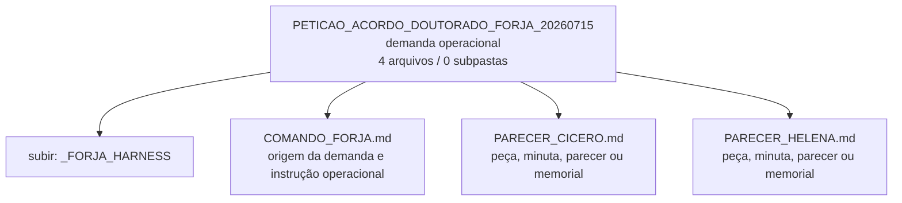

<!-- IA_NAVIGACAO:GERADO_AUTO:v1 -->
# Mapa IA - PETICAO_ACORDO_DOUTORADO_FORJA_20260715

Atualizado automaticamente em: **2026-08-05 13:56:09 -0300**

- Caminho: `C:\Users\IgorPC\.claude\projects\Escritório fabio osório\fabricas de melhoria de petições\_FORJA_HARNESS\PETICAO_ACORDO_DOUTORADO_FORJA_20260715`
- Tipo: **demanda operacional**
- Função para navegação: começar pelo comando e anexos antes de produzir
- Conteúdo recursivo: **4 arquivos**, **0 subpastas**, **3.5 KB**
- Tipos de arquivo: .md: 4
- Mapa raiz: [MAPA_IA.md](<../../MAPA_IA.md>)
- Índice geral: [INDICE_GERAL_IA.md](<../../00_IA_NAVIGACAO/INDICE_GERAL_IA.md>)
- Protocolo de navegação: [PROTOCOLO_NAVEGACAO_IA.md](<../../00_IA_NAVIGACAO/PROTOCOLO_NAVEGACAO_IA.md>)
- Inventário JSON para agentes: [inventario_ia.json](<../../00_IA_NAVIGACAO/dados/inventario_ia.json>)
- Mapa superior: [_FORJA_HARNESS](<../MAPA_IA.md>)

## GPS Mermaid

## Ordem de leitura recomendada

1. Começar pelo `COMANDO_*` desta pasta para entender origem, pedido e pendências.
2. Ler este `MAPA_IA.md` antes de abrir arquivos pesados.
3. Subir para a raiz se precisar das regras globais `AGENTS.md`, `CLAUDE.md` e `_LEIS_GERAIS`.

## Subpastas diretas

_Sem subpastas diretas._

## Arquivos diretos

| Arquivo | Papel | Tamanho | Modificado | Observação |
|---|---:|---:|---:|---|
| [COMANDO_FORJA.md](<COMANDO_FORJA.md>) | comando | 1.2 KB | 2026-07-15 16:18 | origem da demanda e instrução operacional \| tópicos: Comando FORJA — proposta pós-audiência e doutorado |
| [PARECER_CICERO.md](<PARECER_CICERO.md>) | peça/trabalho | 762 B | 2026-07-15 16:20 | peça, minuta, parecer ou memorial \| tópicos: Parecer Cícero — acordo e doutorado |
| [PARECER_HELENA.md](<PARECER_HELENA.md>) | peça/trabalho | 782 B | 2026-07-15 16:20 | peça, minuta, parecer ou memorial \| tópicos: Parecer Helena — acordo e doutorado |
| [DECISOES_CONSELHO.md](<DECISOES_CONSELHO.md>) | outro | 858 B | 2026-07-15 16:20 | arquivo não classificado automaticamente \| tópicos: Decisões do conselho — acordo e doutorado |

## Leitura por papel

- **comando**: [COMANDO_FORJA.md](<COMANDO_FORJA.md>)
- **peça/trabalho**: [PARECER_CICERO.md](<PARECER_CICERO.md>), [PARECER_HELENA.md](<PARECER_HELENA.md>)
- **outro**: [DECISOES_CONSELHO.md](<DECISOES_CONSELHO.md>)

## Observações anti-alucinação

- Este mapa classifica por nomes, extensões e posição na árvore; não substitui leitura de fonte primária.
- Fato, citação, ID processual, prazo e jurisprudência só entram em peça depois de conferência no arquivo-fonte ou fonte oficial.
- Se a pasta tiver regimento, a peça deve refletir o regimento vigente na data do protocolo.
