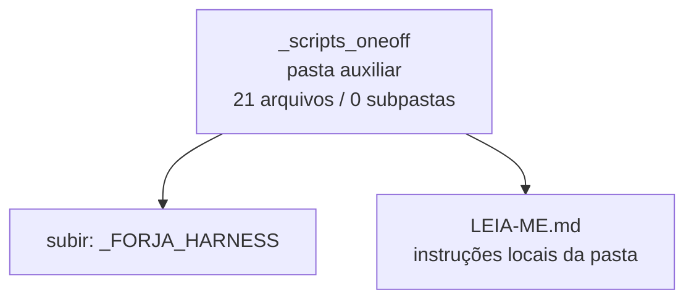

<!-- IA_NAVIGACAO:GERADO_AUTO:v1 -->
# Mapa IA - _scripts_oneoff

Atualizado automaticamente em: **2026-08-05 13:56:09 -0300**

- Caminho: `C:\Users\IgorPC\.claude\projects\Escritório fabio osório\fabricas de melhoria de petições\_FORJA_HARNESS\_scripts_oneoff`
- Tipo: **pasta auxiliar**
- Função para navegação: conteúdo auxiliar ou residual
- Conteúdo recursivo: **21 arquivos**, **0 subpastas**, **64.8 KB**
- Tipos de arquivo: .py: 20, .md: 1
- Mapa raiz: [MAPA_IA.md](<../../MAPA_IA.md>)
- Índice geral: [INDICE_GERAL_IA.md](<../../00_IA_NAVIGACAO/INDICE_GERAL_IA.md>)
- Protocolo de navegação: [PROTOCOLO_NAVEGACAO_IA.md](<../../00_IA_NAVIGACAO/PROTOCOLO_NAVEGACAO_IA.md>)
- Inventário JSON para agentes: [inventario_ia.json](<../../00_IA_NAVIGACAO/dados/inventario_ia.json>)
- Mapa superior: [_FORJA_HARNESS](<../MAPA_IA.md>)

## GPS Mermaid

## Ordem de leitura recomendada

1. Ler este `MAPA_IA.md` antes de abrir arquivos pesados.
2. Subir para a raiz se precisar das regras globais `AGENTS.md`, `CLAUDE.md` e `_LEIS_GERAIS`.

## Subpastas diretas

_Sem subpastas diretas._

## Arquivos diretos

| Arquivo | Papel | Tamanho | Modificado | Observação |
|---|---:|---:|---:|---|
| [LEIA-ME.md](<LEIA-ME.md>) | regras | 1.3 KB | 2026-07-16 23:23 | instruções locais da pasta \| tópicos: Scripts pontuais / históricos (movidos da raiz em 16/07/2026) |
| [ar2_montar_exec_prompts.py](<ar2_montar_exec_prompts.py>) | dados/script | 2.0 KB | 2026-07-23 20:09 | dado estruturado ou rotina técnica |
| [ar2_registrar_execucoes.py](<ar2_registrar_execucoes.py>) | dados/script | 2.3 KB | 2026-07-23 20:09 | dado estruturado ou rotina técnica |
| [ar2b_montar_exec_prompts.py](<ar2b_montar_exec_prompts.py>) | dados/script | 2.7 KB | 2026-07-23 20:28 | dado estruturado ou rotina técnica |
| [ar2b_registrar_execucoes.py](<ar2b_registrar_execucoes.py>) | dados/script | 2.9 KB | 2026-07-23 20:29 | dado estruturado ou rotina técnica |
| [ar_build_canarios_reais.py](<ar_build_canarios_reais.py>) | dados/script | 5.8 KB | 2026-07-23 23:14 | dado estruturado ou rotina técnica |
| [ar_consolidar_julgamentos.py](<ar_consolidar_julgamentos.py>) | dados/script | 1.6 KB | 2026-07-23 03:58 | dado estruturado ou rotina técnica |
| [ar_consolidar_round3.py](<ar_consolidar_round3.py>) | dados/script | 2.5 KB | 2026-07-23 04:05 | dado estruturado ou rotina técnica |
| [ar_debug_ancoras.py](<ar_debug_ancoras.py>) | dados/script | 928 B | 2026-07-23 04:02 | dado estruturado ou rotina técnica |
| [ar_diagrama_arquitetura.py](<ar_diagrama_arquitetura.py>) | dados/script | 14.7 KB | 2026-08-05 03:09 | dado estruturado ou rotina técnica |
| [ar_montar_exec_prompts.py](<ar_montar_exec_prompts.py>) | dados/script | 1.9 KB | 2026-07-23 03:46 | dado estruturado ou rotina técnica |
| [ar_painel_piloto.py](<ar_painel_piloto.py>) | dados/script | 3.2 KB | 2026-07-23 02:11 | dado estruturado ou rotina técnica |
| [ar_registrar_execucoes.py](<ar_registrar_execucoes.py>) | dados/script | 2.4 KB | 2026-07-23 03:56 | dado estruturado ou rotina técnica |
| [ar_selecionar_gen0.py](<ar_selecionar_gen0.py>) | dados/script | 1.7 KB | 2026-07-23 04:06 | dado estruturado ou rotina técnica |
| [ar_spotcheck_i6.py](<ar_spotcheck_i6.py>) | dados/script | 886 B | 2026-07-23 02:19 | dado estruturado ou rotina técnica |
| [build_f2a_igor_20260715.py](<build_f2a_igor_20260715.py>) | dados/script | 9.3 KB | 2026-07-16 19:39 | dado estruturado ou rotina técnica |
| [neutralizar_marca_docx_puro.py](<neutralizar_marca_docx_puro.py>) | dados/script | 1.5 KB | 2026-07-16 19:39 | dado estruturado ou rotina técnica |
| [neutralizar_marca_peticao.py](<neutralizar_marca_peticao.py>) | dados/script | 2.6 KB | 2026-07-16 19:39 | dado estruturado ou rotina técnica |
| [render_forja_sem_sanitize_corruptivo.py](<render_forja_sem_sanitize_corruptivo.py>) | dados/script | 1.0 KB | 2026-07-16 19:39 | dado estruturado ou rotina técnica |
| [sanitize_pdfs_pendentes.py](<sanitize_pdfs_pendentes.py>) | dados/script | 1.8 KB | 2026-07-16 19:39 | dado estruturado ou rotina técnica |
| [validate_f7_integration.py](<validate_f7_integration.py>) | dados/script | 1.9 KB | 2026-07-16 23:23 | dado estruturado ou rotina técnica |

## Leitura por papel

- **regras**: [LEIA-ME.md](<LEIA-ME.md>)
- **dados/script**: [ar2_montar_exec_prompts.py](<ar2_montar_exec_prompts.py>), [ar2_registrar_execucoes.py](<ar2_registrar_execucoes.py>), [ar2b_montar_exec_prompts.py](<ar2b_montar_exec_prompts.py>), [ar2b_registrar_execucoes.py](<ar2b_registrar_execucoes.py>), [ar_build_canarios_reais.py](<ar_build_canarios_reais.py>), [ar_consolidar_julgamentos.py](<ar_consolidar_julgamentos.py>), [ar_consolidar_round3.py](<ar_consolidar_round3.py>), [ar_debug_ancoras.py](<ar_debug_ancoras.py>), [ar_diagrama_arquitetura.py](<ar_diagrama_arquitetura.py>), [ar_montar_exec_prompts.py](<ar_montar_exec_prompts.py>), [ar_painel_piloto.py](<ar_painel_piloto.py>), [ar_registrar_execucoes.py](<ar_registrar_execucoes.py>), [ar_selecionar_gen0.py](<ar_selecionar_gen0.py>), [ar_spotcheck_i6.py](<ar_spotcheck_i6.py>), [build_f2a_igor_20260715.py](<build_f2a_igor_20260715.py>), [neutralizar_marca_docx_puro.py](<neutralizar_marca_docx_puro.py>), [neutralizar_marca_peticao.py](<neutralizar_marca_peticao.py>), [render_forja_sem_sanitize_corruptivo.py](<render_forja_sem_sanitize_corruptivo.py>), [sanitize_pdfs_pendentes.py](<sanitize_pdfs_pendentes.py>), [validate_f7_integration.py](<validate_f7_integration.py>)

## Observações anti-alucinação

- Este mapa classifica por nomes, extensões e posição na árvore; não substitui leitura de fonte primária.
- Fato, citação, ID processual, prazo e jurisprudência só entram em peça depois de conferência no arquivo-fonte ou fonte oficial.
- Se a pasta tiver regimento, a peça deve refletir o regimento vigente na data do protocolo.
