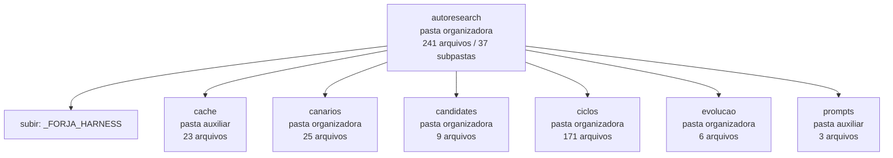

<!-- IA_NAVIGACAO:GERADO_AUTO:v1 -->
# Mapa IA - autoresearch

Atualizado automaticamente em: **2026-08-05 13:56:09 -0300**

- Caminho: `C:\Users\IgorPC\.claude\projects\Escritório fabio osório\fabricas de melhoria de petições\_FORJA_HARNESS\autoresearch`
- Tipo: **pasta organizadora**
- Função para navegação: agrega subpastas; abrir mapa filho conforme objetivo
- Conteúdo recursivo: **241 arquivos**, **37 subpastas**, **5.5 MB**
- Tipos de arquivo: .json: 116, .md: 87, .jsonl: 14, .stderr: 9, .pyc: 4, .txt: 4, (sem extensão): 2, .py: 2, .html: 2, .svg: 1
- Mapa raiz: [MAPA_IA.md](<../../MAPA_IA.md>)
- Índice geral: [INDICE_GERAL_IA.md](<../../00_IA_NAVIGACAO/INDICE_GERAL_IA.md>)
- Protocolo de navegação: [PROTOCOLO_NAVEGACAO_IA.md](<../../00_IA_NAVIGACAO/PROTOCOLO_NAVEGACAO_IA.md>)
- Inventário JSON para agentes: [inventario_ia.json](<../../00_IA_NAVIGACAO/dados/inventario_ia.json>)
- Mapa superior: [_FORJA_HARNESS](<../MAPA_IA.md>)

## GPS Mermaid

## Ordem de leitura recomendada

1. Ler este `MAPA_IA.md` antes de abrir arquivos pesados.
2. Subir para a raiz se precisar das regras globais `AGENTS.md`, `CLAUDE.md` e `_LEIS_GERAIS`.
3. Usar builds, renders e QA apenas para validar entrega ou rastrear geração; não começar por eles.

## Subpastas diretas

| Subpasta | Tipo | Conteúdo | Atualização | Próximo passo |
|---|---|---:|---:|---|
| [cache](<cache/MAPA_IA.md>) | pasta auxiliar | 23 arquivos / 0 subpastas | 2026-07-23 02:11 | conteúdo auxiliar ou residual |
| [canarios](<canarios/MAPA_IA.md>) | pasta organizadora | 25 arquivos / 6 subpastas | 2026-07-23 23:14 | agrega subpastas; abrir mapa filho conforme objetivo |
| [candidates](<candidates/MAPA_IA.md>) | pasta organizadora | 9 arquivos / 2 subpastas | 2026-08-05 03:10 | agrega subpastas; abrir mapa filho conforme objetivo |
| [ciclos](<ciclos/MAPA_IA.md>) | pasta organizadora | 171 arquivos / 19 subpastas | 2026-07-23 23:20 | agrega subpastas; abrir mapa filho conforme objetivo |
| [evolucao](<evolucao/MAPA_IA.md>) | pasta organizadora | 6 arquivos / 4 subpastas | 2026-07-23 20:48 | agrega subpastas; abrir mapa filho conforme objetivo |
| [prompts](<prompts/MAPA_IA.md>) | pasta auxiliar | 3 arquivos / 0 subpastas | 2026-07-24 18:28 | conteúdo auxiliar ou residual |

## Arquivos diretos

| Arquivo | Papel | Tamanho | Modificado | Observação |
|---|---:|---:|---:|---|
| [AR_CORPUS.json](<AR_CORPUS.json>) | dados/script | 18.9 KB | 2026-07-23 02:08 | dado estruturado ou rotina técnica |
| [AR_LOG.jsonl](<AR_LOG.jsonl>) | dados/script | 2.3 KB | 2026-07-23 20:06 | dado estruturado ou rotina técnica |
| [AR_MANIFEST.json](<AR_MANIFEST.json>) | dados/script | 3.8 KB | 2026-07-23 23:18 | dado estruturado ou rotina técnica |
| [AR_PANEL.json](<AR_PANEL.json>) | dados/script | 9.0 KB | 2026-07-23 02:11 | dado estruturado ou rotina técnica |

## Leitura por papel

- **dados/script**: [AR_CORPUS.json](<AR_CORPUS.json>), [AR_LOG.jsonl](<AR_LOG.jsonl>), [AR_MANIFEST.json](<AR_MANIFEST.json>), [AR_PANEL.json](<AR_PANEL.json>)

## Observações anti-alucinação

- Este mapa classifica por nomes, extensões e posição na árvore; não substitui leitura de fonte primária.
- Fato, citação, ID processual, prazo e jurisprudência só entram em peça depois de conferência no arquivo-fonte ou fonte oficial.
- Se a pasta tiver regimento, a peça deve refletir o regimento vigente na data do protocolo.
