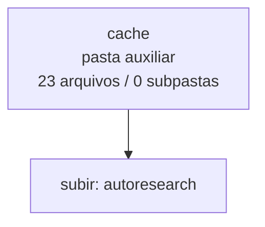

<!-- IA_NAVIGACAO:GERADO_AUTO:v1 -->
# Mapa IA - cache

Atualizado automaticamente em: **2026-08-05 13:56:04 -0300**

- Caminho: `C:\Users\IgorPC\.claude\projects\Escritório fabio osório\fabricas de melhoria de petições\_FORJA_HARNESS\autoresearch\cache`
- Tipo: **pasta auxiliar**
- Função para navegação: conteúdo auxiliar ou residual
- Conteúdo recursivo: **23 arquivos**, **0 subpastas**, **217.4 KB**
- Tipos de arquivo: .json: 22, (sem extensão): 1
- Mapa raiz: [MAPA_IA.md](<../../../MAPA_IA.md>)
- Índice geral: [INDICE_GERAL_IA.md](<../../../00_IA_NAVIGACAO/INDICE_GERAL_IA.md>)
- Protocolo de navegação: [PROTOCOLO_NAVEGACAO_IA.md](<../../../00_IA_NAVIGACAO/PROTOCOLO_NAVEGACAO_IA.md>)
- Inventário JSON para agentes: [inventario_ia.json](<../../../00_IA_NAVIGACAO/dados/inventario_ia.json>)
- Mapa superior: [autoresearch](<../MAPA_IA.md>)

## GPS Mermaid

## Ordem de leitura recomendada

1. Ler este `MAPA_IA.md` antes de abrir arquivos pesados.
2. Subir para a raiz se precisar das regras globais `AGENTS.md`, `CLAUDE.md` e `_LEIS_GERAIS`.

## Subpastas diretas

_Sem subpastas diretas._

## Arquivos diretos

| Arquivo | Papel | Tamanho | Modificado | Observação |
|---|---:|---:|---:|---|
| [0cf9dffd950d9eb04e9069a50ef39f8f2160a181501761d7c53ddfc7ca0626ba.json](<0cf9dffd950d9eb04e9069a50ef39f8f2160a181501761d7c53ddfc7ca0626ba.json>) | dados/script | 8.3 KB | 2026-07-23 02:11 | dado estruturado ou rotina técnica |
| [2fdce91918beb56a4eb03cef3b99d1d75709ea0209c6f09281a136ae084dcf28.json](<2fdce91918beb56a4eb03cef3b99d1d75709ea0209c6f09281a136ae084dcf28.json>) | dados/script | 25.1 KB | 2026-07-23 02:11 | dado estruturado ou rotina técnica |
| [32ce92585c8cddc3cc2b10b66077416b6369be30ccac74a268970aa05c770c84.json](<32ce92585c8cddc3cc2b10b66077416b6369be30ccac74a268970aa05c770c84.json>) | dados/script | 22.6 KB | 2026-07-23 02:11 | dado estruturado ou rotina técnica |
| [33e199fcfb9d303afbfcd6cace514da61bf8fe3f69a65bbbb0becfa74f9ffc67.json](<33e199fcfb9d303afbfcd6cace514da61bf8fe3f69a65bbbb0becfa74f9ffc67.json>) | dados/script | 11.7 KB | 2026-07-23 02:11 | dado estruturado ou rotina técnica |
| [353eba2667f99c4d56be1655b3e3fb1c17f061775213047e4ca597b977e931f7.json](<353eba2667f99c4d56be1655b3e3fb1c17f061775213047e4ca597b977e931f7.json>) | dados/script | 6.2 KB | 2026-07-23 02:11 | dado estruturado ou rotina técnica |
| [45a024a1ee5c85ad3e120f4ef59f49c516fd729265ea5700374e766a1da1b474.json](<45a024a1ee5c85ad3e120f4ef59f49c516fd729265ea5700374e766a1da1b474.json>) | dados/script | 1.7 KB | 2026-07-23 02:11 | dado estruturado ou rotina técnica |
| [5208c3a423c03312b2de665df639bce16597776b5cff1b6079d63f2362bda7e5.json](<5208c3a423c03312b2de665df639bce16597776b5cff1b6079d63f2362bda7e5.json>) | dados/script | 9.0 KB | 2026-07-23 02:11 | dado estruturado ou rotina técnica |
| [72a340902dbfb8d529772e49508a9bde29ebf9ca8174bc96462e8608492e0fc6.json](<72a340902dbfb8d529772e49508a9bde29ebf9ca8174bc96462e8608492e0fc6.json>) | dados/script | 10.7 KB | 2026-07-23 02:11 | dado estruturado ou rotina técnica |
| [76b4a49dd4abd833ab990ff6b2d1f5e60f5f984f82f0d8248445c7a3869f7e3d.json](<76b4a49dd4abd833ab990ff6b2d1f5e60f5f984f82f0d8248445c7a3869f7e3d.json>) | dados/script | 1.7 KB | 2026-07-23 02:11 | dado estruturado ou rotina técnica |
| [78f86a35d3b0bf6830a838f2905759567e20a27f2a44bc070fc31e9028d765ac.json](<78f86a35d3b0bf6830a838f2905759567e20a27f2a44bc070fc31e9028d765ac.json>) | dados/script | 18.1 KB | 2026-07-23 02:11 | dado estruturado ou rotina técnica |
| [7ead985abd051058424bcb8c50778df6099808612cbfa29ad64483f12a6f11fb.json](<7ead985abd051058424bcb8c50778df6099808612cbfa29ad64483f12a6f11fb.json>) | dados/script | 5.2 KB | 2026-07-23 02:11 | dado estruturado ou rotina técnica |
| [7ffccfcb3b85e746c9a78486e6ee2acfb2c313a60426b01740c6ec93405b620b.json](<7ffccfcb3b85e746c9a78486e6ee2acfb2c313a60426b01740c6ec93405b620b.json>) | dados/script | 12.0 KB | 2026-07-23 02:11 | dado estruturado ou rotina técnica |
| [9a1e99346c7836e60a351e4f8afb25d24b06f7ecd7756b47feb6ddd6e11487a3.json](<9a1e99346c7836e60a351e4f8afb25d24b06f7ecd7756b47feb6ddd6e11487a3.json>) | dados/script | 4.8 KB | 2026-07-23 02:11 | dado estruturado ou rotina técnica |
| [9d4444254ff05ddc5b4f525001fb418f0bb3ae2612a5af25bbae32a499b50b07.json](<9d4444254ff05ddc5b4f525001fb418f0bb3ae2612a5af25bbae32a499b50b07.json>) | dados/script | 10.5 KB | 2026-07-23 02:11 | dado estruturado ou rotina técnica |
| [a13f99a98581ff609a34ae1bdeb0f4b6f279f1f47389c09d62b3ddeb8f480eef.json](<a13f99a98581ff609a34ae1bdeb0f4b6f279f1f47389c09d62b3ddeb8f480eef.json>) | dados/script | 6.1 KB | 2026-07-23 02:11 | dado estruturado ou rotina técnica |
| [a19295dc9eff3fb1bb58284b77d6d8f75cee718cda3cb5a18bb98c0133619737.json](<a19295dc9eff3fb1bb58284b77d6d8f75cee718cda3cb5a18bb98c0133619737.json>) | dados/script | 24.6 KB | 2026-07-23 02:11 | dado estruturado ou rotina técnica |
| [aa537495e364c4900d65cb000eddb22aa262a1c4427296bdc685501048503435.json](<aa537495e364c4900d65cb000eddb22aa262a1c4427296bdc685501048503435.json>) | dados/script | 3.2 KB | 2026-07-23 02:11 | dado estruturado ou rotina técnica |
| [c5df212baaa0ac598ccfd9fb36ba61b40727af8a14de238fdb704de689b519aa.json](<c5df212baaa0ac598ccfd9fb36ba61b40727af8a14de238fdb704de689b519aa.json>) | dados/script | 4.0 KB | 2026-07-23 02:11 | dado estruturado ou rotina técnica |
| [c81aea14bd87f8e3125b254035570d0dd7c5392a704e920b15e3323d4ef03a1f.json](<c81aea14bd87f8e3125b254035570d0dd7c5392a704e920b15e3323d4ef03a1f.json>) | dados/script | 2.5 KB | 2026-07-23 02:11 | dado estruturado ou rotina técnica |
| [c92c9f96bbcb74ea1c3db3657a37fc142281729dd09d1d4b6e03a478795f1a0e.json](<c92c9f96bbcb74ea1c3db3657a37fc142281729dd09d1d4b6e03a478795f1a0e.json>) | dados/script | 22.6 KB | 2026-07-23 02:11 | dado estruturado ou rotina técnica |
| [cb3ed96368a2f6f54cfc4d6133bab9eceb465edfff767e0a913f4ad6b22dc465.json](<cb3ed96368a2f6f54cfc4d6133bab9eceb465edfff767e0a913f4ad6b22dc465.json>) | dados/script | 1.7 KB | 2026-07-23 02:11 | dado estruturado ou rotina técnica |
| [d6f185a520dbd9be490c2f1554cc6cbf8a3f14e697427481da09b04e3186ff03.json](<d6f185a520dbd9be490c2f1554cc6cbf8a3f14e697427481da09b04e3186ff03.json>) | dados/script | 5.1 KB | 2026-07-23 02:11 | dado estruturado ou rotina técnica |
| [.gitkeep](<.gitkeep>) | outro | 1 B | 2026-07-23 01:56 | arquivo não classificado automaticamente |

## Leitura por papel

- **dados/script**: [0cf9dffd950d9eb04e9069a50ef39f8f2160a181501761d7c53ddfc7ca0626ba.json](<0cf9dffd950d9eb04e9069a50ef39f8f2160a181501761d7c53ddfc7ca0626ba.json>), [2fdce91918beb56a4eb03cef3b99d1d75709ea0209c6f09281a136ae084dcf28.json](<2fdce91918beb56a4eb03cef3b99d1d75709ea0209c6f09281a136ae084dcf28.json>), [32ce92585c8cddc3cc2b10b66077416b6369be30ccac74a268970aa05c770c84.json](<32ce92585c8cddc3cc2b10b66077416b6369be30ccac74a268970aa05c770c84.json>), [33e199fcfb9d303afbfcd6cace514da61bf8fe3f69a65bbbb0becfa74f9ffc67.json](<33e199fcfb9d303afbfcd6cace514da61bf8fe3f69a65bbbb0becfa74f9ffc67.json>), [353eba2667f99c4d56be1655b3e3fb1c17f061775213047e4ca597b977e931f7.json](<353eba2667f99c4d56be1655b3e3fb1c17f061775213047e4ca597b977e931f7.json>), [45a024a1ee5c85ad3e120f4ef59f49c516fd729265ea5700374e766a1da1b474.json](<45a024a1ee5c85ad3e120f4ef59f49c516fd729265ea5700374e766a1da1b474.json>), [5208c3a423c03312b2de665df639bce16597776b5cff1b6079d63f2362bda7e5.json](<5208c3a423c03312b2de665df639bce16597776b5cff1b6079d63f2362bda7e5.json>), [72a340902dbfb8d529772e49508a9bde29ebf9ca8174bc96462e8608492e0fc6.json](<72a340902dbfb8d529772e49508a9bde29ebf9ca8174bc96462e8608492e0fc6.json>), [76b4a49dd4abd833ab990ff6b2d1f5e60f5f984f82f0d8248445c7a3869f7e3d.json](<76b4a49dd4abd833ab990ff6b2d1f5e60f5f984f82f0d8248445c7a3869f7e3d.json>), [78f86a35d3b0bf6830a838f2905759567e20a27f2a44bc070fc31e9028d765ac.json](<78f86a35d3b0bf6830a838f2905759567e20a27f2a44bc070fc31e9028d765ac.json>), [7ead985abd051058424bcb8c50778df6099808612cbfa29ad64483f12a6f11fb.json](<7ead985abd051058424bcb8c50778df6099808612cbfa29ad64483f12a6f11fb.json>), [7ffccfcb3b85e746c9a78486e6ee2acfb2c313a60426b01740c6ec93405b620b.json](<7ffccfcb3b85e746c9a78486e6ee2acfb2c313a60426b01740c6ec93405b620b.json>), [9a1e99346c7836e60a351e4f8afb25d24b06f7ecd7756b47feb6ddd6e11487a3.json](<9a1e99346c7836e60a351e4f8afb25d24b06f7ecd7756b47feb6ddd6e11487a3.json>), [9d4444254ff05ddc5b4f525001fb418f0bb3ae2612a5af25bbae32a499b50b07.json](<9d4444254ff05ddc5b4f525001fb418f0bb3ae2612a5af25bbae32a499b50b07.json>), [a13f99a98581ff609a34ae1bdeb0f4b6f279f1f47389c09d62b3ddeb8f480eef.json](<a13f99a98581ff609a34ae1bdeb0f4b6f279f1f47389c09d62b3ddeb8f480eef.json>), [a19295dc9eff3fb1bb58284b77d6d8f75cee718cda3cb5a18bb98c0133619737.json](<a19295dc9eff3fb1bb58284b77d6d8f75cee718cda3cb5a18bb98c0133619737.json>), [aa537495e364c4900d65cb000eddb22aa262a1c4427296bdc685501048503435.json](<aa537495e364c4900d65cb000eddb22aa262a1c4427296bdc685501048503435.json>), [c5df212baaa0ac598ccfd9fb36ba61b40727af8a14de238fdb704de689b519aa.json](<c5df212baaa0ac598ccfd9fb36ba61b40727af8a14de238fdb704de689b519aa.json>), [c81aea14bd87f8e3125b254035570d0dd7c5392a704e920b15e3323d4ef03a1f.json](<c81aea14bd87f8e3125b254035570d0dd7c5392a704e920b15e3323d4ef03a1f.json>), [c92c9f96bbcb74ea1c3db3657a37fc142281729dd09d1d4b6e03a478795f1a0e.json](<c92c9f96bbcb74ea1c3db3657a37fc142281729dd09d1d4b6e03a478795f1a0e.json>), [cb3ed96368a2f6f54cfc4d6133bab9eceb465edfff767e0a913f4ad6b22dc465.json](<cb3ed96368a2f6f54cfc4d6133bab9eceb465edfff767e0a913f4ad6b22dc465.json>), [d6f185a520dbd9be490c2f1554cc6cbf8a3f14e697427481da09b04e3186ff03.json](<d6f185a520dbd9be490c2f1554cc6cbf8a3f14e697427481da09b04e3186ff03.json>)
- **outro**: [.gitkeep](<.gitkeep>)

## Observações anti-alucinação

- Este mapa classifica por nomes, extensões e posição na árvore; não substitui leitura de fonte primária.
- Fato, citação, ID processual, prazo e jurisprudência só entram em peça depois de conferência no arquivo-fonte ou fonte oficial.
- Se a pasta tiver regimento, a peça deve refletir o regimento vigente na data do protocolo.
