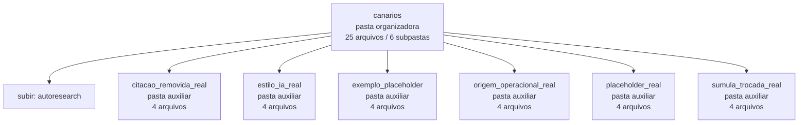

<!-- IA_NAVIGACAO:GERADO_AUTO:v1 -->
# Mapa IA - canarios

Atualizado automaticamente em: **2026-08-05 13:56:04 -0300**

- Caminho: `C:\Users\IgorPC\.claude\projects\Escritório fabio osório\fabricas de melhoria de petições\_FORJA_HARNESS\autoresearch\canarios`
- Tipo: **pasta organizadora**
- Função para navegação: agrega subpastas; abrir mapa filho conforme objetivo
- Conteúdo recursivo: **25 arquivos**, **6 subpastas**, **249.8 KB**
- Tipos de arquivo: .md: 24, .json: 1
- Mapa raiz: [MAPA_IA.md](<../../../MAPA_IA.md>)
- Índice geral: [INDICE_GERAL_IA.md](<../../../00_IA_NAVIGACAO/INDICE_GERAL_IA.md>)
- Protocolo de navegação: [PROTOCOLO_NAVEGACAO_IA.md](<../../../00_IA_NAVIGACAO/PROTOCOLO_NAVEGACAO_IA.md>)
- Inventário JSON para agentes: [inventario_ia.json](<../../../00_IA_NAVIGACAO/dados/inventario_ia.json>)
- Mapa superior: [autoresearch](<../MAPA_IA.md>)

## GPS Mermaid

## Ordem de leitura recomendada

1. Ler este `MAPA_IA.md` antes de abrir arquivos pesados.
2. Subir para a raiz se precisar das regras globais `AGENTS.md`, `CLAUDE.md` e `_LEIS_GERAIS`.

## Subpastas diretas

| Subpasta | Tipo | Conteúdo | Atualização | Próximo passo |
|---|---|---:|---:|---|
| [citacao_removida_real](<citacao_removida_real/MAPA_IA.md>) | pasta auxiliar | 4 arquivos / 0 subpastas | 2026-07-23 23:14 | conteúdo auxiliar ou residual |
| [estilo_ia_real](<estilo_ia_real/MAPA_IA.md>) | pasta auxiliar | 4 arquivos / 0 subpastas | 2026-07-23 23:14 | conteúdo auxiliar ou residual |
| [exemplo_placeholder](<exemplo_placeholder/MAPA_IA.md>) | pasta auxiliar | 4 arquivos / 0 subpastas | 2026-07-23 01:56 | conteúdo auxiliar ou residual |
| [origem_operacional_real](<origem_operacional_real/MAPA_IA.md>) | pasta auxiliar | 4 arquivos / 0 subpastas | 2026-07-23 23:14 | conteúdo auxiliar ou residual |
| [placeholder_real](<placeholder_real/MAPA_IA.md>) | pasta auxiliar | 4 arquivos / 0 subpastas | 2026-07-23 23:14 | conteúdo auxiliar ou residual |
| [sumula_trocada_real](<sumula_trocada_real/MAPA_IA.md>) | pasta auxiliar | 4 arquivos / 0 subpastas | 2026-07-23 23:14 | conteúdo auxiliar ou residual |

## Arquivos diretos

| Arquivo | Papel | Tamanho | Modificado | Observação |
|---|---:|---:|---:|---|
| [CANARIOS_MANIFEST.json](<CANARIOS_MANIFEST.json>) | dados/script | 4.2 KB | 2026-07-23 23:14 | dado estruturado ou rotina técnica |

## Leitura por papel

- **dados/script**: [CANARIOS_MANIFEST.json](<CANARIOS_MANIFEST.json>)

## Observações anti-alucinação

- Este mapa classifica por nomes, extensões e posição na árvore; não substitui leitura de fonte primária.
- Fato, citação, ID processual, prazo e jurisprudência só entram em peça depois de conferência no arquivo-fonte ou fonte oficial.
- Se a pasta tiver regimento, a peça deve refletir o regimento vigente na data do protocolo.
