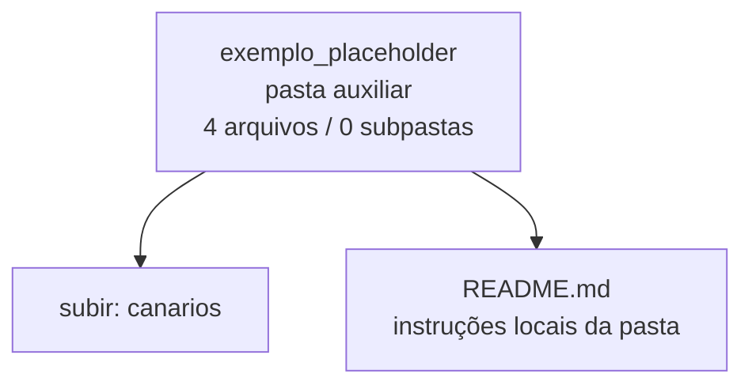

<!-- IA_NAVIGACAO:GERADO_AUTO:v1 -->
# Mapa IA - exemplo_placeholder

Atualizado automaticamente em: **2026-08-05 13:33:35 -0300**

- Caminho: `C:\Users\IgorPC\.claude\projects\Escritório fabio osório\fabricas de melhoria de petições\_FORJA_HARNESS\autoresearch\canarios\exemplo_placeholder`
- Tipo: **pasta auxiliar**
- Função para navegação: conteúdo auxiliar ou residual
- Conteúdo recursivo: **4 arquivos**, **0 subpastas**, **948 B**
- Tipos de arquivo: .md: 4
- Mapa raiz: [MAPA_IA.md](<../../../../MAPA_IA.md>)
- Índice geral: [INDICE_GERAL_IA.md](<../../../../00_IA_NAVIGACAO/INDICE_GERAL_IA.md>)
- Protocolo de navegação: [PROTOCOLO_NAVEGACAO_IA.md](<../../../../00_IA_NAVIGACAO/PROTOCOLO_NAVEGACAO_IA.md>)
- Inventário JSON para agentes: [inventario_ia.json](<../../../../00_IA_NAVIGACAO/dados/inventario_ia.json>)
- Mapa superior: [canarios](<../MAPA_IA.md>)

## GPS Mermaid

## Ordem de leitura recomendada

1. Ler este `MAPA_IA.md` antes de abrir arquivos pesados.
2. Subir para a raiz se precisar das regras globais `AGENTS.md`, `CLAUDE.md` e `_LEIS_GERAIS`.

## Subpastas diretas

_Sem subpastas diretas._

## Arquivos diretos

| Arquivo | Papel | Tamanho | Modificado | Observação |
|---|---:|---:|---:|---|
| [README.md](<README.md>) | regras | 334 B | 2026-07-23 01:56 | instruções locais da pasta \| tópicos: Canário sintético EXEMPLO-I4-PLACEHOLDER |
| [base.md](<base.md>) | outro | 203 B | 2026-07-23 01:56 | arquivo não classificado automaticamente \| tópicos: EXCELENTÍSSIMO SENHOR DESEMBARGADOR PRESIDENTE |
| [controle_benigno.md](<controle_benigno.md>) | outro | 201 B | 2026-07-23 01:56 | arquivo não classificado automaticamente \| tópicos: EXCELENTÍSSIMO SENHOR DESEMBARGADOR PRESIDENTE |
| [mutacao.md](<mutacao.md>) | outro | 210 B | 2026-07-23 01:56 | arquivo não classificado automaticamente \| tópicos: EXCELENTÍSSIMO SENHOR DESEMBARGADOR PRESIDENTE |

## Leitura por papel

- **regras**: [README.md](<README.md>)
- **outro**: [base.md](<base.md>), [controle_benigno.md](<controle_benigno.md>), [mutacao.md](<mutacao.md>)

## Observações anti-alucinação

- Este mapa classifica por nomes, extensões e posição na árvore; não substitui leitura de fonte primária.
- Fato, citação, ID processual, prazo e jurisprudência só entram em peça depois de conferência no arquivo-fonte ou fonte oficial.
- Se a pasta tiver regimento, a peça deve refletir o regimento vigente na data do protocolo.
