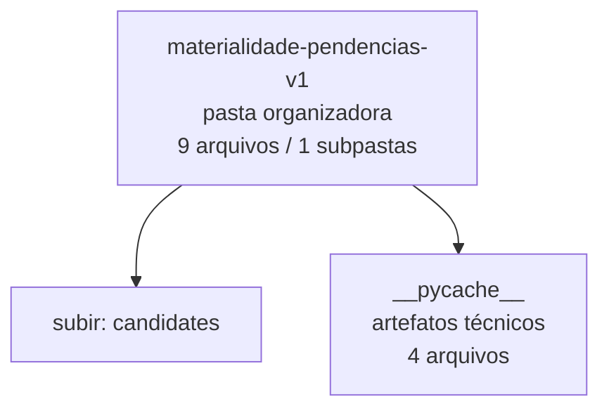

<!-- IA_NAVIGACAO:GERADO_AUTO:v1 -->
# Mapa IA - materialidade-pendencias-v1

Atualizado automaticamente em: **2026-08-05 13:33:35 -0300**

- Caminho: `C:\Users\IgorPC\.claude\projects\Escritório fabio osório\fabricas de melhoria de petições\_FORJA_HARNESS\autoresearch\candidates\materialidade-pendencias-v1`
- Tipo: **pasta organizadora**
- Função para navegação: agrega subpastas; abrir mapa filho conforme objetivo
- Conteúdo recursivo: **9 arquivos**, **1 subpastas**, **55.1 KB**
- Tipos de arquivo: .pyc: 4, .json: 2, .py: 2, .md: 1
- Mapa raiz: [MAPA_IA.md](<../../../../MAPA_IA.md>)
- Índice geral: [INDICE_GERAL_IA.md](<../../../../00_IA_NAVIGACAO/INDICE_GERAL_IA.md>)
- Protocolo de navegação: [PROTOCOLO_NAVEGACAO_IA.md](<../../../../00_IA_NAVIGACAO/PROTOCOLO_NAVEGACAO_IA.md>)
- Inventário JSON para agentes: [inventario_ia.json](<../../../../00_IA_NAVIGACAO/dados/inventario_ia.json>)
- Mapa superior: [candidates](<../MAPA_IA.md>)

## GPS Mermaid

## Ordem de leitura recomendada

1. Ler este `MAPA_IA.md` antes de abrir arquivos pesados.
2. Subir para a raiz se precisar das regras globais `AGENTS.md`, `CLAUDE.md` e `_LEIS_GERAIS`.
3. Usar builds, renders e QA apenas para validar entrega ou rastrear geração; não começar por eles.

## Subpastas diretas

| Subpasta | Tipo | Conteúdo | Atualização | Próximo passo |
|---|---|---:|---:|---|
| [__pycache__](<__pycache__/MAPA_IA.md>) | artefatos técnicos | 4 arquivos / 0 subpastas | 2026-08-05 03:10 | build, extração ou QA; ler só quando precisar validar entrega |

## Arquivos diretos

| Arquivo | Papel | Tamanho | Modificado | Observação |
|---|---:|---:|---:|---|
| [CANDIDATE_MANIFEST.json](<CANDIDATE_MANIFEST.json>) | dados/script | 899 B | 2026-07-23 20:58 | dado estruturado ou rotina técnica |
| [forja_pendencias_utilidade_candidate.py](<forja_pendencias_utilidade_candidate.py>) | dados/script | 5.2 KB | 2026-07-23 20:58 | dado estruturado ou rotina técnica |
| [PENDENCY_DECISION_EXEMPLO.json](<PENDENCY_DECISION_EXEMPLO.json>) | dados/script | 1.1 KB | 2026-07-23 20:58 | dado estruturado ou rotina técnica |
| [test_forja_pendencias_utilidade_candidate.py](<test_forja_pendencias_utilidade_candidate.py>) | dados/script | 3.7 KB | 2026-07-23 20:58 | dado estruturado ou rotina técnica |
| [PROTOCOLO_MATERIALIDADE_PENDENCIAS_CANDIDATO.md](<PROTOCOLO_MATERIALIDADE_PENDENCIAS_CANDIDATO.md>) | outro | 5.8 KB | 2026-07-23 21:03 | arquivo não classificado automaticamente \| tópicos: Protocolo candidato — materialidade de pendências; Problema; Regra central |

## Leitura por papel

- **dados/script**: [CANDIDATE_MANIFEST.json](<CANDIDATE_MANIFEST.json>), [forja_pendencias_utilidade_candidate.py](<forja_pendencias_utilidade_candidate.py>), [PENDENCY_DECISION_EXEMPLO.json](<PENDENCY_DECISION_EXEMPLO.json>), [test_forja_pendencias_utilidade_candidate.py](<test_forja_pendencias_utilidade_candidate.py>)
- **outro**: [PROTOCOLO_MATERIALIDADE_PENDENCIAS_CANDIDATO.md](<PROTOCOLO_MATERIALIDADE_PENDENCIAS_CANDIDATO.md>)

## Observações anti-alucinação

- Este mapa classifica por nomes, extensões e posição na árvore; não substitui leitura de fonte primária.
- Fato, citação, ID processual, prazo e jurisprudência só entram em peça depois de conferência no arquivo-fonte ou fonte oficial.
- Se a pasta tiver regimento, a peça deve refletir o regimento vigente na data do protocolo.
