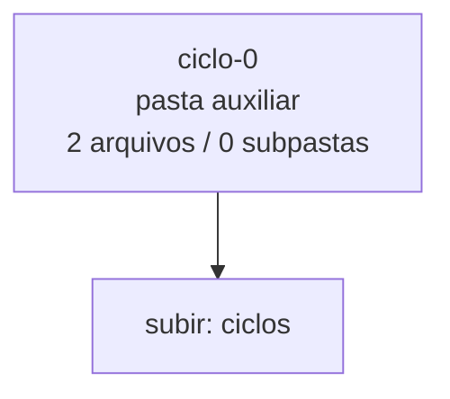

<!-- IA_NAVIGACAO:GERADO_AUTO:v1 -->
# Mapa IA - ciclo-0

Atualizado automaticamente em: **2026-08-05 13:33:35 -0300**

- Caminho: `C:\Users\IgorPC\.claude\projects\Escritório fabio osório\fabricas de melhoria de petições\_FORJA_HARNESS\autoresearch\ciclos\ciclo-0`
- Tipo: **pasta auxiliar**
- Função para navegação: conteúdo auxiliar ou residual
- Conteúdo recursivo: **2 arquivos**, **0 subpastas**, **38.2 KB**
- Tipos de arquivo: .svg: 1, .md: 1
- Mapa raiz: [MAPA_IA.md](<../../../../MAPA_IA.md>)
- Índice geral: [INDICE_GERAL_IA.md](<../../../../00_IA_NAVIGACAO/INDICE_GERAL_IA.md>)
- Protocolo de navegação: [PROTOCOLO_NAVEGACAO_IA.md](<../../../../00_IA_NAVIGACAO/PROTOCOLO_NAVEGACAO_IA.md>)
- Inventário JSON para agentes: [inventario_ia.json](<../../../../00_IA_NAVIGACAO/dados/inventario_ia.json>)
- Mapa superior: [ciclos](<../MAPA_IA.md>)

## GPS Mermaid

## Ordem de leitura recomendada

1. Ler este `MAPA_IA.md` antes de abrir arquivos pesados.
2. Subir para a raiz se precisar das regras globais `AGENTS.md`, `CLAUDE.md` e `_LEIS_GERAIS`.

## Subpastas diretas

_Sem subpastas diretas._

## Arquivos diretos

| Arquivo | Papel | Tamanho | Modificado | Observação |
|---|---:|---:|---:|---|
| [AR_ARQUITETURA_DIAGRAMA.svg](<AR_ARQUITETURA_DIAGRAMA.svg>) | imagem/visual | 34.3 KB | 2026-07-23 02:32 | imagem ou elemento visual |
| [AR_CICLO_0_RELATORIO.md](<AR_CICLO_0_RELATORIO.md>) | outro | 3.9 KB | 2026-07-23 02:20 | arquivo não classificado automaticamente \| tópicos: Ciclo AR-0 — Relatório do estudo piloto descritivo (2026-07-23); Resultado; Verificação realizada |

## Leitura por papel

- **imagem/visual**: [AR_ARQUITETURA_DIAGRAMA.svg](<AR_ARQUITETURA_DIAGRAMA.svg>)
- **outro**: [AR_CICLO_0_RELATORIO.md](<AR_CICLO_0_RELATORIO.md>)

## Observações anti-alucinação

- Este mapa classifica por nomes, extensões e posição na árvore; não substitui leitura de fonte primária.
- Fato, citação, ID processual, prazo e jurisprudência só entram em peça depois de conferência no arquivo-fonte ou fonte oficial.
- Se a pasta tiver regimento, a peça deve refletir o regimento vigente na data do protocolo.
