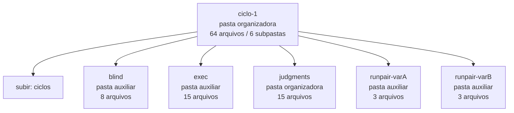

<!-- IA_NAVIGACAO:GERADO_AUTO:v1 -->
# Mapa IA - ciclo-1

Atualizado automaticamente em: **2026-08-05 13:55:56 -0300**

- Caminho: `C:\Users\IgorPC\.claude\projects\Escritório fabio osório\fabricas de melhoria de petições\_FORJA_HARNESS\autoresearch\ciclos\ciclo-1`
- Tipo: **pasta organizadora**
- Função para navegação: agrega subpastas; abrir mapa filho conforme objetivo
- Conteúdo recursivo: **64 arquivos**, **6 subpastas**, **2.4 MB**
- Tipos de arquivo: .json: 37, .md: 17, .jsonl: 4, .txt: 4, .html: 2
- Mapa raiz: [MAPA_IA.md](<../../../../MAPA_IA.md>)
- Índice geral: [INDICE_GERAL_IA.md](<../../../../00_IA_NAVIGACAO/INDICE_GERAL_IA.md>)
- Protocolo de navegação: [PROTOCOLO_NAVEGACAO_IA.md](<../../../../00_IA_NAVIGACAO/PROTOCOLO_NAVEGACAO_IA.md>)
- Inventário JSON para agentes: [inventario_ia.json](<../../../../00_IA_NAVIGACAO/dados/inventario_ia.json>)
- Mapa superior: [ciclos](<../MAPA_IA.md>)

## GPS Mermaid

## Ordem de leitura recomendada

1. Ler este `MAPA_IA.md` antes de abrir arquivos pesados.
2. Subir para a raiz se precisar das regras globais `AGENTS.md`, `CLAUDE.md` e `_LEIS_GERAIS`.

## Subpastas diretas

| Subpasta | Tipo | Conteúdo | Atualização | Próximo passo |
|---|---|---:|---:|---|
| [blind](<blind/MAPA_IA.md>) | pasta auxiliar | 8 arquivos / 0 subpastas | 2026-07-23 03:56 | conteúdo auxiliar ou residual |
| [exec](<exec/MAPA_IA.md>) | pasta auxiliar | 15 arquivos / 0 subpastas | 2026-07-23 03:56 | conteúdo auxiliar ou residual |
| [judgments](<judgments/MAPA_IA.md>) | pasta organizadora | 15 arquivos / 1 subpastas | 2026-07-23 04:05 | agrega subpastas; abrir mapa filho conforme objetivo |
| [runpair-varA](<runpair-varA/MAPA_IA.md>) | pasta auxiliar | 3 arquivos / 0 subpastas | 2026-07-23 03:56 | conteúdo auxiliar ou residual |
| [runpair-varB](<runpair-varB/MAPA_IA.md>) | pasta auxiliar | 3 arquivos / 0 subpastas | 2026-07-23 03:56 | conteúdo auxiliar ou residual |

## Arquivos diretos

| Arquivo | Papel | Tamanho | Modificado | Observação |
|---|---:|---:|---:|---|
| [ar-ciclo-humano.workflow.json](<ar-ciclo-humano.workflow.json>) | dados/script | 8.7 KB | 2026-07-23 13:59 | dado estruturado ou rotina técnica |
| [ar-ciclo.architecture.json](<ar-ciclo.architecture.json>) | dados/script | 5.0 KB | 2026-07-23 04:14 | dado estruturado ou rotina técnica |
| [AR_CANARY_RESULT.json](<AR_CANARY_RESULT.json>) | dados/script | 1.8 KB | 2026-07-23 02:37 | dado estruturado ou rotina técnica |
| [AR_CICLO_MANIFEST.json](<AR_CICLO_MANIFEST.json>) | dados/script | 4.8 KB | 2026-07-23 02:37 | dado estruturado ou rotina técnica |
| [AR_COMPARISON_varA.json](<AR_COMPARISON_varA.json>) | dados/script | 372 B | 2026-07-23 04:05 | dado estruturado ou rotina técnica |
| [AR_COMPARISON_varB.json](<AR_COMPARISON_varB.json>) | dados/script | 372 B | 2026-07-23 04:05 | dado estruturado ou rotina técnica |
| [AR_INDICATORS_varA.json](<AR_INDICATORS_varA.json>) | dados/script | 22.0 KB | 2026-07-23 04:05 | dado estruturado ou rotina técnica |
| [AR_INDICATORS_varB.json](<AR_INDICATORS_varB.json>) | dados/script | 19.3 KB | 2026-07-23 04:05 | dado estruturado ou rotina técnica |
| [AR_INDICATORS_vigente.json](<AR_INDICATORS_vigente.json>) | dados/script | 10.8 KB | 2026-07-23 04:05 | dado estruturado ou rotina técnica |
| [AR_JUDGMENT_ciclo1-varA.json](<AR_JUDGMENT_ciclo1-varA.json>) | dados/script | 850 B | 2026-07-23 04:05 | dado estruturado ou rotina técnica |
| [AR_JUDGMENT_ciclo1-varB.json](<AR_JUDGMENT_ciclo1-varB.json>) | dados/script | 1.1 KB | 2026-07-23 04:05 | dado estruturado ou rotina técnica |
| [AR_PROMOTION_DECISION.json](<AR_PROMOTION_DECISION.json>) | dados/script | 306 B | 2026-07-23 04:06 | dado estruturado ou rotina técnica |
| [mutador_gen0_raw.jsonl](<mutador_gen0_raw.jsonl>) | dados/script | 241.8 KB | 2026-07-23 03:45 | dado estruturado ou rotina técnica |
| [variantes_gen0.json](<variantes_gen0.json>) | dados/script | 514 B | 2026-07-23 03:46 | dado estruturado ou rotina técnica |
| [AR_CICLO_1_RELATORIO.md](<AR_CICLO_1_RELATORIO.md>) | outro | 5.3 KB | 2026-07-23 14:01 | arquivo não classificado automaticamente \| tópicos: Ciclo AR-1 — Primeiro ciclo REAL de trabalho e auto-aperfeiçoamento (23/07/2026); Resultado; O experimento (pré-registrado no snapshot A0, log encadeado) |
| [AR_CICLO_ARQUITETURA.html](<AR_CICLO_ARQUITETURA.html>) | outro | 507.9 KB | 2026-07-23 04:14 | arquivo não classificado automaticamente |
| [AR_CICLO_HUMANO.html](<AR_CICLO_HUMANO.html>) | outro | 525.4 KB | 2026-07-23 13:59 | arquivo não classificado automaticamente |
| [AR_PARECER_INDEPENDENTE_varB.md](<AR_PARECER_INDEPENDENTE_varB.md>) | outro | 1.4 KB | 2026-07-23 04:09 | arquivo não classificado automaticamente \| tópicos: Parecer independente — variante varB (ciclo AR-1, revisor família claude) |
| [mutador_gen0_err.txt](<mutador_gen0_err.txt>) | outro | 4.6 KB | 2026-07-23 03:45 | arquivo não classificado automaticamente |
| [PROMPT_MUTADOR_GEN0.md](<PROMPT_MUTADOR_GEN0.md>) | outro | 1.6 KB | 2026-07-23 03:35 | arquivo não classificado automaticamente |

## Leitura por papel

- **dados/script**: [ar-ciclo-humano.workflow.json](<ar-ciclo-humano.workflow.json>), [ar-ciclo.architecture.json](<ar-ciclo.architecture.json>), [AR_CANARY_RESULT.json](<AR_CANARY_RESULT.json>), [AR_CICLO_MANIFEST.json](<AR_CICLO_MANIFEST.json>), [AR_COMPARISON_varA.json](<AR_COMPARISON_varA.json>), [AR_COMPARISON_varB.json](<AR_COMPARISON_varB.json>), [AR_INDICATORS_varA.json](<AR_INDICATORS_varA.json>), [AR_INDICATORS_varB.json](<AR_INDICATORS_varB.json>), [AR_INDICATORS_vigente.json](<AR_INDICATORS_vigente.json>), [AR_JUDGMENT_ciclo1-varA.json](<AR_JUDGMENT_ciclo1-varA.json>), [AR_JUDGMENT_ciclo1-varB.json](<AR_JUDGMENT_ciclo1-varB.json>), [AR_PROMOTION_DECISION.json](<AR_PROMOTION_DECISION.json>), [mutador_gen0_raw.jsonl](<mutador_gen0_raw.jsonl>), [variantes_gen0.json](<variantes_gen0.json>)
- **outro**: [AR_CICLO_1_RELATORIO.md](<AR_CICLO_1_RELATORIO.md>), [AR_CICLO_ARQUITETURA.html](<AR_CICLO_ARQUITETURA.html>), [AR_CICLO_HUMANO.html](<AR_CICLO_HUMANO.html>), [AR_PARECER_INDEPENDENTE_varB.md](<AR_PARECER_INDEPENDENTE_varB.md>), [mutador_gen0_err.txt](<mutador_gen0_err.txt>), [PROMPT_MUTADOR_GEN0.md](<PROMPT_MUTADOR_GEN0.md>)

## Observações anti-alucinação

- Este mapa classifica por nomes, extensões e posição na árvore; não substitui leitura de fonte primária.
- Fato, citação, ID processual, prazo e jurisprudência só entram em peça depois de conferência no arquivo-fonte ou fonte oficial.
- Se a pasta tiver regimento, a peça deve refletir o regimento vigente na data do protocolo.
