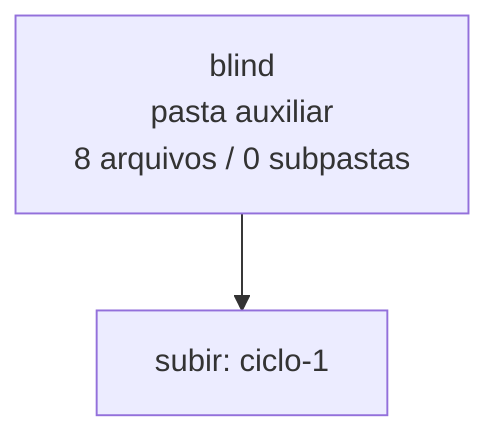

<!-- IA_NAVIGACAO:GERADO_AUTO:v1 -->
# Mapa IA - blind

Atualizado automaticamente em: **2026-08-05 13:33:28 -0300**

- Caminho: `C:\Users\IgorPC\.claude\projects\Escritório fabio osório\fabricas de melhoria de petições\_FORJA_HARNESS\autoresearch\ciclos\ciclo-1\blind`
- Tipo: **pasta auxiliar**
- Função para navegação: conteúdo auxiliar ou residual
- Conteúdo recursivo: **8 arquivos**, **0 subpastas**, **594.9 KB**
- Tipos de arquivo: .md: 8
- Mapa raiz: [MAPA_IA.md](<../../../../../MAPA_IA.md>)
- Índice geral: [INDICE_GERAL_IA.md](<../../../../../00_IA_NAVIGACAO/INDICE_GERAL_IA.md>)
- Protocolo de navegação: [PROTOCOLO_NAVEGACAO_IA.md](<../../../../../00_IA_NAVIGACAO/PROTOCOLO_NAVEGACAO_IA.md>)
- Inventário JSON para agentes: [inventario_ia.json](<../../../../../00_IA_NAVIGACAO/dados/inventario_ia.json>)
- Mapa superior: [ciclo-1](<../MAPA_IA.md>)

## GPS Mermaid

## Ordem de leitura recomendada

1. Ler este `MAPA_IA.md` antes de abrir arquivos pesados.
2. Subir para a raiz se precisar das regras globais `AGENTS.md`, `CLAUDE.md` e `_LEIS_GERAIS`.

## Subpastas diretas

_Sem subpastas diretas._

## Arquivos diretos

| Arquivo | Papel | Tamanho | Modificado | Observação |
|---|---:|---:|---:|---|
| [PAR_ciclo1-varA_ORD1_L.md](<PAR_ciclo1-varA_ORD1_L.md>) | outro | 78.0 KB | 2026-07-23 03:56 | arquivo não classificado automaticamente \| tópicos: MINUTA CONTROLADA E RELATÓRIO DE MELHORIAS; PARTE I — PEÇA MELHORADA COMPLETA; AÇÃO DECLARATÓRIA DE INVALIDADE DE EXCLUSÃO DE BENEFICIÁRIO C/C OBRIGAÇÃO DE FAZER, EXIBIÇÃO DE DOCUMENTOS E INDENIZAÇÃO |
| [PAR_ciclo1-varA_ORD1_R.md](<PAR_ciclo1-varA_ORD1_R.md>) | outro | 82.6 KB | 2026-07-23 03:56 | arquivo não classificado automaticamente \| tópicos: MINUTA INTERNA — NÃO PROTOCOLAR; 1. PEÇA MELHORADA COMPLETA; AÇÃO DECLARATÓRIA DE INVALIDADE DE EXCLUSÃO DE BENEFICIÁRIO C/C OBRIGAÇÃO DE FAZER, EXIBIÇÃO DE DOCUMENTOS E INDENIZAÇÃO |
| [PAR_ciclo1-varA_ORD2_L.md](<PAR_ciclo1-varA_ORD2_L.md>) | outro | 82.6 KB | 2026-07-23 03:56 | arquivo não classificado automaticamente \| tópicos: MINUTA INTERNA — NÃO PROTOCOLAR; 1. PEÇA MELHORADA COMPLETA; AÇÃO DECLARATÓRIA DE INVALIDADE DE EXCLUSÃO DE BENEFICIÁRIO C/C OBRIGAÇÃO DE FAZER, EXIBIÇÃO DE DOCUMENTOS E INDENIZAÇÃO |
| [PAR_ciclo1-varA_ORD2_R.md](<PAR_ciclo1-varA_ORD2_R.md>) | outro | 78.0 KB | 2026-07-23 03:56 | arquivo não classificado automaticamente \| tópicos: MINUTA CONTROLADA E RELATÓRIO DE MELHORIAS; PARTE I — PEÇA MELHORADA COMPLETA; AÇÃO DECLARATÓRIA DE INVALIDADE DE EXCLUSÃO DE BENEFICIÁRIO C/C OBRIGAÇÃO DE FAZER, EXIBIÇÃO DE DOCUMENTOS E INDENIZAÇÃO |
| [PAR_ciclo1-varB_ORD1_L.md](<PAR_ciclo1-varB_ORD1_L.md>) | outro | 78.0 KB | 2026-07-23 03:56 | arquivo não classificado automaticamente \| tópicos: MINUTA CONTROLADA E RELATÓRIO DE MELHORIAS; PARTE I — PEÇA MELHORADA COMPLETA; AÇÃO DECLARATÓRIA DE INVALIDADE DE EXCLUSÃO DE BENEFICIÁRIO C/C OBRIGAÇÃO DE FAZER, EXIBIÇÃO DE DOCUMENTOS E INDENIZAÇÃO |
| [PAR_ciclo1-varB_ORD1_R.md](<PAR_ciclo1-varB_ORD1_R.md>) | outro | 58.9 KB | 2026-07-23 03:56 | arquivo não classificado automaticamente \| tópicos: `INTERNAL_WORKING` — NÃO PROTOCOLAR; PEÇA MELHORADA COMPLETA; AÇÃO DECLARATÓRIA DE INVALIDADE DE EXCLUSÃO DE BENEFICIÁRIO C/C OBRIGAÇÃO DE FAZER, EXIBIÇÃO DE DOCUMENTOS E INDENIZAÇÃO |
| [PAR_ciclo1-varB_ORD2_L.md](<PAR_ciclo1-varB_ORD2_L.md>) | outro | 58.9 KB | 2026-07-23 03:56 | arquivo não classificado automaticamente \| tópicos: `INTERNAL_WORKING` — NÃO PROTOCOLAR; PEÇA MELHORADA COMPLETA; AÇÃO DECLARATÓRIA DE INVALIDADE DE EXCLUSÃO DE BENEFICIÁRIO C/C OBRIGAÇÃO DE FAZER, EXIBIÇÃO DE DOCUMENTOS E INDENIZAÇÃO |
| [PAR_ciclo1-varB_ORD2_R.md](<PAR_ciclo1-varB_ORD2_R.md>) | outro | 78.0 KB | 2026-07-23 03:56 | arquivo não classificado automaticamente \| tópicos: MINUTA CONTROLADA E RELATÓRIO DE MELHORIAS; PARTE I — PEÇA MELHORADA COMPLETA; AÇÃO DECLARATÓRIA DE INVALIDADE DE EXCLUSÃO DE BENEFICIÁRIO C/C OBRIGAÇÃO DE FAZER, EXIBIÇÃO DE DOCUMENTOS E INDENIZAÇÃO |

## Leitura por papel

- **outro**: [PAR_ciclo1-varA_ORD1_L.md](<PAR_ciclo1-varA_ORD1_L.md>), [PAR_ciclo1-varA_ORD1_R.md](<PAR_ciclo1-varA_ORD1_R.md>), [PAR_ciclo1-varA_ORD2_L.md](<PAR_ciclo1-varA_ORD2_L.md>), [PAR_ciclo1-varA_ORD2_R.md](<PAR_ciclo1-varA_ORD2_R.md>), [PAR_ciclo1-varB_ORD1_L.md](<PAR_ciclo1-varB_ORD1_L.md>), [PAR_ciclo1-varB_ORD1_R.md](<PAR_ciclo1-varB_ORD1_R.md>), [PAR_ciclo1-varB_ORD2_L.md](<PAR_ciclo1-varB_ORD2_L.md>), [PAR_ciclo1-varB_ORD2_R.md](<PAR_ciclo1-varB_ORD2_R.md>)

## Observações anti-alucinação

- Este mapa classifica por nomes, extensões e posição na árvore; não substitui leitura de fonte primária.
- Fato, citação, ID processual, prazo e jurisprudência só entram em peça depois de conferência no arquivo-fonte ou fonte oficial.
- Se a pasta tiver regimento, a peça deve refletir o regimento vigente na data do protocolo.
